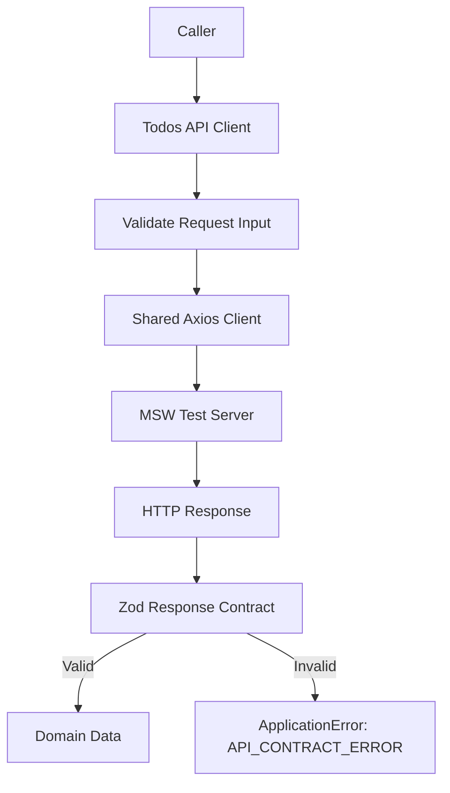
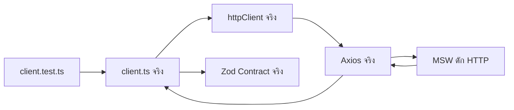
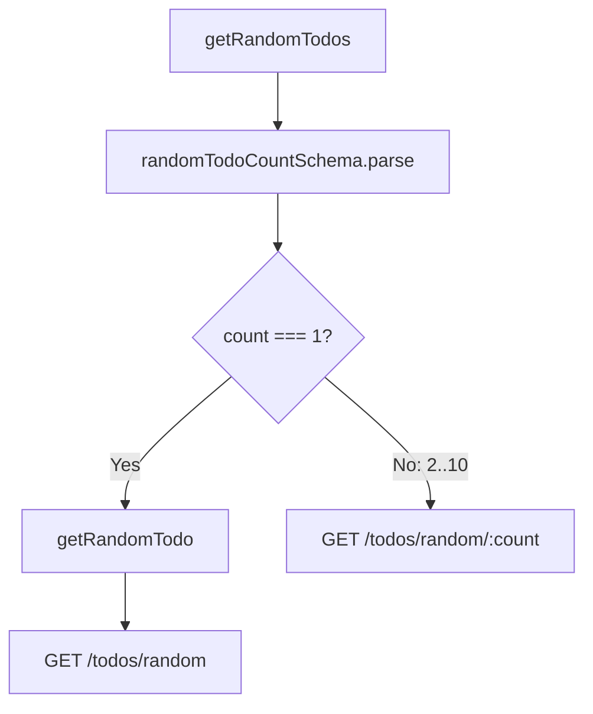
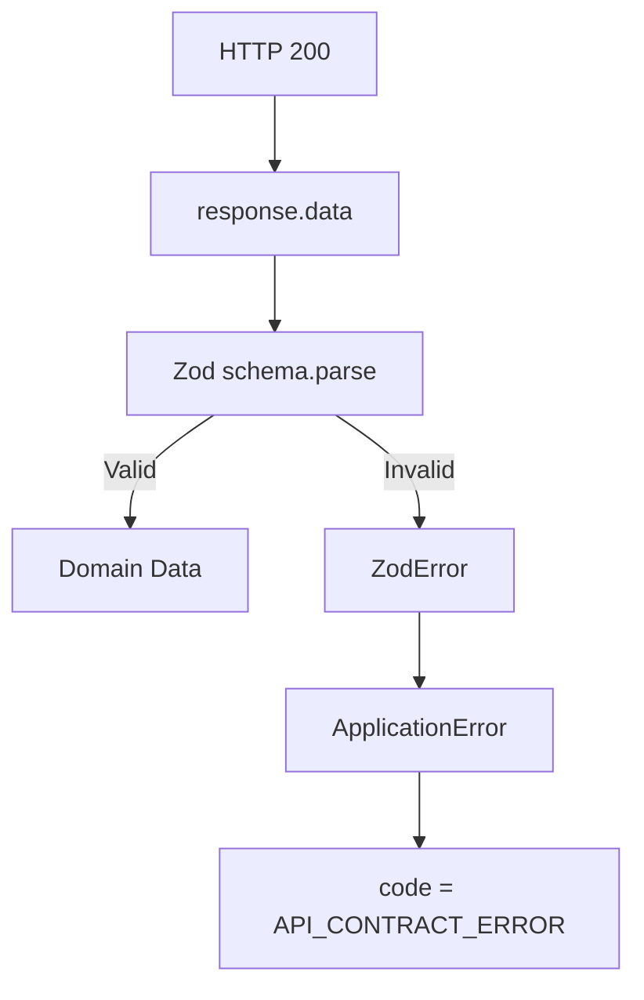
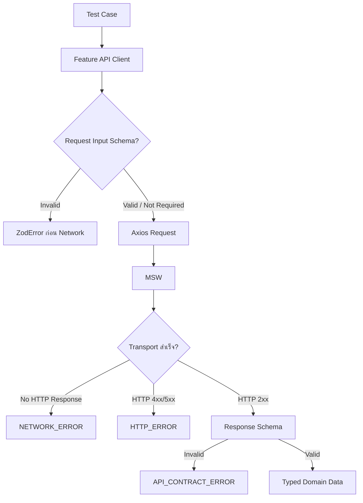

# แนวทางการเขียน Test สำหรับ Todos API Client

ไฟล์ Test: `src/features/todos/api/client.test.ts`

ไฟล์ Production ที่ทดสอบ: `src/features/todos/api/client.ts`

เอกสารนี้ต่อเนื่องจาก

- [การสร้าง API Contract](./api-contract.md)
- [การเขียน Test สำหรับ API Contract](./api-contract-test.md)
- [การสร้าง API Client](./api-client.md)
- หัวข้อ 5 ของ [`docs/GETTING_STARTED.th.md`](../../GETTING_STARTED.th.md)

เป้าหมายคือสร้าง **API Integration Test** สำหรับ Todos API Client ด้วย Vitest + MSW โดยทดสอบ Feature Client, Shared Axios Client และ Zod Runtime Contract จริงร่วมกัน ไม่ Mock `httpClient` หรือ Mock Function ภายใน `client.ts`

> หมายเหตุ: `src/features/todos/api/client.ts` เป็นไฟล์ที่ Tutorial ให้ผู้ใช้สร้างขึ้นเอง หาก Source Tree ของโปรเจ็กต์ยังไม่มีไฟล์นี้ ให้ทำหัวข้อ API Client ก่อนแล้วจึงเขียน Test ตามเอกสารนี้

---

## 1. เป้าหมายของ API Client Test

`client.ts` เป็น Boundary ระหว่าง Feature Todos กับ HTTP API ภายนอก จึงมีความรับผิดชอบมากกว่าการเรียก Axios



Test Suite ต้องพิสูจน์อย่างน้อย 7 เรื่อง

1. Client เรียก HTTP Method และ Endpoint ถูกต้อง
2. Pagination และ Path Parameter ถูกประกอบ Request ถูกต้อง
3. Mutation Input ถูก Validate และ Normalize ก่อนส่ง HTTP
4. Response ถูก Parse ด้วย Zod ก่อนคืนให้ Caller
5. Invalid Response ถูกแปลงเป็น `ApplicationError` รหัส `API_CONTRACT_ERROR`
6. HTTP / Network Error ยังคงเป็น Transport Error และไม่ถูกตีความเป็น Contract Error
7. `AbortSignal` ถูกส่งต่อถึง Axios เพื่อให้ Caller ยกเลิก Request ได้

ดังนั้น Test นี้ต่างจาก `contracts.test.ts`

```text
contracts.test.ts
  → ทดสอบ Zod Schema โดยตรง

client.test.ts
  → ทดสอบ HTTP Boundary จริง
  → client.ts
  → shared httpClient
  → MSW
  → Zod Schema
```

---

## 2. ทำไมไม่ควร Mock `httpClient`

ตัวอย่างที่ไม่แนะนำสำหรับ API Integration Test นี้

```ts
vi.mock("#/shared/api/http-client", () => ({
  httpClient: {
    get: vi.fn(),
  },
}));
```

การ Mock Axios Adapter ตรง ๆ จะทำให้ Test ไม่ได้พิสูจน์ว่า

- URL และ Query String ถูกสร้างจริงหรือไม่
- HTTP Method ถูกต้องหรือไม่
- Axios Config ส่ง `signal` จริงหรือไม่
- Shared Response Interceptor แปลง Error ถูกต้องหรือไม่
- Request/Response เดินผ่าน Runtime Boundary จริงหรือไม่

แนวทางที่ใช้ในเอกสารนี้คือ



MSW จึง Mock เฉพาะ **Network Boundary** ไม่ Mock Business Function ภายใน Feature

---

## 3. API Operations ที่ต้องครอบคลุม

`client.ts` ใน Tutorial มี 8 Operations

| Function | Method | Endpoint | Runtime Input Validation | Response Contract |
| --- | --- | --- | --- | --- |
| `getTodos` | GET | `/todos?limit=&skip=` | ไม่ทำใน Client | `todosListResponseSchema` |
| `getTodo` | GET | `/todos/:todoId` | ไม่ทำใน Client | `todoSchema` |
| `getTodosByUser` | GET | `/todos/user/:userId` | ไม่ทำใน Client | `todosListResponseSchema` |
| `getRandomTodo` | GET | `/todos/random` | ไม่มี Input | `todoSchema` |
| `getRandomTodos` | GET | `/todos/random/:count` หรือ `/todos/random` | `randomTodoCountSchema` | `randomTodosSchema` หรือ `todoSchema` |
| `addTodo` | POST | `/todos/add` | `createTodoInputSchema` | `todoSchema` |
| `updateTodo` | PATCH | `/todos/:todoId` | `updateTodoInputSchema` | `todoSchema` |
| `deleteTodo` | DELETE | `/todos/:todoId` | ไม่ทำใน Client | `deletedTodoSchema` |

จุดสำคัญคือ `getRandomTodos({ count: 1 })` ไม่เรียก `/todos/random/1` แต่ Delegate ไปยัง `getRandomTodo()` และเรียก `/todos/random`



---

## 4. เตรียม Test Dependencies

Repository Baseline อาจยังไม่มี Vitest และ MSW ใน `package.json` ของโปรเจ็กต์ที่เพิ่งสร้างจาก Template ให้ติดตั้งก่อน

```bash
bun add -D vitest @vitest/coverage-v8 msw
```

Contract/API Client Test ไม่ใช้ DOM จึงไม่จำเป็นต้องใช้ `jsdom`

เพิ่ม Scripts ใน `package.json`

```json
{
  "scripts": {
    "test": "vitest run",
    "test:watch": "vitest",
    "test:coverage": "vitest run --coverage"
  }
}
```

ให้นำ 3 Scripts นี้ไปรวมกับ Scripts เดิม ไม่ใช่แทนที่ `scripts` ทั้งหมด

---

## 5. ตั้งค่า Vitest

สร้าง `vitest.config.ts` ที่ Root

```ts
import { defineConfig } from "vitest/config";

export default defineConfig({
  resolve: {
    tsconfigPaths: true,
  },
  test: {
    environment: "node",
    setupFiles: ["./src/test/setup.ts"],
    clearMocks: true,
    restoreMocks: true,
    coverage: {
      provider: "v8",
      reporter: ["text", "html", "lcov"],
      include: ["src/features/todos/api/client.ts"],
    },
  },
});
```

เหตุผลที่ใช้ `environment: "node"`

- API Client ไม่มี DOM
- Axios + MSW Node Server เพียงพอสำหรับ Boundary นี้
- Test Startup เร็วกว่าการเปิด `jsdom`
- ลด Test Environment ที่ไม่เกี่ยวข้อง

`resolve.tsconfigPaths: true` ทำให้ Alias เช่น `#/test/msw/server` ทำงานเหมือน Vite Config ของโปรเจ็กต์

> เมื่อ Test Suite โตขึ้น ควรขยาย `coverage.include` จาก `client.ts` ไปยัง Source Files ที่ทีมต้องการวัดจริง ไม่ควรใช้ Coverage ของไฟล์เดียวเป็น Quality Gate ของทั้งระบบ

---

## 6. สร้าง MSW Server

สร้าง `src/test/msw/server.ts`

```ts
import { setupServer } from "msw/node";

export const server = setupServer();
```

จากนั้นสร้าง `src/test/setup.ts`

```ts
import { afterAll, afterEach, beforeAll } from "vitest";

import { server } from "./msw/server";

beforeAll(() => {
  server.listen({
    onUnhandledRequest: "error",
  });
});

afterEach(() => {
  server.resetHandlers();
});

afterAll(() => {
  server.close();
});
```

`onUnhandledRequest: "error"` สำคัญมาก เพราะทำให้ Test ล้มเหลวทันทีหาก Client

- เรียก Endpoint ผิด
- ใช้ Method ผิด
- ลืมสร้าง Handler
- พยายามยิง Internet จริง

สิ่งนี้ช่วยป้องกัน Test ที่ดูเหมือนผ่าน แต่แอบพึ่ง Network ภายนอก

---

## 7. ตำแหน่งไฟล์ Test

สร้าง

```text
src/features/todos/api/client.test.ts
```

โครงสร้างที่ได้

```text
src/
├── features/
│   └── todos/
│       └── api/
│           ├── client.test.ts
│           ├── client.ts
│           ├── contracts.test.ts
│           ├── contracts.ts
│           ├── mutations.ts
│           └── queries.ts
└── test/
    ├── setup.ts
    └── msw/
        ├── handlers.ts
        └── server.ts
```

แนวทางนี้เป็น Colocated Feature Test

- Test ที่เป็นของ `client.ts` อยู่ข้าง `client.ts`
- Test Infrastructure ที่ใช้ข้าม Feature อยู่ใน `src/test`

---

## 8. Test Matrix ก่อนเขียนโค้ด

| Area | Case ที่ต้องพิสูจน์ |
| --- | --- |
| `getTodos` | Method/Path, `limit`, `skip`, Response normalization, Invalid response |
| `getTodo` | Dynamic ID, Domain output, Invalid response, HTTP 404 |
| `getTodosByUser` | User path, User-scoped response, Invalid list contract |
| `getRandomTodo` | `/todos/random`, Valid response, Invalid response |
| `getRandomTodos` | count=1 branch, count=2..10 branch, invalid count ก่อน Network, invalid array response |
| `addTodo` | POST, normalized payload, invalid input ก่อน Network, invalid response |
| `updateTodo` | PATCH, partial payload, trim, empty patch ก่อน Network, invalid response |
| `deleteTodo` | DELETE, deleted contract, invalid deletion response |
| Transport | HTTP error, Network error |
| Cancellation | `AbortSignal` ของทุก Operation ถูกส่งต่อ |

หลักการคือทดสอบ **Behavior ของ Client** ไม่ทดสอบ Implementation Detail เช่นชื่อ Local Variable หรือจำนวนครั้งที่เรียก `schema.parse()` โดยตรง

---

## 9. โค้ดฉบับเต็ม: `client.test.ts`

```ts
import { HttpResponse, http } from "msw";
import { beforeEach, describe, expect, it } from "vitest";

import {
  addTodo,
  deleteTodo,
  getRandomTodo,
  getRandomTodos,
  getTodo,
  getTodos,
  getTodosByUser,
  updateTodo,
} from "./client";
import { server } from "#/test/msw/server";

const todo = {
  id: 1,
  todo: "Define clear frontend architecture boundaries",
  completed: false,
  userId: 7,
};

const completedTodo = {
  id: 2,
  todo: "Validate every external contract",
  completed: true,
  userId: 7,
};

const deletedOn = "2026-08-02T12:00:00.000Z";

const todosResponse = {
  todos: [todo, completedTodo],
  total: 2,
  skip: 0,
  limit: 10,
};

function createTodos(count: number) {
  return Array.from({ length: count }, (_, index) => ({
    ...todo,
    id: index + 1,
  }));
}

function useDefaultTodosHandlers() {
  server.use(
    http.get("*/todos/random/:count", ({ params }) => {
      const count = Number(params.count);

      return HttpResponse.json(createTodos(count));
    }),

    http.get("*/todos/random", () => HttpResponse.json(todo)),

    http.get("*/todos/user/:userId", ({ params }) =>
      HttpResponse.json({
        ...todosResponse,
        todos: todosResponse.todos.map((item) => ({
          ...item,
          userId: Number(params.userId),
        })),
      }),
    ),

    http.post("*/todos/add", async ({ request }) => {
      const input = (await request.json()) as Record<string, unknown>;

      return HttpResponse.json({
        ...input,
        id: 151,
      });
    }),

    http.patch("*/todos/:todoId", async ({ params, request }) => {
      const input = (await request.json()) as Record<string, unknown>;

      return HttpResponse.json({
        ...todo,
        ...input,
        id: Number(params.todoId),
      });
    }),

    http.delete("*/todos/:todoId", ({ params }) =>
      HttpResponse.json({
        ...todo,
        id: Number(params.todoId),
        isDeleted: true,
        deletedOn,
      }),
    ),

    http.get("*/todos/:todoId", ({ params }) =>
      HttpResponse.json({
        ...todo,
        id: Number(params.todoId),
      }),
    ),

    http.get("*/todos", ({ request }) => {
      const url = new URL(request.url);
      const limit = Number(url.searchParams.get("limit") ?? 10);
      const skip = Number(url.searchParams.get("skip") ?? 0);

      return HttpResponse.json({
        ...todosResponse,
        limit,
        skip,
      });
    }),
  );
}

beforeEach(() => {
  useDefaultTodosHandlers();
});

describe("getTodos", () => {
  it("sends limit and calculated skip and returns parsed list data", async () => {
    let requestedUrl: URL | undefined;

    server.use(
      http.get("*/todos", ({ request }) => {
        requestedUrl = new URL(request.url);

        return HttpResponse.json({
          todos: [todo],
          total: "40",
          skip: "20",
          limit: "20",
        });
      }),
    );

    const result = await getTodos({
      page: 2,
      pageSize: 20,
    });

    expect(requestedUrl?.searchParams.get("limit")).toBe("20");
    expect(requestedUrl?.searchParams.get("skip")).toBe("20");

    expect(result).toEqual({
      todos: [todo],
      total: 40,
      skip: 20,
      limit: 20,
    });
  });

  it("uses skip=0 for the first page", async () => {
    let requestedUrl: URL | undefined;

    server.use(
      http.get("*/todos", ({ request }) => {
        requestedUrl = new URL(request.url);

        return HttpResponse.json(todosResponse);
      }),
    );

    await getTodos({
      page: 1,
      pageSize: 10,
    });

    expect(requestedUrl?.searchParams.get("limit")).toBe("10");
    expect(requestedUrl?.searchParams.get("skip")).toBe("0");
  });

  it("maps an invalid list response to API_CONTRACT_ERROR", async () => {
    server.use(
      http.get("*/todos", () =>
        HttpResponse.json({
          todos: [
            {
              ...todo,
              todo: "",
            },
          ],
          total: 1,
          skip: 0,
          limit: 10,
        }),
      ),
    );

    await expect(
      getTodos({
        page: 1,
        pageSize: 10,
      }),
    ).rejects.toMatchObject({
      name: "ApplicationError",
      code: "API_CONTRACT_ERROR",
      message: "Todos API ส่ง Response รายการไม่ตรง Contract",
    });
  });
});

describe("getTodo", () => {
  it("loads the requested todo id", async () => {
    let requestedTodoId: string | readonly string[] | undefined;

    server.use(
      http.get("*/todos/:todoId", ({ params }) => {
        requestedTodoId = params.todoId;

        return HttpResponse.json({
          ...todo,
          id: Number(params.todoId),
        });
      }),
    );

    const result = await getTodo({ todoId: 42 });

    expect(requestedTodoId).toBe("42");
    expect(result.id).toBe(42);
  });

  it("normalizes response data through todoSchema", async () => {
    server.use(
      http.get("*/todos/:todoId", () =>
        HttpResponse.json({
          id: "12",
          todo: "  Normalize API data  ",
          completed: false,
          userId: "7",
        }),
      ),
    );

    const result = await getTodo({ todoId: 12 });

    expect(result).toEqual({
      id: 12,
      todo: "Normalize API data",
      completed: false,
      userId: 7,
    });
  });

  it("maps an invalid todo response to API_CONTRACT_ERROR", async () => {
    server.use(
      http.get("*/todos/:todoId", () =>
        HttpResponse.json({
          id: 999,
          todo: "",
          completed: "not-a-boolean",
          userId: null,
        }),
      ),
    );

    await expect(getTodo({ todoId: 999 })).rejects.toMatchObject({
      name: "ApplicationError",
      code: "API_CONTRACT_ERROR",
      message: "Todos API ส่ง Todo ไม่ตรง Contract",
    });
  });

  it("preserves HTTP errors as HTTP_ERROR", async () => {
    server.use(
      http.get("*/todos/:todoId", () =>
        HttpResponse.json(
          {
            message: "Todo not found",
          },
          {
            status: 404,
          },
        ),
      ),
    );

    await expect(getTodo({ todoId: 404 })).rejects.toMatchObject({
      name: "ApplicationError",
      code: "HTTP_ERROR",
      status: 404,
      details: {
        message: "Todo not found",
      },
    });
  });

  it("maps a transport failure to NETWORK_ERROR", async () => {
    server.use(http.get("*/todos/:todoId", () => HttpResponse.error()));

    await expect(getTodo({ todoId: 5000 })).rejects.toMatchObject({
      name: "ApplicationError",
      code: "NETWORK_ERROR",
    });
  });
});

describe("getTodosByUser", () => {
  it("loads todos from the requested user endpoint", async () => {
    let requestedUserId: string | readonly string[] | undefined;

    server.use(
      http.get("*/todos/user/:userId", ({ params }) => {
        requestedUserId = params.userId;

        return HttpResponse.json({
          todos: [
            {
              ...todo,
              userId: Number(params.userId),
            },
          ],
          total: 1,
          skip: 0,
          limit: 1,
        });
      }),
    );

    const result = await getTodosByUser({ userId: 5 });

    expect(requestedUserId).toBe("5");
    expect(result.todos).toHaveLength(1);
    expect(result.todos.every((item) => item.userId === 5)).toBe(true);
  });

  it("maps an invalid user-scoped list response to API_CONTRACT_ERROR", async () => {
    server.use(
      http.get("*/todos/user/:userId", () =>
        HttpResponse.json({
          todos: [todo],
          total: -1,
          skip: 0,
          limit: 10,
        }),
      ),
    );

    await expect(getTodosByUser({ userId: 5 })).rejects.toMatchObject({
      name: "ApplicationError",
      code: "API_CONTRACT_ERROR",
      message: "Todos By User API ส่ง Response ไม่ตรง Contract",
    });
  });
});

describe("getRandomTodo", () => {
  it("loads one todo from /todos/random", async () => {
    let requestCount = 0;

    server.use(
      http.get("*/todos/random", () => {
        requestCount += 1;

        return HttpResponse.json(todo);
      }),
    );

    const result = await getRandomTodo();

    expect(requestCount).toBe(1);
    expect(result).toEqual(todo);
  });

  it("maps an invalid random todo response to API_CONTRACT_ERROR", async () => {
    server.use(
      http.get("*/todos/random", () =>
        HttpResponse.json({
          ...todo,
          todo: "   ",
        }),
      ),
    );

    await expect(getRandomTodo()).rejects.toMatchObject({
      name: "ApplicationError",
      code: "API_CONTRACT_ERROR",
      message: "Random Todo API ส่ง Response ไม่ตรง Contract",
    });
  });
});

describe("getRandomTodos", () => {
  it("uses /todos/random when count is 1", async () => {
    let singleRequestCount = 0;
    let collectionRequestCount = 0;

    server.use(
      http.get("*/todos/random/:count", () => {
        collectionRequestCount += 1;

        return HttpResponse.json([todo]);
      }),
      http.get("*/todos/random", () => {
        singleRequestCount += 1;

        return HttpResponse.json(todo);
      }),
    );

    const result = await getRandomTodos({ count: 1 });

    expect(singleRequestCount).toBe(1);
    expect(collectionRequestCount).toBe(0);
    expect(result).toEqual([todo]);
  });

  it.each([2, 3, 10])("uses /todos/random/:count for count=%i", async (count) => {
    let requestedCount: string | readonly string[] | undefined;
    let singleRequestCount = 0;

    server.use(
      http.get("*/todos/random/:count", ({ params }) => {
        requestedCount = params.count;

        return HttpResponse.json(createTodos(Number(params.count)));
      }),
      http.get("*/todos/random", () => {
        singleRequestCount += 1;

        return HttpResponse.json(todo);
      }),
    );

    const result = await getRandomTodos({ count });

    expect(requestedCount).toBe(String(count));
    expect(singleRequestCount).toBe(0);
    expect(result).toHaveLength(count);
  });

  it.each([0, -1, 11, 1.5, Number.NaN, Number.POSITIVE_INFINITY])(
    "rejects invalid count before sending HTTP request: %s",
    async (count) => {
      let requestCount = 0;

      server.use(
        http.get("*/todos/random/:count", () => {
          requestCount += 1;

          return HttpResponse.json([todo]);
        }),
        http.get("*/todos/random", () => {
          requestCount += 1;

          return HttpResponse.json(todo);
        }),
      );

      await expect(getRandomTodos({ count })).rejects.toMatchObject({
        name: "ZodError",
      });

      expect(requestCount).toBe(0);
    },
  );

  it("maps an invalid random collection response to API_CONTRACT_ERROR", async () => {
    server.use(http.get("*/todos/random/:count", () => HttpResponse.json([])));

    await expect(getRandomTodos({ count: 3 })).rejects.toMatchObject({
      name: "ApplicationError",
      code: "API_CONTRACT_ERROR",
      message: "Random Todos API ส่ง Response ไม่ตรง Contract",
    });
  });
});

describe("addTodo", () => {
  it("validates, normalizes, and sends the create payload", async () => {
    let requestBody: unknown;

    server.use(
      http.post("*/todos/add", async ({ request }) => {
        requestBody = await request.json();
        const input = requestBody as Record<string, unknown>;

        return HttpResponse.json({
          ...input,
          id: 151,
        });
      }),
    );

    const result = await addTodo({
      input: {
        todo: "  Ship a tested Todos module  ",
        completed: false,
        userId: 7,
      },
    });

    expect(requestBody).toEqual({
      todo: "Ship a tested Todos module",
      completed: false,
      userId: 7,
    });

    expect(result).toEqual({
      id: 151,
      todo: "Ship a tested Todos module",
      completed: false,
      userId: 7,
    });
  });

  it("rejects invalid create input before sending HTTP request", async () => {
    let requestCount = 0;

    server.use(
      http.post("*/todos/add", () => {
        requestCount += 1;

        return HttpResponse.json({
          ...todo,
          id: 151,
        });
      }),
    );

    await expect(
      addTodo({
        input: {
          todo: "  ",
          completed: false,
          userId: 7,
        },
      }),
    ).rejects.toMatchObject({
      name: "ZodError",
    });

    expect(requestCount).toBe(0);
  });

  it("maps an invalid create response to API_CONTRACT_ERROR", async () => {
    server.use(
      http.post("*/todos/add", () =>
        HttpResponse.json({
          id: 0,
          todo: "Ship a tested Todos module",
          completed: false,
          userId: 7,
        }),
      ),
    );

    await expect(
      addTodo({
        input: {
          todo: "Ship a tested Todos module",
          completed: false,
          userId: 7,
        },
      }),
    ).rejects.toMatchObject({
      name: "ApplicationError",
      code: "API_CONTRACT_ERROR",
      message: "Add Todo API ส่ง Response ไม่ตรง Contract",
    });
  });
});

describe("updateTodo", () => {
  it("sends PATCH with only the provided field", async () => {
    let requestedTodoId: string | readonly string[] | undefined;
    let requestBody: unknown;

    server.use(
      http.patch("*/todos/:todoId", async ({ params, request }) => {
        requestedTodoId = params.todoId;
        requestBody = await request.json();
        const input = requestBody as Record<string, unknown>;

        return HttpResponse.json({
          ...todo,
          ...input,
          id: Number(params.todoId),
        });
      }),
    );

    const result = await updateTodo({
      todoId: 42,
      input: {
        completed: true,
      },
    });

    expect(requestedTodoId).toBe("42");
    expect(requestBody).toEqual({
      completed: true,
    });
    expect(result).toEqual({
      ...todo,
      id: 42,
      completed: true,
    });
  });

  it("normalizes todo text before sending PATCH", async () => {
    let requestBody: unknown;

    server.use(
      http.patch("*/todos/:todoId", async ({ params, request }) => {
        requestBody = await request.json();
        const input = requestBody as Record<string, unknown>;

        return HttpResponse.json({
          ...todo,
          ...input,
          id: Number(params.todoId),
        });
      }),
    );

    const result = await updateTodo({
      todoId: 1,
      input: {
        todo: "  Prepare release notes  ",
      },
    });

    expect(requestBody).toEqual({
      todo: "Prepare release notes",
    });
    expect(result.todo).toBe("Prepare release notes");
  });

  it("rejects an empty PATCH before sending HTTP request", async () => {
    let requestCount = 0;

    server.use(
      http.patch("*/todos/:todoId", () => {
        requestCount += 1;

        return HttpResponse.json(todo);
      }),
    );

    await expect(
      updateTodo({
        todoId: 1,
        input: {},
      }),
    ).rejects.toMatchObject({
      name: "ZodError",
    });

    expect(requestCount).toBe(0);
  });

  it("maps an invalid update response to API_CONTRACT_ERROR", async () => {
    server.use(
      http.patch("*/todos/:todoId", () =>
        HttpResponse.json({
          ...todo,
          completed: "true",
        }),
      ),
    );

    await expect(
      updateTodo({
        todoId: 1,
        input: {
          completed: true,
        },
      }),
    ).rejects.toMatchObject({
      name: "ApplicationError",
      code: "API_CONTRACT_ERROR",
      message: "Update Todo API ส่ง Response ไม่ตรง Contract",
    });
  });
});

describe("deleteTodo", () => {
  it("deletes the requested todo and parses the deleted contract", async () => {
    let requestedTodoId: string | readonly string[] | undefined;

    server.use(
      http.delete("*/todos/:todoId", ({ params }) => {
        requestedTodoId = params.todoId;

        return HttpResponse.json({
          ...todo,
          id: Number(params.todoId),
          isDeleted: true,
          deletedOn,
        });
      }),
    );

    const result = await deleteTodo({ todoId: 42 });

    expect(requestedTodoId).toBe("42");
    expect(result).toEqual({
      ...todo,
      id: 42,
      isDeleted: true,
      deletedOn,
    });
  });

  it("maps an invalid delete response to API_CONTRACT_ERROR", async () => {
    server.use(
      http.delete("*/todos/:todoId", () =>
        HttpResponse.json({
          ...todo,
          isDeleted: false,
          deletedOn,
        }),
      ),
    );

    await expect(deleteTodo({ todoId: 1 })).rejects.toMatchObject({
      name: "ApplicationError",
      code: "API_CONTRACT_ERROR",
      message: "Delete Todo API ส่ง Response ไม่ตรง Contract",
    });
  });
});

describe("AbortSignal propagation", () => {
  type AbortCase = readonly [
    string,
    (signal: AbortSignal) => Promise<unknown>,
  ];

  const abortCases: AbortCase[] = [
    [
      "getTodos",
      (signal) =>
        getTodos({
          page: 1,
          pageSize: 10,
          signal,
        }),
    ],
    [
      "getTodo",
      (signal) =>
        getTodo({
          todoId: 1,
          signal,
        }),
    ],
    [
      "getTodosByUser",
      (signal) =>
        getTodosByUser({
          userId: 7,
          signal,
        }),
    ],
    [
      "getRandomTodo",
      (signal) =>
        getRandomTodo({
          signal,
        }),
    ],
    [
      "getRandomTodos count=1",
      (signal) =>
        getRandomTodos({
          count: 1,
          signal,
        }),
    ],
    [
      "getRandomTodos count>1",
      (signal) =>
        getRandomTodos({
          count: 3,
          signal,
        }),
    ],
    [
      "addTodo",
      (signal) =>
        addTodo({
          input: {
            todo: "Ship a tested Todos module",
            completed: false,
            userId: 7,
          },
          signal,
        }),
    ],
    [
      "updateTodo",
      (signal) =>
        updateTodo({
          todoId: 1,
          input: {
            completed: true,
          },
          signal,
        }),
    ],
    [
      "deleteTodo",
      (signal) =>
        deleteTodo({
          todoId: 1,
          signal,
        }),
    ],
  ];

  it.each(abortCases)("forwards an aborted signal in %s", async (_, request) => {
    const controller = new AbortController();
    controller.abort();

    await expect(request(controller.signal)).rejects.toMatchObject({
      name: "ApplicationError",
      code: "NETWORK_ERROR",
    });
  });
});
```

---

## 10. อธิบาย Test Fixture และ Local MSW Handlers

Test Suite สร้าง Fixture กลาง

```ts
const todo = {
  id: 1,
  todo: "Define clear frontend architecture boundaries",
  completed: false,
  userId: 7,
};
```

Fixture นี้เป็นข้อมูลที่ผ่าน `todoSchema` และใช้เป็น Baseline ของ Test

`useDefaultTodosHandlers()` ลงทะเบียน Handlers ก่อนแต่ละ Test เพื่อให้ไฟล์นี้มี Default Behavior ของ Todos API เป็นของตัวเอง

ข้อดีคือ

- Test อ่านได้โดยไม่ต้องเปิด `handlers.ts` ไปมา
- Override Response เฉพาะ Test ได้ง่ายด้วย `server.use(...)`
- Test ของ Feature อื่นไม่ต้องรู้ Fixture ของ Todos
- `server.resetHandlers()` หลัง Test ป้องกัน Handler จาก Test ก่อนหน้ารั่วไป Test ถัดไป

Handler Order ยังคงวาง Specific Route ก่อน Dynamic Route

```text
/todos/random/:count
/todos/random
/todos/user/:userId
/todos/add
/todos/:todoId
/todos
```

---

## 11. การทดสอบ `getTodos`

Production Logic

```ts
params: {
  limit: pageSize,
  skip: (page - 1) * pageSize,
}
```

ดังนั้น Test ต้องตรวจทั้งสองส่วน

```text
page=2
pageSize=20

limit=20
skip=(2-1)*20=20
```

เราไม่เพียง Assert Output แต่จับ URL ที่ MSW ได้รับจริง

```ts
expect(requestedUrl?.searchParams.get("limit")).toBe("20");
expect(requestedUrl?.searchParams.get("skip")).toBe("20");
```

ถ้ามีคนแก้ Formula ผิดเป็น

```ts
skip: page * pageSize
```

Test จะ Fail ทันที

### ทำไมไม่ Test `page=0` ที่ Client

`GetTodosInput` เป็น TypeScript Interface ไม่ใช่ Runtime Schema และ implementation ปัจจุบันไม่ได้ Validate `page` หรือ `pageSize` ใน Client

Tutorial Validate ค่าเหล่านี้ที่ URL/Search Boundary ก่อนเรียก Client ดังนั้น Test ของ Client ไม่ควรเขียนความคาดหวังที่ Production Code ไม่ได้สัญญา

หากทีมตัดสินใจเพิ่ม Defensive Schema ใน `getTodos` ภายหลัง จึงเพิ่ม Test ของ `page <= 0`, Decimal และ Maximum Page Size ที่ Layer นี้

---

## 12. การทดสอบ Response Normalization

`getTodo` ไม่คืน `response.data` ตรง ๆ แต่ใช้

```ts
parseResponse(todoSchema, response.data, ...)
```

ดังนั้น Response

```json
{
  "id": "12",
  "todo": "  Normalize API data  ",
  "completed": false,
  "userId": "7"
}
```

ต้องกลายเป็น

```ts
{
  id: 12,
  todo: "Normalize API data",
  completed: false,
  userId: 7,
}
```

Test นี้พิสูจน์ Integration ระหว่าง API Client กับ Runtime Contract จริง หาก Client เผลอคืน `response.data` โดยไม่ Parse Test จะตรวจพบ

---

## 13. การทดสอบ `API_CONTRACT_ERROR`

`parseResponse()` มีหน้าที่เปลี่ยน `ZodError` จาก Response เป็น Domain-level Infrastructure Error



เหตุผลที่ต้อง Test Invalid Response แยกจาก HTTP Error คือ HTTP `200 OK` ไม่ได้แปลว่า Payload เชื่อถือได้

ตัวอย่าง API อาจตอบ

```json
{
  "id": 999,
  "todo": "",
  "completed": "not-a-boolean",
  "userId": null
}
```

Transport สำเร็จ แต่ Contract ล้มเหลว ระบบต้องได้

```text
ApplicationError
code = API_CONTRACT_ERROR
```

ไม่ใช่ `HTTP_ERROR`

Test Suite ฉบับเต็มมี Invalid Response Case สำหรับทุก Response Schema Path ของ Client เพื่อป้องกัน Endpoint ใด Endpoint หนึ่งหลุดการ Parse ในอนาคต

---

## 14. HTTP Error กับ Contract Error ต้องไม่ปนกัน

Shared HTTP Client มี Response Interceptor แยก Error เป็น

```text
HTTP Response Error
  → HTTP_ERROR

ไม่มี HTTP Response / Network Failure
  → NETWORK_ERROR

HTTP สำเร็จแต่ Zod Parse ไม่ผ่าน
  → API_CONTRACT_ERROR
```

ดังนั้น `404` ต้องยังเป็น

```ts
{
  code: "HTTP_ERROR",
  status: 404,
}
```

และ `HttpResponse.error()` ต้องกลายเป็น

```ts
{
  code: "NETWORK_ERROR",
}
```

การแยก Semantic นี้สำคัญต่อ Error UI, Retry Policy, Logging และ Observability

---

## 15. การทดสอบ Random Endpoint Branching

`getRandomTodos` มี Branch จริงใน Production Code จึงควร Test แยก

### count = 1

```text
getRandomTodos({ count: 1 })
  → getRandomTodo()
  → GET /todos/random
```

Test ตรวจทั้ง

```ts
expect(singleRequestCount).toBe(1);
expect(collectionRequestCount).toBe(0);
```

เพราะ Assert แค่ `result.length === 1` ยังไม่พิสูจน์ว่า Client เลือก Endpoint ถูก

### count = 2–10

```text
getRandomTodos({ count: 3 })
  → GET /todos/random/3
```

ใช้ `it.each([2, 3, 10])` เพื่อครอบคลุม Valid Class และ Maximum Boundary โดยไม่สร้าง Test ซ้ำจำนวนมาก

---

## 16. Validation ต้องเกิดก่อน Network

สามส่วนของ Client มี Request-side Runtime Validation

```text
getRandomTodos
  → randomTodoCountSchema.parse

addTodo
  → createTodoInputSchema.parse

updateTodo
  → updateTodoInputSchema.parse
```

Test ไม่ควรตรวจแค่ว่า Promise Reject แต่ต้องพิสูจน์ว่า **HTTP Request ไม่ถูกส่งออกไปเลย**

รูปแบบ

```ts
let requestCount = 0;

server.use(
  http.post("*/todos/add", () => {
    requestCount += 1;
    return HttpResponse.json(...);
  }),
);

await expect(addTodo(...)).rejects.toMatchObject({
  name: "ZodError",
});

expect(requestCount).toBe(0);
```

นี่เป็น Security และ Correctness Property สำคัญ เพราะ Invalid Payload ไม่ควรออกจาก Application Boundary

---

## 17. การทดสอบ Payload Normalization

`createTodoInputSchema` และ `updateTodoInputSchema` มี `.trim()`

Input

```text
"  Ship a tested Todos module  "
```

Payload ที่ออก Network ต้องเป็น

```text
"Ship a tested Todos module"
```

ดังนั้น Test จับ `request.json()` จาก MSW แล้ว Assert Request Body จริง

```ts
expect(requestBody).toEqual({
  todo: "Ship a tested Todos module",
  completed: false,
  userId: 7,
});
```

ถ้า Client Validate หลังยิง HTTP แทนที่จะ Validate ก่อนยิง Test นี้จะตรวจพบพฤติกรรมผิด

---

## 18. การทดสอบ PATCH Semantics

`updateTodo` ใช้ `PATCH` เพราะ Caller ส่งเฉพาะ Field ที่เปลี่ยน

```ts
updateTodo({
  todoId: 42,
  input: {
    completed: true,
  },
});
```

Request Body ต้องเป็น

```json
{
  "completed": true
}
```

ไม่ควรกลายเป็น Full Todo Object และไม่ควรเพิ่ม `id` หรือ `userId`

Test นี้ช่วยป้องกัน Regression ที่เปลี่ยน Partial Update ให้กลายเป็น Replacement Semantics โดยไม่ตั้งใจ

อีก Case สำคัญคือ

```ts
input: {}
```

ต้องถูก `updateTodoInputSchema` ปฏิเสธก่อน Network เพราะ PATCH ที่ไม่มี Field ให้แก้ไม่มีความหมาย

---

## 19. การทดสอบ Delete Contract

DummyJSON Delete Response ไม่ได้คืนเพียง Todo ปกติ แต่ต้องมี

```ts
{
  isDeleted: true,
  deletedOn: string,
}
```

ดังนั้น Response นี้

```ts
{
  ...todo,
  isDeleted: false,
  deletedOn,
}
```

ต้อง Fail แม้ Field อื่นถูกต้องทั้งหมด

นี่พิสูจน์ว่า `deleteTodo()` ใช้ `deletedTodoSchema` ไม่ใช่ `todoSchema`

---

## 20. การทดสอบ `AbortSignal`

ทุก Request Interface สืบทอด `RequestInput`

```ts
interface RequestInput {
  signal?: AbortSignal | undefined;
}
```

`withSignal()` มีสอง Branch

```ts
signal === undefined
  → {}

signal !== undefined
  → { signal }
```

Test Suite ใช้ `AbortController` ที่ Abort แล้วส่ง Signal เข้าแต่ละ Operation

```ts
const controller = new AbortController();
controller.abort();
```

หาก Client ส่ง Signal ให้ Axios จริง Request ต้อง Reject แทนที่จะสำเร็จ

ใน Shared HTTP Client ปัจจุบัน Cancellation ที่ไม่มี `error.response` ถูก Normalize เป็น `NETWORK_ERROR` ดังนั้น Test จึง Assert ตาม Behavior ปัจจุบัน

```ts
await expect(request(controller.signal)).rejects.toMatchObject({
  code: "NETWORK_ERROR",
});
```

### Production Note

ในระบบที่ต้องแยก User Cancellation ออกจาก Network Failure อย่างชัดเจน อาจเพิ่ม Error Code เช่น `REQUEST_CANCELLED` และตรวจ `axios.isCancel(error)` ก่อน Branch `!error.response`

หากปรับ Policy นี้ ต้องแก้ Test ให้สะท้อน Contract ใหม่ ไม่ควรปล่อย Cancellation ปะปนกับ Retryable Network Error โดยไม่ตั้งใจ

---

## 21. ทำไม Invalid Input Test ไม่ต้องทำซ้ำทุก Combination

รายละเอียด Boundary ของ Zod แต่ละ Field เช่น

- `todo` 2/3/300/301 ตัวอักษร
- `userId` 0, -1, Decimal, String
- Boolean Type
- ISO Datetime

ควรถูก Test ละเอียดใน `contracts.test.ts`

`client.test.ts` มีหน้าที่พิสูจน์ Integration Property ว่า

```text
Client เรียก Schema ก่อน Network จริงหรือไม่
```

จึงเลือก Representative Invalid Case ต่อ Request Schema แล้วตรวจ `requestCount === 0`

การ Test ทุก Zod Combination ซ้ำทั้งสองไฟล์ทำให้ Test Suite ใหญ่แต่ไม่ได้เพิ่ม Signal มากนัก และเพิ่ม Maintenance Cost เมื่อ Contract เปลี่ยน

---

## 22. Case ที่ไม่ควรบังคับใน Client Test ปัจจุบัน

Production Code ปัจจุบันไม่ได้ Runtime Validate ค่าต่อไปนี้ภายใน Client

```text
getTodos.page
getTodos.pageSize
getTodo.todoId
getTodosByUser.userId
deleteTodo.todoId
updateTodo.todoId
```

ค่าพวกนี้ถูกคาดหวังให้ผ่าน Route/Search/Domain Boundary ก่อนเข้ามา

ดังนั้นอย่าเขียน Test แบบ

```ts
await expect(getTodo({ todoId: -1 })).rejects.toThrow();
```

เพราะ Client ปัจจุบันไม่ได้สัญญาพฤติกรรมนั้น

หาก Architecture Decision เปลี่ยนเป็น Defensive Validation ทุก Identifier ใน Client ค่อยเพิ่ม Schema และ Test ที่ Layer นี้พร้อมกัน

---

## 23. รัน Test

รัน Test ทั้งระบบ

```bash
bun run test
```

รันเฉพาะ API Client

```bash
bunx vitest run src/features/todos/api/client.test.ts
```

Watch เฉพาะไฟล์นี้

```bash
bunx vitest src/features/todos/api/client.test.ts
```

รันพร้อม Coverage

```bash
bun run test:coverage
```

หรือ

```bash
bunx vitest run src/features/todos/api/client.test.ts --coverage
```

---

## 24. Coverage ที่ควรคาดหวังจาก `client.ts`

เมื่อ Test Suite นี้ผ่าน Branch หลักของ `client.ts` ควรถูก Execute ครบ เช่น

```text
parseResponse
  ├── success
  └── ZodError → API_CONTRACT_ERROR

withSignal
  ├── undefined
  └── AbortSignal

getRandomTodos
  ├── count === 1
  └── count > 1

addTodo
  ├── valid input
  └── invalid input

updateTodo
  ├── valid partial input
  └── invalid empty input
```

อย่างไรก็ตาม Coverage 100% ไม่ได้แปลว่า Test มีคุณภาพ 100%

เป้าหมายที่สำคัญกว่าคือ Business/Boundary Behavior ถูก Assert ถูกต้อง เช่น Endpoint, Payload, Error Semantics และ Cancellation

---

## 25. Quality Gate ที่แนะนำ

หลังเขียน Test ให้รัน

```bash
bun run test
bun run format:check
bun run lint
bun run typecheck
bun run build
```

หรือถ้า Repository เพิ่ม Test เข้า `check` แล้ว

```bash
bun run check
```

ตัวอย่างการเพิ่ม Test เข้า Quality Gate

```json
{
  "scripts": {
    "check": "bun run format:check && bun run lint && bun run typecheck && bun run test && bun run build"
  }
}
```

CI ควร Fail เมื่อ API Client Test Fail เพื่อไม่ให้ Contract Drift หรือ Request Regression ถูก Merge

---

## 26. Production Checklist

ก่อนถือว่า `client.test.ts` พร้อมใช้งานจริง ให้ตรวจรายการนี้

- [ ] Test ใช้ `client.ts` จริง ไม่ Mock Feature Client
- [ ] Test ใช้ Shared Axios Client จริง
- [ ] Network ถูก Intercept ด้วย MSW
- [ ] `onUnhandledRequest: "error"` เปิดใช้งาน
- [ ] ไม่มี Request ออก Internet จริง
- [ ] `getTodos` ตรวจ `limit` และ `skip`
- [ ] Dynamic Path ของ Todo/User ถูกตรวจ
- [ ] Random count=1 และ count=2–10 ถูก Test คนละ Branch
- [ ] Invalid Random Count ถูก Reject ก่อน Network
- [ ] Create Input ถูก Validate ก่อน Network
- [ ] Create Payload ที่ Trim แล้วถูก Assert
- [ ] Update ใช้ PATCH และส่ง Partial Payload
- [ ] Empty Update ถูก Reject ก่อน Network
- [ ] Delete Response ใช้ `deletedTodoSchema`
- [ ] Invalid Response ของทุก Operation สำคัญกลายเป็น `API_CONTRACT_ERROR`
- [ ] HTTP Error ยังคงเป็น `HTTP_ERROR`
- [ ] Network Failure ยังคงเป็น `NETWORK_ERROR`
- [ ] `AbortSignal` ถูกส่งต่อทุก Operation
- [ ] Handlers ถูก Reset หลังแต่ละ Test
- [ ] Test ไม่พึ่งลำดับการรันของ Test อื่น
- [ ] `bun run test` ผ่าน
- [ ] `bun run typecheck` ผ่าน
- [ ] `bun run lint` ผ่าน
- [ ] `bun run build` ผ่าน

---

## 27. Mental Model สุดท้าย

ให้คิดว่า `client.test.ts` เป็น Boundary Verification ของ Feature



Contract Test และ Client Test จึงทำงานเสริมกัน

```text
contracts.test.ts
  → กฎ Validation ถูกต้องหรือไม่

client.test.ts
  → HTTP Boundary นำกฎเหล่านั้นไปใช้ถูกต้องหรือไม่
```

เมื่อสอง Layer นี้ครอบคลุมร่วมกัน Feature จะมีทั้ง Compile-time Type Safety, Runtime Contract Safety และ HTTP Boundary Verification โดยไม่ต้องพึ่ง API ภายนอกจริงระหว่าง Test
