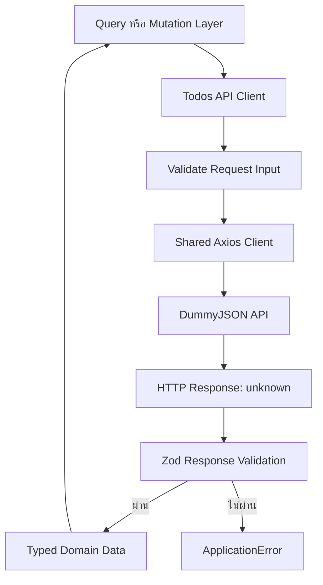
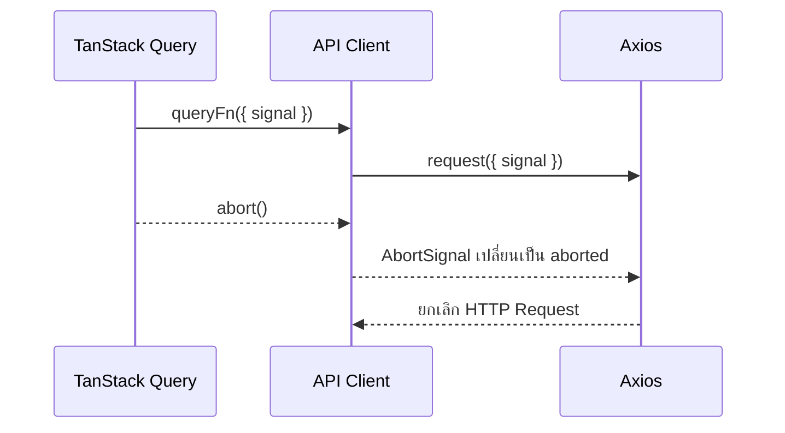
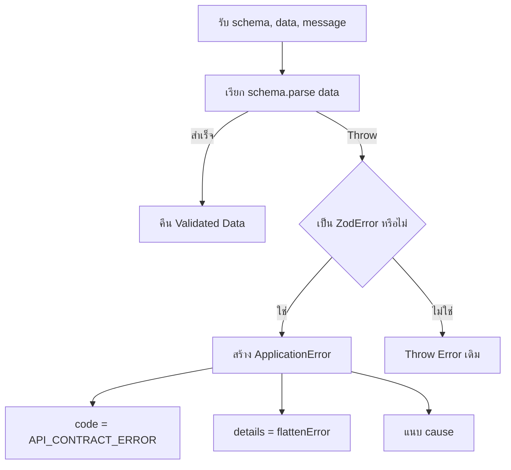
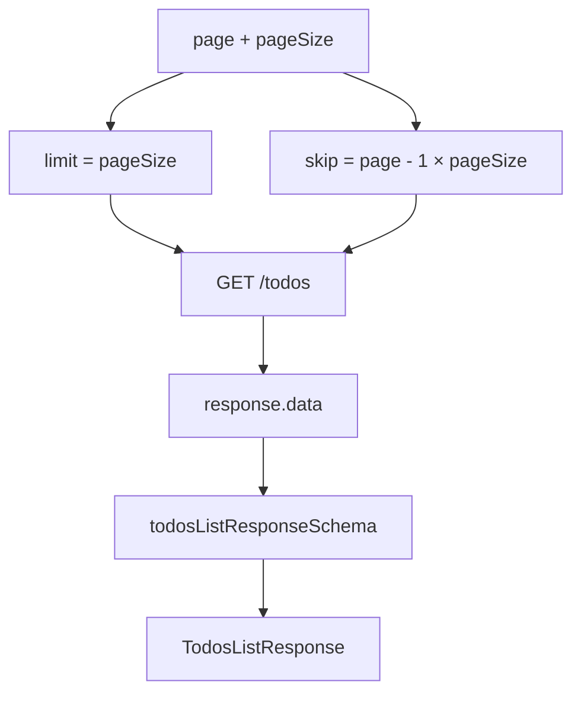
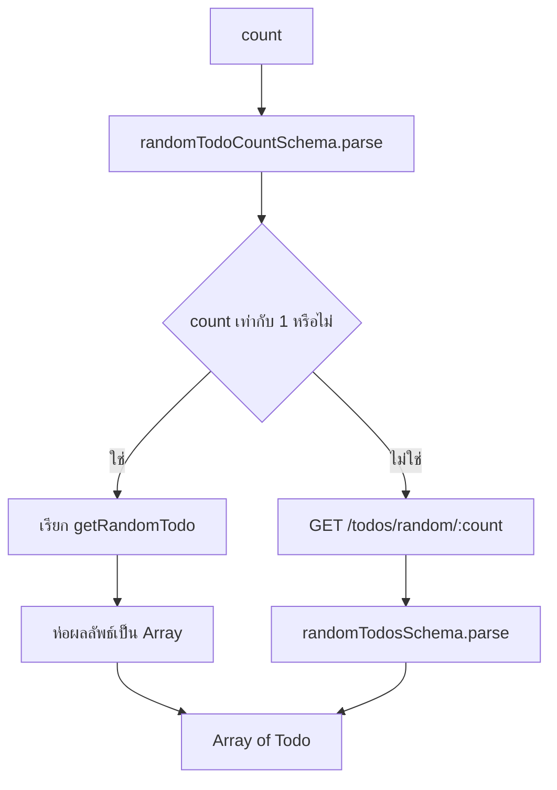
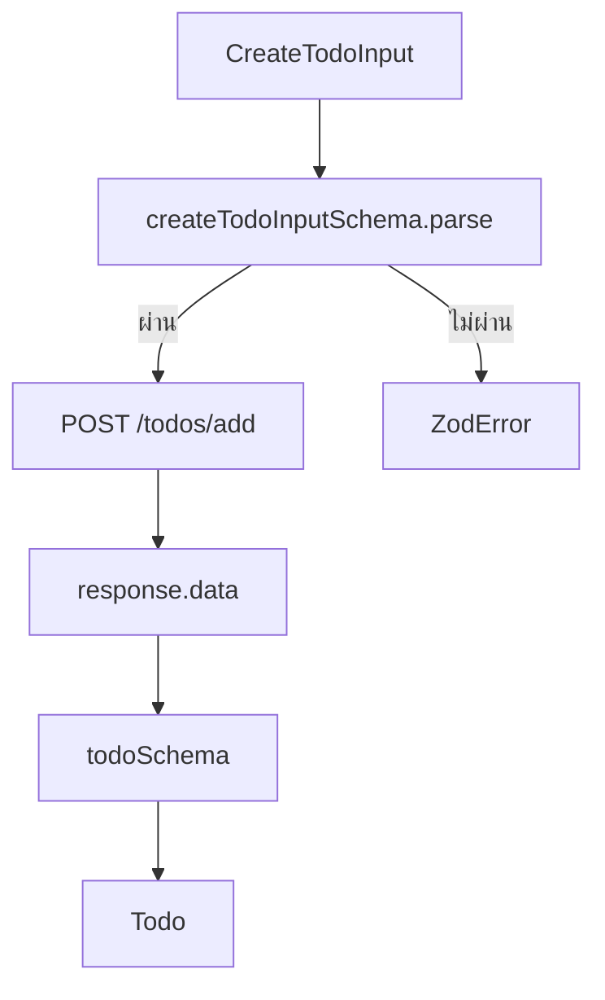
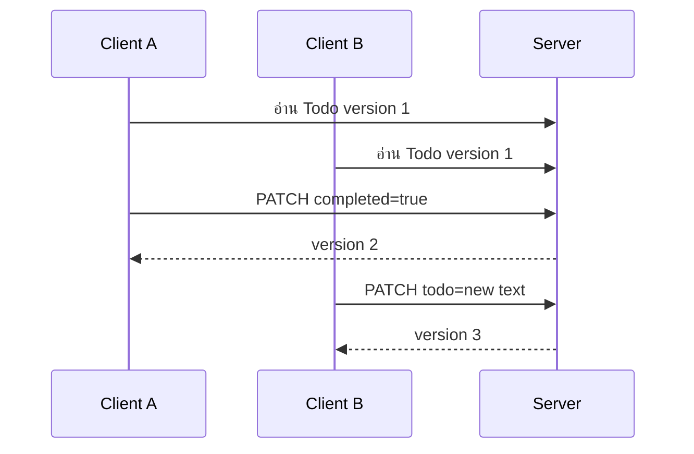
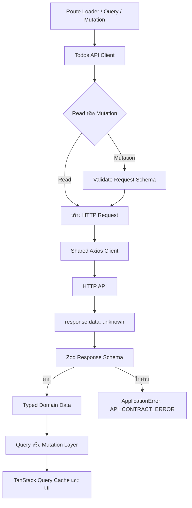

# คำอธิบายเพิ่มเติมเกี่ยวกับ API Client

ไฟล์เป้าหมายจาก Tutorial: `src/features/todos/api/client.ts`

> หมายเหตุ: ไฟล์ `src/features/todos/api/client.ts` ยังไม่ได้อยู่ใน Source Tree ของ Repository ปัจจุบัน เพราะ Tutorial ออกแบบให้ผู้อ่านสร้างไฟล์นี้ขึ้นมาเอง เนื้อหาในเอกสารนี้จึงอธิบายจาก Implementation ในหัวข้อ 5 ของ `docs/GETTING_STARTED.th.md`

API Client คือ Boundary ที่เชื่อมระหว่าง Feature Todos กับ HTTP API ภายนอก หน้าที่ของมันไม่ใช่เพียงเรียก Axios แต่ต้องควบคุมวงจรของข้อมูลให้ครบตั้งแต่รับ Input, สร้าง HTTP Request, รองรับการยกเลิก Request, ตรวจ Runtime Contract ของ Response และคืน Domain Data ที่เชื่อถือได้ให้ Query หรือ Mutation Layer



API Client อยู่ระหว่างสอง Boundary สำคัญ

1. Function Caller → HTTP Request
2. HTTP Response → Domain Data

ดังนั้นไฟล์นี้จึงต้องรักษากฎหลักต่อไปนี้

- Caller ส่ง Parameter ที่สื่อความหมายเชิง Domain ไม่ส่ง Axios Config กระจัดกระจาย
- Request Input ของ Mutation ต้องถูก Validate ก่อนส่ง
- HTTP Response ต้องถูกมองเป็น `unknown` จนกว่าจะผ่าน Zod Schema
- Client คืน Domain Data ไม่คืน `AxiosResponse`
- Cancellation ต้องส่งต่อจาก TanStack Query ไปถึง Axios
- Transport Error และ Contract Error ต้องแยกความหมายออกจากกัน

---

## Interfaces

Interfaces ในไฟล์นี้ทำหน้าที่นิยาม Function Contract ของแต่ละ API Operation ว่า Caller ต้องส่งข้อมูลอะไรเข้ามา โดยแยกตาม Use Case เช่น อ่านรายการ, อ่านรายละเอียด, สุ่ม, เพิ่ม, แก้ไข และลบ

การใช้ Object Parameter แทน Positional Parameter ช่วยให้ Call Site อ่านง่ายและรองรับการเพิ่ม Option ภายหลังโดยไม่ต้องเปลี่ยนลำดับ Argument

```ts
getTodo({ todoId: 12, signal });
```

ชัดเจนกว่า

```ts
getTodo(12, signal);
```

เมื่อ Function มี Parameter เพิ่มขึ้นหลายรายการ ความแตกต่างนี้จะมีผลต่อ Maintainability อย่างชัดเจน

---

### `RequestInput`

```ts
interface RequestInput {
  signal?: AbortSignal | undefined;
}
```

เป็น Base Interface สำหรับ Request ทุกตัวที่รองรับการยกเลิกผ่าน Web Platform `AbortSignal`

Input:

- `signal` — Signal ที่อาจส่งมาจาก TanStack Query, Route Loader หรือ Caller อื่น
- เป็น Optional เพราะบางคำสั่ง เช่นการเรียกจาก Event Handler โดยตรง อาจไม่มี Signal

Output:

- Interface นี้ไม่มี Runtime Output แต่ทำให้ Type ของ Function ต่าง ๆ รองรับ Cancellation อย่างสม่ำเสมอ

บทบาทใน Flow:



เหตุผลที่ไม่สร้าง `AbortController` ภายใน API Client คือ Lifecycle ของ Request ถูกควบคุมโดย Caller อยู่แล้ว API Client ควรส่งต่อ Signal ไม่ควรแย่ง Ownership

Edge Cases:

- Signal ถูก Abort ก่อนเรียก Function: Axios ควรยกเลิก Request ทันที
- Signal ถูก Abort ระหว่าง Response กำลังกลับมา: Promise จะ Reject ด้วย Cancellation Error
- Caller ไม่ส่ง Signal: Request จะทำงานตามปกติ แต่ไม่สามารถยกเลิกจากภายนอกได้

---

### `GetTodosInput`

```ts
export interface GetTodosInput extends RequestInput {
  page: number;
  pageSize: number;
}
```

ใช้กับ `getTodos` สำหรับอ่านรายการ Todo แบบ Pagination

Input:

- `page` — หมายเลขหน้าที่ UI ใช้ โดยเริ่มจาก 1
- `pageSize` — จำนวนรายการต่อหน้า
- `signal` — Optional Cancellation Signal จาก `RequestInput`

Output ของ Interface:

```ts
{
  page: number;
  pageSize: number;
  signal?: AbortSignal;
}
```

ค่าจะถูกแปลงเป็น Query Parameter ของ DummyJSON ดังนี้

```text
limit = pageSize
skip  = (page - 1) × pageSize
```

ตัวอย่าง

```text
page = 3
pageSize = 20

limit = 20
skip = 40
```

Edge Cases:

- `page = 0` ทำให้ `skip` ติดลบ
- `pageSize = 0` เป็นค่าที่ DummyJSON รองรับ แต่ UI อาจไม่ควรอนุญาต
- `page` หรือ `pageSize` เป็นทศนิยม ทำให้ Pagination ไม่สมเหตุผล
- ค่าที่ใหญ่มากอาจสร้าง Request ที่หนักเกินจำเป็น

Interface เป็นเพียง Compile-time Contract จึงไม่ได้ป้องกันกรณีเหล่านี้เอง โดยปกติควร Validate ที่ URL Schema หรือ Boundary ก่อนเข้ามาถึง API Client และอาจเพิ่ม Defensive Validation ใน Client เมื่อเป็นระบบ Production

---

### `GetTodoInput`

```ts
export interface GetTodoInput extends RequestInput {
  todoId: number;
}
```

ใช้กับ `getTodo` เพื่ออ่าน Todo หนึ่งรายการ

Input:

- `todoId` — Identifier ของ Todo ที่จะนำไปประกอบ Path `/todos/:id`
- `signal` — Optional Cancellation Signal

Output ของ Interface:

```ts
{
  todoId: number;
  signal?: AbortSignal;
}
```

Edge Cases:

- `todoId <= 0`
- `todoId` เป็นทศนิยม, `NaN` หรือ `Infinity`
- Todo ไม่มีอยู่จริงและ API ตอบ `404`
- Caller สร้าง ID จาก String โดยไม่ผ่านการ Validate

Production Client ควรมั่นใจว่า ID ผ่าน Route Param Schema หรือ Domain Schema ก่อนนำไปประกอบ URL

---

### `GetTodosByUserInput`

```ts
export interface GetTodosByUserInput extends RequestInput {
  userId: number;
}
```

ใช้กับ `getTodosByUser` สำหรับอ่าน Todos ของ User ที่ระบุ

Input:

- `userId` — Identifier ของ User
- `signal` — Optional Cancellation Signal

Endpoint ที่ได้:

```text
GET /todos/user/:userId
```

ข้อสังเกต:

DummyJSON Endpoint นี้คืนรายการทั้งหมดของ User โดย Interface ปัจจุบันไม่ได้รับ `page` และ `pageSize` ดังนั้น Query Key และ UI ต้องเข้าใจว่า User-scoped list ไม่มี Pagination แบบเดียวกับ `/todos`

Edge Cases:

- User ไม่มี Todo และ API คืน Array ว่าง
- User ไม่มีอยู่จริง แต่ API อาจคืน List ว่างแทน `404`
- `userId` ผิดรูปแบบ
- Dataset ใหญ่มากในระบบจริงและ Endpoint ไม่รองรับ Pagination

---

### `GetRandomTodosInput`

```ts
export interface GetRandomTodosInput extends RequestInput {
  count: number;
}
```

ใช้กับ `getRandomTodos` เพื่อขอ Todo แบบสุ่ม 1–10 รายการ

Input:

- `count` — จำนวน Todo ที่ต้องการ
- `signal` — Optional Cancellation Signal

ค่า `count` จะถูก Validate ด้วย `randomTodoCountSchema` ก่อนเลือก Endpoint

```text
count = 1      → GET /todos/random
count = 2–10   → GET /todos/random/:count
```

Edge Cases:

- `count = 0`
- `count > 10`
- `count` เป็นทศนิยม
- API คืนรายการน้อยกว่าหรือมากกว่าที่ Contract อนุญาต

---

### `AddTodoRequest`

```ts
export interface AddTodoRequest extends RequestInput {
  input: CreateTodoInput;
}
```

ใช้กับ `addTodo` สำหรับสร้าง Todo ใหม่

Input:

- `input` — Mutation Payload ตาม `CreateTodoInput`
- `signal` — Optional Cancellation Signal

Shape โดยประมาณ

```ts
{
  input: {
    todo: string;
    completed: boolean;
    userId: number;
  };
  signal?: AbortSignal;
}
```

แม้ TypeScript จะตรวจ Shape ตอน Compile แต่ `addTodo` ยัง Parse ด้วย `createTodoInputSchema` อีกครั้ง เพื่อป้องกันข้อมูล Runtime ที่อาจมาจาก JavaScript, Form Parsing, Test Fixture หรือ External Caller

Edge Cases:

- ข้อความสั้นกว่า 3 ตัวอักษรหรือยาวเกิน 300 ตัวอักษร
- ข้อความมีแต่ช่องว่าง
- `userId` ไม่เป็นจำนวนเต็มบวก
- User กด Submit ซ้ำและเกิด Duplicate Mutation
- Request สำเร็จที่ Server แต่ Client ถูกตัดการเชื่อมต่อก่อนรับ Response

---

### `UpdateTodoRequest`

```ts
export interface UpdateTodoRequest extends RequestInput {
  todoId: number;
  input: UpdateTodoInput;
}
```

ใช้กับ `updateTodo` สำหรับแก้ Todo บาง Field ด้วย `PATCH`

Input:

- `todoId` — Todo ที่ต้องการแก้
- `input` — Partial Payload ซึ่งมีอย่างน้อยหนึ่ง Field
- `signal` — Optional Cancellation Signal

ตัวอย่างที่ถูกต้อง

```ts
{ todoId: 1, input: { completed: true } }
```

```ts
{ todoId: 1, input: { todo: "Prepare release notes" } }
```

ตัวอย่างที่ไม่ผ่าน Contract

```ts
{ todoId: 1, input: {} }
```

Edge Cases:

- Todo ถูกแก้จาก Client อื่นก่อน Request นี้
- Todo ถูกลบไปแล้ว
- Payload ว่าง
- ส่ง Field ที่ไม่ควรถูกแก้ เช่น `id` หรือ `userId`
- Update สำเร็จแต่ Response ไม่ตรง `todoSchema`

ระบบ Production อาจต้องใช้ Version, ETag หรือ `updatedAt` สำหรับ Optimistic Concurrency Control

---

### `DeleteTodoRequest`

```ts
export interface DeleteTodoRequest extends RequestInput {
  todoId: number;
}
```

ใช้กับ `deleteTodo` เพื่อระบุ Todo ที่ต้องการลบ

Input:

- `todoId` — Identifier ของ Todo
- `signal` — Optional Cancellation Signal

Edge Cases:

- ลบ Entity ที่ไม่มีอยู่
- User ส่งคำสั่งลบซ้ำ
- Request ถูกยกเลิกหลัง Server ลบสำเร็จแล้ว แต่ก่อน Client รับ Response
- API จริงใช้ `204 No Content` แต่ Contract ปัจจุบันคาดหวัง JSON Body
- User ไม่มีสิทธิ์ลบและ Server ตอบ `403`

---

## Methods

Methods ใน API Client มี Pattern เดียวกัน

```text
รับ Domain-oriented Input
  → Validate Input เมื่อจำเป็น
  → สร้าง Request
  → ส่งผ่าน Shared HTTP Client
  → รับ response.data ในฐานะข้อมูลภายนอก
  → Parse ด้วย Zod
  → คืน Typed Domain Data
```

Read Operations Validate Response เป็นหลัก ส่วน Mutation Operations Validate ทั้ง Request Payload และ Response

---

### `parseResponse`

```ts
function parseResponse<TSchema extends z.ZodType>(
  schema: TSchema,
  data: unknown,
  message: string,
): z.infer<TSchema>
```

เป็น Generic Helper สำหรับ Parse HTTP Response ด้วย Zod และแปลง `ZodError` ให้เป็น `ApplicationError` ที่ระบบรู้จัก

Input:

- `schema` — Zod Schema ที่ใช้ตรวจ Response
- `data` — ข้อมูลที่ยังไม่เชื่อถือ จึงประกาศเป็น `unknown`
- `message` — Contextual Message ที่บอกว่า Operation ใดมี Contract ผิด

Output:

- คืนค่าชนิด `z.infer<TSchema>` เมื่อ Parse สำเร็จ
- Throw `ApplicationError` เมื่อ Response ไม่ตรง Schema
- Re-throw Error เดิมเมื่อ Error ไม่ใช่ `ZodError`

Logic Breakdown:



เหตุผลที่ไม่ปล่อย `ZodError` ตรง ๆ:

- UI และ Error Boundary ไม่ควรผูกกับ Validation Library โดยตรง
- ระบบต้องแยก Contract Failure ออกจาก Network Failure
- Error Code คงที่ช่วยให้ Logging และ Observability จัดกลุ่มเหตุการณ์ได้
- Contextual Message บอกได้ว่า Endpoint ใดผิด Contract

ข้อสังเกตเกี่ยวกับ `cause`:

Implementation ใช้ `cause: error.cause` ซึ่งอาจเป็น `undefined` เพราะ `ZodError` ไม่จำเป็นต้องมี Cause ต้นทาง หากต้องการเก็บ Error จริงเพื่อ Debug อาจใช้ `cause: error` ตาม Contract ของ `ApplicationError` แทน ทั้งนี้ต้องตรวจ Design ของ Error Class ก่อนแก้

Performance:

Zod Parse มีต้นทุนตามขนาดของ Payload สำหรับ Todo รายการเล็กถือว่าต่ำ แต่ Response ขนาดใหญ่หลายพันรายการจะมี Validation Cost แบบ O(n) ตามจำนวน Entity ซึ่งเป็นต้นทุนที่ตั้งใจจ่ายเพื่อความถูกต้องของ Boundary

Edge Cases:

- Schema Transform หรือ Coercion อาจเปลี่ยนค่าก่อนคืน
- Payload ใหญ่มากทำให้ Parse ใช้ CPU และ Memory สูง
- Error Detail อาจมีข้อมูล Response ที่ไม่ควรถูกส่งไป Client Logging ภายนอก
- Schema ผิดเอง เช่น Contract เข้มเกิน API จริง ทำให้ทุก Request Fail

---

### `withSignal`

```ts
function withSignal(signal: AbortSignal | undefined) {
  return signal === undefined ? {} : { signal };
}
```

เป็น Helper สำหรับสร้าง Axios Config Fragment เฉพาะเมื่อมี Signal

- Input: `signal: AbortSignal | undefined`
- Output: `{}` หรือ `{ signal: AbortSignal }`

เหตุผลที่ใช้ Helper:

- ลดการเขียน Conditional Config ซ้ำทุก Method
- ทำให้ทุก Endpoint รองรับ Cancellation ด้วย Convention เดียวกัน
- หลีกเลี่ยงการส่ง `signal: undefined` เข้า Config

แม้ Axios รองรับ `undefined` ได้ในหลายกรณี แต่การละ Property ออกชัดเจนกว่าและช่วยรักษา Type เมื่อเปิด `exactOptionalPropertyTypes`

Edge Cases:

- Signal เป็น Object ปลอมที่ไม่ใช่ `AbortSignal` จาก Runtime JavaScript
- Signal ถูก Abort แล้วก่อน Function ทำงาน
- Library Adapter ไม่ส่งต่อ Signal จริง

---

### `getTodos`

```ts
export async function getTodos({
  page,
  pageSize,
  signal,
}: GetTodosInput): Promise<TodosListResponse>
```

หน้าที่: อ่านรายการ Todo แบบ Server Pagination

Input:

- `page`
- `pageSize`
- `signal`

Output: `Promise<TodosListResponse>`

Logic Breakdown:

1. Destructure Input
2. คำนวณ `limit` จาก `pageSize`
3. คำนวณ `skip` จาก `(page - 1) * pageSize`
4. เรียก `GET /todos`
5. ส่ง Signal ให้ Axios เมื่อมี
6. Parse `response.data` ด้วย `todosListResponseSchema`
7. คืนข้อมูลที่ Validate และ Normalize แล้ว



ตัวอย่าง

```ts
await getTodos({ page: 2, pageSize: 10 });
```

Request:

```text
GET /todos?limit=10&skip=10
```

Performance Analysis:

- ใช้ Server Pagination จึงไม่ต้องดาวน์โหลด Dataset ทั้งหมด
- Signal ช่วยยกเลิก Request เก่าเมื่อ User เปลี่ยนหน้าเร็ว
- Query Cache ควรแยกตาม `page` และ `pageSize`
- ไม่ควรใช้ `pageSize` ใหญ่เกินไปเพราะเพิ่ม Network, Parse และ Render Cost

Edge Cases:

- Pagination Overflow เมื่อ `page` สูงกว่าจำนวนหน้าจริง
- API คืน `skip` หรือ `limit` ไม่ตรง Request แต่ยังผ่าน Schema
- Dataset เปลี่ยนระหว่างเปลี่ยนหน้า ทำให้รายการซ้ำหรือขาด
- Page เปลี่ยนเร็วและ Response เก่ากลับมาทีหลัง ซึ่ง TanStack Query Key และ Cancellation ต้องช่วยควบคุม

---

### `getTodo`

```ts
export async function getTodo({ todoId, signal }: GetTodoInput): Promise<Todo>
```

หน้าที่: อ่าน Todo หนึ่งรายการจาก `GET /todos/:id`

Input:

- `todoId`
- `signal`

Output: `Promise<Todo>`

Logic Breakdown:

1. ประกอบ Endpoint จาก `todoId`
2. เรียก Shared HTTP Client
3. ส่ง Cancellation Signal
4. Parse Response ด้วย `todoSchema`
5. คืน Todo ที่ Validate แล้ว

> Security Note: การใช้ Template Literal กับ Numeric ID ที่ผ่าน Validation มีความเสี่ยงต่ำ แต่ API Client ไม่ควรประกอบ Path จาก String ที่ไม่ได้ Validate โดยเฉพาะ Endpoint ที่รับ Arbitrary Path Segment

Edge Cases:

- `404 Not Found`
- Backend ตอบ Error Object แต่ใช้ Status 200 ทำให้ `todoSchema` Reject
- ID ที่ขอไม่ตรง ID ใน Response แต่ Schema ปัจจุบันไม่ตรวจ Cross-field Equality
- Response ถูก Cache ไว้แต่ Entity ถูกแก้จากระบบอื่นแล้ว

---

### `getTodosByUser`

```ts
export async function getTodosByUser({
  userId,
  signal,
}: GetTodosByUserInput): Promise<TodosListResponse>
```

หน้าที่:

อ่าน Todos ที่เป็นของ User จาก `GET /todos/user/:userId`

Input:

- `userId`
- `signal`

Output:

- `Promise<TodosListResponse>`

Logic Breakdown:

1. นำ `userId` ประกอบ Endpoint
2. เรียก HTTP GET
3. Parse List Response ด้วย Schema เดียวกับ `getTodos`
4. คืน List Shape มาตรฐานให้ Query และ UI

ข้อดีของการคืน Shape เดียวกับ `getTodos` คือ Component ตารางและ Pagination Metadata สามารถใช้ Type เดียวกันได้ แม้ Semantics ของ Endpoint จะต่างกัน

Edge Cases:

- API คืน Todo ของ User อื่นปะปนมา แต่ Schema ปัจจุบันตรวจเพียง Shape ไม่ตรวจว่า `todo.userId === requestedUserId`
- User ไม่มี Todo
- Endpoint ระบบจริงต้องรองรับ Pagination แต่ Interface ไม่มี Parameter
- Authorization ต้องไม่พึ่ง `userId` จาก Client เพียงอย่างเดียว Server ต้องตรวจสิทธิ์จาก Identity Context

---

### `getRandomTodo`

```ts
export async function getRandomTodo({ signal }: RequestInput = {}): Promise<Todo>
```

หน้าที่: อ่าน Todo แบบสุ่มหนึ่งรายการจาก `GET /todos/random`

Input:

- Optional Object Parameter
- `signal` เป็น Optional
- หากไม่ส่ง Argument จะใช้ `{}` เป็น Default

Output: `Promise<Todo>`

ข้อดีของ Default Parameter:

```ts
await getRandomTodo();
```

และ

```ts
await getRandomTodo({ signal });
```

สามารถใช้ Function เดียวกันได้โดยไม่ต้องส่ง Object ว่างทุกครั้ง

> Caching Consideration: Random Endpoint มี Semantics ต่างจาก Resource Query ทั่วไป เพราะ Caller มักคาดหวังผลใหม่ทุกครั้ง หากนำไปใช้กับ TanStack Query ต้องกำหนด `staleTime`, `refetch` หรือใช้ Mutation-style trigger ให้ตรงกับ UX ไม่เช่นนั้น Cache อาจทำให้กดสุ่มแล้วได้ค่าครั้งเดิม

Edge Cases:

- API สุ่มได้ Item เดิมติดต่อกัน ซึ่งไม่ใช่ Error
- Cache ป้องกันการยิง Request ใหม่
- Response ไม่ตรง `todoSchema`
- Endpoint ไม่มีข้อมูลให้สุ่ม

---

### `getRandomTodos`

```ts
export async function getRandomTodos({
  count,
  signal,
}: GetRandomTodosInput): Promise<Array<Todo>>
```

หน้าที่: อ่าน Todo แบบสุ่มหลายรายการ โดย Normalize Output ให้เป็น `Array<Todo>` เสมอ แม้ขอเพียงหนึ่งรายการ

Input:

- `count`
- `signal`

Output: `Promise<Array<Todo>>`

Logic Breakdown:

1. Parse `count` ด้วย `randomTodoCountSchema`
2. หาก `count === 1` ให้เรียก `getRandomTodo`
3. นำ Todo เดี่ยวมาห่อเป็น Array
4. หาก `count` อยู่ระหว่าง 2–10 ให้เรียก `/todos/random/:count`
5. Parse Response ด้วย `randomTodosSchema`
6. คืน Array ที่ผ่าน Validation



เหตุผลที่ Normalize Output:

Caller ไม่ต้องรองรับ Union Type แบบนี้

```ts
Todo | Array<Todo>
```

แต่ใช้ Type เดียวเสมอ

```ts
Array<Todo>
```

ช่วยลด Branching ใน UI และ Mutation Consumer

> Performance Analysis:
> - `count === 1` ใช้ Endpoint เฉพาะแทน Endpoint หลายรายการ
> - จำกัดสูงสุด 10 รายการเพื่อลด Payload และ Render Cost
> - Validation Cost ต่ำตามขนาด Array ที่จำกัด

Edge Cases:

- API หลายรายการคืน Todo ซ้ำ
- API คืนจำนวนไม่ตรง `count` แต่ Schema ตรวจเพียง 1–10 ไม่ได้ตรวจ Exact Length
- Request ถูก Abort ระหว่างเรียก Nested Function
- `count` ถูก Coerce จาก String ไม่ได้ เพราะ Schema ใช้ `z.number()` ไม่ใช่ `z.coerce.number()`

---

### `addTodo`

```ts
export async function addTodo({ input, signal }: AddTodoRequest): Promise<Todo>
```

หน้าที่: สร้าง Todo ใหม่ผ่าน `POST /todos/add`

Input:

- `input: CreateTodoInput`
- `signal`

Output: `Promise<Todo>`

Logic Breakdown:

1. Validate Input ด้วย `createTodoInputSchema`
2. ได้ `payload` ที่ Trim และ Normalize แล้ว
3. เรียก `POST /todos/add`
4. ส่ง Payload เป็น Request Body
5. Parse Response ด้วย `todoSchema`
6. คืน Todo ที่ Server ตอบกลับ



> Security Analysis:
> - Client-side Validation ช่วย UX แต่ไม่ใช่ Security Boundary สุดท้าย
> - Server ต้อง Validate Input ซ้ำเสมอ
> - `userId` จาก Browser ไม่ควรถูกเชื่อถือเพื่อระบุ Ownership ในระบบจริง
> - Authorization ควรอ้างอิง Identity จาก Session หรือ Access Token ที่ Server ตรวจแล้ว

> DummyJSON Limitation: Endpoint นี้จำลองการสร้างและคืน Object ใหม่ แต่ไม่ได้ Persist ลง Dataset เมื่อ Refresh หรือ Fetch ใหม่ข้อมูลจะหายไป ดังนั้น Cache Update ใน Tutorial ต้องถูกมองเป็น Demo Consistency Model ไม่ใช่พฤติกรรมของ Database จริง

Edge Cases:

- Double Submit สร้างข้อมูลซ้ำ
- Timeout แต่ Server สร้างสำเร็จแล้ว ทำให้ Retry อาจสร้างซ้ำ
- Server Generate ID ชนกันหรือ Response ขาด Field
- Input ผ่าน TypeScript แต่ไม่ผ่าน Runtime Schema

ระบบจริงควรพิจารณา Idempotency Key สำหรับ Create Operation ที่ Retry ได้

---

### `updateTodo`

```ts
export async function updateTodo({
  todoId,
  input,
  signal,
}: UpdateTodoRequest): Promise<Todo>
```

หน้าที่: แก้บาง Field ของ Todo ผ่าน `PATCH /todos/:id`

Input:

- `todoId`
- `input: UpdateTodoInput`
- `signal`

Output: `Promise<Todo>`

Logic Breakdown:

1. Parse Partial Payload ด้วย `updateTodoInputSchema`
2. Reject Payload ว่าง
3. ตัด Field ที่ไม่ได้อยู่ใน Update Contract
4. เรียก HTTP PATCH
5. Parse Response เป็น Todo เต็มรูป
6. คืน Entity ใหม่สำหรับอัปเดต Query Cache

> เหตุผลที่ใช้ `PATCH`: Form ส่งเฉพาะ Field ที่เปลี่ยน ไม่ได้ Replace Resource ทั้งก้อน หาก API ใช้ `PUT` ตาม Semantics ของ Full Replacement Caller ต้องส่ง Field ที่จำเป็นทั้งหมดและ Contract ต้องเปลี่ยนตาม

Concurrency Risk:



หาก Backend Merge เฉพาะ Field การแก้ไขอาจอยู่ร่วมกันได้ แต่หากมี Business Rule ซับซ้อนอาจเกิด Lost Update ระบบ Production ควรพิจารณา Version Field, ETag และ `If-Match`

Edge Cases:

- Payload ว่าง
- Server ไม่รองรับ PATCH
- Entity ถูกลบระหว่างแก้
- Response คืน Partial Object แต่ `todoSchema` ต้องการ Full Object
- Optimistic Update ต้อง Rollback เมื่อ Request Fail

---

### `deleteTodo`

```ts
export async function deleteTodo({
  todoId,
  signal,
}: DeleteTodoRequest): Promise<DeletedTodo>
```

หน้าที่: ลบ Todo ผ่าน `DELETE /todos/:id`

Input:

- `todoId`
- `signal`

Output: `Promise<DeletedTodo>`

Logic Breakdown:

1. ประกอบ Endpoint จาก `todoId`
2. เรียก HTTP DELETE
3. รับ Response Body
4. Parse ด้วย `deletedTodoSchema`
5. ยืนยันว่า Response มี Todo Fields, `isDeleted: true` และ `deletedOn` ที่เป็น ISO Datetime
6. คืน Deleted Entity ให้ Mutation Layer ใช้จัดการ Cache

Delete API ในระบบจริงพบได้หลายรูปแบบ

```text
200 OK + Deleted Resource
202 Accepted + Async Job
204 No Content
```

Implementation นี้ผูกกับรูปแบบแรกของ DummyJSON หาก Backend จริงคืน `204` ต้องเปลี่ยน Return Type และไม่ควร Parse Body ด้วย `deletedTodoSchema`

Edge Cases:

- Delete ซ้ำและ Server ตอบ `404` หรือ `410 Gone`
- Soft Delete กับ Hard Delete มี Semantics ต่างกัน
- API คืน `isDeleted: false`
- `deletedOn` ไม่ใช่ ISO Datetime
- Request ถูก Abort หลัง Server ลบเสร็จ ทำให้ Client ไม่รู้ผลสุดท้าย

---

## แนวทางสำหรับ Production

### 1. แยก Transport Error ออกจาก Contract Error

API Client ควรทำให้ Consumer แยกสถานการณ์อย่างน้อยต่อไปนี้ได้

- Request ถูกยกเลิก
- Network Error
- Timeout
- Authentication Error เช่น `401`
- Authorization Error เช่น `403`
- Not Found เช่น `404`
- Rate Limit เช่น `429`
- Server Error เช่น `5xx`
- API Contract Error

`parseResponse` ดูแล Contract Error ส่วน Shared HTTP Client ควร Normalize Transport และ HTTP Error เป็น Error Model กลาง

### 2. Validate Identifier และ Pagination ที่ Boundary

แม้ Route Search Schema จะ Validate มาแล้ว API Client ที่ใช้ซ้ำจากหลาย Caller ควรมี Defensive Contract สำหรับ `todoId`, `userId`, `page` และ `pageSize` เมื่อความเสียหายจาก Input ผิดมีนัยสำคัญ

ตัวอย่างแนวคิด

```ts
const todoIdSchema = z.number().int().positive();
const pageSchema = z.number().int().min(1);
const pageSizeSchema = z.number().int().min(1).max(100);
```

ไม่จำเป็นต้อง Parse ซ้ำทุก Layer แบบไร้เหตุผล แต่ต้องกำหนดให้ชัดว่า Boundary ใดเป็นเจ้าของ Validation

### 3. Authentication และ Authorization

Token Injection ควรอยู่ใน Shared HTTP Client หรือ Auth Adapter ไม่ควรเขียนใน Todos Client ทุก Function

```text
Todos API Client
  → Shared HTTP Client
      → Auth Adapter หรือ Interceptor
          → Authorization Header / Cookie
```

ห้ามใช้ `userId` จาก Request เป็นหลักฐานว่าผู้ใช้มีสิทธิ์เข้าถึงข้อมูลนั้น Server ต้องตรวจ Identity และ Permission เอง

### 4. Request Cancellation

ทุก Read Query ควรส่ง Signal จาก TanStack Query ถึง Axios เพื่อลด Request ที่ไม่จำเป็น โดยเฉพาะ Search, Pagination และ Route Transition

Mutation Cancellation ต้องใช้ด้วยความระวัง เพราะ Abort ฝั่ง Client ไม่ได้ยืนยันว่า Server ยกเลิก Transaction แล้ว การยกเลิก Create, Update หรือ Delete อาจทิ้งสถานะที่ Client ไม่ทราบผลแน่นอน

### 5. Retry Policy และ Idempotency

Read Request สามารถ Retry ตามประเภท Error ได้ แต่ Mutation ไม่ควร Retry แบบทั่วไปโดยไม่มี Idempotency Strategy

- `GET` โดยทั่วไป Retry ได้
- `POST` อาจสร้างข้อมูลซ้ำ
- `PATCH` อาจ Apply ซ้ำได้หรือไม่ได้ ขึ้นกับ Operation
- `DELETE` อาจออกแบบให้ Idempotent แต่ Response ของการลบซ้ำต้องกำหนดชัด

ระบบจริงควรพิจารณา Idempotency Key สำหรับ Create และ Operation สำคัญ

### 6. Cache Consistency

API Client ไม่ควรจัดการ TanStack Query Cache โดยตรง หน้าที่นั้นควรอยู่ใน Query หรือ Mutation Layer เพื่อรักษา Separation of Concerns

```text
API Client
  → คืน Validated Server Result

Mutation Layer
  → ตัดสินใจ setQueryData, invalidateQueries หรือ removeQueries
```

นโยบาย Cache ต้องอ้างอิง Consistency Model ของ Backend ไม่ควร Invalidate ทุก Query โดยอัตโนมัติ และไม่ควรแก้ Cache แบบคาดเดาเมื่อ Server เป็นเจ้าของข้อมูลจริง

### 7. Contract Evolution

เมื่อ Backend เปลี่ยน Response Shape ต้องเปลี่ยน Schema, Type, Test และ Documentation ใน Change Set เดียวกัน

ควรมี Contract Tests สำหรับกรณีต่อไปนี้

- Valid Response
- Missing Required Field
- Wrong Primitive Type
- Invalid Date
- Empty List
- Error Response ที่ใช้ Status Code ผิด
- Backward-compatible Field เพิ่มใหม่

หาก Backend มี OpenAPI อาจ Generate Type ได้ แต่ Runtime Validation ยังมีประโยชน์ที่ Browser Boundary โดยเฉพาะ API ภายนอกหรือระบบที่ Deploy ไม่พร้อมกัน

### 8. Performance Optimization

- ใช้ Server Pagination แทน Fetch Dataset ทั้งหมด
- จำกัด `pageSize` และ Random Count
- ยกเลิก Request เก่าระหว่าง Navigation หรือ Filter Change
- หลีกเลี่ยง Response Schema ที่ Transform หนักโดยไม่จำเป็น
- สำหรับ Payload ใหญ่มากควรพิจารณา Pagination, Streaming หรือ Validation Strategy ที่เหมาะสม
- วัดผลก่อนตัด Runtime Validation ออก เพราะ Contract Failure ใน Production มักมีต้นทุนสูงกว่า CPU ที่ใช้ Parse

### 9. Security First

- ห้ามใส่ Secret ใน Frontend หรือ `VITE_*`
- Validate และ Encode Dynamic Path/Query Input
- Server ต้อง Validate Payload ซ้ำ
- Server ต้องเป็นผู้บังคับ Authorization
- อย่า Log Access Token, Personal Data หรือ Response Body ทั้งก้อนโดยอัตโนมัติ
- จำกัดรายละเอียด `ZodError` ที่ส่งเข้า External Telemetry
- ใช้ HTTPS และ Cookie/Token Policy ตาม Threat Model
- ระวัง Retry ของ Mutation และ Replay Attack

### 10. Observability

Production API Client ควรส่งข้อมูลที่ช่วยวิเคราะห์โดยไม่รั่วข้อมูลสำคัญ เช่น

- Operation Name
- Endpoint Template ไม่ใช่ URL ที่มี Personal Data
- HTTP Status
- Duration
- Retry Count
- Cancellation Status
- Error Code
- Contract Schema Version
- Correlation ID หรือ Trace ID

ไม่ควรผูก Logging SDK โดยตรงในทุก Feature Function ควรใช้ Shared Observability Adapter

### 11. Scalability และ Maintainability

เมื่อ Feature โตขึ้น ควรแยกตาม Responsibility โดยไม่แยกเร็วเกินจำเป็น

```text
features/todos/api/
├── contracts.ts
├── client.ts
├── queries.ts
├── mutations.ts
└── mappers.ts        # เพิ่มเมื่อ API Model ต่างจาก Domain Modelจริง
```

หาก API Response กลายเป็น Transport DTO ที่ไม่เหมาะกับ UI ควรเพิ่ม Mapper

```text
API DTO
  → Runtime Schema
  → Mapper
  → Domain Model
  → Query Cache
```

อย่าให้ API Client กลายเป็นไฟล์ที่รวม Query Key, Cache Policy, UI Formatting และ Business Workflow ไว้พร้อมกัน

### 12. Testing Strategy

ควรทดสอบ API Client ผ่าน Mock Service Worker หรือ HTTP Mock ที่ Boundary จริง ไม่ควร Mock `parseResponse` จนเสียคุณค่าของ Contract Test

Test Cases ขั้นต่ำ:

- สร้าง URL และ Query Parameter ถูกต้อง
- ส่ง Payload ถูกต้อง
- ส่ง AbortSignal ถึง Transport
- Parse Response สำเร็จ
- Response ผิด Contract กลายเป็น `ApplicationError`
- Input Mutation ผิดถูก Reject ก่อนยิง Network
- `count === 1` ใช้ Endpoint เดี่ยวและคืน Array
- `count` 2–10 ใช้ Endpoint หลายรายการ
- Cancellation ไม่ถูกแปลงเป็น Contract Error
- HTTP Error ไม่ถูกแปลงเป็น Contract Error

---

## สรุปสาระสำคัญ

API Client ของ Todos เป็น Feature Boundary ที่รับผิดชอบการสื่อสารกับ HTTP API โดยมีหลักสำคัญดังนี้

1. ใช้ Interface แบบ Object Parameter เพื่อทำให้ Contract ของแต่ละ Operation ชัดเจน
2. ส่ง `AbortSignal` จาก Caller ถึง Axios เพื่อรองรับ Cancellation
3. Validate Mutation Input ก่อนส่งออกจากระบบ
4. มอง `response.data` เป็นข้อมูลภายนอกและ Parse ด้วย Zod ทุกครั้ง
5. แปลง `ZodError` เป็น `ApplicationError` ที่มี Error Code กลาง
6. คืน Domain Data ไม่คืน Axios-specific Object
7. Normalize Random Result ให้เป็น `Array<Todo>` เสมอ
8. แยก API Transport ออกจาก Query Cache Policy
9. ออกแบบ Retry, Idempotency และ Concurrency ตาม Semantics ของ Operation
10. ปรับ Contract ให้ตรง Backend จริง โดยเฉพาะ Delete Response, Pagination และ Authentication

ภาพรวมสุดท้าย


