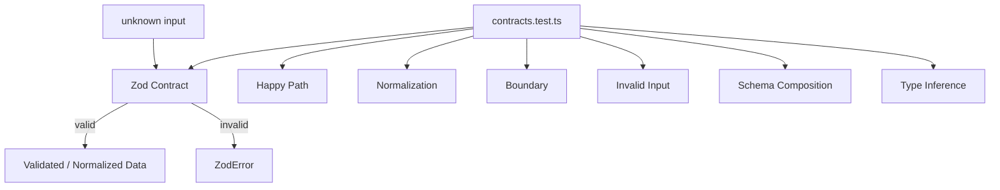
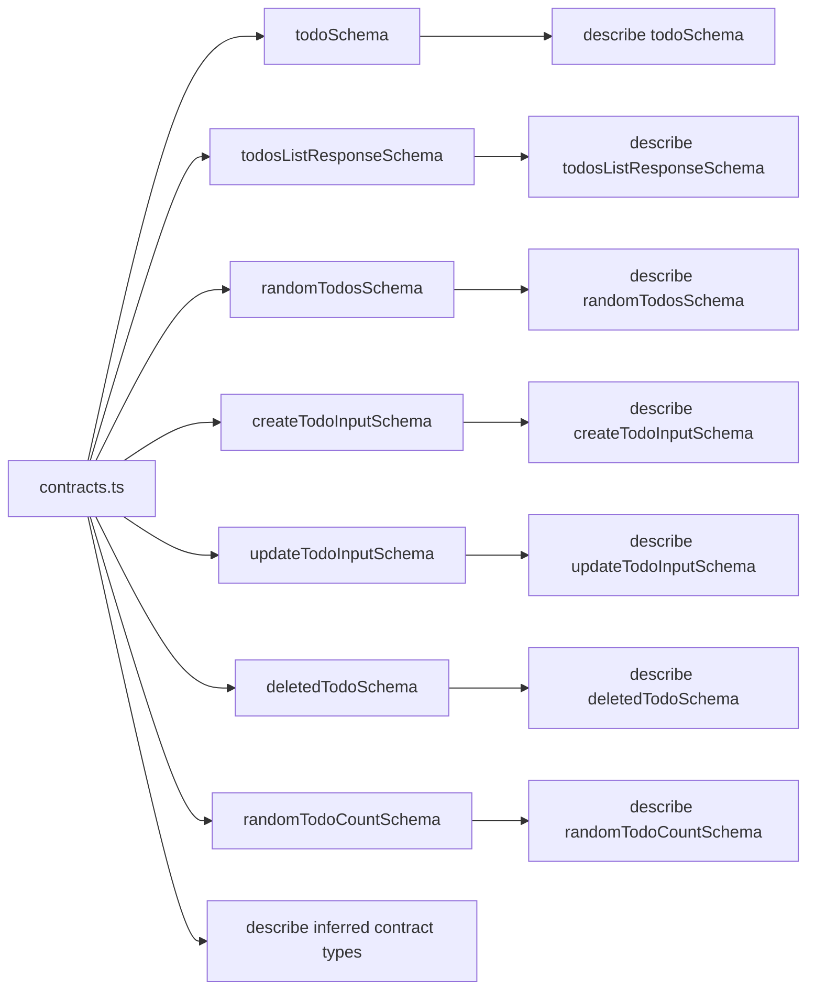
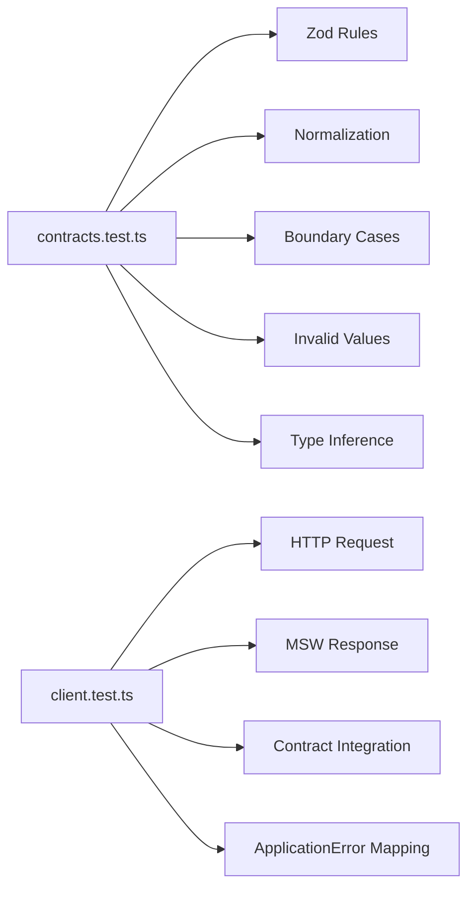
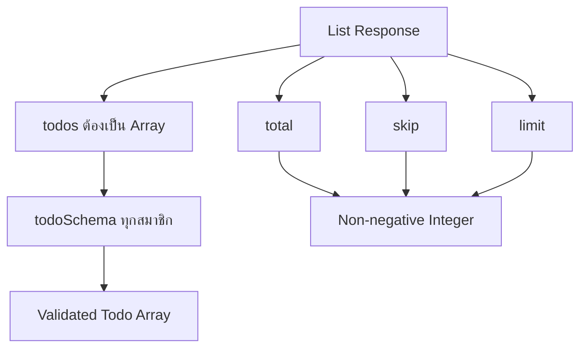
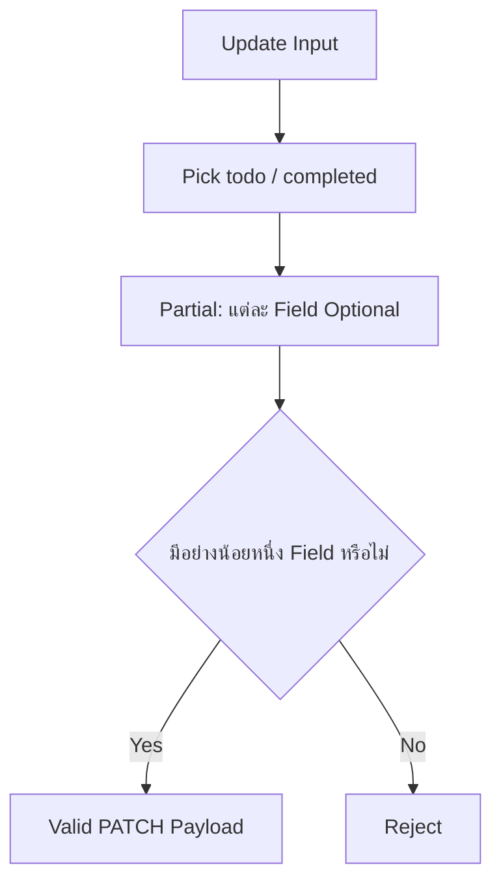
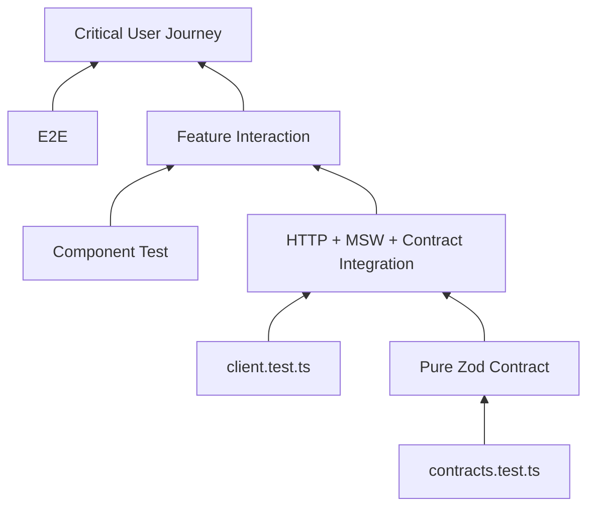

# แนวทางการเขียน Test สำหรับ Todos API Contract

ไฟล์ Test: `src/features/todos/api/contracts.test.ts`

ไฟล์ Production ที่ทดสอบ: `src/features/todos/api/contracts.ts`

เอกสารนี้อธิบายแนวทางเขียน Unit Test สำหรับ Runtime Contract ของโมดูล Todos ด้วย Vitest ตั้งแต่การเตรียม Test Runner, การออกแบบ Test Matrix, การเขียน Test Case, การทดสอบ Boundary และ Normalization ไปจนถึงการรัน Coverage และแนวทางดูแล Test เมื่อ Contract เปลี่ยน

> เอกสารนี้ต่อเนื่องจาก [การสร้าง API Contract](./api-contract.md) ดังนั้นควรสร้าง `src/features/todos/api/contracts.ts` ตามหัวข้อนั้นก่อน

เป้าหมายของ Contract Test ไม่ใช่การพิสูจน์ว่า Zod ทำงานได้ แต่คือการพิสูจน์ว่า **กฎของ Application ที่เราเขียนด้วย Zod ตรงกับ Runtime Contract ที่เราต้องการจริง**



Contract Test ในไฟล์นี้เป็น **Pure Unit Test** จึงไม่ต้องใช้ Axios, MSW, TanStack Query, React Testing Library หรือ DOM

---

## 1. สิ่งที่เราจะทดสอบ

`contracts.ts` ของ Tutorial มี Schema หลัก 7 ตัว

```text
todoSchema
  → Entity Contract

todosListResponseSchema
  → List Response Contract

randomTodosSchema
  → Random Collection Response Contract

createTodoInputSchema
  → Create Command Contract

updateTodoInputSchema
  → Update Command Contract

deletedTodoSchema
  → Delete Response Contract

randomTodoCountSchema
  → Random Count Control Contract
```

แนวทางนี้จัด `describe()` ให้ตรงกับ Schema แบบ 1:1 และเพิ่ม Type-level Contract อีกหนึ่งกลุ่ม เพื่อให้เปิด `contracts.ts` และ `contracts.test.ts` เทียบกันได้ง่าย



---

## 2. Prerequisite: Contract ที่ Test ชุดนี้อ้างอิง

ก่อนเขียน Test ต้องมี `src/features/todos/api/contracts.ts` ตาม Tutorial ดังนี้

```ts
import { z } from "zod";

export const todoSchema = z.object({
  id: z.coerce.number().int().positive(),
  todo: z.string().trim().min(1),
  completed: z.boolean(),
  userId: z.coerce.number().int().positive(),
});

export const todosListResponseSchema = z.object({
  todos: z.array(todoSchema),
  total: z.coerce.number().int().nonnegative(),
  skip: z.coerce.number().int().nonnegative(),
  limit: z.coerce.number().int().nonnegative(),
});

export const randomTodosSchema = z.array(todoSchema).min(1).max(10);

export const createTodoInputSchema = z.object({
  todo: z.string().trim().min(3).max(300),
  completed: z.boolean(),
  userId: z.number().int().positive(),
});

export const updateTodoInputSchema = createTodoInputSchema
  .pick({ todo: true, completed: true })
  .partial()
  .refine((value) => Object.keys(value).length > 0, {
    message: "ต้องมีข้อมูลอย่างน้อยหนึ่ง Field สำหรับการแก้ไข",
  });

export const deletedTodoSchema = todoSchema.extend({
  isDeleted: z.literal(true),
  deletedOn: z.iso.datetime(),
});

export const randomTodoCountSchema = z.number().int().min(1).max(10);

export type CreateTodoInput = z.infer<typeof createTodoInputSchema>;
export type DeletedTodo = z.infer<typeof deletedTodoSchema>;
export type Todo = z.infer<typeof todoSchema>;
export type TodosListResponse = z.infer<typeof todosListResponseSchema>;
export type UpdateTodoInput = z.infer<typeof updateTodoInputSchema>;
```

Test ต่อจากนี้ผูกกับกฎของ Contract ชุดนี้ หาก Schema เปลี่ยน Test ต้องถูกทบทวนพร้อมกัน

---

## 3. ติดตั้ง Vitest

Repository ใช้ Bun ดังนั้นติดตั้ง Vitest เป็น Development Dependency

```bash
bun add -D vitest @vitest/coverage-v8
```

- `vitest` คือ Test Runner
- `@vitest/coverage-v8` ใช้สร้าง Code Coverage ด้วย V8

สำหรับ Contract Test นี้ไม่จำเป็นต้องติดตั้ง `jsdom` เพราะไม่มี React Component หรือ Browser API

---

## 4. เพิ่ม Test Scripts

เพิ่มคำสั่งต่อไปนี้ใน `scripts` ของ `package.json`

```json
{
  "scripts": {
    "test": "vitest run",
    "test:watch": "vitest",
    "test:coverage": "vitest run --coverage",
    "test:contracts": "vitest run src/features/todos/api/contracts.test.ts"
  }
}
```

ให้นำเฉพาะ Script เหล่านี้ไปรวมกับ Script เดิมของ Repository ไม่ใช่แทนที่ `scripts` ทั้งหมด

| คำสั่ง | หน้าที่ |
| --- | --- |
| `bun run test` | รัน Test ทั้งหมดหนึ่งรอบ เหมาะกับ CI |
| `bun run test:watch` | Watch ไฟล์และรันใหม่เมื่อ Source/Test เปลี่ยน |
| `bun run test:coverage` | รัน Test พร้อมสร้าง Coverage |
| `bun run test:contracts` | รันเฉพาะ Todos API Contract Test |

---

## 5. ตำแหน่งไฟล์ Test

สร้างไฟล์

```text
src/features/todos/api/contracts.test.ts
```

โครงสร้างที่ได้

```text
src/
└── features/
    └── todos/
        └── api/
            ├── contracts.ts
            ├── contracts.test.ts
            ├── client.ts
            ├── client.test.ts
            ├── queries.ts
            └── mutations.ts
```

ใช้แนวทาง **Colocated Test** คือวาง Test อยู่ใกล้ Source ที่มันรับผิดชอบ

```text
contracts.ts
    ↓
contracts.test.ts

client.ts
    ↓
client.test.ts
```

Responsibility ต้องไม่ปะปนกัน



`contracts.test.ts` จึงไม่ควรมี `vi.mock()`, MSW Server, Axios, QueryClient หรือ DOM

---

## 6. Test Strategy

แต่ละ Schema ควรถูกตรวจอย่างน้อย 5 มิติ

1. **Happy Path** — ข้อมูลที่ถูกต้องต้องผ่าน
2. **Normalization** — Transformation เช่น `trim()` และ `coerce` ต้องได้ Output ที่คาดหวัง
3. **Boundary** — ค่าต่ำสุด/สูงสุดต้องถูกต้อง
4. **Invalid Input** — ชนิดข้อมูลและค่าที่ผิดต้องถูกปฏิเสธ
5. **Composition** — Schema ที่ประกอบจาก Schema อื่นต้องรักษากฎของ Schema ต้นทาง

และควรตรวจเพิ่มอีกหนึ่งมิติสำหรับ Contract ที่ Infer Type จาก Zod

6. **Type Inference** — Runtime Schema และ TypeScript Type ต้องไม่แยกออกจากกัน

Test Matrix หลักของไฟล์นี้คือ

| Schema | Happy Path | Normalize | Boundary | Invalid Type/Value | Composition/Structure |
| --- | --- | --- | --- | --- | --- |
| `todoSchema` | ✓ | ✓ | Positive Integer | ✓ | Required/Unknown Fields |
| `todosListResponseSchema` | ✓ | ✓ | Non-negative Integer | ✓ | Nested `todoSchema` |
| `randomTodosSchema` | ✓ | ✓ | 1–10 | ✓ | Nested `todoSchema` |
| `createTodoInputSchema` | ✓ | ✓ | 3–300 chars | ✓ | Required/Command Fields |
| `updateTodoInputSchema` | ✓ | ✓ | อย่างน้อย 1 Field | ✓ | Derived from Create Schema |
| `deletedTodoSchema` | ✓ | ✓ | `isDeleted === true` | ✓ | Extends `todoSchema` |
| `randomTodoCountSchema` | ✓ | - | 1–10 | ✓ | No Coercion |

---

## 7. `parse()` กับ `safeParse()` ใช้ต่างกันอย่างไร

Happy Path ควรใช้ `parse()` เพราะเราต้องตรวจ Output ที่ผ่าน Validation และ Transformation แล้ว

```ts
const result = todoSchema.parse(input);

expect(result).toEqual(expected);
```

Invalid Case ส่วนใหญ่ควรใช้ `safeParse()`

```ts
const result = todoSchema.safeParse(input);

expect(result.success).toBe(false);
```

เหตุผลคือ Test ต้องการสื่อว่า “Contract ปฏิเสธ Input นี้” มากกว่าจะผูกกับกลไกการ Throw ของ Zod

ใช้ `parse()` + `toThrow()` เมื่อเราต้องการตรวจพฤติกรรมการ Throw โดยเฉพาะ แต่สำหรับ Validation Matrix ทั่วไป `safeParse()` อ่านง่ายกว่าและให้ข้อมูล Error สำหรับ Assertion เพิ่มเติมได้

---

## 8. ใช้ Table-Driven Testing กับ Validation Cases

ถ้า Test Logic เหมือนกันแต่ Input ต่างกัน ควรใช้ `it.each()`

แทนที่จะเขียนซ้ำ

```ts
it("rejects zero id", () => {
  // ...
});

it("rejects negative id", () => {
  // ...
});

it("rejects decimal id", () => {
  // ...
});
```

ให้เขียน

```ts
it.each([
  ["zero", 0],
  ["negative", -1],
  ["decimal", 1.5],
])("rejects invalid id: %s", (_, id) => {
  // ...
});
```

ข้อดีคือเห็น Test Matrix ชัด ลด Copy/Paste และเพิ่ม Edge Case ได้ง่าย

---

# 9. โค้ด `contracts.test.ts` ฉบับเต็ม

สร้างไฟล์ `src/features/todos/api/contracts.test.ts` ด้วยโค้ดต่อไปนี้

```ts
import { describe, expect, expectTypeOf, it } from "vitest";

import {
  createTodoInputSchema,
  deletedTodoSchema,
  randomTodoCountSchema,
  randomTodosSchema,
  todoSchema,
  todosListResponseSchema,
  updateTodoInputSchema,
} from "./contracts";
import type {
  CreateTodoInput,
  DeletedTodo,
  Todo,
  TodosListResponse,
  UpdateTodoInput,
} from "./contracts";

const validTodo = {
  id: 1,
  todo: "Buy milk",
  completed: false,
  userId: 10,
};

const validCreateInput = {
  todo: "Buy milk",
  completed: false,
  userId: 10,
};

const validDeletedTodo = {
  ...validTodo,
  isDeleted: true as const,
  deletedOn: "2026-08-08T00:00:00.000Z",
};

function createTodos(count: number) {
  return Array.from({ length: count }, (_, index) => ({
    ...validTodo,
    id: index + 1,
  }));
}

describe("todoSchema", () => {
  it("accepts a valid todo", () => {
    const result = todoSchema.parse(validTodo);

    expect(result).toEqual(validTodo);
  });

  it("accepts completed=true", () => {
    const result = todoSchema.parse({
      ...validTodo,
      completed: true,
    });

    expect(result.completed).toBe(true);
  });

  it("coerces numeric string id and userId to numbers", () => {
    const result = todoSchema.parse({
      id: "1",
      todo: "Buy milk",
      completed: false,
      userId: "10",
    });

    expect(result).toEqual({
      id: 1,
      todo: "Buy milk",
      completed: false,
      userId: 10,
    });
    expect(result.id).toBeTypeOf("number");
    expect(result.userId).toBeTypeOf("number");
  });

  it("trims surrounding whitespace from todo text", () => {
    const result = todoSchema.parse({
      ...validTodo,
      todo: "  Buy milk  ",
    });

    expect(result.todo).toBe("Buy milk");
  });

  it("strips unknown fields from the parsed object", () => {
    const result = todoSchema.parse({
      ...validTodo,
      unexpected: "ignored",
    });

    expect(result).toEqual(validTodo);
    expect(result).not.toHaveProperty("unexpected");
  });

  it.each([
    ["zero", 0],
    ["negative integer", -1],
    ["decimal number", 1.5],
    ["decimal numeric string", "1.5"],
    ["non-numeric string", "abc"],
    ["empty string", ""],
    ["null", null],
    ["undefined", undefined],
    ["false", false],
  ])("rejects invalid id: %s", (_, id) => {
    const result = todoSchema.safeParse({
      ...validTodo,
      id,
    });

    expect(result.success).toBe(false);
  });

  it.each([
    ["zero", 0],
    ["negative integer", -1],
    ["decimal number", 1.5],
    ["decimal numeric string", "1.5"],
    ["non-numeric string", "abc"],
    ["empty string", ""],
    ["null", null],
    ["undefined", undefined],
    ["false", false],
  ])("rejects invalid userId: %s", (_, userId) => {
    const result = todoSchema.safeParse({
      ...validTodo,
      userId,
    });

    expect(result.success).toBe(false);
  });

  it.each(["", " ", "   ", "\n\t"])("rejects blank todo text: %j", (todo) => {
    const result = todoSchema.safeParse({
      ...validTodo,
      todo,
    });

    expect(result.success).toBe(false);
  });

  it.each([123, null, undefined, true, false, {}, []])(
    "rejects non-string todo value: %j",
    (todo) => {
      const result = todoSchema.safeParse({
        ...validTodo,
        todo,
      });

      expect(result.success).toBe(false);
    },
  );

  it.each(["true", "false", 0, 1, null, undefined, {}, []])(
    "rejects non-boolean completed value: %j",
    (completed) => {
      const result = todoSchema.safeParse({
        ...validTodo,
        completed,
      });

      expect(result.success).toBe(false);
    },
  );

  it.each(["id", "todo", "completed", "userId"] as const)(
    "rejects todo when required field %s is missing",
    (field) => {
      const input: Record<string, unknown> = { ...validTodo };
      delete input[field];

      const result = todoSchema.safeParse(input);

      expect(result.success).toBe(false);
    },
  );
});

describe("todosListResponseSchema", () => {
  const validListResponse = {
    todos: [validTodo],
    total: 1,
    skip: 0,
    limit: 30,
  };

  it("accepts a valid todos list response", () => {
    const result = todosListResponseSchema.parse(validListResponse);

    expect(result).toEqual(validListResponse);
  });

  it("coerces pagination metadata from numeric strings to numbers", () => {
    const result = todosListResponseSchema.parse({
      todos: [validTodo],
      total: "100",
      skip: "30",
      limit: "30",
    });

    expect(result).toEqual({
      todos: [validTodo],
      total: 100,
      skip: 30,
      limit: 30,
    });
  });

  it("normalizes nested todos through todoSchema", () => {
    const result = todosListResponseSchema.parse({
      todos: [
        {
          id: "1",
          todo: "  Buy milk  ",
          completed: false,
          userId: "10",
        },
      ],
      total: 1,
      skip: 0,
      limit: 30,
    });

    expect(result.todos[0]).toEqual(validTodo);
  });

  it("allows an empty todos array", () => {
    const result = todosListResponseSchema.parse({
      todos: [],
      total: 0,
      skip: 0,
      limit: 30,
    });

    expect(result.todos).toEqual([]);
    expect(result.total).toBe(0);
  });

  it("allows zero for nonnegative pagination metadata", () => {
    const result = todosListResponseSchema.parse({
      todos: [],
      total: 0,
      skip: 0,
      limit: 0,
    });

    expect(result).toEqual({
      todos: [],
      total: 0,
      skip: 0,
      limit: 0,
    });
  });

  it("rejects the entire response when one nested todo is invalid", () => {
    const result = todosListResponseSchema.safeParse({
      todos: [
        validTodo,
        {
          ...validTodo,
          id: 2,
          todo: "",
        },
      ],
      total: 2,
      skip: 0,
      limit: 30,
    });

    expect(result.success).toBe(false);
  });

  it("rejects todos when it is not an array", () => {
    const result = todosListResponseSchema.safeParse({
      todos: validTodo,
      total: 1,
      skip: 0,
      limit: 30,
    });

    expect(result.success).toBe(false);
  });

  it.each([
    ["total", -1],
    ["skip", -1],
    ["limit", -1],
  ] as const)("rejects negative %s", (field, value) => {
    const result = todosListResponseSchema.safeParse({
      ...validListResponse,
      [field]: value,
    });

    expect(result.success).toBe(false);
  });

  it.each([
    ["total", 1.5],
    ["skip", 1.5],
    ["limit", 1.5],
  ] as const)("rejects non-integer %s", (field, value) => {
    const result = todosListResponseSchema.safeParse({
      ...validListResponse,
      [field]: value,
    });

    expect(result.success).toBe(false);
  });

  it.each([
    ["total", "abc"],
    ["skip", "abc"],
    ["limit", "abc"],
  ] as const)("rejects non-numeric %s", (field, value) => {
    const result = todosListResponseSchema.safeParse({
      ...validListResponse,
      [field]: value,
    });

    expect(result.success).toBe(false);
  });

  it.each(["todos", "total", "skip", "limit"] as const)(
    "rejects response when required field %s is missing",
    (field) => {
      const input: Record<string, unknown> = { ...validListResponse };
      delete input[field];

      const result = todosListResponseSchema.safeParse(input);

      expect(result.success).toBe(false);
    },
  );

  it("strips unknown response fields by default", () => {
    const result = todosListResponseSchema.parse({
      ...validListResponse,
      unexpected: "ignored",
    });

    expect(result).toEqual(validListResponse);
    expect(result).not.toHaveProperty("unexpected");
  });

  it("does not enforce relationships between total, limit, and todos.length", () => {
    const result = todosListResponseSchema.parse({
      todos: [validTodo],
      total: 0,
      skip: 0,
      limit: 0,
    });

    expect(result.todos).toHaveLength(1);
    expect(result.total).toBe(0);
    expect(result.limit).toBe(0);
  });
});

describe("randomTodosSchema", () => {
  it("accepts one todo at the minimum collection size", () => {
    const result = randomTodosSchema.parse(createTodos(1));

    expect(result).toHaveLength(1);
  });

  it("accepts ten todos at the maximum collection size", () => {
    const result = randomTodosSchema.parse(createTodos(10));

    expect(result).toHaveLength(10);
  });

  it("normalizes every todo through todoSchema", () => {
    const result = randomTodosSchema.parse([
      {
        id: "1",
        todo: "  Buy milk  ",
        completed: false,
        userId: "10",
      },
    ]);

    expect(result).toEqual([validTodo]);
  });

  it("rejects an empty array", () => {
    const result = randomTodosSchema.safeParse([]);

    expect(result.success).toBe(false);
  });

  it("rejects more than ten todos", () => {
    const result = randomTodosSchema.safeParse(createTodos(11));

    expect(result.success).toBe(false);
  });

  it("rejects the collection when one nested todo is invalid", () => {
    const result = randomTodosSchema.safeParse([
      validTodo,
      {
        ...validTodo,
        id: 2,
        todo: "",
      },
    ]);

    expect(result.success).toBe(false);
  });

  it.each([null, {}, "not-an-array", 1])("rejects non-array input: %j", (input) => {
    const result = randomTodosSchema.safeParse(input);

    expect(result.success).toBe(false);
  });
});

describe("createTodoInputSchema", () => {
  it("accepts valid create input", () => {
    const result = createTodoInputSchema.parse(validCreateInput);

    expect(result).toEqual(validCreateInput);
  });

  it("accepts completed=true", () => {
    const result = createTodoInputSchema.parse({
      ...validCreateInput,
      completed: true,
    });

    expect(result.completed).toBe(true);
  });

  it("trims todo text", () => {
    const result = createTodoInputSchema.parse({
      ...validCreateInput,
      todo: "  Buy milk  ",
    });

    expect(result.todo).toBe("Buy milk");
  });

  it("accepts todo text at the minimum length", () => {
    const result = createTodoInputSchema.parse({
      ...validCreateInput,
      todo: "abc",
    });

    expect(result.todo).toBe("abc");
  });

  it("accepts todo text at the maximum length", () => {
    const todo = "a".repeat(300);

    const result = createTodoInputSchema.parse({
      ...validCreateInput,
      todo,
    });

    expect(result.todo).toHaveLength(300);
  });

  it("rejects todo shorter than three characters after trimming", () => {
    const result = createTodoInputSchema.safeParse({
      ...validCreateInput,
      todo: "  ab  ",
    });

    expect(result.success).toBe(false);
  });

  it("rejects todo longer than 300 characters", () => {
    const result = createTodoInputSchema.safeParse({
      ...validCreateInput,
      todo: "a".repeat(301),
    });

    expect(result.success).toBe(false);
  });

  it.each(["", " ", "   "])("rejects blank todo text: %j", (todo) => {
    const result = createTodoInputSchema.safeParse({
      ...validCreateInput,
      todo,
    });

    expect(result.success).toBe(false);
  });

  it.each([null, undefined, 123, true])("rejects non-string todo: %j", (todo) => {
    const result = createTodoInputSchema.safeParse({
      ...validCreateInput,
      todo,
    });

    expect(result.success).toBe(false);
  });

  it.each(["true", "false", 0, 1, null])("rejects non-boolean completed: %j", (completed) => {
    const result = createTodoInputSchema.safeParse({
      ...validCreateInput,
      completed,
    });

    expect(result.success).toBe(false);
  });

  it.each([0, -1, 1.5])("rejects invalid numeric userId: %j", (userId) => {
    const result = createTodoInputSchema.safeParse({
      ...validCreateInput,
      userId,
    });

    expect(result.success).toBe(false);
  });

  it("does not coerce userId from string to number", () => {
    const result = createTodoInputSchema.safeParse({
      ...validCreateInput,
      userId: "10",
    });

    expect(result.success).toBe(false);
  });

  it.each(["todo", "completed", "userId"] as const)(
    "rejects input when required field %s is missing",
    (field) => {
      const input: Record<string, unknown> = { ...validCreateInput };
      delete input[field];

      const result = createTodoInputSchema.safeParse(input);

      expect(result.success).toBe(false);
    },
  );

  it("strips fields that are not part of the create contract", () => {
    const result = createTodoInputSchema.parse({
      ...validCreateInput,
      id: 999,
      isDeleted: true,
    });

    expect(result).toEqual(validCreateInput);
    expect(result).not.toHaveProperty("id");
    expect(result).not.toHaveProperty("isDeleted");
  });
});

describe("updateTodoInputSchema", () => {
  it("accepts a todo-only update", () => {
    const result = updateTodoInputSchema.parse({
      todo: "Updated todo",
    });

    expect(result).toEqual({
      todo: "Updated todo",
    });
  });

  it("accepts a completed-only update with true", () => {
    const result = updateTodoInputSchema.parse({
      completed: true,
    });

    expect(result).toEqual({
      completed: true,
    });
  });

  it("accepts a completed-only update with false", () => {
    const result = updateTodoInputSchema.parse({
      completed: false,
    });

    expect(result).toEqual({
      completed: false,
    });
  });

  it("accepts todo and completed together", () => {
    const result = updateTodoInputSchema.parse({
      todo: "Updated todo",
      completed: true,
    });

    expect(result).toEqual({
      todo: "Updated todo",
      completed: true,
    });
  });

  it("trims todo text", () => {
    const result = updateTodoInputSchema.parse({
      todo: "  Updated todo  ",
    });

    expect(result.todo).toBe("Updated todo");
  });

  it("rejects an empty update object", () => {
    const result = updateTodoInputSchema.safeParse({});

    expect(result.success).toBe(false);

    if (!result.success) {
      expect(result.error.issues).toEqual(
        expect.arrayContaining([
          expect.objectContaining({
            message: "ต้องมีข้อมูลอย่างน้อยหนึ่ง Field สำหรับการแก้ไข",
          }),
        ]),
      );
    }
  });

  it("rejects an object containing only fields outside the update contract", () => {
    const result = updateTodoInputSchema.safeParse({
      userId: 20,
      id: 99,
    });

    expect(result.success).toBe(false);
  });

  it("rejects todo shorter than three characters after trimming", () => {
    const result = updateTodoInputSchema.safeParse({
      todo: "  ab  ",
    });

    expect(result.success).toBe(false);
  });

  it("rejects todo longer than 300 characters", () => {
    const result = updateTodoInputSchema.safeParse({
      todo: "a".repeat(301),
    });

    expect(result.success).toBe(false);
  });

  it.each(["true", "false", 0, 1, null])("rejects non-boolean completed: %j", (completed) => {
    const result = updateTodoInputSchema.safeParse({
      completed,
    });

    expect(result.success).toBe(false);
  });

  it("strips unknown fields when at least one valid update field exists", () => {
    const result = updateTodoInputSchema.parse({
      todo: "Updated todo",
      userId: 999,
      id: 123,
    });

    expect(result).toEqual({
      todo: "Updated todo",
    });
    expect(result).not.toHaveProperty("userId");
    expect(result).not.toHaveProperty("id");
  });
});

describe("deletedTodoSchema", () => {
  it("accepts a valid deleted todo", () => {
    const result = deletedTodoSchema.parse(validDeletedTodo);

    expect(result).toEqual(validDeletedTodo);
  });

  it("normalizes fields inherited from todoSchema", () => {
    const result = deletedTodoSchema.parse({
      id: "1",
      todo: "  Buy milk  ",
      completed: false,
      userId: "10",
      isDeleted: true,
      deletedOn: "2026-08-08T00:00:00.000Z",
    });

    expect(result).toEqual(validDeletedTodo);
  });

  it("requires isDeleted to be literal true", () => {
    const result = deletedTodoSchema.safeParse({
      ...validDeletedTodo,
      isDeleted: false,
    });

    expect(result.success).toBe(false);
  });

  it("rejects the response when isDeleted is missing", () => {
    const input: Record<string, unknown> = { ...validDeletedTodo };
    delete input.isDeleted;

    const result = deletedTodoSchema.safeParse(input);

    expect(result.success).toBe(false);
  });

  it("rejects an invalid deletedOn datetime", () => {
    const result = deletedTodoSchema.safeParse({
      ...validDeletedTodo,
      deletedOn: "not-a-datetime",
    });

    expect(result.success).toBe(false);
  });

  it("rejects the response when deletedOn is missing", () => {
    const input: Record<string, unknown> = { ...validDeletedTodo };
    delete input.deletedOn;

    const result = deletedTodoSchema.safeParse(input);

    expect(result.success).toBe(false);
  });

  it("still validates fields inherited from todoSchema", () => {
    const result = deletedTodoSchema.safeParse({
      ...validDeletedTodo,
      todo: "",
    });

    expect(result.success).toBe(false);
  });

  it("strips unknown response fields by default", () => {
    const result = deletedTodoSchema.parse({
      ...validDeletedTodo,
      unexpected: "ignored",
    });

    expect(result).toEqual(validDeletedTodo);
    expect(result).not.toHaveProperty("unexpected");
  });
});

describe("randomTodoCountSchema", () => {
  it.each([1, 2, 5, 10])("accepts valid count %i", (count) => {
    const result = randomTodoCountSchema.parse(count);

    expect(result).toBe(count);
  });

  it.each([0, -1, 11, 100])("rejects out-of-range count %i", (count) => {
    const result = randomTodoCountSchema.safeParse(count);

    expect(result.success).toBe(false);
  });

  it.each([1.5, 5.5, 9.9])("rejects decimal count %f", (count) => {
    const result = randomTodoCountSchema.safeParse(count);

    expect(result.success).toBe(false);
  });

  it.each(["1", "5", "10"])("does not coerce string count %j", (count) => {
    const result = randomTodoCountSchema.safeParse(count);

    expect(result.success).toBe(false);
  });

  it.each([Number.NaN, Number.POSITIVE_INFINITY, Number.NEGATIVE_INFINITY])(
    "rejects non-finite count %s",
    (count) => {
      const result = randomTodoCountSchema.safeParse(count);

      expect(result.success).toBe(false);
    },
  );
});

describe("inferred contract types", () => {
  it("keeps Todo aligned with todoSchema output", () => {
    const result = todoSchema.parse(validTodo);

    expectTypeOf(result).toEqualTypeOf<Todo>();
  });

  it("keeps TodosListResponse aligned with todosListResponseSchema output", () => {
    const result = todosListResponseSchema.parse({
      todos: [validTodo],
      total: 1,
      skip: 0,
      limit: 30,
    });

    expectTypeOf(result).toEqualTypeOf<TodosListResponse>();
  });

  it("keeps CreateTodoInput aligned with createTodoInputSchema output", () => {
    const result = createTodoInputSchema.parse(validCreateInput);

    expectTypeOf(result).toEqualTypeOf<CreateTodoInput>();
  });

  it("keeps UpdateTodoInput aligned with updateTodoInputSchema output", () => {
    const result = updateTodoInputSchema.parse({
      todo: "Updated todo",
    });

    expectTypeOf(result).toEqualTypeOf<UpdateTodoInput>();
  });

  it("keeps DeletedTodo aligned with deletedTodoSchema output", () => {
    const result = deletedTodoSchema.parse(validDeletedTodo);

    expectTypeOf(result).toEqualTypeOf<DeletedTodo>();
  });

  it("infers random todos as Todo[]", () => {
    const result = randomTodosSchema.parse([validTodo]);

    expectTypeOf(result).toEqualTypeOf<Array<Todo>>();
  });

  it("infers random todo count as number", () => {
    const result = randomTodoCountSchema.parse(5);

    expectTypeOf(result).toEqualTypeOf<number>();
  });
});
```

---

# 10. อธิบาย Test Suite ทีละส่วน

## 10.1 Shared Fixtures

```ts
const validTodo = {
  id: 1,
  todo: "Buy milk",
  completed: false,
  userId: 10,
};
```

Fixture นี้คือข้อมูลมาตรฐานที่ผ่าน `todoSchema` แน่นอน Test ที่ต้องการทำให้ Field ใดผิดจะ Override เฉพาะ Field นั้น

```ts
const result = todoSchema.safeParse({
  ...validTodo,
  id: -1,
});
```

ข้อดีคือ Test อ่านง่ายและเห็นทันทีว่ากำลังเปลี่ยนเงื่อนไขใด

`createTodos()` ใช้สร้าง Todo 1–N รายการสำหรับ Boundary ของ `randomTodosSchema`

```ts
function createTodos(count: number) {
  return Array.from({ length: count }, (_, index) => ({
    ...validTodo,
    id: index + 1,
  }));
}
```

ทุก Todo จะมี `id` ไม่ซ้ำและยังผ่าน Contract

---

## 10.2 `todoSchema`

Schema

```ts
z.object({
  id: z.coerce.number().int().positive(),
  todo: z.string().trim().min(1),
  completed: z.boolean(),
  userId: z.coerce.number().int().positive(),
});
```

Test ต้องพิสูจน์ว่า

- Todo ปกติผ่าน
- `completed` ใช้ได้ทั้ง `false` และ `true`
- Numeric String ของ `id` และ `userId` ถูก Normalize เป็น Number
- `todo` ถูก Trim
- `id` และ `userId` ต้องเป็น Integer และมากกว่า 0
- `todo` หลัง Trim ห้ามว่าง
- `completed` รับ Boolean จริงเท่านั้น
- Field ที่ Required หายไปไม่ได้
- Unknown Field ถูก Strip ตามพฤติกรรม Default ของ Zod Object

Normalization เป็นส่วนสำคัญมาก เพราะ Contract นี้ไม่ได้ทำแค่ Validation

```text
{
  id: "1",
  todo: "  Buy milk  ",
  userId: "10"
}

        ↓ parse

{
  id: 1,
  todo: "Buy milk",
  userId: 10
}
```

Test จึงต้องตรวจ Output ด้วย ไม่ใช่ตรวจเพียงว่า `parse()` ไม่ Throw

---

## 10.3 `todosListResponseSchema`

Schema นี้ตรวจสองระดับ



Test จึงครอบคลุมทั้ง

- Response ปกติ
- Numeric Metadata ที่เป็น String
- Nested Todo Normalization
- Empty Array
- `total = 0`, `skip = 0`, `limit = 0`
- Nested Todo เพียงตัวเดียวผิดทำให้ Response ทั้งก้อน Fail
- Metadata ติดลบ
- Metadata เป็น Decimal
- Metadata ไม่ใช่ Numeric Value
- Required Field หาย
- Unknown Field

Test นี้ยังตั้งใจบันทึก Scope ปัจจุบันของ Contract ว่า **ไม่ได้ตรวจความสัมพันธ์ระหว่าง `todos.length`, `total`, `skip`, `limit`**

ตัวอย่างนี้จึงยังผ่าน Schema ปัจจุบัน

```ts
{
  todos: [validTodo],
  total: 0,
  skip: 0,
  limit: 0,
}
```

ถ้า Business Requirement ภายหลังต้องบังคับ Relationship เหล่านี้ ต้องเพิ่ม `.refine()` หรือ `.superRefine()` และปรับ Test ให้ตรงกับ Contract ใหม่

---

## 10.4 `randomTodosSchema`

Schema

```ts
z.array(todoSchema).min(1).max(10)
```

Boundary ที่สำคัญคือ

```text
0      → Reject
1      → Accept: Minimum
2–9    → Accept
10     → Accept: Maximum
11     → Reject
```

ไม่จำเป็นต้องเขียน Case 1–10 ทุกค่า เพราะกฎของ Schema เป็น Range การตรวจ Minimum, Maximum และค่าที่อยู่นอก Boundary ทั้งสองด้านเพียงพอสำหรับ Rule นี้

แต่สมาชิกทุกตัวใน Array ยังต้องผ่าน `todoSchema` ดังนั้นมี Test Invalid Nested Todo แยกด้วย

---

## 10.5 `createTodoInputSchema`

Create Input เข้มงวดกว่าฝั่ง Response

```ts
z.object({
  todo: z.string().trim().min(3).max(300),
  completed: z.boolean(),
  userId: z.number().int().positive(),
});
```

จุดสำคัญคือ `userId` ใช้ `z.number()` ไม่ใช่ `z.coerce.number()`

```text
Response Contract
"10" → 10 → Accept

Create Command Contract
"10" → Reject
```

นี่คือ Architectural Decision ที่ควรถูก Lock ด้วย Test เพราะ Application เป็นเจ้าของ Command Input เอง จึงสามารถบังคับ Type ให้เข้มงวดกว่าข้อมูลที่มาจาก External API

String Boundary ต้องทดสอบหลัง `trim()` ด้วย

```text
"  ab  "
   ↓ trim
"ab"
   ↓ min(3)
Reject
```

และต้องตรวจขอบ 3 กับ 300 ตัวอักษรโดยตรง

---

## 10.6 `updateTodoInputSchema`

Update Contract สร้างจาก Create Contract

```ts
createTodoInputSchema
  .pick({ todo: true, completed: true })
  .partial()
  .refine((value) => Object.keys(value).length > 0)
```

Flow คือ



Valid Shape คือ

```ts
{ todo: "Updated todo" }
```

หรือ

```ts
{ completed: true }
```

หรือ

```ts
{ completed: false }
```

หรือ

```ts
{
  todo: "Updated todo",
  completed: true,
}
```

แต่

```ts
{}
```

ต้อง Reject

Test ยังตรวจ Error Message ของ `.refine()` ด้วย เพื่อให้ Business Rule ที่สำคัญนี้ไม่หายไปโดยไม่ตั้งใจ

Unknown Field เพียงอย่างเดียวจะถูก Strip ก่อน Refine จนเหลือ `{}` และจึงถูก Reject

```text
{ userId: 20, id: 99 }
          ↓ Zod object strip
{}
          ↓ refine
Reject
```

หากมี Field ที่ถูกต้องร่วมด้วย Unknown Field จะถูก Strip แต่ Payload ยังผ่าน

```text
{
  todo: "Updated todo",
  userId: 999
}

        ↓

{
  todo: "Updated todo"
}
```

---

## 10.7 `deletedTodoSchema`

Delete Response เป็น Schema Composition

```ts
todoSchema.extend({
  isDeleted: z.literal(true),
  deletedOn: z.iso.datetime(),
});
```

จึงต้องพิสูจน์ว่า

1. กฎของ `todoSchema` ยังทำงาน
2. `isDeleted` ต้องเป็น `true` เท่านั้น
3. `deletedOn` ต้องเป็น ISO DateTime
4. Transformation จาก Base Schema เช่น Numeric Coercion และ `trim()` ยังทำงาน

`z.literal(true)` ต่างจาก `z.boolean()`

```text
z.boolean()
true  → Accept
false → Accept

z.literal(true)
true  → Accept
false → Reject
```

ดังนั้น Test `isDeleted: false` เป็น Contract Case ที่จำเป็น

---

## 10.8 `randomTodoCountSchema`

Schema

```ts
z.number().int().min(1).max(10)
```

ต้องตรวจ

- 1 ผ่าน
- 10 ผ่าน
- ค่ากลางผ่าน
- 0 และค่าติดลบไม่ผ่าน
- 11 ขึ้นไปไม่ผ่าน
- Decimal ไม่ผ่าน
- Numeric String ไม่ถูก Coerce
- `NaN`, `Infinity`, `-Infinity` ไม่ผ่าน

การทดสอบ Numeric String สำคัญเพราะ Schema นี้ตั้งใจรับ Internal Number ไม่ใช่ข้อมูล External API ที่ต้อง Normalize

---

## 10.9 Type-level Contract

Production Code ใช้ `z.infer` เพื่อให้ TypeScript Type มาจาก Runtime Schema ชุดเดียวกัน

```ts
export type Todo = z.infer<typeof todoSchema>;
```

Vitest มี `expectTypeOf()` ซึ่งช่วยยืนยันว่า Output จาก `parse()` ยังคงตรงกับ Type ที่ Export ออกไป

```ts
const result = todoSchema.parse(validTodo);

expectTypeOf(result).toEqualTypeOf<Todo>();
```

Test กลุ่มนี้ไม่ได้แทน Runtime Validation แต่ช่วยป้องกันการแยกกันระหว่าง Contract ที่ Execute ตอน Runtime กับ Type ที่ทีมใช้ตอน Compile-time

---

# 11. Unknown Fields และ `.strict()`

Zod Object ใน Contract ปัจจุบัน Strip Unknown Field โดย Default

ตัวอย่าง

```ts
const result = todoSchema.parse({
  id: 1,
  todo: "Buy milk",
  completed: false,
  userId: 10,
  admin: true,
});
```

Output จะไม่มี `admin`

```ts
{
  id: 1,
  todo: "Buy milk",
  completed: false,
  userId: 10,
}
```

Test Suite จึงมี Test เพื่อ Lock พฤติกรรมนี้ไว้

ถ้า Requirement เปลี่ยนเป็น “มี Field เกิน Contract ต้อง Reject ทันที” ต้องเปลี่ยน Schema เป็น Strict Object ตาม API ของ Zod ที่เลือกใช้ แล้วเปลี่ยน Test จากการคาดหวังว่า Field ถูก Strip เป็นคาดหวัง `success === false`

การเลือก Strip หรือ Strict ควรเป็น Decision ที่ตั้งใจ ไม่ควรเกิดจาก Default Behavior โดยทีมไม่รู้ตัว

---

# 12. ข้อควรระวังของ `z.coerce.number()`

Contract ฝั่ง Response ใช้

```ts
z.coerce.number().int().positive()
```

เพื่อรองรับ Number และ Numeric String จาก External API แต่ `z.coerce.number()` อาศัย JavaScript Number Coercion ซึ่งรับ Input ได้กว้างกว่าสองชนิดนี้

ตัวอย่างแนวคิด

```text
"10" → 10
""   → 0
true → 1
```

ใน Contract ปัจจุบัน `""` จะถูก `positive()` ปฏิเสธเพราะกลายเป็น `0` แต่ Input บางชนิดอาจถูก Coerce เป็นจำนวนที่ผ่าน Rule ได้

ดังนั้น Production System ที่ต้องการ Contract แบบ

```text
number OR numeric string เท่านั้น
```

ควร Harden Schema เพิ่ม ไม่ควรตีความ `z.coerce.number()` ว่าเท่ากับ Union ของ Number และ Numeric String โดยอัตโนมัติ

Test Suite ในเอกสารนี้ Lock Business Rules ที่ Contract ปัจจุบันประกาศไว้ แต่ไม่เพิ่ม Test ที่ทำให้ Accidental Coercion กลายเป็น Business Requirement

ถ้า Harden Schema ในอนาคต ควรเพิ่ม Security/Robustness Cases เช่น

```text
true
false
null
[]
{}
```

และคาดหวังว่า Reject ทั้งหมด

---

# 13. ข้อควรระวังของ Empty PATCH และ `undefined`

Contract ปัจจุบันใช้

```ts
.refine((value) => Object.keys(value).length > 0)
```

เพื่อป้องกัน `{}`

ใน Production ควรระวัง Input ที่มี Key แต่ Value เป็น `undefined` เช่น

```ts
{
  todo: undefined,
}
```

เพราะคำถามทาง Business จริงไม่ใช่เพียง “Object มี Key หรือไม่” แต่คือ “มีค่าที่จะ Update จริงหรือไม่”

หาก Application สามารถสร้าง Payload รูปแบบนี้ได้ ควร Harden Contract ให้ตรวจ Effective Update Value และเพิ่ม Test แยก

ตัวอย่าง Requirement ที่แข็งแรงกว่า

```text
{}                         → Reject
{ todo: undefined }        → Reject
{ completed: undefined }   → Reject
{ todo: "Updated todo" }   → Accept
{ completed: false }       → Accept
```

อย่าเพิ่ม Expected Behavior นี้ใน Test หลักจนกว่า Schema จะถูกแก้ให้รองรับ Requirement ดังกล่าว ไม่เช่นนั้น Test Suite จะ Fail โดยตั้งใจ

---

# 14. Unit Contract Test ต่างจาก API Client Integration Test อย่างไร

สอง Layer นี้ไม่ควร Test ซ้ำทุก Case



`contracts.test.ts` ควรมี Validation Edge Cases ละเอียดที่สุด

ตัวอย่างสิ่งที่อยู่ที่นี่

```text
min/max
trim
coerce
required fields
wrong type
nested schema
unknown fields
literal values
type inference
```

ส่วน `client.test.ts` ควรตรวจว่าฝั่ง HTTP ใช้ Contract จริง เช่น

```text
MSW ส่ง Invalid Todo
        ↓
client.ts
        ↓
todoSchema.parse(...)
        ↓
ZodError
        ↓
ApplicationError(code = API_CONTRACT_ERROR)
```

ไม่จำเป็นต้อง Test ทุก `todoSchema` Edge Case ซ้ำใน `client.test.ts` เพราะรายละเอียดเหล่านั้นถูก Lock ไว้ใน `contracts.test.ts` แล้ว

---

# 15. รัน Test

รัน Contract Test โดยตรง

```bash
bun run test:contracts
```

หรือ

```bash
bunx vitest run src/features/todos/api/contracts.test.ts
```

รัน Test ทั้งโปรเจ็กต์

```bash
bun run test
```

Watch Mode

```bash
bun run test:watch
```

Coverage

```bash
bun run test:coverage
```

ระหว่างพัฒนา Schema สามารถรันเฉพาะไฟล์นี้เพื่อลด Feedback Loop

```text
แก้ contracts.ts
      ↓
bun run test:contracts
      ↓
ผ่าน → ทำงานต่อ
ไม่ผ่าน → ตรวจ Contract/Test Requirement
```

---

# 16. Coverage

Coverage มีประโยชน์ในการตรวจว่า Code Path ถูก Execute แต่ **100% Coverage ไม่ได้แปลว่า Contract ถูกต้อง**

ตัวอย่าง Test นี้อาจทำให้บรรทัดถูก Cover

```ts
expect(() => todoSchema.parse(validTodo)).not.toThrow();
```

แต่ไม่ได้พิสูจน์ว่า

```text
id numeric string ถูก normalize หรือไม่
trim ทำงานหรือไม่
0 ถูก reject หรือไม่
completed string ถูก reject หรือไม่
```

ดังนั้น Validation Code ควรใช้ทั้ง

```text
Coverage
+
Boundary Analysis
+
Equivalence Partitioning
+
Invalid Type Matrix
+
Transformation Assertions
```

เป้าหมายที่สำคัญกว่าตัวเลข Coverage คือทุก Business Rule ใน `contracts.ts` มี Test ที่อธิบาย Intent ของ Rule นั้นได้

---

# 17. Quality Gate ที่แนะนำ

หลังเพิ่ม Vitest ให้ Quality Gate ของโปรเจ็กต์รวม Unit Test ด้วย

แนวคิด

```text
Format
  ↓
Lint
  ↓
Typecheck
  ↓
Unit / Integration Tests
  ↓
Build
```

ตัวอย่าง Script

```json
{
  "scripts": {
    "test": "vitest run",
    "check": "bun run format:check && bun run lint && bun run typecheck && bun run test && bun run build"
  }
}
```

ใน CI ควรใช้ `vitest run` ไม่ใช้ Watch Mode เพื่อให้ Process จบพร้อม Exit Code ที่ชัดเจน

---

# 18. เมื่อ Contract เปลี่ยน ต้องแก้ Test อย่างไร

สมมติ Todo เพิ่ม `priority`

```ts
priority: z.enum(["low", "medium", "high"])
```

ควรทำตามลำดับ

```text
1. เพิ่ม/แก้ Requirement
2. แก้ contracts.ts
3. เพิ่ม Happy Path Fixture
4. เพิ่ม Invalid Value Cases
5. เพิ่ม Missing Field Case ถ้า Required
6. ตรวจ Schema ที่ Compose todoSchema
7. ตรวจ Type-level Assertions
8. รัน contracts.test.ts
9. รัน client.test.ts
10. รัน Full Quality Gate
```

อย่าแก้ Test เพียงเพื่อให้สีเขียวโดยไม่เข้าใจว่า Contract Requirement เปลี่ยนจริงหรือไม่

Test ที่ Fail หลังเปลี่ยน Schema มีหน้าที่บอกว่า

> พฤติกรรมที่เคยรับประกันไว้เปลี่ยนไปแล้ว กรุณาตัดสินใจว่านี่คือการเปลี่ยน Requirement หรือ Bug

---

# 19. Naming Convention ของ Test

ชื่อ Test ควรบอกพฤติกรรม ไม่ควรบอก Implementation Detail เกินจำเป็น

แนะนำ

```ts
it("rejects todo shorter than three characters after trimming", ...)
```

ดีกว่า

```ts
it("works correctly", ...)
```

และดีกว่า

```ts
it("calls Zod min", ...)
```

เพราะสิ่งที่เราต้องการ Lock คือ Contract ไม่ใช่ว่า Library ภายในเรียก Method ชื่ออะไร

Pattern ที่ใช้ได้ดีคือ

```text
accepts ...
rejects ...
normalizes ...
coerces ...
strips ...
requires ...
keeps ... aligned ...
```

---

# 20. Production Checklist

ก่อนถือว่า `contracts.test.ts` พร้อมใช้งาน ให้ตรวจรายการต่อไปนี้

- [ ] Test อยู่ที่ `src/features/todos/api/contracts.test.ts`
- [ ] ไม่มี Network Request
- [ ] ไม่มี Axios
- [ ] ไม่มี MSW
- [ ] ไม่มี React/DOM
- [ ] ทุก Schema มี `describe()` ของตัวเอง
- [ ] มี Happy Path
- [ ] มี Invalid Type
- [ ] มี Invalid Value
- [ ] มี Minimum/Maximum Boundary เมื่อ Schema มี Range
- [ ] มี Transformation Assertion สำหรับ `.trim()` และ Coercion
- [ ] มี Required Field Cases
- [ ] Nested Schema Failure ถูกทดสอบ
- [ ] Unknown Field Behavior ถูกทดสอบและเป็น Decision ที่ตั้งใจ
- [ ] Input Contract กับ Response Contract ถูกทดสอบแยกกัน
- [ ] `updateTodoInputSchema` ปฏิเสธ Empty Update
- [ ] `completed: false` ใน Update ยังถือเป็น Valid Update
- [ ] `deletedTodoSchema` ตรวจ Literal `true` และ ISO DateTime
- [ ] `randomTodoCountSchema` ไม่ Coerce Numeric String
- [ ] Runtime Schema และ Exported Types มี Type-level Assertions
- [ ] Test Names อธิบาย Behavior ได้โดยไม่ต้องเปิด Implementation
- [ ] `bun run test:contracts` ผ่าน
- [ ] `bun run test` ผ่าน
- [ ] `bun run typecheck` ผ่าน
- [ ] `bun run lint` ผ่าน
- [ ] `bun run build` ผ่าน

---

# 21. สรุป

`contracts.test.ts` คือ Safety Net ของ Runtime Boundary

```text
External / Untrusted Data
        ↓
contracts.ts
        ↓
Validated + Normalized Data
        ↓
Application
```

และ Test ทำหน้าที่คุม Contract อีกชั้น

```text
Business Requirement
        ↓
contracts.test.ts
        ↓
contracts.ts
        ↓
Runtime Data
```

หลักสำคัญคือ

1. Test **พฤติกรรมของ Contract** ไม่ใช่ Test ตัว Library Zod
2. ตรวจทั้ง Valid, Invalid, Boundary และ Transformation
3. Response Schema สามารถ Normalize External Data ได้ แต่ Command/Input Schema ควรเข้มงวดตามข้อมูลที่ Application ควบคุมได้
4. Schema Composition ต้องมี Test ว่ากฎจาก Base Schema ยังทำงาน
5. Unit Contract Test ต้องเร็ว, Deterministic และไม่มี External Dependency
6. HTTP Integration ไม่ควรอยู่ในไฟล์นี้ แต่ให้ `client.test.ts` รับผิดชอบ
7. `z.infer` ควรถูกคุมด้วย Type-level Assertion เพื่อให้ Runtime Contract และ Compile-time Type เดินไปด้วยกัน
8. เมื่อ Contract เปลี่ยน ต้องทบทวน Test พร้อม Requirement ไม่ใช่แก้ Expected Value เพื่อให้ Test ผ่านอย่างเดียว

เมื่อ Test Suite นี้ผ่าน เราจะมั่นใจได้ว่า Data ที่เข้าหรือออกจาก Todos Feature ผ่านกฎ Runtime Contract ตามที่ Application กำหนด ก่อนข้อมูลจะไปถึง API Client, TanStack Query Cache และ UI
