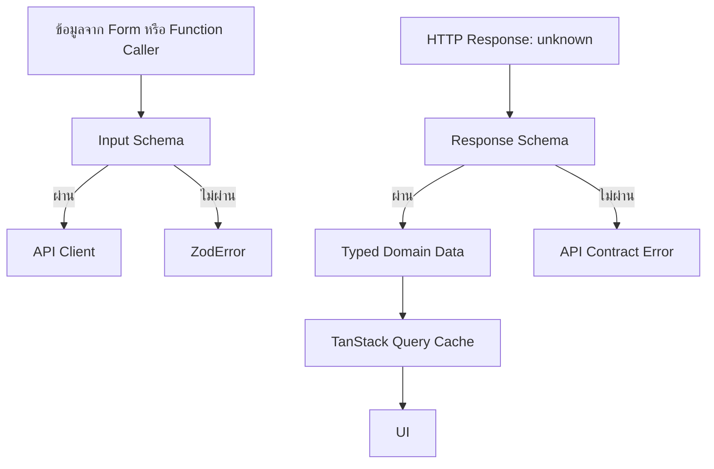
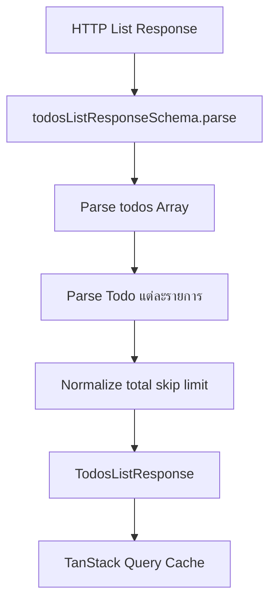
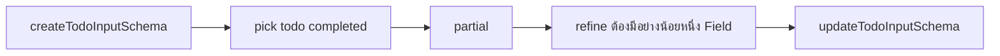

# คำอธิบายเพิ่มเติมเกี่ยวกับ API Contract

ไฟล์: `src/features/todos/api/contracts.ts`

API Contract คือข้อตกลงเรื่อง “รูปร่างของข้อมูล” ที่อนุญาตให้ผ่านเข้าและออกจากโมดูล Todos โดยไฟล์นี้ใช้ Zod เป็น Runtime Schema เพื่อทำหน้าที่สองอย่างพร้อมกัน

1. ตรวจสอบข้อมูลจริงตอน Runtime ก่อนนำไปใช้ในระบบ
2. สร้าง TypeScript Type จาก Schema ด้วย `z.infer` เพื่อไม่ให้ Runtime Contract กับ Compile-time Type แยกออกจากกัน

ตำแหน่งของ Contract อยู่ที่ Boundary ระหว่างข้อมูลภายนอกกับ Feature



จุดสำคัญคือ TypeScript ตรวจสอบได้เฉพาะตอน Compile เท่านั้น แต่ข้อมูลจาก HTTP API เป็นข้อมูลภายนอกที่เชื่อถือไม่ได้ในตอน Runtime ดังนั้น API Client ต้อง Parse Response ด้วย Schema ก่อนคืนข้อมูลออกจาก Boundary

```text
HTTP Response
  → unknown
  → Zod Schema
  → validated and normalized data
  → Query Cache
  → UI
```

ไฟล์นี้แบ่ง Contract ออกเป็นสามกลุ่มหลัก

- Entity Contract: รูปร่างของ Todo หนึ่งรายการ
- Response Contract: รูปร่างข้อมูลที่ API ส่งกลับ
- Command/Input Contract: รูปร่างข้อมูลที่ Application อนุญาตให้ส่งไปยัง API

การแยก Input ออกจาก Response เป็นเรื่องสำคัญ เพราะข้อมูลที่ API คืนกลับมักมี Field ที่ Client ไม่ควรเป็นผู้กำหนด เช่น `id`, `isDeleted` หรือ `deletedOn`

## Schema

Schema เป็น Executable Contract กล่าวคือไม่ได้เป็นเพียงคำอธิบาย Type แต่เป็นโค้ดที่รับค่า `unknown` แล้วตรวจสอบว่าโครงสร้างและค่าภายในตรงตามกฎหรือไม่

การเรียก `schema.parse(value)` มีพฤติกรรมดังนี้

```text
Input: unknown

ตรงตาม Schema
  → คืนค่าที่ผ่าน Validation และผ่านการ Normalize แล้ว

ไม่ตรงตาม Schema
  → throw ZodError
```

ในโมดูลนี้ Schema บางตัวใช้สำหรับ Response บางตัวใช้สำหรับ Request Input และบางตัวใช้สำหรับค่าควบคุมภายใน เช่นจำนวน Todo แบบสุ่ม

---

### todoSchema

```ts
export const todoSchema = z.object({
  id: z.coerce.number().int().positive(),
  todo: z.string().trim().min(1),
  completed: z.boolean(),
  userId: z.coerce.number().int().positive(),
});
```

`todoSchema` เป็น Entity Contract กลางของ Feature ใช้อธิบาย Todo หนึ่งรายการที่ผ่านการตรวจสอบแล้ว

ทุก Response ที่มี Todo ไม่ว่าจะเป็น Detail, List, Random, Create หรือ Update จะอ้างอิง Schema นี้แทนการประกาศรูปร่างซ้ำ

- Input: รับค่า `unknown` ที่คาดว่าจะมีโครงสร้างดังนี้
    ```ts
    {
      id: number | numeric string;
      todo: string;
      completed: boolean;
      userId: number | numeric string;
    }
    ```
- Output: เมื่อ Parse สำเร็จ จะคืนข้อมูลรูปแบบนี้
    ```ts
    {
      id: number;
      todo: string;
      completed: boolean;
      userId: number;
    }
    ```
    แม้ `id` หรือ `userId` จาก API จะเป็น Numeric String เช่น `"12"` ค่า Output จะถูก Normalize เป็น `12`

#### Logic Breakdown

- `id`: `z.coerce.number().int().positive()`
    ทำงานตามลำดับดังนี้
    
    1. `coerce.number()` พยายามแปลงค่าเป็น `number`
    2. `int()` บังคับว่าต้องเป็นจำนวนเต็ม
    3. `positive()` บังคับว่าต้องมากกว่า `0`
    
    ตัวอย่าง
    
    ```text
    "10"  → 10      ผ่าน
    10     → 10      ผ่าน
    10.5   →         ไม่ผ่าน เพราะไม่ใช่จำนวนเต็ม
    0      →         ไม่ผ่าน เพราะไม่เป็นจำนวนบวก
    -1     →         ไม่ผ่าน เพราะไม่เป็นจำนวนบวก
    "abc" → NaN     ไม่ผ่าน
    ```
- `todo`: `z.string().trim().min(1)`
    ทำงานตามลำดับดังนี้
    
    1. ต้องเป็น String
    2. ตัดช่องว่างหัวและท้ายด้วย `trim()`
    3. หลัง Trim แล้วต้องเหลืออย่างน้อยหนึ่งตัวอักษร
    
    ```text
    " Buy milk " → "Buy milk"   ผ่านและถูก Normalize
    "   "         → ""           ไม่ผ่าน
    null          →              ไม่ผ่าน
    ```
- `completed`: `z.boolean()`
    รับเฉพาะ Boolean จริงเท่านั้น ค่าอย่าง `"true"`, `1` หรือ `0` จะไม่ถูกแปลงให้อัตโนมัติ
- `userId`: ใช้กฎเดียวกับ `id` เพื่อรับทั้ง Number และ Numeric String จาก API แล้ว Normalize เป็นจำนวนเต็มบวก

#### เหตุผลเชิงสถาปัตยกรรม

การมี Entity Schema กลางทำให้ทุก Endpoint ตีความ Todo เหมือนกัน หาก API เปลี่ยน Contract เช่นเพิ่มข้อกำหนดของ `todo` หรือเปลี่ยนรูปแบบ `userId` ทีมแก้กฎหลักได้ในตำแหน่งเดียว

#### Edge Cases

- `z.coerce.number()` สามารถแปลงค่าบางชนิดที่อาจไม่ตั้งใจ เช่น `""` เป็น `0` แต่กรณีนี้จะถูก `positive()` ปฏิเสธต่อ
- String ที่เป็นเลขทศนิยม เช่น `"1.5"` ถูกแปลงสำเร็จ แต่จะถูก `int()` ปฏิเสธ
- `completed: "false"` ไม่ผ่าน เพราะ String ที่ไม่ว่างถือเป็น Truthy ใน JavaScript แต่ Zod Schema นี้ไม่ได้ Coerce Boolean ซึ่งเป็นพฤติกรรมที่ปลอดภัยกว่า
- `.trim()` เปลี่ยนข้อมูลจริง หากระบบต้องเก็บช่องว่างหัวท้ายโดยมีความหมาย ไม่ควรใช้ Transformation นี้
- Schema ไม่จำกัดความยาวสูงสุดของ `todo` ฝั่ง Response เพราะ Tutorial เลือกยอมรับข้อมูลจาก API ตราบใดที่ไม่ว่าง แต่ Production อาจกำหนดเพดานเพื่อป้องกัน Payload ผิดปกติ

---

### todosListResponseSchema

```ts
export const todosListResponseSchema = z.object({
  todos: z.array(todoSchema),
  total: z.coerce.number().int().nonnegative(),
  skip: z.coerce.number().int().nonnegative(),
  limit: z.coerce.number().int().nonnegative(),
});
```

Schema นี้อธิบาย Response ของ Endpoint รายการ Todo ทั้งแบบทั้งหมดและแบบกรองตาม User

```ts
GET /todos
GET /todos/user/:userId
```

Response ประกอบด้วยข้อมูลรายการและ Metadata สำหรับ Pagination

- input: 
    ```ts
    {
      todos: unknown[];
      total: number | numeric string;
      skip: number | numeric string;
      limit: number | numeric string;
    }
    ```
- Output: 
    ```ts
    {
      todos: Todo[];
      total: number;
      skip: number;
      limit: number;
    }
    ```

Todo ทุกตัวใน Array จะถูก Parse ด้วย `todoSchema` และ Numeric Metadata ทุกตัวจะถูก Normalize เป็น Number

#### Logic Breakdown

- `todos`: `z.array(todoSchema)`
    ตรวจสองระดับ
    
    1. ค่าหลักต้องเป็น Array
    2. สมาชิกทุกตัวต้องผ่าน `todoSchema`
    
    หากมี Todo เพียงหนึ่งตัวผิด Contract การ Parse Response ทั้งก้อนจะล้มเหลว นี่เป็นแนวทางแบบ Fail Fast เพื่อไม่ปล่อย Partial Invalid Data เข้าสู่ Query Cache
- `total`: จำนวนข้อมูลทั้งหมดของ Dataset หรือ Scope ปัจจุบัน ต้องเป็นจำนวนเต็มตั้งแต่ `0` ขึ้นไป
- `skip`: จำนวนรายการที่ API ข้ามก่อนเริ่มคืนผลลัพธ์ ต้องเป็นจำนวนเต็มตั้งแต่ `0` ขึ้นไป
- `limit`: จำนวนรายการสูงสุดที่ Endpoint ขอหรือคืนกลับ ต้องเป็นจำนวนเต็มตั้งแต่ `0` ขึ้นไป

ใช้ `nonnegative()` แทน `positive()` เพราะ DummyJSON รองรับ `limit=0`

```text
limit = 0  → ผ่าน
limit = 1  → ผ่าน
limit = -1 → ไม่ผ่าน
```

#### Data Flow



#### Edge Cases

- Array ว่างถือว่าถูกต้อง เพราะ `z.array(todoSchema)` ไม่ได้กำหนด `.min(1)` ซึ่งเหมาะกับหน้าสุดท้ายหรือ Filter ที่ไม่มีผลลัพธ์
- Schema ไม่ตรวจความสัมพันธ์ระหว่าง `todos.length`, `total`, `skip` และ `limit` เช่น API อาจส่ง `limit: 10` แต่คืน 20 รายการและยังผ่าน Schema
- `total` อาจน้อยกว่า `todos.length` และยังผ่าน เพราะแต่ละ Field ถูกตรวจแยกกัน
- Unknown Fields จาก API จะไม่อยู่ในค่าที่ Zod Object คืนโดยค่าเริ่มต้น แต่ Contract นี้ไม่ได้ใช้ `.strict()` เพื่อ Reject Field ส่วนเกิน
- หาก Todo หนึ่งรายการผิด Contract Response ทั้งก้อนจะล้มเหลว ควรพิจารณาว่า Production ต้องการ Fail ทั้งก้อนหรือเก็บเฉพาะรายการที่ถูกต้อง พร้อม Telemetry

---

### randomTodosSchema

```ts
export const randomTodosSchema = z.array(todoSchema).min(1).max(10);
```

Schema นี้ตรวจ Response ของ Endpoint ที่คืน Todo แบบสุ่มหลายรายการ

```text
GET /todos/random/:count
```

Tutorial กำหนดขอบเขตไว้ที่ 1–10 รายการให้ตรงกับความสามารถของ UI และ API

- Input: ค่า `unknown` ที่คาดว่าจะเป็น Array ของ Todo
- Output: `Todo[]` โดย Array ต้องมีจำนวนสมาชิกตั้งแต่ 1 ถึง 10 และสมาชิกทุกตัวต้องผ่าน `todoSchema`

#### Logic Breakdown

```text
unknown
  → ต้องเป็น Array
  → ต้องมีอย่างน้อย 1 รายการ
  → ต้องมีไม่เกิน 10 รายการ
  → Todo ทุกตัวต้องผ่าน todoSchema
  → Todo[]
```

#### Edge Cases

- `[]` ไม่ผ่าน แม้จะเป็น Array ถูกชนิด เพราะขัดกับ `.min(1)`
- Response 11 รายการไม่ผ่าน แม้ทุก Todo จะถูกต้อง
- Schema ไม่ตรวจว่ารายการสุ่มไม่ซ้ำกัน API อาจคืน Todo ID เดิมหลายครั้งและยังผ่าน
- Schema ไม่ตรวจว่าจำนวน Response เท่ากับ Count ที่ Request ขอ เพราะ Schema ไม่ได้รับ Request Context
- Endpoint สำหรับ Count เท่ากับ 1 ใน Tutorial ใช้ `getRandomTodo()` แล้วครอบผลลัพธ์เป็น Array แทนการ Parse ด้วย Schema นี้

---

### createTodoInputSchema

```ts
export const createTodoInputSchema = z.object({
  todo: z.string().trim().min(3).max(300),
  completed: z.boolean(),
  userId: z.number().int().positive(),
});
```

Schema นี้เป็น Command/Input Contract สำหรับการสร้าง Todo ใหม่ ไม่ใช่ API Response Contract

Client อนุญาตให้ผู้เรียกกำหนดเฉพาะข้อมูลที่จำเป็นต่อการสร้าง

```ts
{
  todo: string;
  completed: boolean;
  userId: number;
}
```

ไม่มี `id` เพราะ Server เป็นผู้สร้าง Identifier

#### Input และ Output

Input ที่ถูกต้อง

```ts
{
  todo: "Prepare monthly report";
  completed: false;
  userId: 7;
}
```

Output หลัง Parse มีโครงสร้างเดิม แต่ `todo` จะถูก Trim

```ts
{
  todo: "Prepare monthly report";
  completed: false;
  userId: 7;
}
```

#### Logic Breakdown

`todo`

- ต้องเป็น String
- Trim ช่องว่างหัวท้าย
- ต้องยาวอย่างน้อย 3 ตัวอักษรหลัง Trim
- ต้องยาวไม่เกิน 300 ตัวอักษร

`completed`

- ต้องเป็น Boolean จริง
- Tutorial บังคับให้ Caller ระบุค่าอย่างชัดเจน ไม่มี Default ใน Schema

`userId`

- ต้องเป็น Number อยู่แล้ว
- ต้องเป็นจำนวนเต็มบวก
- ไม่ใช้ `coerce` เพราะนี่คือข้อมูลที่ Application ควบคุมเอง ไม่ควรยอมรับ Input คลุมเครือโดยไม่จำเป็น

#### เหตุผลที่ Request Input เข้มกว่า Response

Response ใช้ `z.coerce.number()` เพื่อป้องกันความไม่สม่ำเสมอจาก External API แต่ Mutation Input ใช้ `z.number()` เพราะข้อมูลมาจาก Application Layer ที่ควร Normalize ก่อนถึง API Contract

แนวคิดนี้แยกความรับผิดชอบชัดเจน

```text
External Response
  → Defensive Parsing และ Normalization

Internal Command
  → Strict Validation และ Reject Invalid State
```

#### Security และ Data Quality

ความยาวสูงสุด 300 ตัวอักษรช่วยจำกัดข้อมูลผิดปกติในระดับ Client แต่ไม่ใช่มาตรการ Security ที่เพียงพอ Server ต้อง Validate ซ้ำเสมอ เพราะผู้โจมตีสามารถข้าม Frontend และเรียก API โดยตรงได้

#### Edge Cases

- `todo: "  ab  "` ไม่ผ่าน เพราะหลัง Trim เหลือ 2 ตัวอักษร
- Emoji อาจถูกนับความยาวตาม JavaScript String Code Units ไม่ตรงกับจำนวน Grapheme ที่ผู้ใช้มองเห็น
- `userId: "7"` ไม่ผ่าน เพราะไม่มี Coercion
- `completed` หายไปไม่ผ่าน แม้ Business Default อาจเป็น `false`
- Unknown Field เช่น `id` จะไม่กลายเป็นส่วนหนึ่งของ Parsed Output แต่ถ้าต้องการ Reject อย่างชัดเจนควรพิจารณา `.strict()`
- Client-side Maximum Length ไม่แทนข้อจำกัดของ Database หรือ API Gateway

---

### updateTodoInputSchema

```ts
export const updateTodoInputSchema = createTodoInputSchema
  .pick({ todo: true, completed: true })
  .partial()
  .refine((value) => Object.keys(value).length > 0, {
    message: "ต้องมีข้อมูลอย่างน้อยหนึ่ง Field สำหรับการแก้ไข",
  });
```

Schema นี้เป็น Input Contract สำหรับ `PATCH /todos/:id` ซึ่งส่งเฉพาะ Field ที่ต้องการเปลี่ยน

Tutorial อนุญาตให้ Update ได้สอง Field

- `todo`
- `completed`

ไม่อนุญาตให้เปลี่ยน `userId` และไม่มี `id` อยู่ใน Payload เพราะ Identifier ถูกส่งผ่าน URL Path

#### Schema Composition

Schema นี้ไม่ได้ประกาศกฎใหม่ทั้งหมด แต่ประกอบจาก `createTodoInputSchema`



ขั้นตอนที่ 1: `pick`

```ts
.pick({ todo: true, completed: true })
```

เลือกเฉพาะ Schema ของ `todo` และ `completed` ทำให้กฎ Validation เช่น Trim และความยาวของ `todo` ถูกใช้ร่วมกับ Create โดยไม่ประกาศซ้ำ

ขั้นตอนที่ 2: `partial`

```ts
.partial()
```

เปลี่ยนทุก Field ที่เลือกให้เป็น Optional

ก่อน `partial`

```ts
{
  todo: string;
  completed: boolean;
}
```

หลัง `partial`

```ts
{
  todo?: string;
  completed?: boolean;
}
```

ขั้นตอนที่ 3: `refine`

```ts
.refine((value) => Object.keys(value).length > 0)
```

ป้องกัน Empty Patch เช่น `{}` เพราะแม้ทุก Field เป็น Optional แต่ Request ที่ไม่แก้อะไรไม่มีความหมายเชิง Business

- Input ที่ผ่าน
    ```ts
    { todo: "Updated todo" }
    { completed: true }
    { todo: "Updated todo", completed: true }
    ```
- Input ที่ไม่ผ่าน
    ```ts
    {}
    { todo: " " }
    { completed: "true" }
    { userId: 10 }
    ```
    กรณี `{ userId: 10 }` จะถูก Strip จนเหลือ Object ว่างในพฤติกรรมปกติของ Zod Object จากนั้น Refine จะไม่ผ่าน จึงไม่สามารถใช้ Unknown Field หลบกฎ Empty Patch ได้
- Output
    ```ts
    {
      todo?: string;
      completed?: boolean;
    }
    ```

มีอย่างน้อยหนึ่ง Field เสมอในระดับ Runtime แม้ Type ที่ Infer ออกมายังคงแสดง Field ทั้งสองเป็น Optional เพราะ TypeScript ไม่สามารถสะท้อนเงื่อนไขจาก `.refine()` เป็น Union ที่บังคับ Non-empty Object ได้โดยตรง

#### Production Consideration

หากต้องการ Compile-time Type ที่บังคับว่าต้องมีอย่างน้อยหนึ่ง Field อาจสร้าง Utility Type เพิ่ม เช่น `AtLeastOne<T>` แต่ Runtime Schema ยังต้องคงอยู่ เพราะ TypeScript ไม่ป้องกันข้อมูลภายนอกตอน Runtime

อีกแนวทางหนึ่งคือใช้ Discriminated Command สำหรับ Workflow ที่ซับซ้อน

```ts
{ action: "rename", todo: string }
{ action: "complete" }
{ action: "reopen" }
```

วิธีนี้แสดง Business Intent ชัดกว่า Generic Patch เมื่อระบบมี Rule แตกต่างกันตามการกระทำ

#### Edge Cases

- `{ todo: undefined }` อาจมี Key อยู่ใน Object ทำให้ `Object.keys(value).length > 0` เป็นจริง ขึ้นกับผลลัพธ์หลัง Zod Parse และวิธีสร้าง Object ควรมี Test ครอบคลุม Empty-like Payload
- `.refine()` ตรวจจำนวน Key ไม่ได้ตรวจว่ามีการเปลี่ยนค่าจากข้อมูลเดิมจริงหรือไม่
- User อาจส่งค่าเดิมกลับไป ทำให้ API Request เกิดขึ้นโดยไม่มี Effective Change
- Schema ไม่ป้องกัน Concurrent Update หรือ Lost Update เรื่องเหล่านี้ต้องใช้ Version, ETag หรือ Server-side Concurrency Control
- การไม่อนุญาต `userId` เป็น Business Decision หาก Requirement เปลี่ยนต้องพิจารณาผลต่อ Query Cache ของรายการตาม User ด้วย

---

### deletedTodoSchema

```ts
export const deletedTodoSchema = todoSchema.extend({
  isDeleted: z.literal(true),
  deletedOn: z.iso.datetime(),
});
```

Schema นี้อธิบาย Response หลังลบ Todo สำเร็จ โดยต่อยอดจาก Entity เดิมและเพิ่ม Metadata ของการลบ

- Input
    ```ts
    {
      id: number | numeric string;
      todo: string;
      completed: boolean;
      userId: number | numeric string;
      isDeleted: true;
      deletedOn: string;
    }
    ```
- Output
    ```ts
    {
      id: number;
      todo: string;
      completed: boolean;
      userId: number;
      isDeleted: true;
      deletedOn: string;
    }
    ```

#### Logic Breakdown

- `todoSchema.extend(...)`: นำกฎทั้งหมดของ Todo มาใช้ต่อ แล้วเพิ่มสอง Field
- `isDeleted`: `z.literal(true)` 
    ต้องเป็นค่า `true` เท่านั้น ไม่ใช่ Boolean ทั่วไป ดังนั้น `false`, `1` หรือ `"true"` ไม่ผ่าน
    Literal นี้ทำให้ Response ยืนยันเชิง Semantic ว่า Operation ที่เรียกเป็นการลบสำเร็จจริงตาม Contract
- `deletedOn`:  `z.iso.datetime()`
    ต้องเป็น String ที่มีรูปแบบ ISO Date-time ที่ถูกต้อง ตัวอย่างเช่น `2026-08-06T12:30:00.000Z`
    Schema ตรวจรูปแบบแต่ Output ยังคงเป็น String ไม่ได้แปลงเป็น JavaScript `Date`

#### Edge Cases

- วันที่รูปแบบถูกต้องแต่ไม่สัมพันธ์กับเวลาปัจจุบันยังผ่าน เช่น Timestamp ในอนาคต
- Schema ไม่ตรวจว่า `isDeleted` สอดคล้องกับสถานะบน Server จริง
- `deletedOn` ยังคงเป็น String หาก UI ต้องคำนวณเวลา ต้อง Parse อย่างระมัดระวังและกำหนด Timezone Policy
- Production API บางระบบตอบ `204 No Content` หลัง Delete ซึ่งจะไม่ตรงกับ Contract นี้ ต้องออกแบบ Schema และ Client ตาม API จริง
- Soft Delete และ Hard Delete มี Semantics ต่างกัน Response นี้สะท้อนรูปแบบจำลองของ DummyJSON ไม่ได้หมายความว่าทุกระบบควรคืน Entity ที่ถูกลบ

---

### randomTodoCountSchema

```ts
export const randomTodoCountSchema = z.number().int().min(1).max(10);
```

Schema นี้ตรวจค่าจำนวน Todo ที่ Caller ต้องการสุ่มก่อนนำค่าไปสร้าง URL Endpoint

แม้ไม่ใช่ HTTP Response Contract แต่เป็น Boundary Contract ระหว่าง UI หรือ Function Caller กับ API Client

- Input: `number`
- Output: Number เดิม เมื่อเป็นจำนวนเต็มตั้งแต่ 1 ถึง 10
    ```text
    1  → ผ่าน
    5  → ผ่าน
    10 → ผ่าน
    0  → ไม่ผ่าน
    11 → ไม่ผ่าน
    2.5 → ไม่ผ่าน
    "5" → ไม่ผ่าน
    ```

#### เหตุผลที่ไม่ใช้ Coercion

ค่าจำนวนสุ่มเป็นข้อมูลที่ Application ควบคุมเอง จึงควรบังคับให้ Caller ส่ง Number ที่ Normalize แล้วแทนการยอมรับ String โดยปริยาย

การ Validate ก่อนประกอบ URL ป้องกัน Request ที่ไม่สมเหตุผล เช่น

```text
/todos/random/0
/todos/random/-1
/todos/random/1000
/todos/random/NaN
```

#### Edge Cases

- ค่า `NaN` และ `Infinity` ไม่ผ่าน Number Schema ตามกฎของ Zod
- Schema ไม่กำหนด Default หาก Caller ไม่ส่งค่า การ Parse จะล้มเหลว
- หาก API เปลี่ยน Maximum Count ต้องอัปเดตทั้ง Schema, UI Constraint และ Test ให้สอดคล้องกัน
- Client ยังควร Encode Path Parameter หรือหลีกเลี่ยงการสร้าง URL จากค่าที่ไม่ได้ Validate แม้ Schema นี้จำกัดเป็น Number แล้ว

---

## Type

Type ทั้งหมดใช้ `z.infer<typeof schema>` เพื่อให้ Schema เป็น Single Source of Truth

```ts
export type Todo = z.infer<typeof todoSchema>;
```

ทิศทางการสร้าง Type คือ

```text
Zod Schema
  → Runtime Validation Rules
  → z.infer
  → TypeScript Type
```

ไม่ใช่

```text
TypeScript Interface
  + Schema ที่เขียนซ้ำอีกชุด
```

การเขียน Type และ Schema แยกกันสร้างโอกาสให้สองส่วนไม่ตรงกัน เช่น Type บอกว่า `id` เป็น Number แต่ Runtime Schema ยอมรับ String โดยไม่ Normalize หรือ Schema เพิ่ม Field แล้วลืมแก้ Interface

ข้อควรเข้าใจคือ Type ที่ Infer สื่อถึง Output หลัง Parse เป็นหลัก เช่น `z.coerce.number()` รับ Input ได้หลายรูปแบบ แต่ Output Type เป็น `number`

### CreateTodoInput

```ts
export type CreateTodoInput = z.infer<typeof createTodoInputSchema>;
```

เทียบเท่าโดยแนวคิดกับ

```ts
type CreateTodoInput = {
  todo: string;
  completed: boolean;
  userId: number;
};
```

ใช้เป็น Type ของ Payload สำหรับ Create Form, Mutation Options และ API Client

ไม่ควรเพิ่ม `id` ใน Type นี้ เพราะ ID เป็น Server-owned Field

---

### DeletedTodo

```ts
export type DeletedTodo = z.infer<typeof deletedTodoSchema>;
```

เทียบเท่าโดยแนวคิดกับ

```ts
type DeletedTodo = Todo & {
  isDeleted: true;
  deletedOn: string;
};
```

การที่ `isDeleted` เป็น Literal Type `true` ช่วยให้โค้ดหลัง Parse ไม่ต้องตรวจว่าเป็น `true` หรือ `false` อีกครั้งภายใน Success Path

---

### Todo

```ts
export type Todo = z.infer<typeof todoSchema>;
```

เทียบเท่ากับ

```ts
type Todo = {
  id: number;
  todo: string;
  completed: boolean;
  userId: number;
};
```

Type นี้คือ Canonical Domain Shape ของ Todo ภายใน Frontend หลังผ่าน Boundary แล้ว Component และ Query Cache จึงไม่ต้องรองรับ `id: string | number`

---

### TodosListResponse

```ts
export type TodosListResponse = z.infer<typeof todosListResponseSchema>;
```

เทียบเท่ากับ

```ts
type TodosListResponse = {
  todos: Todo[];
  total: number;
  skip: number;
  limit: number;
};
```

ใช้เป็น Return Type ของ API Client และ Data Type ใน Query Cache สำหรับหน้ารายการ

---

### UpdateTodoInput

```ts
export type UpdateTodoInput = z.infer<typeof updateTodoInputSchema>;
```

เทียบเท่าในระดับโครงสร้างกับ

```ts
type UpdateTodoInput = {
  todo?: string;
  completed?: boolean;
};
```

แต่ Runtime Schema เพิ่มกฎว่า Object ต้องมีอย่างน้อยหนึ่ง Field ซึ่ง TypeScript Type ด้านบนไม่สามารถสื่อจาก `.refine()` ได้ครบถ้วน

ดังนั้นโค้ดต้องไม่คิดว่า TypeScript Type สามารถแทน Runtime Parse ได้

```text
Type ถูกต้องตอน Compile
  ≠
ข้อมูลถูกต้องตอน Runtime เสมอ
```

---

## แนวทางสำหรับ Production

### 1. Parse ทุก External Boundary

Response จาก Axios มี Type ที่ Developer กำหนดได้ แต่ Generic Type ของ Axios ไม่ได้ตรวจข้อมูลจริง

โค้ดนี้ไม่เพียงพอ

```ts
const response = await httpClient.get<Todo>(`/todos/${todoId}`);
return response.data;
```

เพราะ `<Todo>` เป็นเพียง Compile-time Assertion

Production ควร Parse ก่อนคืนข้อมูล

```ts
return todoSchema.parse(response.data);
```

หรือแปลง ZodError เป็น Application Error ที่มี Error Code และรายละเอียดสำหรับ Observability

### 2. แยก Transport DTO ออกจาก Domain Model เมื่อระบบซับซ้อน

Tutorial ใช้ API Response Shape เป็น Domain Shape โดยตรงเพราะโมเดลเรียบง่าย

Production อาจมี Response เช่น

```ts
{
  todo_id: "12",
  title: "Buy milk",
  is_completed: 0,
  owner_id: "7"
}
```

ควร Parse เป็น Transport DTO แล้ว Map เป็น Domain Model

```text
HTTP Response
  → Transport Schema
  → DTO
  → Mapper
  → Domain Model
  → Query Cache
```

วิธีนี้ทำให้ UI ไม่ผูกกับ Naming และความผิดปกติของ Backend

### 3. ใช้ Strictness ให้เหมาะกับ Compatibility Policy

Zod Object โดยทั่วไป Strip Unknown Keys การเลือกว่าจะยอมรับหรือ Reject Field ใหม่จาก API ต้องสอดคล้องกับ Compatibility Strategy

- Strip Unknown Fields: ทนต่อ API ที่เพิ่ม Field ใหม่
- Strict Object: ตรวจจับ Contract Drift ได้เร็ว แต่การเพิ่ม Field แบบ Backward-compatible อาจทำให้ Frontend พัง
- Passthrough: เก็บ Unknown Fields ไว้ แต่ทำให้ Domain Data มีข้อมูลนอก Contract

สำหรับ Public หรือ Third-party API มักเลือก Strip Unknown Fields ส่วน Internal API ที่ต้องควบคุม Schema เข้มอาจใช้ Strict พร้อม Contract Testing

### 4. อย่าใช้ Coercion กว้างเกินความจำเป็น

Coercion ช่วย Normalize External Data แต่สามารถซ่อนปัญหาของ Backend ได้

Production ควรตอบให้ได้ว่า

- API Contract ยอมรับ Numeric String จริงหรือไม่
- ควร Fail เพื่อให้ Backend แก้หรือควร Normalize เพื่อ Compatibility
- ต้องเก็บ Telemetry เมื่อเกิด Coercion หรือไม่

หาก API ภายในรับประกัน JSON Number ควรใช้ `z.number()` เพื่อจับ Contract Regression ให้เร็ว

### 5. Validation ฝั่ง Client ไม่ใช่ Security Boundary

Schema ฝั่ง Frontendช่วยเรื่อง UX, Type Safety และ Data Integrity ภายใน Client แต่ไม่ป้องกันผู้โจมตีจากการเรียก API โดยตรง

Server ต้องตรวจซ้ำทั้งหมด เช่น

- Authentication
- Authorization
- Ownership
- Field Allowlist
- Length และ Format
- Rate Limit
- Concurrency
- Business Invariant

Frontend ห้ามเก็บ Secret ใน Schema หรือเชื่อว่าการซ่อน Field จาก Type จะทำให้ Field นั้นปลอดภัย

### 6. กำหนด Error Taxonomy และ Observability

เมื่อ Response ผิด Contract ควรแยกจาก Network Error และ Business Error

ตัวอย่าง Error Code

```text
NETWORK_ERROR
TIMEOUT_ERROR
API_CONTRACT_ERROR
AUTHENTICATION_ERROR
AUTHORIZATION_ERROR
BUSINESS_RULE_ERROR
```

Contract Error ควรส่งข้อมูลที่จำเป็นเข้า Logging หรือ Error Monitoring โดยต้อง Redact Personal Data และ Secret ก่อน

ไม่ควรแสดง Raw Zod Issue หรือ Raw Response ทั้งก้อนแก่ผู้ใช้

### 7. กำหนด Date และ Time Policy

`deletedOn` เป็น ISO String การใช้ใน Production ควรกำหนดให้ชัดเจนว่า

- Server ส่ง UTC หรือ Offset ใด
- Frontend เก็บใน Cache เป็น String หรือ Date
- จุดใดทำ Formatting ตาม User Locale
- Invalid Time และ Timezone ถูกจัดการอย่างไร

แนวทางทั่วไปคือเก็บ ISO String ใน Transport/Cache แล้ว Format เฉพาะ Presentation Layer เพื่อหลีกเลี่ยง Serialization และ Hydration Problem

### 8. ทดสอบ Contract โดยตรง

ควรมี Test ครอบคลุมอย่างน้อย

- Valid Input
- Invalid Type
- Boundary Value
- Coercion Behavior
- Whitespace Normalization
- Empty Patch
- Unknown Field Policy
- Invalid Date-time
- API Fixture ที่สมจริง

ตัวอย่าง Test Case สำคัญ

```text
todoSchema
  ✓ แปลง numeric string เป็น number
  ✓ trim todo text
  ✗ ปฏิเสธ completed แบบ string
  ✗ ปฏิเสธ id เป็นศูนย์

updateTodoInputSchema
  ✓ รับ todo อย่างเดียว
  ✓ รับ completed อย่างเดียว
  ✗ ปฏิเสธ object ว่าง
  ✗ ปฏิเสธ todo ที่สั้นหลัง trim
```

### 9. ระวัง Performance ของ Schema Validation

สำหรับ Payload ขนาดเล็กอย่าง Todos ค่าใช้จ่ายของ Zod ต่ำและเหมาะสมกับประโยชน์ที่ได้รับ

แต่สำหรับ Dataset ขนาดใหญ่มาก การ Parse Array ทุก Entity มีต้นทุนตามจำนวนข้อมูล

```text
Time Complexity โดยประมาณ: O(n)
```

แนวทาง Production

- ใช้ Server Pagination
- จำกัด Response Size
- Parse ที่ Boundary ครั้งเดียว ไม่ Parse ซ้ำใน Component
- หลีกเลี่ยงการ Transform หนักใน Schema
- วัดผลก่อน Optimize
- พิจารณา Streaming หรือ Worker เฉพาะเมื่อ Profiling ยืนยันปัญหา

ไม่ควรข้าม Runtime Validation เพียงเพราะคาดว่าอาจช้าโดยไม่มี Measurement

### 10. จัดการ Schema Evolution

เมื่อ API เปลี่ยน Contract ควรวางแผน Version และ Migration เช่น

```text
API v1 Response
  → v1 Schema
  → Mapper
  → Stable Domain Model

API v2 Response
  → v2 Schema
  → Mapper
  → Stable Domain Model
```

การรักษา Domain Model ให้เสถียรลดผลกระทบต่อ Query, Component และ Test

---

## สรุปสาระสำคัญ

- `contracts.ts` เป็น Runtime Boundary ของ Feature Todos ไม่ใช่เพียงไฟล์รวม Type
- `todoSchema` กำหนด Canonical Shape ของ Todo และ Normalize Numeric Field
- `todosListResponseSchema` ตรวจทั้งรายการ Todo และ Pagination Metadata
- `randomTodosSchema` บังคับจำนวนผลลัพธ์ให้อยู่ในช่วง 1–10
- `createTodoInputSchema` เป็น Strict Command Contract สำหรับ Create และไม่รวม Server-owned Field
- `updateTodoInputSchema` ใช้ Schema Composition เพื่อรองรับ Partial Update แต่ป้องกัน Empty Patch
- `deletedTodoSchema` ต่อ Entity Schema และยืนยัน Metadata ของการลบ
- `randomTodoCountSchema` ตรวจค่าก่อนนำไปสร้าง Endpoint
- Type ทั้งหมด Infer จาก Schema เพื่อรักษา Single Source of Truth
- Response จาก API ต้องถูกมองเป็น `unknown` และ Parse ก่อนเข้าสู่ Query Cache
- Client Validation ช่วยเรื่อง Data Integrity แต่ไม่แทน Server-side Security
- สำหรับ Production ควรเพิ่ม Contract Tests, Error Taxonomy, Observability, Schema Evolution Policy และ DTO-to-Domain Mapping ตามความซับซ้อนของระบบ
