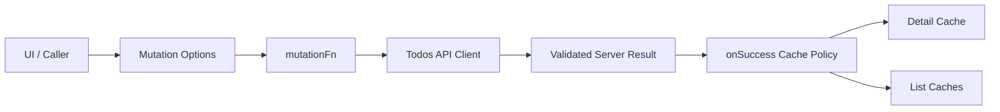
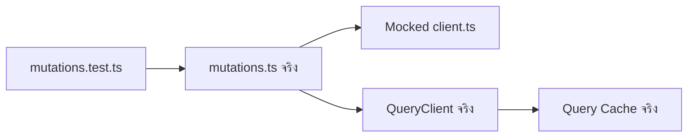
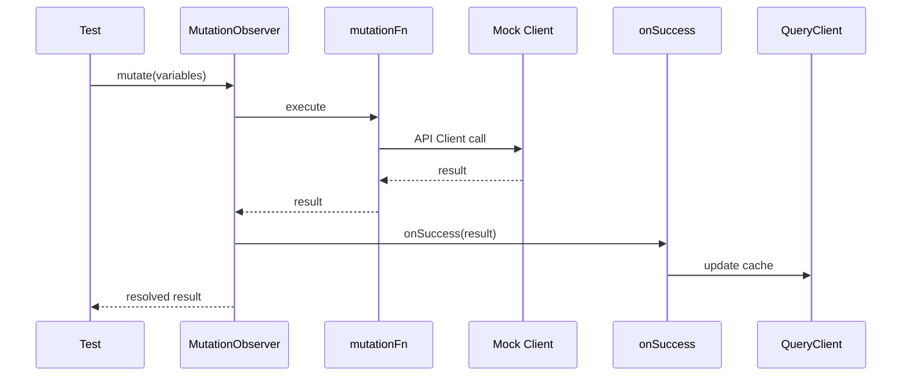
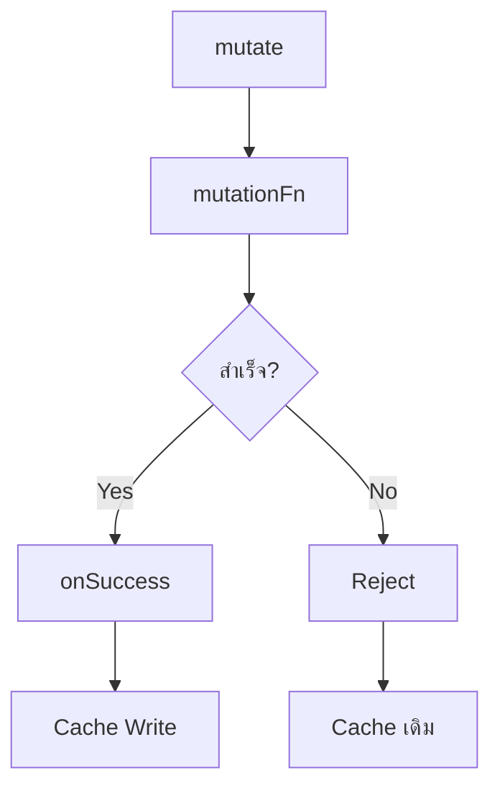
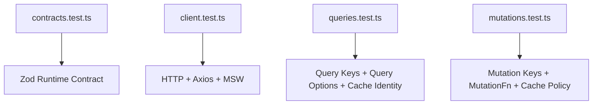

# แนวทางการเขียน Test สำหรับ Todos API Mutations

ไฟล์ Test: `src/features/todos/api/mutations.test.ts`

ไฟล์ Production ที่ทดสอบ: `src/features/todos/api/mutations.ts`

เอกสารนี้ต่อเนื่องจาก

- [การสร้าง API Contract](./api-contract.md)
- [การเขียน Test สำหรับ API Contract](./api-contract-test.md)
- [การสร้าง API Client](./api-client.md)
- [การเขียน Test สำหรับ API Client](./api-client-test.md)
- [การสร้าง API Queries](./api-queries.md)
- [การเขียน Test สำหรับ API Queries](./api-queries-test.md)
- [การสร้าง API Mutations](./api-mutations.md)
- หัวข้อ 7 ของ [`docs/GETTING_STARTED.th.md`](../../GETTING_STARTED.th.md)

เป้าหมายของเอกสารนี้คือสร้าง Test Suite สำหรับ Mutation Layer ของโมดูล Todos ด้วย **Vitest + TanStack Query `QueryClient` และ `MutationObserver` จริง** โดย Mock เฉพาะ Feature API Client (`./client`) เพื่อให้ Test โฟกัสที่สิ่งที่ `mutations.ts` เป็นเจ้าของจริง ได้แก่ Mutation Key, Mutation Function Routing และ Cache Policy

> `mutations.test.ts` ไม่ควรทดสอบ HTTP ซ้ำกับ `client.test.ts` และไม่ควรทดสอบ Zod Schema ซ้ำกับ `contracts.test.ts` เพราะแต่ละ Layer ควรมี Test Boundary ของตัวเอง

---

## 1. Mutation Layer รับผิดชอบอะไร

Implementation ในหัวข้อ 7 มีหน้าที่หลักสองส่วน

1. สร้าง Mutation Options สำหรับ Command แต่ละชนิด
2. กำหนดว่าเมื่อ Mutation สำเร็จแล้ว Query Cache ต้องเปลี่ยนอย่างไร



Operation ที่มีอยู่คือ

```text
Random
Add
Update
Delete
```

Cache Policy ของ Tutorial คือ

| Operation | Detail Cache | List Cache | Refetch |
| --- | --- | --- | --- |
| Random | ไม่เขียน | ไม่เขียน | ไม่เกี่ยวข้อง |
| Add | Seed Todo ใหม่ | เพิ่มเฉพาะ Active List ที่สมเหตุสมผล | ไม่ Refetch |
| Update | Replace Todo | Replace ในทุก Cached List ที่มี Todo | ไม่ Refetch |
| Delete | Remove Detail Query | Remove จากทุก Cached List ที่มี Todo | ไม่ Refetch |

จุดสำคัญคือ Implementation นี้เป็น **server-confirmed direct cache synchronization** ไม่ใช่ Optimistic Update

```text
mutationFn
  → Server สำเร็จ
  → onSuccess
  → เปลี่ยน Cache
```

ไม่มี `onMutate` ดังนั้น Cache ไม่ควรเปลี่ยนก่อน Server สำเร็จ และเมื่อ Mutation ล้มเหลว Cache เดิมต้องยังคงอยู่โดยไม่ต้อง Rollback

---

## 2. ทำไม Test Layer นี้ควร Mock API Client

ใน `client.test.ts` เราทดสอบ Flow นี้อยู่แล้ว

```text
client.ts จริง
  → Shared Axios Client จริง
  → MSW
  → Zod Contract จริง
```

ถ้า `mutations.test.ts` ใช้ MSW และ HTTP จริงอีกครั้ง Test จะซ้ำ Responsibility และทำให้หาสาเหตุของ Failure ยากขึ้น

สำหรับ Mutation Layer เราต้องการทดสอบเฉพาะ

```text
Mutation Options
  → เรียก Client Function ถูกตัวหรือไม่
  → ส่ง Variables ถูกหรือไม่
  → Mutation Key ถูกหรือไม่
  → onSuccess เปลี่ยน Query Cache ถูกหรือไม่
  → Error แล้ว Cache ไม่เปลี่ยนหรือไม่
```

จึงใช้ Boundary นี้



ข้อดีคือ

- ไม่ผูก Test นี้กับ Network
- ไม่ซ้ำ API Integration Test
- ใช้ TanStack Query Cache Behavior จริง
- ตรวจ Mutation Lifecycle ผ่าน `MutationObserver` จริง
- Failure บอกตำแหน่งของปัญหาได้ชัดเจน

---

## 3. Production Code ที่ Test นี้อ้างอิง

หัวข้อ 7 สร้าง `src/features/todos/api/mutations.ts` ดังนี้

```ts
import { mutationOptions } from "@tanstack/react-query";
import type { QueryClient } from "@tanstack/react-query";

import { addTodo, deleteTodo, getRandomTodos, updateTodo } from "./client";
import type { CreateTodoInput, Todo, TodosListResponse, UpdateTodoInput } from "./contracts";
import { todosKeys } from "./queries";
import type { TodosListQueryInput } from "./queries";

export const todosMutationKeys = {
  all: ["todos", "mutation"] as const,
  random: () => [...todosMutationKeys.all, "random"] as const,
  add: () => [...todosMutationKeys.all, "add"] as const,
  update: (todoId: number) => [...todosMutationKeys.all, "update", todoId] as const,
  delete: (todoId: number) => [...todosMutationKeys.all, "delete", todoId] as const,
};

function shouldInsertIntoActiveList(input: TodosListQueryInput, todo: Todo) {
  if (input.source === "user") {
    return input.userId === todo.userId;
  }

  return input.page === 1;
}

function prependTodo(current: TodosListResponse, todo: Todo): TodosListResponse {
  if (current.todos.some((item) => item.id === todo.id)) {
    return current;
  }

  const nextTodos = [todo, ...current.todos];
  const visibleTodos = current.limit > 0 ? nextTodos.slice(0, current.limit) : nextTodos;

  return {
    ...current,
    todos: visibleTodos,
    total: current.total + 1,
  };
}

export function randomTodosMutationOptions() {
  return mutationOptions({
    mutationKey: todosMutationKeys.random(),
    mutationFn: (count: number) => getRandomTodos({ count }),
  });
}

export function addTodoMutationOptions(
  queryClient: QueryClient,
  activeListInput: TodosListQueryInput,
) {
  return mutationOptions({
    mutationKey: todosMutationKeys.add(),
    mutationFn: (input: CreateTodoInput) => addTodo({ input }),
    onSuccess: (createdTodo) => {
      queryClient.setQueryData(todosKeys.detail(createdTodo.id), createdTodo);

      if (!shouldInsertIntoActiveList(activeListInput, createdTodo)) {
        return;
      }

      queryClient.setQueryData<TodosListResponse>(todosKeys.list(activeListInput), (current) =>
        current ? prependTodo(current, createdTodo) : current,
      );
    },
  });
}

export function updateTodoMutationOptions(queryClient: QueryClient, todoId: number) {
  return mutationOptions({
    mutationKey: todosMutationKeys.update(todoId),
    mutationFn: (input: UpdateTodoInput) => updateTodo({ todoId, input }),
    onSuccess: (updatedTodo) => {
      queryClient.setQueryData(todosKeys.detail(todoId), updatedTodo);

      queryClient.setQueriesData<TodosListResponse>({ queryKey: todosKeys.lists() }, (current) => {
        if (!current) {
          return current;
        }

        const containsTodo = current.todos.some((todo) => todo.id === todoId);

        if (!containsTodo) {
          return current;
        }

        return {
          ...current,
          todos: current.todos.map((todo) => (todo.id === todoId ? updatedTodo : todo)),
        };
      });
    },
  });
}

export function deleteTodoMutationOptions(queryClient: QueryClient, todoId: number) {
  return mutationOptions({
    mutationKey: todosMutationKeys.delete(todoId),
    mutationFn: () => deleteTodo({ todoId }),
    onSuccess: () => {
      queryClient.removeQueries({ queryKey: todosKeys.detail(todoId) });

      queryClient.setQueriesData<TodosListResponse>({ queryKey: todosKeys.lists() }, (current) => {
        if (!current) {
          return current;
        }

        const containsTodo = current.todos.some((todo) => todo.id === todoId);

        if (!containsTodo) {
          return current;
        }

        return {
          ...current,
          todos: current.todos.filter((todo) => todo.id !== todoId),
          total: Math.max(0, current.total - 1),
        };
      });
    },
  });
}
```

---

## 4. Test Strategy

Test Suite ควรแบ่งตาม Public API ของ `mutations.ts`

```text
mutations.test.ts
├── todosMutationKeys
├── randomTodosMutationOptions
├── addTodoMutationOptions
├── updateTodoMutationOptions
└── deleteTodoMutationOptions
```

ไม่ควร Export `shouldInsertIntoActiveList` หรือ `prependTodo` เพียงเพื่อให้ Test เรียกได้โดยตรง เพราะสองฟังก์ชันนี้เป็น Implementation Detail

เราจะทดสอบพฤติกรรมของสองฟังก์ชันผ่าน Public API คือ `addTodoMutationOptions()` แทน

นี่เป็นหลัก Black-box Testing:

```text
ไม่ถามว่า private helper ทำงานอย่างไร
ถามว่าเมื่อ Add สำเร็จ Cache สุดท้ายถูกต้องหรือไม่
```

---

## 5. Test Matrix

### Mutation Keys

| Case | Expected |
| --- | --- |
| Root | `["todos", "mutation"]` |
| Random | `["todos", "mutation", "random"]` |
| Add | `["todos", "mutation", "add"]` |
| Update #7 | `["todos", "mutation", "update", 7]` |
| Delete #7 | `["todos", "mutation", "delete", 7]` |

### Random

| Case | Expected |
| --- | --- |
| ส่ง `count` | Forward ไป `getRandomTodos` |
| Server Success | คืน Result ให้ Caller |
| เรียกซ้ำ | Client ถูกเรียกใหม่ทุกครั้ง |
| Success | ไม่เขียน Query Cache |
| Client Error | Promise Reject ตามเดิม |

### Add

| Case | Expected |
| --- | --- |
| mutationFn | เรียก `addTodo({ input })` |
| Success | Seed Detail Cache |
| All / page 1 | Prepend Active List |
| All / page > 1 | ไม่แก้ List |
| User / userId ตรง | Prepend List |
| User / userId ไม่ตรง | ไม่แก้ List |
| Active List ไม่มี Cache | ไม่สร้าง List Cache ปลอม |
| Duplicate Todo ID | ไม่เพิ่มซ้ำและไม่เพิ่ม `total` |
| `limit > 0` | Trim จำนวนแถวไม่เกิน Limit |
| `limit === 0` | ไม่ Slice Array |
| Insert Success | `total + 1` |
| Error | Detail/List Cache ไม่เปลี่ยน |

### Update

| Case | Expected |
| --- | --- |
| mutationFn | เรียก `updateTodo({ todoId, input })` |
| Success | Replace Detail Cache |
| List มี Todo | Replace Entity |
| หลาย List มี Todo | Replace ทุก List |
| List ไม่มี Todo | ไม่แก้ Data |
| Update | ไม่เปลี่ยน `total` |
| ไม่มี List Cache | ไม่สร้าง List Cache ใหม่ |
| Unrelated Query | ไม่ได้รับผลกระทบ |
| Error | Cache ไม่เปลี่ยน |

### Delete

| Case | Expected |
| --- | --- |
| mutationFn | เรียก `deleteTodo({ todoId })` |
| Success | Remove Detail Query |
| List มี Todo | Remove Entity |
| หลาย List มี Todo | Remove ทุก List |
| List ไม่มี Todo | ไม่เปลี่ยน Data |
| Delete | ลด `total` 1 |
| Defensive Guard | `total` ไม่ต่ำกว่า 0 |
| ไม่มี List Cache | ไม่สร้าง List ใหม่ |
| Unrelated Query | ไม่ได้รับผลกระทบ |
| Error | Cache ไม่เปลี่ยน |

---

## 6. เตรียม Vitest

หากทำเอกสาร Test ก่อนหน้ามาแล้วสามารถใช้ Setup เดิมได้ ไม่ต้องติดตั้งซ้ำ

หากโปรเจ็กต์ยังไม่มี Vitest ให้ติดตั้ง

```bash
bun add -D vitest @vitest/coverage-v8
```

เพิ่ม Scripts ใน `package.json`

```json
{
  "scripts": {
    "test": "vitest run",
    "test:watch": "vitest",
    "test:coverage": "vitest run --coverage"
  }
}
```

Contract/Query/Mutation Tests ชุดนี้ไม่ต้องใช้ DOM ดังนั้นไม่จำเป็นต้องใช้ `jsdom`

---

## 7. สร้างไฟล์ Test

สร้าง

```text
src/features/todos/api/mutations.test.ts
```

โครงสร้าง Feature จะเป็น

```text
src/
└── features/
    └── todos/
        └── api/
            ├── client.test.ts
            ├── client.ts
            ├── contracts.test.ts
            ├── contracts.ts
            ├── mutations.test.ts
            ├── mutations.ts
            ├── queries.test.ts
            └── queries.ts
```

นี่คือ Colocated Testing: Test อยู่ใกล้ Production Code ที่เป็นเจ้าของพฤติกรรมนั้น

---

## 8. ทำไมใช้ `MutationObserver`

เราสามารถเรียก `options.mutationFn` และ `options.onSuccess` ด้วยมือได้ แต่แนวทางนั้นมีข้อเสียคือ Test กำลังจำลอง Lifecycle ของ TanStack Query เอง

Production-grade Test ควรปล่อยให้ TanStack Query Execute Lifecycle จริง

```ts
const observer = new MutationObserver(queryClient, options);
const result = await observer.mutate(variables);
```

Flow ที่ได้คือ



เมื่อ Client Reject, `onSuccess` จะไม่ทำงาน ซึ่งช่วยให้เราทดสอบ Error Invariant ได้จริง

---

## 9. QueryClient สำหรับ Test

ทุก Test ควรสร้าง `QueryClient` ใหม่เพื่อไม่ให้ Cache และ Mutation State รั่วข้าม Test

```ts
function createTestQueryClient() {
  return new QueryClient({
    defaultOptions: {
      queries: {
        retry: false,
      },
      mutations: {
        retry: false,
      },
    },
  });
}
```

เหตุผลที่ปิด Retry:

- Test Error Case ไม่ต้องรอ Retry
- จำนวนครั้งที่ Mock ถูกเรียก deterministic
- Failure อ่านง่าย

ห้ามใช้ QueryClient Singleton ร่วมกันทั้งไฟล์ เพราะจะทำให้ Test Order มีผลต่อผลลัพธ์

---

## 10. Mock เฉพาะ API Client Boundary

ใช้ Vitest Mock แบบนี้

```ts
vi.mock("./client", () => ({
  addTodo: vi.fn(),
  deleteTodo: vi.fn(),
  getRandomTodos: vi.fn(),
  updateTodo: vi.fn(),
}));
```

จากนั้นใช้ `vi.mocked()` เพื่อให้ Mock รักษา Type ของ Production Function

```ts
const mockedAddTodo = vi.mocked(addTodo);
const mockedDeleteTodo = vi.mocked(deleteTodo);
const mockedGetRandomTodos = vi.mocked(getRandomTodos);
const mockedUpdateTodo = vi.mocked(updateTodo);
```

ข้อดีคือหาก Signature ของ Client เปลี่ยน Test จะได้รับ Type Error แทนการผ่านด้วย Mock Shape ที่ล้าสมัย

---

## 11. โค้ดฉบับเต็ม: `mutations.test.ts`

```ts
import { MutationObserver, QueryClient } from "@tanstack/react-query";
import { beforeEach, describe, expect, expectTypeOf, it, vi } from "vitest";

import { addTodo, deleteTodo, getRandomTodos, updateTodo } from "./client";
import type {
  CreateTodoInput,
  DeletedTodo,
  Todo,
  TodosListResponse,
  UpdateTodoInput,
} from "./contracts";
import {
  addTodoMutationOptions,
  deleteTodoMutationOptions,
  randomTodosMutationOptions,
  todosMutationKeys,
  updateTodoMutationOptions,
} from "./mutations";
import { todosKeys } from "./queries";
import type { TodosListQueryInput } from "./queries";

vi.mock("./client", () => ({
  addTodo: vi.fn(),
  deleteTodo: vi.fn(),
  getRandomTodos: vi.fn(),
  updateTodo: vi.fn(),
}));

const mockedAddTodo = vi.mocked(addTodo);
const mockedDeleteTodo = vi.mocked(deleteTodo);
const mockedGetRandomTodos = vi.mocked(getRandomTodos);
const mockedUpdateTodo = vi.mocked(updateTodo);

const todoOne: Todo = {
  id: 1,
  todo: "Define clear frontend architecture boundaries",
  completed: false,
  userId: 7,
};

const todoTwo: Todo = {
  id: 2,
  todo: "Validate every external contract",
  completed: true,
  userId: 7,
};

const todoThree: Todo = {
  id: 3,
  todo: "Keep server-state ownership explicit",
  completed: false,
  userId: 9,
};

const createdTodo: Todo = {
  id: 151,
  todo: "Ship a tested Todos module",
  completed: false,
  userId: 7,
};

const deletedTodo: DeletedTodo = {
  ...todoOne,
  isDeleted: true,
  deletedOn: "2026-08-08T00:00:00.000Z",
};

const allPageOne: TodosListQueryInput = {
  page: 1,
  pageSize: 2,
  source: "all",
  userId: null,
};

const allPageTwo: TodosListQueryInput = {
  page: 2,
  pageSize: 2,
  source: "all",
  userId: null,
};

const userSevenList: TodosListQueryInput = {
  page: 1,
  pageSize: 10,
  source: "user",
  userId: 7,
};

const userNineList: TodosListQueryInput = {
  page: 1,
  pageSize: 10,
  source: "user",
  userId: 9,
};

function createTestQueryClient() {
  return new QueryClient({
    defaultOptions: {
      queries: {
        retry: false,
      },
      mutations: {
        retry: false,
      },
    },
  });
}

function createList(
  todos: Array<Todo>,
  overrides: Partial<Omit<TodosListResponse, "todos">> = {},
): TodosListResponse {
  return {
    todos,
    total: todos.length,
    skip: 0,
    limit: 10,
    ...overrides,
  };
}

beforeEach(() => {
  vi.clearAllMocks();
});

describe("todosMutationKeys", () => {
  it("creates the root mutation key", () => {
    expect(todosMutationKeys.all).toEqual(["todos", "mutation"]);
  });

  it("creates the random mutation key", () => {
    expect(todosMutationKeys.random()).toEqual(["todos", "mutation", "random"]);
  });

  it("creates the add mutation key", () => {
    expect(todosMutationKeys.add()).toEqual(["todos", "mutation", "add"]);
  });

  it("creates an entity-scoped update mutation key", () => {
    expect(todosMutationKeys.update(7)).toEqual(["todos", "mutation", "update", 7]);
  });

  it("creates an entity-scoped delete mutation key", () => {
    expect(todosMutationKeys.delete(7)).toEqual(["todos", "mutation", "delete", 7]);
  });

  it("keeps different entity mutation keys isolated", () => {
    expect(todosMutationKeys.update(1)).not.toEqual(todosMutationKeys.update(2));
    expect(todosMutationKeys.delete(1)).not.toEqual(todosMutationKeys.delete(2));
  });

  it("preserves the readonly literal root key type", () => {
    expectTypeOf(todosMutationKeys.all).toEqualTypeOf<readonly ["todos", "mutation"]>();
  });
});

describe("randomTodosMutationOptions", () => {
  it("uses the expected mutation key", () => {
    const options = randomTodosMutationOptions();

    expect(options.mutationKey).toEqual(todosMutationKeys.random());
  });

  it("forwards count to getRandomTodos and returns its result", async () => {
    const queryClient = createTestQueryClient();
    mockedGetRandomTodos.mockResolvedValue([todoOne, todoTwo, todoThree]);

    const observer = new MutationObserver(queryClient, randomTodosMutationOptions());
    const result = await observer.mutate(3);

    expect(mockedGetRandomTodos).toHaveBeenCalledTimes(1);
    expect(mockedGetRandomTodos).toHaveBeenCalledWith({ count: 3 });
    expect(result).toEqual([todoOne, todoTwo, todoThree]);
  });

  it("executes the client again for every random command", async () => {
    const queryClient = createTestQueryClient();
    mockedGetRandomTodos.mockResolvedValue([todoOne]);

    const observer = new MutationObserver(queryClient, randomTodosMutationOptions());

    await observer.mutate(1);
    await observer.mutate(1);

    expect(mockedGetRandomTodos).toHaveBeenCalledTimes(2);
  });

  it("does not write random results into Query Cache", async () => {
    const queryClient = createTestQueryClient();
    queryClient.setQueryData(["sentinel"], { preserved: true });
    const beforeQueries = queryClient.getQueryCache().getAll().map((query) => query.queryHash);

    mockedGetRandomTodos.mockResolvedValue([todoOne, todoTwo]);

    const observer = new MutationObserver(queryClient, randomTodosMutationOptions());
    await observer.mutate(2);

    const afterQueries = queryClient.getQueryCache().getAll().map((query) => query.queryHash);

    expect(afterQueries).toEqual(beforeQueries);
    expect(queryClient.getQueryData(["sentinel"])).toEqual({ preserved: true });
  });

  it("propagates client errors", async () => {
    const queryClient = createTestQueryClient();
    const error = new Error("Random request failed");
    mockedGetRandomTodos.mockRejectedValue(error);

    const observer = new MutationObserver(queryClient, randomTodosMutationOptions());

    await expect(observer.mutate(3)).rejects.toBe(error);
  });
});

describe("addTodoMutationOptions", () => {
  const input: CreateTodoInput = {
    todo: "Ship a tested Todos module",
    completed: false,
    userId: 7,
  };

  it("uses the expected mutation key", () => {
    const queryClient = createTestQueryClient();
    const options = addTodoMutationOptions(queryClient, allPageOne);

    expect(options.mutationKey).toEqual(todosMutationKeys.add());
  });

  it("forwards create input to addTodo and returns the created todo", async () => {
    const queryClient = createTestQueryClient();
    mockedAddTodo.mockResolvedValue(createdTodo);

    const observer = new MutationObserver(
      queryClient,
      addTodoMutationOptions(queryClient, allPageOne),
    );
    const result = await observer.mutate(input);

    expect(mockedAddTodo).toHaveBeenCalledTimes(1);
    expect(mockedAddTodo).toHaveBeenCalledWith({ input });
    expect(result).toEqual(createdTodo);
  });

  it("seeds the detail cache after success", async () => {
    const queryClient = createTestQueryClient();
    mockedAddTodo.mockResolvedValue(createdTodo);

    const observer = new MutationObserver(
      queryClient,
      addTodoMutationOptions(queryClient, allPageTwo),
    );
    await observer.mutate(input);

    expect(queryClient.getQueryData(todosKeys.detail(createdTodo.id))).toEqual(createdTodo);
  });

  it("prepends a created todo to the first all-scope page", async () => {
    const queryClient = createTestQueryClient();
    queryClient.setQueryData(
      todosKeys.list(allPageOne),
      createList([todoOne, todoTwo], { total: 20, limit: 2 }),
    );
    mockedAddTodo.mockResolvedValue(createdTodo);

    const observer = new MutationObserver(
      queryClient,
      addTodoMutationOptions(queryClient, allPageOne),
    );
    await observer.mutate(input);

    expect(queryClient.getQueryData<TodosListResponse>(todosKeys.list(allPageOne))).toEqual({
      todos: [createdTodo, todoOne],
      total: 21,
      skip: 0,
      limit: 2,
    });
  });

  it("does not insert a created todo into all-scope pages after page one", async () => {
    const queryClient = createTestQueryClient();
    const current = createList([todoOne, todoTwo], {
      total: 20,
      skip: 2,
      limit: 2,
    });
    queryClient.setQueryData(todosKeys.list(allPageTwo), current);
    mockedAddTodo.mockResolvedValue(createdTodo);

    const observer = new MutationObserver(
      queryClient,
      addTodoMutationOptions(queryClient, allPageTwo),
    );
    await observer.mutate(input);

    expect(queryClient.getQueryData(todosKeys.list(allPageTwo))).toBe(current);
    expect(queryClient.getQueryData(todosKeys.detail(createdTodo.id))).toEqual(createdTodo);
  });

  it("inserts into a user-scoped list when the server result belongs to that user", async () => {
    const queryClient = createTestQueryClient();
    queryClient.setQueryData(
      todosKeys.list(userSevenList),
      createList([todoOne, todoTwo], { total: 2, limit: 10 }),
    );
    mockedAddTodo.mockResolvedValue(createdTodo);

    const observer = new MutationObserver(
      queryClient,
      addTodoMutationOptions(queryClient, userSevenList),
    );
    await observer.mutate(input);

    const result = queryClient.getQueryData<TodosListResponse>(todosKeys.list(userSevenList));

    expect(result?.todos).toEqual([createdTodo, todoOne, todoTwo]);
    expect(result?.total).toBe(3);
  });

  it("does not insert into a user-scoped list when the server result belongs to another user", async () => {
    const queryClient = createTestQueryClient();
    const current = createList([todoThree], { total: 1, limit: 10 });
    queryClient.setQueryData(todosKeys.list(userNineList), current);
    mockedAddTodo.mockResolvedValue(createdTodo);

    const observer = new MutationObserver(
      queryClient,
      addTodoMutationOptions(queryClient, userNineList),
    );
    await observer.mutate(input);

    expect(queryClient.getQueryData(todosKeys.list(userNineList))).toBe(current);
  });

  it("bases user-list membership on the server result rather than the submitted input", async () => {
    const queryClient = createTestQueryClient();
    const serverResult: Todo = {
      ...createdTodo,
      userId: 9,
    };
    const submittedInput: CreateTodoInput = {
      ...input,
      userId: 7,
    };
    queryClient.setQueryData(
      todosKeys.list(userNineList),
      createList([todoThree], { total: 1, limit: 10 }),
    );
    mockedAddTodo.mockResolvedValue(serverResult);

    const observer = new MutationObserver(
      queryClient,
      addTodoMutationOptions(queryClient, userNineList),
    );
    await observer.mutate(submittedInput);

    const result = queryClient.getQueryData<TodosListResponse>(todosKeys.list(userNineList));

    expect(result?.todos[0]).toEqual(serverResult);
    expect(result?.total).toBe(2);
  });

  it("does not create a synthetic active-list cache when that list was not cached", async () => {
    const queryClient = createTestQueryClient();
    mockedAddTodo.mockResolvedValue(createdTodo);

    expect(queryClient.getQueryData(todosKeys.list(allPageOne))).toBeUndefined();

    const observer = new MutationObserver(
      queryClient,
      addTodoMutationOptions(queryClient, allPageOne),
    );
    await observer.mutate(input);

    expect(queryClient.getQueryData(todosKeys.list(allPageOne))).toBeUndefined();
    expect(queryClient.getQueryData(todosKeys.detail(createdTodo.id))).toEqual(createdTodo);
  });

  it("does not duplicate an existing todo or increment total twice", async () => {
    const queryClient = createTestQueryClient();
    const current = createList([createdTodo, todoOne], { total: 20, limit: 10 });
    queryClient.setQueryData(todosKeys.list(allPageOne), current);
    mockedAddTodo.mockResolvedValue(createdTodo);

    const observer = new MutationObserver(
      queryClient,
      addTodoMutationOptions(queryClient, allPageOne),
    );
    await observer.mutate(input);

    const result = queryClient.getQueryData<TodosListResponse>(todosKeys.list(allPageOne));

    expect(result).toBe(current);
    expect(result?.todos.filter((todo) => todo.id === createdTodo.id)).toHaveLength(1);
    expect(result?.total).toBe(20);
  });

  it("trims the visible list to the current limit", async () => {
    const queryClient = createTestQueryClient();
    queryClient.setQueryData(
      todosKeys.list(allPageOne),
      createList([todoOne, todoTwo], { total: 20, limit: 2 }),
    );
    mockedAddTodo.mockResolvedValue(createdTodo);

    const observer = new MutationObserver(
      queryClient,
      addTodoMutationOptions(queryClient, allPageOne),
    );
    await observer.mutate(input);

    const result = queryClient.getQueryData<TodosListResponse>(todosKeys.list(allPageOne));

    expect(result?.todos).toEqual([createdTodo, todoOne]);
    expect(result?.todos).toHaveLength(2);
    expect(result?.total).toBe(21);
  });

  it("does not slice the list when limit is zero", async () => {
    const queryClient = createTestQueryClient();
    queryClient.setQueryData(
      todosKeys.list(allPageOne),
      createList([todoOne, todoTwo], { total: 2, limit: 0 }),
    );
    mockedAddTodo.mockResolvedValue(createdTodo);

    const observer = new MutationObserver(
      queryClient,
      addTodoMutationOptions(queryClient, allPageOne),
    );
    await observer.mutate(input);

    const result = queryClient.getQueryData<TodosListResponse>(todosKeys.list(allPageOne));

    expect(result?.todos).toEqual([createdTodo, todoOne, todoTwo]);
    expect(result?.total).toBe(3);
  });

  it("does not change list or detail cache when addTodo fails", async () => {
    const queryClient = createTestQueryClient();
    const current = createList([todoOne, todoTwo], { total: 20, limit: 2 });
    queryClient.setQueryData(todosKeys.list(allPageOne), current);
    const error = new Error("Add failed");
    mockedAddTodo.mockRejectedValue(error);

    const observer = new MutationObserver(
      queryClient,
      addTodoMutationOptions(queryClient, allPageOne),
    );

    await expect(observer.mutate(input)).rejects.toBe(error);

    expect(queryClient.getQueryData(todosKeys.list(allPageOne))).toBe(current);
    expect(queryClient.getQueryData(todosKeys.detail(createdTodo.id))).toBeUndefined();
  });
});

describe("updateTodoMutationOptions", () => {
  const input: UpdateTodoInput = {
    completed: true,
  };

  const updatedTodo: Todo = {
    ...todoOne,
    completed: true,
  };

  it("uses an entity-scoped mutation key", () => {
    const queryClient = createTestQueryClient();
    const options = updateTodoMutationOptions(queryClient, todoOne.id);

    expect(options.mutationKey).toEqual(todosMutationKeys.update(todoOne.id));
  });

  it("forwards todoId and update input to updateTodo", async () => {
    const queryClient = createTestQueryClient();
    mockedUpdateTodo.mockResolvedValue(updatedTodo);

    const observer = new MutationObserver(
      queryClient,
      updateTodoMutationOptions(queryClient, todoOne.id),
    );
    const result = await observer.mutate(input);

    expect(mockedUpdateTodo).toHaveBeenCalledTimes(1);
    expect(mockedUpdateTodo).toHaveBeenCalledWith({
      todoId: todoOne.id,
      input,
    });
    expect(result).toEqual(updatedTodo);
  });

  it("replaces the detail cache after success", async () => {
    const queryClient = createTestQueryClient();
    queryClient.setQueryData(todosKeys.detail(todoOne.id), todoOne);
    mockedUpdateTodo.mockResolvedValue(updatedTodo);

    const observer = new MutationObserver(
      queryClient,
      updateTodoMutationOptions(queryClient, todoOne.id),
    );
    await observer.mutate(input);

    expect(queryClient.getQueryData(todosKeys.detail(todoOne.id))).toEqual(updatedTodo);
  });

  it("replaces the todo in every cached list that contains it", async () => {
    const queryClient = createTestQueryClient();
    queryClient.setQueryData(
      todosKeys.list(allPageOne),
      createList([todoOne, todoTwo], { total: 20, limit: 2 }),
    );
    queryClient.setQueryData(
      todosKeys.list(allPageTwo),
      createList([todoThree, todoOne], { total: 20, skip: 2, limit: 2 }),
    );
    queryClient.setQueryData(
      todosKeys.list(userSevenList),
      createList([todoOne, todoTwo], { total: 2, limit: 10 }),
    );
    mockedUpdateTodo.mockResolvedValue(updatedTodo);

    const observer = new MutationObserver(
      queryClient,
      updateTodoMutationOptions(queryClient, todoOne.id),
    );
    await observer.mutate(input);

    expect(
      queryClient.getQueryData<TodosListResponse>(todosKeys.list(allPageOne))?.todos,
    ).toEqual([updatedTodo, todoTwo]);
    expect(
      queryClient.getQueryData<TodosListResponse>(todosKeys.list(allPageTwo))?.todos,
    ).toEqual([todoThree, updatedTodo]);
    expect(
      queryClient.getQueryData<TodosListResponse>(todosKeys.list(userSevenList))?.todos,
    ).toEqual([updatedTodo, todoTwo]);
  });

  it("preserves list total and pagination metadata while replacing an entity", async () => {
    const queryClient = createTestQueryClient();
    queryClient.setQueryData(
      todosKeys.list(allPageTwo),
      createList([todoThree, todoOne], { total: 20, skip: 2, limit: 2 }),
    );
    mockedUpdateTodo.mockResolvedValue(updatedTodo);

    const observer = new MutationObserver(
      queryClient,
      updateTodoMutationOptions(queryClient, todoOne.id),
    );
    await observer.mutate(input);

    const result = queryClient.getQueryData<TodosListResponse>(todosKeys.list(allPageTwo));

    expect(result).toEqual({
      todos: [todoThree, updatedTodo],
      total: 20,
      skip: 2,
      limit: 2,
    });
  });

  it("leaves cached lists that do not contain the todo unchanged", async () => {
    const queryClient = createTestQueryClient();
    const untouchedList = createList([todoThree], { total: 1, limit: 10 });
    queryClient.setQueryData(todosKeys.list(userNineList), untouchedList);
    mockedUpdateTodo.mockResolvedValue(updatedTodo);

    const observer = new MutationObserver(
      queryClient,
      updateTodoMutationOptions(queryClient, todoOne.id),
    );
    await observer.mutate(input);

    expect(queryClient.getQueryData(todosKeys.list(userNineList))).toBe(untouchedList);
  });

  it("does not create list cache entries when no list is currently cached", async () => {
    const queryClient = createTestQueryClient();
    mockedUpdateTodo.mockResolvedValue(updatedTodo);

    expect(queryClient.getQueryCache().findAll({ queryKey: todosKeys.lists() })).toHaveLength(0);

    const observer = new MutationObserver(
      queryClient,
      updateTodoMutationOptions(queryClient, todoOne.id),
    );
    await observer.mutate(input);

    expect(queryClient.getQueryCache().findAll({ queryKey: todosKeys.lists() })).toHaveLength(0);
    expect(queryClient.getQueryData(todosKeys.detail(todoOne.id))).toEqual(updatedTodo);
  });

  it("does not modify unrelated query namespaces", async () => {
    const queryClient = createTestQueryClient();
    const unrelatedKey = ["users", "list"] as const;
    const unrelatedData = { users: [{ id: 1 }] };
    queryClient.setQueryData(unrelatedKey, unrelatedData);
    mockedUpdateTodo.mockResolvedValue(updatedTodo);

    const observer = new MutationObserver(
      queryClient,
      updateTodoMutationOptions(queryClient, todoOne.id),
    );
    await observer.mutate(input);

    expect(queryClient.getQueryData(unrelatedKey)).toBe(unrelatedData);
  });

  it("does not change detail or list cache when updateTodo fails", async () => {
    const queryClient = createTestQueryClient();
    const currentList = createList([todoOne, todoTwo], { total: 20, limit: 2 });
    queryClient.setQueryData(todosKeys.detail(todoOne.id), todoOne);
    queryClient.setQueryData(todosKeys.list(allPageOne), currentList);
    const error = new Error("Update failed");
    mockedUpdateTodo.mockRejectedValue(error);

    const observer = new MutationObserver(
      queryClient,
      updateTodoMutationOptions(queryClient, todoOne.id),
    );

    await expect(observer.mutate(input)).rejects.toBe(error);

    expect(queryClient.getQueryData(todosKeys.detail(todoOne.id))).toBe(todoOne);
    expect(queryClient.getQueryData(todosKeys.list(allPageOne))).toBe(currentList);
  });
});

describe("deleteTodoMutationOptions", () => {
  it("uses an entity-scoped mutation key", () => {
    const queryClient = createTestQueryClient();
    const options = deleteTodoMutationOptions(queryClient, todoOne.id);

    expect(options.mutationKey).toEqual(todosMutationKeys.delete(todoOne.id));
  });

  it("forwards todoId to deleteTodo and returns the client result", async () => {
    const queryClient = createTestQueryClient();
    mockedDeleteTodo.mockResolvedValue(deletedTodo);

    const observer = new MutationObserver(
      queryClient,
      deleteTodoMutationOptions(queryClient, todoOne.id),
    );
    const result = await observer.mutate(undefined);

    expect(mockedDeleteTodo).toHaveBeenCalledTimes(1);
    expect(mockedDeleteTodo).toHaveBeenCalledWith({ todoId: todoOne.id });
    expect(result).toEqual(deletedTodo);
  });

  it("removes the detail query after success", async () => {
    const queryClient = createTestQueryClient();
    queryClient.setQueryData(todosKeys.detail(todoOne.id), todoOne);
    mockedDeleteTodo.mockResolvedValue(deletedTodo);

    const observer = new MutationObserver(
      queryClient,
      deleteTodoMutationOptions(queryClient, todoOne.id),
    );
    await observer.mutate(undefined);

    expect(queryClient.getQueryState(todosKeys.detail(todoOne.id))).toBeUndefined();
  });

  it("removes the todo from every cached list that contains it", async () => {
    const queryClient = createTestQueryClient();
    queryClient.setQueryData(
      todosKeys.list(allPageOne),
      createList([todoOne, todoTwo], { total: 20, limit: 2 }),
    );
    queryClient.setQueryData(
      todosKeys.list(allPageTwo),
      createList([todoThree, todoOne], { total: 20, skip: 2, limit: 2 }),
    );
    queryClient.setQueryData(
      todosKeys.list(userSevenList),
      createList([todoOne, todoTwo], { total: 2, limit: 10 }),
    );
    mockedDeleteTodo.mockResolvedValue(deletedTodo);

    const observer = new MutationObserver(
      queryClient,
      deleteTodoMutationOptions(queryClient, todoOne.id),
    );
    await observer.mutate(undefined);

    expect(
      queryClient.getQueryData<TodosListResponse>(todosKeys.list(allPageOne))?.todos,
    ).toEqual([todoTwo]);
    expect(
      queryClient.getQueryData<TodosListResponse>(todosKeys.list(allPageTwo))?.todos,
    ).toEqual([todoThree]);
    expect(
      queryClient.getQueryData<TodosListResponse>(todosKeys.list(userSevenList))?.todos,
    ).toEqual([todoTwo]);
  });

  it("decrements total while preserving pagination metadata", async () => {
    const queryClient = createTestQueryClient();
    queryClient.setQueryData(
      todosKeys.list(allPageTwo),
      createList([todoThree, todoOne], { total: 20, skip: 2, limit: 2 }),
    );
    mockedDeleteTodo.mockResolvedValue(deletedTodo);

    const observer = new MutationObserver(
      queryClient,
      deleteTodoMutationOptions(queryClient, todoOne.id),
    );
    await observer.mutate(undefined);

    expect(queryClient.getQueryData<TodosListResponse>(todosKeys.list(allPageTwo))).toEqual({
      todos: [todoThree],
      total: 19,
      skip: 2,
      limit: 2,
    });
  });

  it("never decrements total below zero", async () => {
    const queryClient = createTestQueryClient();
    queryClient.setQueryData(
      todosKeys.list(allPageOne),
      createList([todoOne], { total: 0, limit: 10 }),
    );
    mockedDeleteTodo.mockResolvedValue(deletedTodo);

    const observer = new MutationObserver(
      queryClient,
      deleteTodoMutationOptions(queryClient, todoOne.id),
    );
    await observer.mutate(undefined);

    const result = queryClient.getQueryData<TodosListResponse>(todosKeys.list(allPageOne));

    expect(result?.todos).toEqual([]);
    expect(result?.total).toBe(0);
  });

  it("leaves cached lists that do not contain the todo unchanged", async () => {
    const queryClient = createTestQueryClient();
    const untouchedList = createList([todoThree], { total: 1, limit: 10 });
    queryClient.setQueryData(todosKeys.list(userNineList), untouchedList);
    mockedDeleteTodo.mockResolvedValue(deletedTodo);

    const observer = new MutationObserver(
      queryClient,
      deleteTodoMutationOptions(queryClient, todoOne.id),
    );
    await observer.mutate(undefined);

    expect(queryClient.getQueryData(todosKeys.list(userNineList))).toBe(untouchedList);
  });

  it("does not create list cache entries when no list is cached", async () => {
    const queryClient = createTestQueryClient();
    queryClient.setQueryData(todosKeys.detail(todoOne.id), todoOne);
    mockedDeleteTodo.mockResolvedValue(deletedTodo);

    expect(queryClient.getQueryCache().findAll({ queryKey: todosKeys.lists() })).toHaveLength(0);

    const observer = new MutationObserver(
      queryClient,
      deleteTodoMutationOptions(queryClient, todoOne.id),
    );
    await observer.mutate(undefined);

    expect(queryClient.getQueryCache().findAll({ queryKey: todosKeys.lists() })).toHaveLength(0);
  });

  it("does not modify unrelated query namespaces", async () => {
    const queryClient = createTestQueryClient();
    const unrelatedKey = ["users", "detail", 1] as const;
    const unrelatedData = { id: 1, name: "Ada" };
    queryClient.setQueryData(unrelatedKey, unrelatedData);
    mockedDeleteTodo.mockResolvedValue(deletedTodo);

    const observer = new MutationObserver(
      queryClient,
      deleteTodoMutationOptions(queryClient, todoOne.id),
    );
    await observer.mutate(undefined);

    expect(queryClient.getQueryData(unrelatedKey)).toBe(unrelatedData);
  });

  it("does not change detail or list cache when deleteTodo fails", async () => {
    const queryClient = createTestQueryClient();
    const currentList = createList([todoOne, todoTwo], { total: 20, limit: 2 });
    queryClient.setQueryData(todosKeys.detail(todoOne.id), todoOne);
    queryClient.setQueryData(todosKeys.list(allPageOne), currentList);
    const error = new Error("Delete failed");
    mockedDeleteTodo.mockRejectedValue(error);

    const observer = new MutationObserver(
      queryClient,
      deleteTodoMutationOptions(queryClient, todoOne.id),
    );

    await expect(observer.mutate(undefined)).rejects.toBe(error);

    expect(queryClient.getQueryData(todosKeys.detail(todoOne.id))).toBe(todoOne);
    expect(queryClient.getQueryData(todosKeys.list(allPageOne))).toBe(currentList);
  });
});
```

---

## 12. อธิบาย Test Fixture

### `todoOne`, `todoTwo`, `todoThree`

ใช้เป็น Canonical Entities สำหรับ Cache Fixture

```text
todoOne   → user 7
todoTwo   → user 7
todoThree → user 9
```

การมีอย่างน้อยสอง User ทำให้ Test User-scoped Cache Policy ได้จริง ไม่ใช่แค่เปลี่ยน ID โดยไม่มีความหมาย

### `allPageOne` และ `allPageTwo`

ใช้ทดสอบกฎสำคัญของ Add:

```text
All Page 1
  → Created Todo อาจถูก Prepend

All Page 2+
  → ห้าม Insert เพราะอาจทำลาย Pagination Ordering
```

### `userSevenList` และ `userNineList`

ใช้ทดสอบ Membership Rule:

```text
createdTodo.userId === activeList.userId
  → Insert

createdTodo.userId !== activeList.userId
  → No-op
```

---

## 13. Mutation Key Tests

Mutation Key ไม่ใช่ Query Key แต่เป็น Identity ของ Command ใน Mutation Cache

```text
["todos", "mutation"]
├── ["todos", "mutation", "random"]
├── ["todos", "mutation", "add"]
├── ["todos", "mutation", "update", todoId]
└── ["todos", "mutation", "delete", todoId]
```

เหตุผลที่ Update/Delete ต้องมี `todoId`:

สมมติ Todo #1 และ #2 ถูก Update พร้อมกัน

```text
ไม่มี ID ใน Key
["todos", "mutation", "update"]
["todos", "mutation", "update"]
```

UI แยก Pending State ราย Entity ได้ยาก

เมื่อมี ID:

```text
["todos", "mutation", "update", 1]
["todos", "mutation", "update", 2]
```

จึงสามารถใช้ `useIsMutating()` เจาะจง Entity ได้

---

## 14. Random Mutation Tests

แม้ Endpoint เป็น GET แต่ UI Semantics เป็น Command

```text
Click Random
  → ต้องการผลใหม่
  → ไม่ใช้ Canonical Query Cache
  → เรียก API ใหม่ทุกครั้ง
```

Test จึงพิสูจน์สอง Invariant สำคัญ

1. ทุก `mutate(count)` เรียก Client ใหม่
2. Query Cache ไม่เปลี่ยน

อย่าสับสนระหว่าง Mutation Cache กับ Query Cache: `MutationObserver` จะสร้าง Mutation State ใน Mutation Cache ได้ตามปกติ แต่ Random Result ไม่ควรถูกเขียนเป็น Server-state Query Entry

---

## 15. Add Cache Policy Tests

### 15.1 Detail Cache ต้องถูก Seed เสมอเมื่อ Success

ไม่ว่า Active List จะเป็นหน้าไหน เมื่อ Server คืน `createdTodo` แล้ว Detail Cache สามารถใช้ Entity นี้ได้ทันที

```text
Add Success
  → todosKeys.detail(createdTodo.id)
  → createdTodo
```

ข้อดีคือถ้าผู้ใช้ Navigate ไป Detail Page ต่อ ระบบสามารถ reuse cache entry นี้ได้ตาม `staleTime`

### 15.2 All Scope Insert เฉพาะ Page 1

Policy สมมติว่า Todo ใหม่อยู่ต้นชุดข้อมูล

```text
page = 1
  → Insert

page > 1
  → No-op
```

ห้ามเขียน Test ที่คาดว่า Add จะไปแก้ทุก List Page เพราะนั่นขัดกับ Production Policy ปัจจุบัน

### 15.3 User Scope ใช้ Server Result เป็น Source of Truth

Test นี้สำคัญ:

```ts
const serverResult = {
  ...createdTodo,
  userId: 9,
};
```

แม้ Input ที่ส่งอาจมี `userId: 7` แต่ Cache Membership ต้องยึด Todo ที่ Server ยืนยันแล้ว

```text
Request Input
  ≠ Source of Truth หลัง Server Success

Server Response
  = Source of Truth สำหรับ Cache Projection
```

### 15.4 Duplicate Guard

หาก Todo ID มีอยู่แล้วใน List:

```text
ห้าม Prepend ซ้ำ
ห้าม total + 1
```

Test ใช้ `toBe(current)` เพื่อยืนยันว่าฟังก์ชันคืน Reference เดิม ซึ่งช่วย Structural Sharing และลด Re-render ที่ไม่จำเป็น

### 15.5 Limit Trimming

เมื่อ List มี `limit = 2`:

```text
ก่อน Add
[A, B]

หลัง Add
[NEW, A]
```

`B` หลุดจาก visible page แต่ `total` เพิ่ม เพราะ Dataset โดยรวมมี Entity เพิ่มขึ้น

### 15.6 ไม่มี Cache อยู่แล้วต้องไม่สร้าง Cache ปลอม

Updater นี้

```ts
current ? prependTodo(current, createdTodo) : current
```

ตั้งใจไม่สร้าง List Response จากข้อมูลที่ Client เดาเอง

หาก List ไม่เคย Fetch:

```text
undefined
  → Success Add
  → ยัง undefined
```

แต่ Detail Cache ยัง Seed ได้เพราะมี Entity ฉบับเต็มจาก Server

---

## 16. Update Cache Policy Tests

Update แตกต่างจาก Add เพราะ Entity เดิมอาจอยู่ในหลาย Cache Entries อยู่แล้ว

```text
Detail #1
All Page 1
All Page 2
User #7 List
```

จึงใช้

```ts
queryClient.setQueriesData({ queryKey: todosKeys.lists() }, updater)
```

Test ต้องพิสูจน์ว่า **ทุก Existing List Cache ที่มี Todo ถูก Sync**

### List ที่ไม่มี Todo ต้องรักษา Reference เดิม

```ts
if (!containsTodo) {
  return current;
}
```

มีประโยชน์ด้าน Performance เพราะ List ที่ไม่เปลี่ยนไม่ควรได้รับ Object/Array Reference ใหม่

### `total`, `skip`, `limit` ต้องไม่เปลี่ยน

Update เปลี่ยน Entity ไม่ได้เปลี่ยนจำนวน Entity

```text
Update
  → todos เปลี่ยนบาง Item
  → total เท่าเดิม
  → skip เท่าเดิม
  → limit เท่าเดิม
```

### ไม่สร้าง List Cache ใหม่

`setQueriesData` ทำงานกับ Existing Queries ที่ Match เท่านั้น ต่างจาก `setQueryData` ที่สามารถสร้าง Entry ได้เมื่อส่ง Data ใหม่

นี่เป็น Invariant ที่ควรล็อกด้วย Test เพราะการ Update ไม่ควรเดา List Dataset ที่ยังไม่เคยโหลด

---

## 17. Delete Cache Policy Tests

Delete มีสองการเปลี่ยนแปลงหลัก

```text
Detail Query
  → Remove

List Queries ที่มี Todo
  → Filter Todo ออก
  → total - 1
```

### ทำไมตรวจ `getQueryState()` หลัง Delete

```ts
expect(queryClient.getQueryState(todosKeys.detail(todoId))).toBeUndefined();
```

ดีกว่าตรวจแค่ `getQueryData() === undefined` เพราะต้องการพิสูจน์ว่า Query Entry ถูก Remove จริง ไม่ใช่แค่ Data เป็น `undefined`

### Defensive `total` Guard

Production Code ใช้

```ts
total: Math.max(0, current.total - 1)
```

Test จึงสร้าง Fixture ที่ intentionally inconsistent:

```text
todos = [Todo #1]
total = 0
```

แล้วพิสูจน์ว่า Delete ไม่ทำให้ `total = -1`

นี่เป็น Defensive Test ไม่ใช่ Happy-path Fixture

### Delete ไม่เติมแถวจากหน้าถัดไป

Policy ปัจจุบันเพียง Remove Entity ออกจากหน้าเดิม

```text
ก่อน
[A, B, C]

Delete B
[A, C]
```

ไม่ได้ Fetch Item ถัดไปมาเติม Page ให้เต็ม นี่เป็นข้อจำกัดที่ตั้งใจไว้ใน Tutorial และ Production System อาจเลือก Invalidate List หลัง Delete เพื่อเติม Pagination ให้ครบ

---

## 18. Error Tests สำคัญอย่างไร

Mutation Layer นี้ไม่มี `onMutate`

ดังนั้นก่อน Server สำเร็จจะไม่มี Cache Write



Test ของ Add/Update/Delete จึงล็อก Invariant ว่า

```text
Client Reject
  → onSuccess ไม่ทำงาน
  → Cache ไม่เปลี่ยน
```

หากในอนาคตทีมเพิ่ม Optimistic Update ผ่าน `onMutate` Test Strategy ต้องเปลี่ยนเป็น

```text
onMutate
  → Snapshot
  → Optimistic Cache Write

Error
  → onError
  → Rollback Snapshot
```

และต้องเพิ่ม Test สำหรับ rollback โดยเฉพาะ

---

## 19. Reference Equality และ Structural Sharing

ใน Test บางกรณีใช้

```ts
expect(result).toBe(current);
```

ไม่ใช่แค่

```ts
expect(result).toEqual(current);
```

เพราะต้องการตรวจ Reference Identity

```text
toEqual
  → Value เท่ากัน

toBe
  → Object เดียวกันจริง
```

กรณีที่ไม่มีการเปลี่ยนแปลง Production Code ตั้งใจคืน `current` เดิมเพื่อให้ TanStack Query และ React ไม่ต้องประมวลผล State Change ที่ไม่มีจริง

ใช้ `toBe()` เฉพาะเมื่อ Reference Preservation เป็นส่วนหนึ่งของ Policy อย่าใช้ทุก Test โดยไม่มีเหตุผล

---

## 20. สิ่งที่ไม่ควร Test ซ้ำในไฟล์นี้

### ไม่ทดสอบ Zod Validation ราย Field

ตัวอย่างต่อไปนี้เป็น Responsibility ของ `contracts.test.ts`

```text
Todo สั้นกว่า 3 ตัวอักษร
userId ติดลบ
random count > 10
```

### ไม่ทดสอบ HTTP Method / URL

ตัวอย่างต่อไปนี้เป็น Responsibility ของ `client.test.ts`

```text
POST /todos/add
PATCH /todos/:id
DELETE /todos/:id
```

### ไม่ทดสอบ React UI

ตัวอย่างต่อไปนี้ควรอยู่ Component Test

```text
ปุ่ม Disabled ตอน Pending
แสดง Error Message
ปิด Dialog หลัง Success
```

Mutation Test ควรหยุดที่ Mutation + Cache Boundary

---

## 21. Test Layer Ownership

เมื่อทำ Test ตามเอกสารชุดนี้ครบ Architecture จะเป็น



แต่ละไฟล์มี Failure Signal ที่ชัดเจน

```text
contracts.test.ts fail
  → Runtime Schema ผิด

client.test.ts fail
  → HTTP Boundary ผิด

queries.test.ts fail
  → Read Cache Identity / Query Routing ผิด

mutations.test.ts fail
  → Command Routing / Write Cache Policy ผิด
```

นี่ทำให้ Test Suite Maintain ได้ง่ายกว่า Test ขนาดใหญ่ที่ทดสอบทุก Layer พร้อมกัน

---

## 22. รัน Test

เฉพาะ Mutation Test

```bash
bunx vitest run src/features/todos/api/mutations.test.ts
```

ผ่าน Script

```bash
bun run test -- src/features/todos/api/mutations.test.ts
```

Watch Mode

```bash
bunx vitest src/features/todos/api/mutations.test.ts
```

รัน Test ทั้งหมด

```bash
bun run test
```

Coverage

```bash
bun run test:coverage
```

หรือเจาะไฟล์

```bash
bunx vitest run src/features/todos/api/mutations.test.ts --coverage
```

---

## 23. Coverage ที่ควรสนใจ

Coverage เป็น Signal ไม่ใช่เป้าหมายสุดท้าย

สำหรับ `mutations.ts` ควรให้ Test ผ่าน Branch สำคัญดังนี้

```text
shouldInsertIntoActiveList
├── source=user + match
├── source=user + mismatch
├── source=all + page=1
└── source=all + page>1

prependTodo
├── duplicate
├── new todo + limit>0
└── new todo + limit=0

Add onSuccess
├── active list exists
├── active list missing
├── should insert
└── should not insert

Update onSuccess
├── current missing / no matching cached list
├── contains todo
└── does not contain todo

Delete onSuccess
├── current missing / no matching cached list
├── contains todo
├── does not contain todo
└── total floor at 0
```

Branch Coverage มีความหมายกับไฟล์นี้มากกว่า Statement Coverage เพราะ Cache Policy ประกอบด้วย Decision Branch หลายจุด

---

## 24. Production Edge Cases ที่ควรประเมินเมื่อระบบโตขึ้น

Test Suite ในเอกสารนี้ล็อก Behavior ของ Tutorial ปัจจุบัน แต่ระบบจริงอาจเพิ่มเงื่อนไขที่ต้องเปลี่ยน Cache Policy

### Filtered Lists

ถ้าเพิ่ม

```text
completed=true
priority=high
status=open
```

Update อาจทำให้ Entity ไม่ควรอยู่ใน List เดิมอีกต่อไป

ตอนนั้น Policy แบบ Replace อย่างเดียวไม่พอ ต้อง Re-evaluate Membership หรือ Invalidate

### Sorting

Add ปัจจุบันใช้ Prepend โดยสมมติ Todo ใหม่ควรอยู่ด้านบน

หาก Backend Sort ตาม

```text
alphabetical
priority
updatedAt
custom rank
```

ต้อง Insert ตาม Sort Rule หรือ Refetch

### Pagination

Delete ปัจจุบันทำให้ Page มีแถวน้อยลงหนึ่งรายการและไม่ดึงรายการถัดไปมาเติม

ระบบที่ต้องการ Page Size คงที่อาจเลือก

```text
Direct remove
  +
Invalidate affected list
```

### Optimistic Update

ถ้า UX ต้องตอบสนองก่อน Server Response:

```text
onMutate
  → cancelQueries
  → snapshot
  → optimistic write

onError
  → rollback

onSettled
  → reconcile / invalidate
```

Test ต้องเพิ่ม Race/Error/Rollback Scenarios อย่างจริงจัง

### Concurrent Mutations

Update Todo เดียวกันพร้อมกันสอง Request อาจเกิด

```text
Request A ส่งก่อน
Request B ส่งทีหลัง
Response B กลับก่อน
Response A กลับทีหลัง
```

Policy ปัจจุบันเป็น Last Response Wins ซึ่งอาจไม่ตรง Last Intent Wins

Production Backend อาจต้องใช้ Version, ETag หรือ `updatedAt` เพื่อทำ Optimistic Concurrency Control

---

## 25. ไม่ควร Invalidate ทุกอย่างโดยอัตโนมัติ

รูปแบบนี้ง่ายแต่กว้างเกินไป

```ts
queryClient.invalidateQueries({ queryKey: todosKeys.all });
```

ทุก Mutation อาจทำให้ List/Detail ทั้งหมด Refetch ทั้งที่ Server Response มีข้อมูลเพียงพอสำหรับ Cache Update โดยตรง

ข้อเสีย:

- Network Request เพิ่ม
- Loading State เพิ่ม
- Race Condition เพิ่ม
- Cache ที่ไม่เกี่ยวข้องถูก Refetch

แต่ Direct Cache Update ก็ไม่ใช่คำตอบเสมอไป หาก Server มี Side Effect ที่ Client ไม่สามารถคำนวณได้ การ Invalidate เฉพาะ Scope ที่ได้รับผลกระทบอาจถูกต้องกว่า

หลักคือเลือกตาม **Consistency Model ของ Backend** ไม่ใช่เลือกสูตรเดียวสำหรับทุกระบบ

---

## 26. Quality Gate

หลังเพิ่ม `mutations.test.ts` ให้รัน

```bash
bun run format
bun run lint
bun run typecheck
bun run test
bun run build
```

ถ้าทีมต้องการให้ Unit/Integration Tests เป็นส่วนหนึ่งของ `check` สามารถปรับ Script เป็นแนวทางนี้

```json
{
  "scripts": {
    "check": "bun run format:check && bun run lint && bun run typecheck && bun run test && bun run build"
  }
}
```

เป้าหมายคือ PR ไม่ควรผ่าน Quality Gate หาก Cache Policy Regression

---

## 27. Production Checklist

ก่อนถือว่า Mutation Test ครบ ให้ตรวจรายการนี้

### Mutation Keys

- [ ] Root Key ถูกต้อง
- [ ] Random/Add แยก Operation
- [ ] Update/Delete มี `todoId`
- [ ] Entity คนละ ID มี Key คนละชุด

### Random

- [ ] Forward `count` ถูกต้อง
- [ ] คืน Result ถูกต้อง
- [ ] เรียกซ้ำแล้ว Client ถูกเรียกซ้ำ
- [ ] ไม่เขียน Query Cache
- [ ] Error ถูก Propagate

### Add

- [ ] Forward Input ถูกต้อง
- [ ] Seed Detail Cache
- [ ] All Page 1 Insert
- [ ] All Page 2+ No-op
- [ ] User Match Insert
- [ ] User Mismatch No-op
- [ ] Membership ใช้ Server Result
- [ ] Missing List Cache ไม่ถูกสร้าง
- [ ] Duplicate Guard
- [ ] Limit Trimming
- [ ] `limit=0`
- [ ] `total + 1`
- [ ] Error ไม่เปลี่ยน Cache

### Update

- [ ] Forward `todoId` + Input
- [ ] Replace Detail
- [ ] Replace ทุก Matching List
- [ ] Non-containing List ไม่เปลี่ยน
- [ ] Metadata ไม่เปลี่ยน
- [ ] ไม่สร้าง List Cache ใหม่
- [ ] Unrelated Namespace ไม่เปลี่ยน
- [ ] Error ไม่เปลี่ยน Cache

### Delete

- [ ] Forward `todoId`
- [ ] Remove Detail Query จริง
- [ ] Remove จากทุก Matching List
- [ ] Non-containing List ไม่เปลี่ยน
- [ ] `total - 1`
- [ ] `total >= 0`
- [ ] ไม่สร้าง List Cache ใหม่
- [ ] Unrelated Namespace ไม่เปลี่ยน
- [ ] Error ไม่เปลี่ยน Cache

---

## สรุป

`mutations.test.ts` ไม่ได้มีหน้าที่พิสูจน์ว่า API Endpoint ทำงานหรือ Zod Validate ถูกต้อง เพราะเรื่องเหล่านั้นถูกครอบคลุมใน Layer ก่อนหน้าแล้ว

หน้าที่ของ Test นี้คือพิสูจน์ว่า **Command ของ Feature และ Cache Consistency Policy ถูกต้อง**

```text
Mutation Key
  → mutationFn routing
  → API Client result
  → onSuccess
  → Query Cache synchronization
```

กฎสำคัญของ Tutorial คือ

```text
Random
  → ไม่แตะ Query Cache

Add
  → Seed Detail
  → Project เข้า Active List เฉพาะที่สมเหตุสมผล

Update
  → Replace Detail
  → Sync ทุก Existing List ที่มี Entity

Delete
  → Remove Detail
  → Remove จากทุก Existing List ที่มี Entity

Error
  → ไม่มี onSuccess
  → Cache ไม่เปลี่ยน
```

เมื่อ Test Suite ล็อก Invariant เหล่านี้ไว้ การปรับ Cache Policy ในอนาคตจะมี Safety Net ที่บอกทันทีว่าการเปลี่ยนแปลงใดทำให้ Read Model ของ UI ไม่สอดคล้องกับ Command Result
