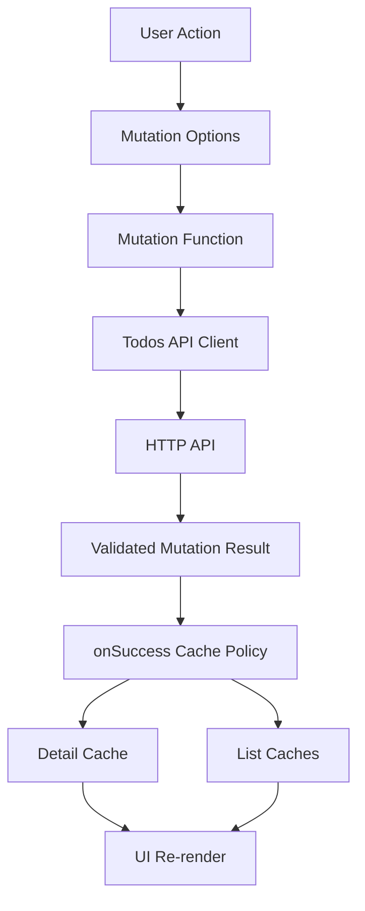
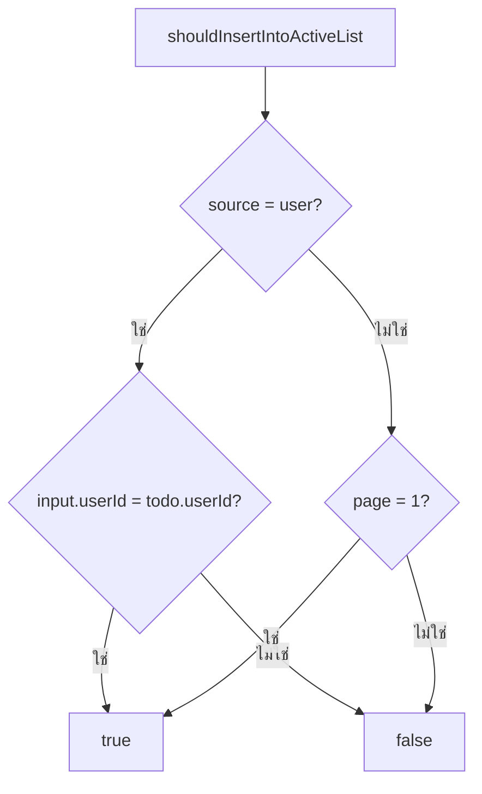
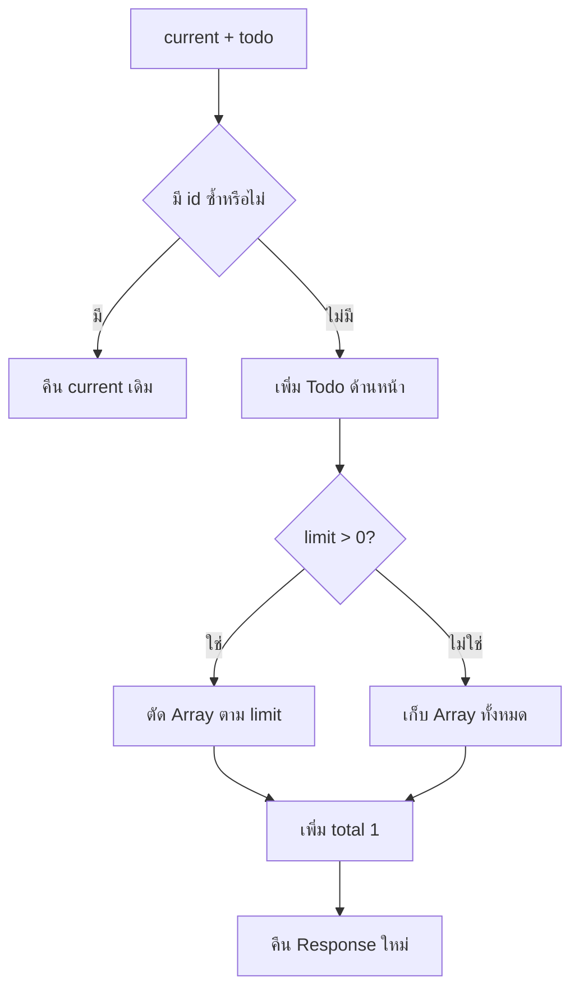
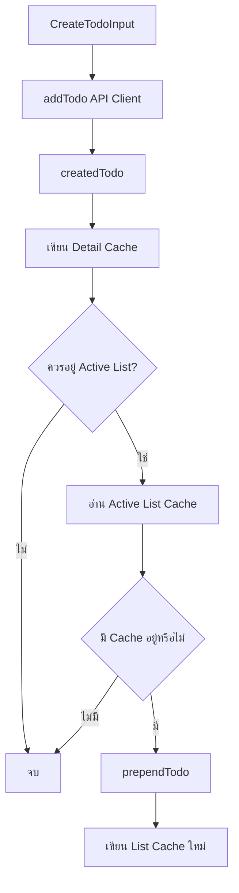
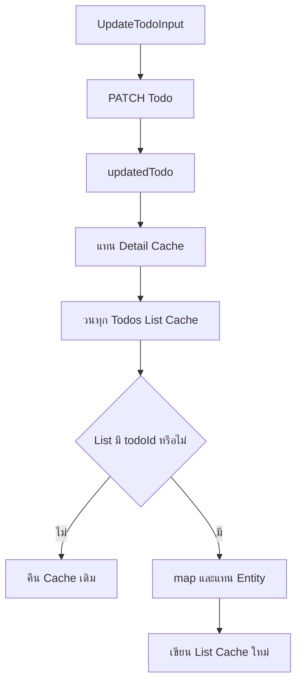
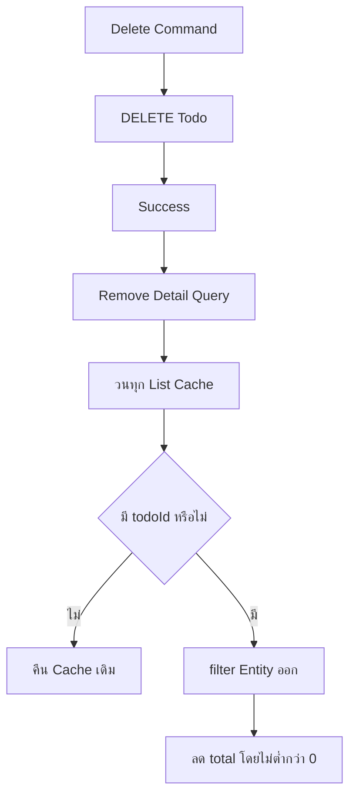
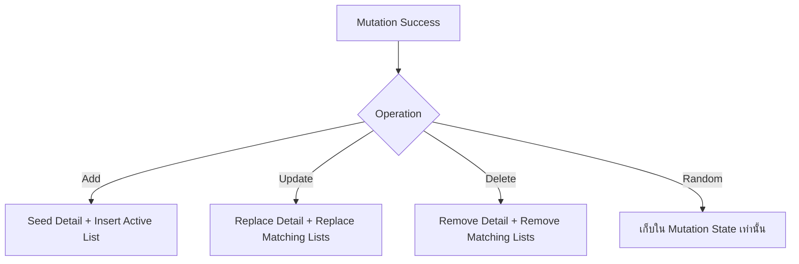
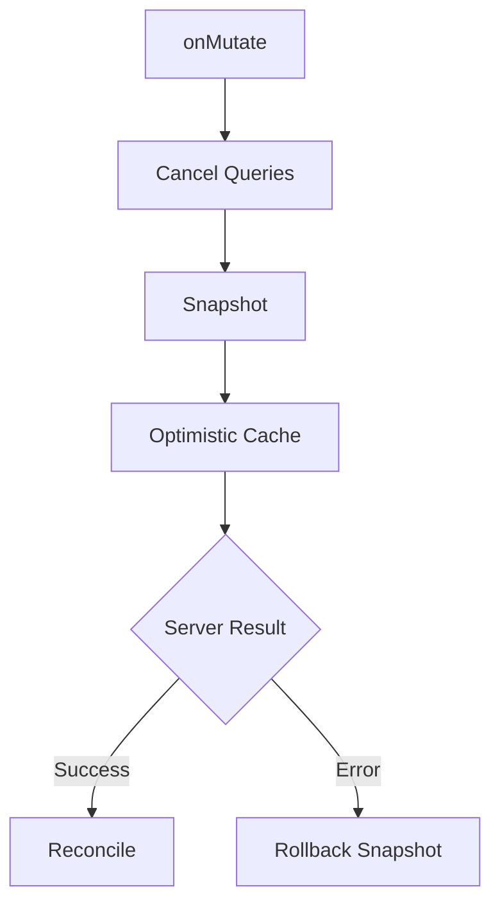

# คำอธิบายเพิ่มเติมเกี่ยวกับ Mutation และ Cache Policy

ไฟล์เป้าหมายจาก Tutorial: `src/features/todos/api/mutations.ts`

## ภาพรวม

ไฟล์ `mutations.ts` เป็นเจ้าของ Command Operations ของ Feature Todos ได้แก่ สุ่มข้อมูล เพิ่ม แก้ไข และลบ Todo รวมถึงกำหนดว่าเมื่อ Server ตอบกลับสำเร็จแล้ว Query Cache ต้องเปลี่ยนอย่างไร

Mutation ไม่ได้จบที่การเรียก API สำเร็จ เพราะ UI อาจมีสำเนาข้อมูลเดียวกันอยู่หลาย Cache Entry เช่น

- Detail Cache ของ Todo หนึ่งรายการ
- List Cache หน้าแรก
- List Cache หน้าที่สอง
- List Cache ที่กรองตาม User

หาก Mutation เปลี่ยนข้อมูลบน Server แต่ไม่อัปเดต Cache ที่เกี่ยวข้อง UI จะอยู่ในสถานะไม่สอดคล้องกัน



ไฟล์นี้ใช้แนวทาง **direct cache synchronization** เป็นหลัก กล่าวคือใช้ผลลัพธ์ที่ Server คืนมาเขียนลง Cache โดยตรง แทนการ `invalidateQueries` แล้ว Fetch ใหม่ทุกครั้ง

ข้อดี:

- UI เปลี่ยนทันทีหลัง Mutation สำเร็จ
- ลด Network Request ที่ไม่จำเป็น
- ใช้ข้อมูลที่ผ่าน Runtime Contract แล้วจาก API Client

ข้อแลกเปลี่ยน:

- Cache Policy ต้องสะท้อนพฤติกรรมของ Backend อย่างถูกต้อง
- ต้องรู้ว่ามี Cache Entry ใดบ้างที่ได้รับผลกระทบ
- หาก Server มี Side Effect ที่ Client คาดเดาไม่ได้ การ Refetch อาจปลอดภัยกว่า

Mutation Flow ของ Tutorial:

```text
User Action
  → mutationFn
  → API Client
  → Response Validation
  → onSuccess
  → Update หรือ Remove Query Cache
  → UI Re-render
```

---

## `todosMutationKeys`

```ts
export const todosMutationKeys = {
  all: ["todos", "mutation"] as const,
  random: () => [...todosMutationKeys.all, "random"] as const,
  add: () => [...todosMutationKeys.all, "add"] as const,
  update: (todoId: number) => [...todosMutationKeys.all, "update", todoId] as const,
  delete: (todoId: number) => [...todosMutationKeys.all, "delete", todoId] as const,
};
```

Mutation Key ใช้ระบุตัวตนของ Mutation Operation ใน TanStack Query Mutation Cache

โครงสร้างเป็นลำดับชั้น:

```text
["todos", "mutation"]
├── ["todos", "mutation", "random"]
├── ["todos", "mutation", "add"]
├── ["todos", "mutation", "update", todoId]
└── ["todos", "mutation", "delete", todoId]
```

หน้าที่หลัก:

- แยกสถานะ Pending/Error ของแต่ละ Command
- ช่วยตรวจสถานะ Mutation แบบรวมด้วย `useIsMutating`
- ทำให้ Devtools และ Observability อ่านง่าย
- แยก Update/Delete ราย Entity ด้วย `todoId`

ตัวอย่าง:

```ts
useIsMutating({ mutationKey: todosMutationKeys.all });
```

ใช้ตรวจว่ามี Mutation ใดของ Todos กำลังทำงานอยู่หรือไม่

```ts
useIsMutating({ mutationKey: todosMutationKeys.update(todoId) });
```

ใช้ตรวจ Update ของ Todo เฉพาะรายการ

`as const` ทำให้ TypeScript รักษา Literal Tuple Type ของ Key แทนการขยายเป็น Array ทั่วไป

Edge Cases:

- หาก Update ทุก Entity ใช้ Key เดียวกัน จะระบุ Pending State ราย Todo ไม่ได้
- Mutation Key ไม่ใช่ Query Key และไม่ใช้เก็บ Server State
- Key ที่มี Object หรือค่าที่ไม่ Stable โดยไม่จำเป็นจะทำให้การตรวจ Mutation State ซับซ้อน

---

## `shouldInsertIntoActiveList`

```ts
function shouldInsertIntoActiveList(input: TodosListQueryInput, todo: Todo) {
  if (input.source === "user") {
    return input.userId === todo.userId;
  }

  return input.page === 1;
}
```

ฟังก์ชันนี้ตัดสินว่า Todo ที่เพิ่งสร้างควรถูกเพิ่มเข้า Active List Cache ที่ผู้ใช้กำลังดูหรือไม่

Input:

- `input: TodosListQueryInput` — เงื่อนไขของ List ปัจจุบัน เช่น Source, Page, Page Size และ User ID
- `todo: Todo` — Todo ที่ Server คืนหลัง Add สำเร็จ

Output:

- `true` — Todo ใหม่สมควรปรากฏใน Active List
- `false` — ไม่ควรแก้ Active List Cache

Logic Breakdown:
- กรณี `source === "user"`: ให้ Todo ใหม่อยู่ใน List นี้เมื่อ `activeList.userId === createdTodo.userId`
- กรณี `source === "all"`: ให้ Todo ใหม่ถูกสมมติว่าอยู่บนหน้าแรก จึง Insert เฉพาะเมื่อ `page === 1`



เหตุผลที่ไม่ Insert ลงทุกหน้า:

- Pagination List แต่ละหน้ามีตำแหน่งข้อมูลเฉพาะ
- การเพิ่ม Todo ใหม่ลงหน้าที่สองหรือสามโดยตรงทำลายลำดับข้อมูล
- User-scoped List ต้องไม่แสดง Todo ของ User อื่น

Edge Cases:

- Policy นี้สมมติว่า List เรียงรายการใหม่ล่าสุดก่อน หาก Backend Sort แบบอื่น Todo ใหม่อาจไม่ได้อยู่หน้าแรก
- ถ้ามี Filter เพิ่ม เช่น `completed=true` ต้องเพิ่มเงื่อนไขให้ Todo ใหม่ตรง Filter ด้วย
- ถ้า `userId` เป็น `null` ใน User Scope ฟังก์ชันจะคืน `false` แต่ Invalid State ควรถูกป้องกันตั้งแต่ URL/Query Boundary
- หาก Backend Assign ค่า `userId` ต่างจาก Input ต้องยึดค่าจาก Response ซึ่งโค้ดนี้ทำถูกต้องแล้ว

---

## `prependTodo`

```ts
function prependTodo(current: TodosListResponse, todo: Todo): TodosListResponse {
  if (current.todos.some((item) => item.id === todo.id)) {
    return current;
  }

  const nextTodos = [todo, ...current.todos];
  const visibleTodos = current.limit > 0 ? nextTodos.slice(0, current.limit) : nextTodos;

  return {
    ...current,
    todos: visibleTodos,
    total: current.total + 1,
  };
}
```

ฟังก์ชันนี้สร้าง List Response ชุดใหม่โดยเพิ่ม Todo ไว้ด้านหน้า พร้อมรักษาขนาดหน้าตาม `limit`

Input:
- `current: TodosListResponse` — Cache Value ปัจจุบัน
- `todo: Todo` — Todo ใหม่ที่ต้องเพิ่ม

Output:
- `TodosListResponse` ชุดใหม่
- หรือคืน Object เดิมเมื่อพบ Todo ID ซ้ำ

Logic Breakdown: 
1. ตรวจ Duplicate ด้วย `id`
2. หากมีอยู่แล้ว คืน `current` เพื่อไม่เพิ่มซ้ำ
3. สร้าง Array ใหม่ `[todo, ...current.todos]`
4. ถ้า `limit > 0` ตัด Array ให้ไม่เกินขนาดหน้า
5. เพิ่ม `total` หนึ่งรายการ
6. คืน Object ใหม่โดยไม่ Mutate Cache เดิม



> **เหตุผลที่ต้องสร้าง Object และ Array ใหม่:** TanStack Query ตรวจการเปลี่ยนแปลงและทำ Structural Sharing จาก Reference หากแก้ Array เดิมด้วย `unshift()` หรือแก้ Object เดิมโดยตรง อาจทำให้ State Tracking และ React Rendering ไม่แน่นอน

> เหตุผลที่ตรวจ Duplicate:
> - ป้องกัน `onSuccess` ถูกประมวลผลซ้ำ
> - ป้องกัน API คืน Entity ที่มีอยู่แล้ว
> - ป้องกัน UI Trigger Add ซ้ำในบาง Workflow

Edge Cases:

- `current.limit === 0` หมายถึง DummyJSON อาจคืนข้อมูลทั้งหมด จึงไม่ Slice
- หาก `total` จาก Server ไม่สอดคล้องกับ Array ปัจจุบัน ฟังก์ชันยังเพิ่มจากค่าที่ Cache มี
- การใช้ `.some()` มี Complexity `O(n)` แต่ List Page ทั่วไปมีขนาดเล็ก
- ถ้า Backend ใช้ Composite Key การเทียบด้วย `id` อย่างเดียวอาจไม่พอ
- หาก Add เป็น Idempotent Retry และ Server คืน Todo เดิม Duplicate Guard จะป้องกัน `total` เพิ่มผิด

---

## `randomTodosMutationOptions`

```ts
export function randomTodosMutationOptions() {
  return mutationOptions({
    mutationKey: todosMutationKeys.random(),
    mutationFn: (count: number) => getRandomTodos({ count }),
  });
}
```

แม้ `/todos/random` จะเป็น HTTP GET แต่ใน UX มันมี Semantics แบบ Command:

```text
ผู้ใช้กดปุ่ม
  → ต้องการผลลัพธ์ใหม่ทุกครั้ง
  → ไม่ต้องการผลเดิมจาก Query Cache
  → ไม่ต้องการ Background Refetch
```

ดังนั้นจึงใช้ Mutation แทน Query

Input: `count: number` — จำนวน Todo ที่ต้องการสุ่ม ตั้งแต่ 1–10
Output: Mutation Options ที่เมื่อ Execute จะคืน `Promise<Array<Todo>>`
Logic Breakdown: 

1. สร้าง Mutation Key `random`
2. รับ `count` จาก Caller
3. เรียก `getRandomTodos({ count })`
4. API Client Validate Count และ Response
5. ผลลัพธ์เก็บใน Mutation State ไม่เขียนลง Query Cache

ข้อดี:

- กดซ้ำแล้ว Request ใหม่ทุกครั้ง
- Random Result ไม่ปะปนกับ Canonical Todos List Cache
- UI ใช้ `mutation.data`, `mutation.isPending` และ `mutation.error` ได้โดยตรง

Edge Cases:

- กดหลายครั้งเร็ว ๆ อาจเกิด Race Condition ผลลัพธ์ Request เก่ากลับมาทีหลังและกลายเป็นค่าล่าสุด
- Mutation ไม่มี Cancellation Signal ใน implementation นี้
- Count ผิดช่วงจะเกิด ZodError ก่อนยิง Request
- Random Endpoint ไม่ควรถูก Retry อัตโนมัติหลายครั้งหากแต่ละครั้งสร้างผลลัพธ์ต่างกัน เว้นแต่ UX ยอมรับได้

Production Improvement:

- Disable ปุ่มระหว่าง Pending หรือกำหนด Request ID เพื่อป้องกัน Out-of-order Result
- รองรับ AbortController หากต้อง Cancel คำสั่งก่อนหน้า
- กำหนด `retry` อย่างชัดเจนตาม Semantics ของ Random Operation

---

## `addTodoMutationOptions`

```ts
export function addTodoMutationOptions(
  queryClient: QueryClient,
  activeListInput: TodosListQueryInput,
) {
  return mutationOptions({
    mutationKey: todosMutationKeys.add(),
    mutationFn: (input: CreateTodoInput) => addTodo({ input }),
    onSuccess: (createdTodo) => {
      queryClient.setQueryData(todosKeys.detail(createdTodo.id), createdTodo);

      if (!shouldInsertIntoActiveList(activeListInput, createdTodo)) {
        return;
      }

      queryClient.setQueryData<TodosListResponse>(todosKeys.list(activeListInput), (current) =>
        current ? prependTodo(current, createdTodo) : current,
      );
    },
  });
}
```

Factory นี้สร้าง Mutation สำหรับเพิ่ม Todo และกำหนด Cache Policy หลัง Add สำเร็จ

Factory Input:

- `queryClient: QueryClient` — API สำหรับอ่านและแก้ Query Cache
- `activeListInput: TodosListQueryInput` — เงื่อนไขของ List ที่ผู้ใช้กำลังดู

Mutation Input: `CreateTodoInput` — `{ todo, completed, userId }`
Mutation Output: `Todo` ที่ผ่าน Response Contract แล้ว
Logic Breakdown:
1. Caller ส่ง `CreateTodoInput`
2. `mutationFn` เรียก `addTodo`
3. API Client Validate Request Input
4. Server คืน Todo ที่สร้างแล้ว
5. API Client Validate Response
6. `onSuccess` เขียน Todo ลง Detail Cache
7. ตรวจว่า Todo ควรแสดงใน Active List หรือไม่
8. ถ้าควรแสดง ให้ Prepend ลง List Cache ปัจจุบัน



> ทำไมเขียน Detail Cache ทันที: หลัง Add สำเร็จ Server คืน Entity ฉบับสมบูรณ์แล้ว จึงสามารถ Seed Detail Cache ได้ทันที หากผู้ใช้ Navigate ไปหน้ารายละเอียด TanStack Query สามารถใช้ข้อมูลนี้ก่อนตาม `staleTime`
> ทำไมอัปเดตเฉพาะ Active List: Tutorial เลือก Policy แบบจำกัดขอบเขตเพื่อหลีกเลี่ยงการคาดเดาตำแหน่งของ Todo ใหม่ในทุก List Cache โดย Update เฉพาะ List ที่ผู้ใช้มองเห็นและมีเงื่อนไขรองรับอย่างชัดเจน

Edge Cases:

- หาก Active List ยังไม่มี Cache `current` จะเป็น `undefined` และไม่สร้าง Cache ปลอมขึ้นมา
- List อื่นที่ Todo ใหม่ควรอยู่จะยังไม่ถูกอัปเดตจนกว่าจะ Fetch ใหม่
- หาก Backend Sort ไม่ใช่ Created-at Descending การ Prepend อาจผิดลำดับ
- หาก Add เปลี่ยน Filter Aggregate หรือ Summary อื่น ต้องอัปเดต Cache เหล่านั้นด้วย
- DummyJSON ไม่ Persist Add เมื่อ Refetch ข้อมูลที่ Insert ใน Browser Cache จะหายไป

Production Alternatives:

- `invalidateQueries({ queryKey: todosKeys.lists() })` เมื่อ Server เป็น Source of Truth และตำแหน่งข้อมูลคาดเดาไม่ได้
- Optimistic Update ผ่าน `onMutate` เมื่อ UX ต้องเห็นผลก่อน Server ตอบ แต่ต้องมี Rollback
- Hybrid Policy: เขียน Detail Cache ทันที แล้ว Invalidate List Cache เฉพาะกลุ่มที่ได้รับผลกระทบ

---

## `updateTodoMutationOptions`

```ts
export function updateTodoMutationOptions(queryClient: QueryClient, todoId: number) {
  return mutationOptions({
    mutationKey: todosMutationKeys.update(todoId),
    mutationFn: (input: UpdateTodoInput) => updateTodo({ todoId, input }),
    onSuccess: (updatedTodo) => {
      queryClient.setQueryData(todosKeys.detail(todoId), updatedTodo);

      queryClient.setQueriesData<TodosListResponse>({ queryKey: todosKeys.lists() }, (current) => {
        if (!current) {
          return current;
        }

        const containsTodo = current.todos.some((todo) => todo.id === todoId);

        if (!containsTodo) {
          return current;
        }

        return {
          ...current,
          todos: current.todos.map((todo) => (todo.id === todoId ? updatedTodo : todo)),
        };
      });
    },
  });
}
```

Factory นี้สร้าง Mutation สำหรับแก้ไข Todo และ Synchronize ทุก Cached List ที่มี Todo รายการนั้น

Factory Input: 
- `queryClient: QueryClient`
- `todoId: number` — Entity ID เป้าหมาย

Mutation Input: `UpdateTodoInput` — Partial Payload ที่ต้องมีอย่างน้อยหนึ่ง Field
Mutation Output: `Todo` ฉบับล่าสุดจาก Server
Logic Breakdown: 
1. `mutationFn` ปิด `todoId` ไว้ใน Closure
2. Caller ส่งเฉพาะ Field ที่ต้องแก้
3. API Client Validate Input และใช้ `PATCH`
4. Server คืน Todo ฉบับเต็ม
5. เขียนผลลัพธ์ลง Detail Cache
6. ค้นทุก Query ที่ขึ้นต้นด้วย `todosKeys.lists()`
7. สำหรับแต่ละ List Cache ตรวจว่ามี `todoId` หรือไม่
8. ถ้ามี ให้แทนที่ Item เดิมด้วย `updatedTodo`
9. ถ้าไม่มี คืน Reference เดิม



> ทำไมใช้ `setQueriesData`: Todo เดียวกันอาจปรากฏในหลาย List Cache เช่น All List และ User List การอัปเดตเฉพาะ Active List จะทำให้กลับไปอีกหน้าแล้วเห็นข้อมูลเก่า `setQueriesData` จึงใช้ Partial Query Key `todosKeys.lists()` เพื่อ Synchronize ทุก List Cache ที่มีอยู่
> ทำไมตรวจ `containsTodo` ก่อน `map`: 
> - หลีกเลี่ยงสร้าง Array/Object ใหม่โดยไม่จำเป็น
> - รักษา Reference เดิมให้ Structural Sharing ทำงานดี
> - ลด React Re-render ของ Consumer ที่ข้อมูลไม่เปลี่ยน

Edge Cases สำคัญ:

- ถ้า Update เปลี่ยน `userId` หรือ Field ที่ใช้ Filter ตัว Todo อาจต้องถูกย้ายออกจาก List เดิมและเพิ่มเข้า List ใหม่ แต่ Tutorial ไม่อนุญาตแก้ `userId`
- ถ้า Update เปลี่ยน `completed` และ List มี Filter ตาม Status โค้ดปัจจุบันยังแทน Entity ใน List เดิม แม้ไม่ตรง Filter แล้ว
- ถ้า Server คืน Partial Response แทน Full Entity การแทนทั้ง Object จะทำให้ Field หาย แต่ Contract ปัจจุบันบังคับ Full Todo
- Concurrent Update สองครั้งอาจเกิด Last Response Wins ไม่ใช่ Last Intent Wins
- ถ้า Detail Cache ใช้ `todoId` จาก Argument แต่ Server คืน ID อื่น ถือเป็น Contract/Server Integrity Problem

Production Improvement:

- Cancel หรือ Serialize Mutation ราย Entity
- ใช้ Version/ETag/`updatedAt` สำหรับ Optimistic Concurrency Control
- เมื่อ Update กระทบ Membership ของ Filtered List ให้ Re-evaluate ทุก List Input หรือ Invalidate ที่เกี่ยวข้อง
- ใช้ `onMutate` พร้อม Snapshot และ Rollback หากต้องการ Optimistic UI

---

## `deleteTodoMutationOptions`

```ts
export function deleteTodoMutationOptions(queryClient: QueryClient, todoId: number) {
  return mutationOptions({
    mutationKey: todosMutationKeys.delete(todoId),
    mutationFn: () => deleteTodo({ todoId }),
    onSuccess: () => {
      queryClient.removeQueries({ queryKey: todosKeys.detail(todoId) });

      queryClient.setQueriesData<TodosListResponse>({ queryKey: todosKeys.lists() }, (current) => {
        if (!current) {
          return current;
        }

        const containsTodo = current.todos.some((todo) => todo.id === todoId);

        if (!containsTodo) {
          return current;
        }

        return {
          ...current,
          todos: current.todos.filter((todo) => todo.id !== todoId),
          total: Math.max(0, current.total - 1),
        };
      });
    },
  });
}
```

Factory นี้สร้าง Mutation สำหรับลบ Todo และนำ Entity ออกจากทุก Cache Entry ที่เกี่ยวข้อง

Factory Input: 
- `queryClient: QueryClient`
- `todoId: number`

Mutation Input: ไม่มี Runtime Variable เพราะ `todoId` ถูกปิดไว้ใน Closure
Mutation Output: API Client คืน `DeletedTodo` แต่ `onSuccess` ไม่ต้องใช้ Payload เพราะรู้ Entity ID ที่ต้องลบอยู่แล้ว
Logic Breakdown: 
1. `mutationFn` เรียก `deleteTodo({ todoId })`
2. เมื่อ Server ยืนยันสำเร็จ ลบ Detail Query ออกจาก Cache
3. ค้นทุก Todos List Cache
4. ถ้า List ไม่มี Todo เป้าหมาย คืน Cache เดิม
5. ถ้ามี ให้ Filter Todo ออก
6. ลด `total` ลงหนึ่ง แต่ไม่ให้ต่ำกว่า `0`



> `removeQueries` ต่างจาก `setQueryData(undefined)` อย่างไร?
> `removeQueries` นำ Query Entry ออกจาก Query Cache โดยตรง รวม State และ Metadata ที่เกี่ยวข้อง เหมาะกับ Resource ที่ยืนยันแล้วว่าไม่มีอยู่ต่อไป

> ทำไมใช้ `Math.max(0, total - 1)`?
> เป็น Defensive Guard ป้องกัน Aggregate ติดลบหาก Cache เดิมไม่สอดคล้องหรือ Delete Flow ถูกเรียกซ้ำ

Edge Cases:

- การลบ Item จากหน้าปัจจุบันจะทำให้จำนวนแถวลดลง แต่ไม่ได้ดึง Item ถัดไปจากหน้าถัดไปมาเติม
- หากลบ Item สุดท้ายบนหน้าสุดท้าย URL อาจชี้ไป Page ที่ว่าง ต้องให้ Route/UI ปรับ Page หรือ Refetch
- Concurrent Delete ซ้ำอาจครั้งที่สองได้ 404 ต้องกำหนดว่า 404 ถือเป็น Idempotent Success หรือ Error
- Soft Delete ของระบบจริงอาจไม่ควร Remove ทันที แต่อัปเดต Status แทน
- Related Cache เช่น Counts, Dashboard Summary หรือ Search Index ต้องได้รับการอัปเดตหรือ Invalidate เพิ่ม
- DummyJSON ไม่ Persist Delete หลัง Refetch Todo จะกลับมา

Production Alternatives:

- Invalidate Lists หลัง Direct Removal เพื่อให้ Pagination เติมรายการครบ
- ใช้ Tombstone State ระหว่าง Transition
- Navigate ออกจาก Detail Route ก่อนหรือหลังลบตาม UX Policy
- กำหนด Authorization และ Audit Log ฝั่ง Server ไม่ใช่เชื่อการซ่อนปุ่มฝั่ง Client

---

## Cache Policy โดยรวม

Tutorial ใช้ Policy ดังนี้:

| Operation | Detail Cache | List Cache | Refetch |
| --- | --- | --- | --- |
| Random | ไม่เขียน | ไม่เขียน | ไม่เกี่ยวข้อง |
| Add | Seed Entity ใหม่ | เพิ่มเฉพาะ Active List ที่สมเหตุสมผล | ไม่ Refetch |
| Update | แทน Entity | แทนในทุก Cached List ที่มี Entity | ไม่ Refetch |
| Delete | Remove Query | ลบจากทุก Cached List ที่มี Entity | ไม่ Refetch |

Policy นี้เหมาะกับ Tutorial และ API ที่ Response มีข้อมูลเพียงพอให้ Client Synchronize Cache ได้อย่างแน่นอน



ต้องเข้าใจว่า Cache Update เหล่านี้เกิดเฉพาะ Browser Session และ DummyJSON ไม่ Persist Mutation เมื่อ Query Refetch ข้อมูลจะกลับไปตาม Dataset ต้นฉบับ

---

## แนวทางสำหรับ Production

### 1. เลือก Cache Strategy ตาม Consistency Model

ไม่มี Policy เดียวที่เหมาะกับทุกระบบ

ใช้ Direct Cache Write เมื่อ:

- Mutation Response คืน Entity ฉบับสมบูรณ์
- Client รู้แน่นอนว่า Cache ใดได้รับผลกระทบ
- Sort, Filter และ Pagination Logic สามารถประเมินได้

ใช้ Invalidation เมื่อ:

- Server มี Side Effect หลายจุด
- Server คำนวณ Aggregate, Rank หรือ Permission ใหม่
- Client ไม่รู้ตำแหน่ง Entity หลัง Mutation
- Dataset มีผู้ใช้งานหลายคนแก้พร้อมกัน

ใช้ Hybrid เมื่อ:

- ต้องการ UI ตอบสนองเร็ว
- แต่ยังต้อง Reconcile กับ Server ภายหลัง

ตัวอย่าง:

```text
onSuccess
  → เขียน Detail Cache จาก Response
  → อัปเดต Active List เพื่อ UX ทันที
  → Invalidate List Group แบบ Background
```

### 2. Optimistic Update ต้องมี Rollback

หากเพิ่ม `onMutate`:

1. Cancel Query ที่เกี่ยวข้อง
2. Snapshot Cache เดิม
3. เขียน Optimistic Value
4. คืน Context สำหรับ Rollback
5. `onError` คืน Snapshot
6. `onSettled` Revalidate ตามความจำเป็น



ห้ามทำ Optimistic Update โดยไม่มี Rollback สำหรับข้อมูลสำคัญ

### 3. Concurrency Control

สถานการณ์ที่ต้องออกแบบ:

- Update เดียวกันหลายครั้งพร้อมกัน
- Update และ Delete Entity เดียวกันพร้อมกัน
- Mutation Result กลับมาไม่ตามลำดับที่ส่ง
- ผู้ใช้อื่นแก้ Entity ระหว่าง Session

แนวทาง:

- Disable Action ราย Entity ระหว่าง Pending
- Serialize Mutation ด้วย Mutation Scope หรือ Queue
- ใช้ Version Number, ETag หรือ `updatedAt`
- ให้ Server Reject Stale Write ด้วย `409 Conflict` หรือ `412 Precondition Failed`
- Reconcile Cache หลัง Conflict

### 4. Pagination และ Filter Membership

Direct Cache Write ต้องคำนึงถึง:

- Sort Order
- Filter ทุก Field
- Cursor/Page Boundary
- Item ที่ควรถูกย้ายระหว่าง Cache
- Aggregate เช่น `total`

การลบจากหน้าใดหน้าหนึ่งอาจต้อง Fetch Item ถัดไปมาเติม ส่วนการเพิ่มอาจเปลี่ยนทุก Page Boundary หากต้องการความถูกต้องเต็มรูปแบบ Invalidate Paginated Lists มักปลอดภัยกว่า

### 5. Security First

Client-side Validation และ Cache Policy ไม่ใช่ Security Boundary

Server ต้องตรวจ:

- Authentication
- Authorization ราย Entity และ Action
- Input Validation
- Ownership/Tenant Scope
- Rate Limit
- CSRF เมื่อใช้ Cookie-based Session
- Audit Log สำหรับ Mutation สำคัญ

ข้อควรระวัง:

- อย่าใส่ Secret หรือ Privileged Token ใน Frontend
- อย่าเชื่อ `userId` จาก Form โดยไม่ตรวจสิทธิ์ฝั่ง Server
- หลีกเลี่ยงแสดง Error Detail ภายในจาก API ให้ผู้ใช้โดยตรง
- Delete ควรมี Confirmation ตามความเสียหายและอาจต้องรองรับ Undo/Soft Delete

### 6. Retry และ Idempotency

Mutation ไม่ควรถูก Retry โดยอัตโนมัติโดยไม่วิเคราะห์

- Add อาจสร้างข้อมูลซ้ำ ต้องใช้ Idempotency Key
- Update มัก Retry ได้เมื่อใช้ Version Control หรือ Idempotent Payload
- Delete ควรออกแบบเป็น Idempotent หรือกำหนด 404 หลังลบซ้ำให้ชัด
- Random Operation Retry จะคืนผลลัพธ์ใหม่ ไม่ใช่คำตอบเดิม

### 7. Error Taxonomy

ควรแยก Error อย่างน้อย:

- Validation Error
- Authentication/Authorization Error
- Conflict Error
- Not Found Error
- Rate Limit Error
- Transport/Timeout Error
- API Contract Error

UI จึงตัดสินใจได้ว่า Error ใดควร Retry, แสดง Inline Message, Redirect หรือส่งไป Observability

### 8. Observability

บันทึกข้อมูลที่ช่วย Debug โดยไม่รั่วข้อมูลลับ:

- Mutation Name
- Entity ID
- Duration
- HTTP Status
- Error Code
- Retry Count
- Cache Policy ที่ใช้
- Correlation/Request ID

ควรหลีกเลี่ยง Log Payload ที่มี PII หรือ Sensitive Content

### 9. Performance

Implementation ปัจจุบันมี Complexity โดยประมาณ:

- `prependTodo`: `O(n)`
- Update ต่อ List: `O(n)`
- Delete ต่อ List: `O(n)`
- `setQueriesData`: คูณตามจำนวน List Cache ที่ Match

สำหรับ List Page ขนาดเล็กถือว่าเหมาะสม แต่ถ้า Cache มีหลายร้อย Query Entry:

- จำกัด Prefix/Predicate ให้แคบ
- Invalidate เฉพาะ Scope ที่ได้รับผลกระทบ
- หลีกเลี่ยงเขียน Cache ทุกชุดโดยไม่มี Membership Check
- กำหนด `gcTime` ให้เหมาะสมเพื่อลด Cache ที่ไม่ใช้งาน

### 10. Testing Strategy

ควรทดสอบอย่างน้อย:

#### Helper Unit Tests

- `shouldInsertIntoActiveList` สำหรับ All/User Scope
- `prependTodo` เพิ่มด้านหน้า
- Duplicate ไม่เพิ่มซ้ำและไม่เพิ่ม `total`
- `limit` ตัดจำนวนรายการถูกต้อง
- `limit=0` ไม่ตัด Array

#### Mutation Integration Tests

- Add Seed Detail Cache
- Add อัปเดตเฉพาะ Active List ที่ตรงเงื่อนไข
- Update แทน Entity ในทุก Matching List
- Update ไม่เปลี่ยน List ที่ไม่มี Entity
- Delete Remove Detail Query
- Delete ลด `total` แต่ไม่ติดลบ
- Random ไม่เขียน Query Cache
- API Error ไม่เรียก `onSuccess`

#### Concurrency Tests

- Out-of-order Update Responses
- Double Submit Add
- Update ระหว่าง Delete
- Rollback ของ Optimistic Mutation

---

## Edge Cases สรุป

สถานการณ์ที่อาจทำให้ Cache ผิดหรือ UI ไม่ตรงกับ Server:

1. Backend Sort ไม่ตรงกับสมมติฐานว่า Todo ใหม่อยู่ด้านหน้า
2. Update เปลี่ยน Field ที่กำหนด Filter Membership
3. Delete ทำให้หน้าปัจจุบันเหลือแถวไม่ครบหรือกลายเป็นหน้าว่าง
4. Mutation หลายรายการกลับมาไม่ตามลำดับ
5. Add ถูก Retry และสร้างข้อมูลซ้ำ
6. Server Response เป็น Partial Entity
7. Query Cache ไม่มี Active List Entry ขณะ Add สำเร็จ
8. Aggregate `total` จาก Cache เดิมไม่ตรง Server
9. DummyJSON Refetch แล้วข้อมูล Mutation หาย
10. Cache อื่นนอกเหนือจาก List/Detail ไม่ได้รับการ Synchronize
11. User เปลี่ยน Active Filter ระหว่าง Mutation Pending แต่ `activeListInput` ยังเป็นค่าตอนสร้าง Options
12. Entity ถูกแก้หรือลบโดยผู้ใช้อื่น

---

## สรุปสาระสำคัญ

ไฟล์ `mutations.ts` ไม่ได้เป็นเพียงชุด Function สำหรับเรียก POST, PATCH หรือ DELETE แต่เป็นเจ้าของ **Mutation Semantics และ Cache Consistency Policy** ของ Feature Todos

หลักที่ต้องรักษา:

1. Mutation Key ต้องสื่อ Command และ Entity Scope
2. Mutation Function เรียกผ่าน Feature API Client
3. Response ต้องผ่าน Runtime Contract ก่อนใช้แก้ Cache
4. Add ต้อง Insert เฉพาะ List ที่ Membership ถูกต้อง
5. Update ต้อง Synchronize Detail และทุก List ที่มี Entity
6. Delete ต้อง Remove Detail และนำ Entity ออกจาก List Cache
7. Random ใช้ Mutation เพราะ Interaction ต้องการผลใหม่ทุกครั้ง
8. Direct Cache Write เหมาะเมื่อ Client คาดเดาผลได้แน่นอน
9. Invalidation เหมาะเมื่อ Server มี Side Effect หรือ Ordering ซับซ้อน
10. Production Mutation ต้องวางแผนเรื่อง Retry, Idempotency, Concurrency, Rollback และ Authorization

แก่นของหัวข้อนี้คือ:
- Mutation Success ≠ งานเสร็จ
- Mutation Success:
  - Reconcile Cache ที่ได้รับผลกระทบ
  - รักษา UI ให้สอดคล้องกับ Server State
