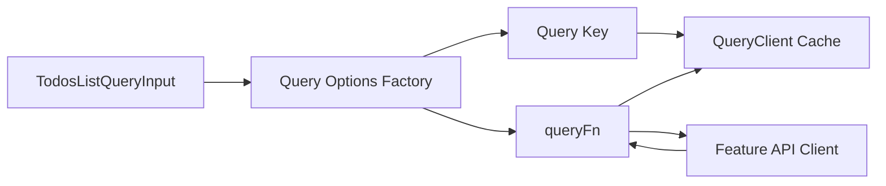
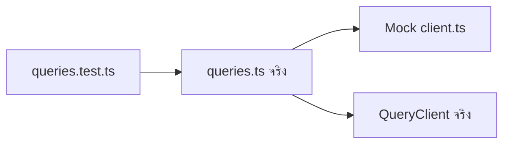
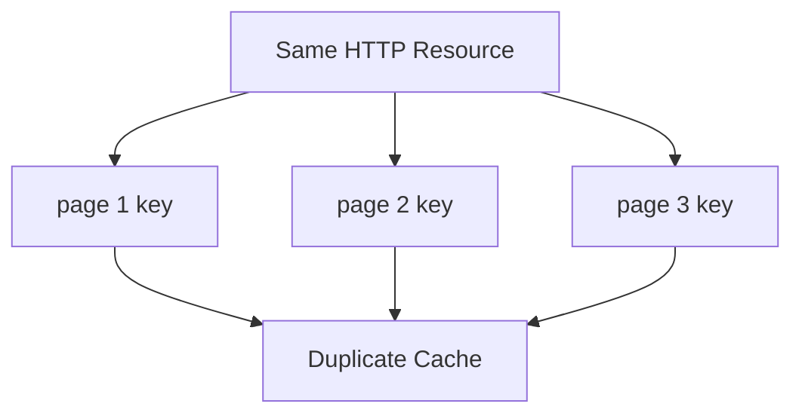
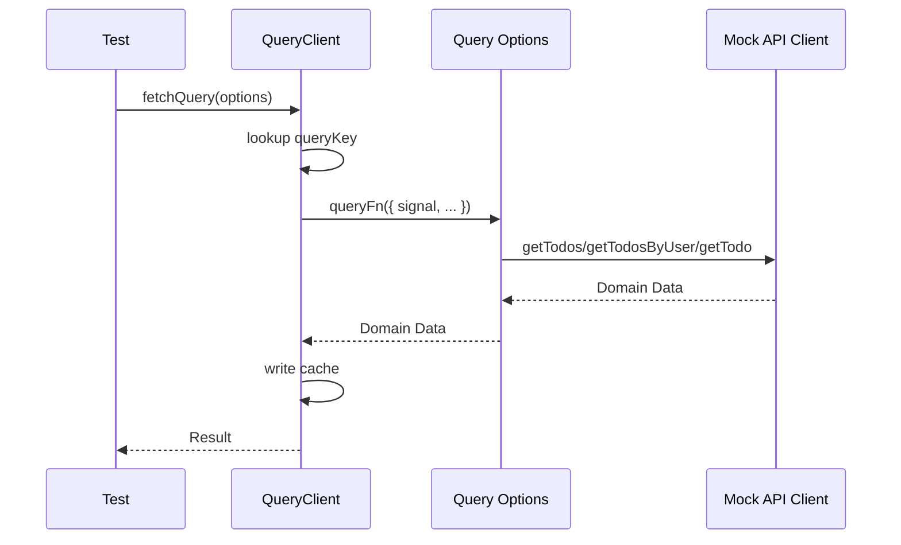
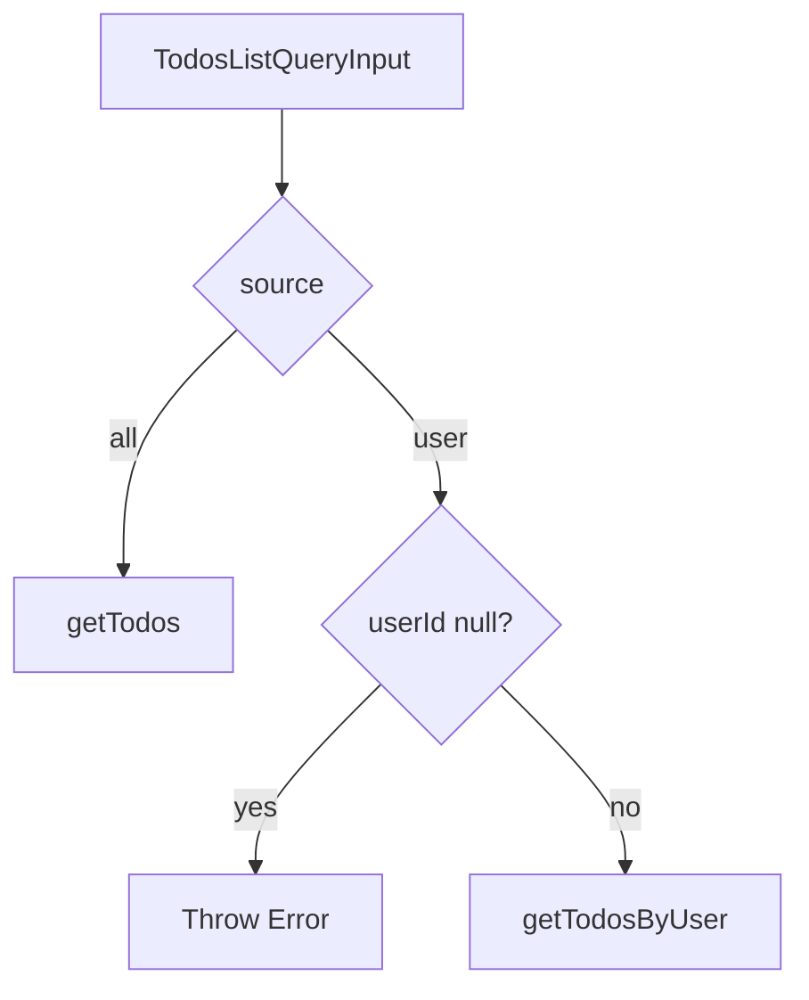
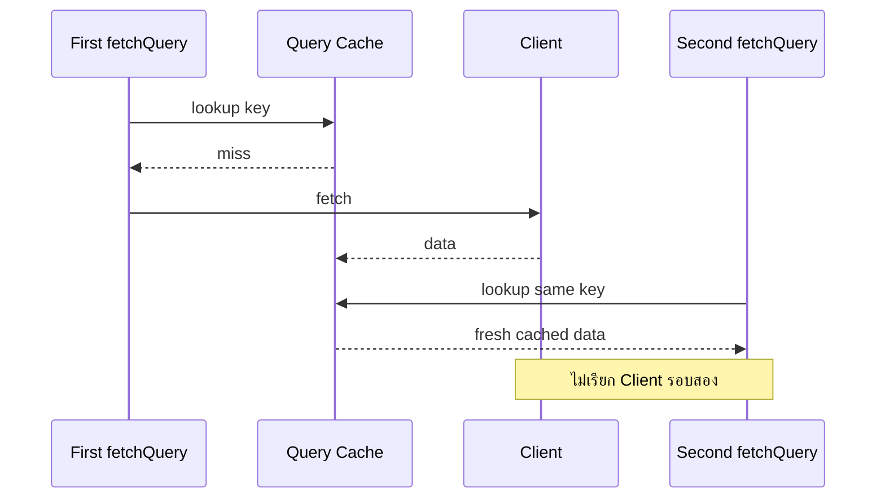
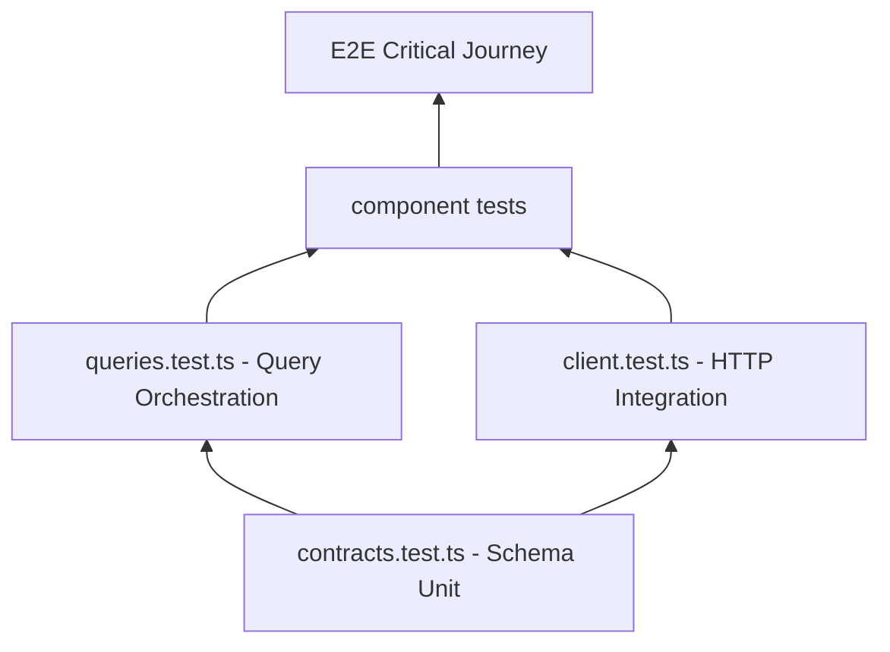

# แนวทางการเขียน Test สำหรับ Todos API Queries

ไฟล์ Test: `src/features/todos/api/queries.test.ts`

ไฟล์ Production ที่ทดสอบ: `src/features/todos/api/queries.ts`

เอกสารนี้ต่อเนื่องจาก

- [การสร้าง API Contract](./api-contract.md)
- [การเขียน Test สำหรับ API Contract](./api-contract-test.md)
- [การสร้าง API Client](./api-client.md)
- [การเขียน Test สำหรับ API Client](./api-client-test.md)
- [การสร้าง API Queries](./api-queries.md)
- หัวข้อ 6 ของ [`docs/GETTING_STARTED.th.md`](../../GETTING_STARTED.th.md)

> **Naming correction:** หัวข้อ 6 สร้าง `src/features/todos/api/queries.ts` ดังนั้นไฟล์ Test ที่ตรงกับ Layer นี้คือ `src/features/todos/api/queries.test.ts` ไม่ใช่ `client.test.ts` ซึ่งเป็น Test ของหัวข้อ 5

เป้าหมายของเอกสารนี้คือสร้าง Unit/Integration Test สำหรับ Query Layer ของโมดูล Todos ด้วย **Vitest + TanStack Query `QueryClient` จริง** โดย Mock เฉพาะ Feature API Client เพื่อแยกความรับผิดชอบของ Query Layer ออกจาก HTTP Layer อย่างชัดเจน

---

## 1. Query Layer กำลังรับผิดชอบอะไร

`queries.ts` รวมสองแนวคิดที่ต้องสอดคล้องกันไว้ในจุดเดียว

1. **Query Key Factory** — กำหนด Identity ของข้อมูลใน TanStack Query Cache
2. **Query Options Factory** — กำหนด Query Key, Query Function และ Query Policy เช่น `staleTime`

Implementation จาก Tutorial คือ

```ts
import { queryOptions } from "@tanstack/react-query";

import { getTodo, getTodos, getTodosByUser } from "./client";

export type TodosListSource = "all" | "user";

export interface TodosListQueryInput {
  page: number;
  pageSize: number;
  source: TodosListSource;
  userId: number | null;
}

function normalizeTodosListInput(input: TodosListQueryInput) {
  if (input.source === "user") {
    return {
      source: input.source,
      userId: input.userId,
    } as const;
  }

  return {
    source: input.source,
    page: input.page,
    pageSize: input.pageSize,
  } as const;
}

export const todosKeys = {
  all: ["todos"] as const,
  lists: () => [...todosKeys.all, "list"] as const,
  list: (input: TodosListQueryInput) =>
    [...todosKeys.lists(), normalizeTodosListInput(input)] as const,
  details: () => [...todosKeys.all, "detail"] as const,
  detail: (todoId: number) => [...todosKeys.details(), todoId] as const,
};

export function todosListQueryOptions(input: TodosListQueryInput) {
  return queryOptions({
    queryKey: todosKeys.list(input),
    queryFn: ({ signal }) => {
      if (input.source === "user") {
        if (input.userId === null) {
          throw new Error("User Scope ต้องมี userId");
        }

        return getTodosByUser({ userId: input.userId, signal });
      }

      return getTodos({
        page: input.page,
        pageSize: input.pageSize,
        signal,
      });
    },
    staleTime: 60_000,
  });
}

export function todoDetailQueryOptions(todoId: number) {
  return queryOptions({
    queryKey: todosKeys.detail(todoId),
    queryFn: ({ signal }) => getTodo({ todoId, signal }),
    staleTime: 60_000,
  });
}
```

Data Flow ที่ Test ต้องตรวจคือ



Query Layer ไม่ควรทดสอบว่า Axios สร้าง HTTP Request ถูกหรือไม่ เพราะเรื่องนั้นเป็น Ownership ของ `client.test.ts`

---

## 2. สิ่งที่ Test Suite ต้องพิสูจน์

Test Suite ที่ดีควรครอบคลุมอย่างน้อย 8 กลุ่ม

1. **Key hierarchy** — `all`, `lists`, `list`, `details`, `detail` ต้องมีโครงสร้างถูกต้อง
2. **Key normalization** — User Scope ต้องตัด `page` และ `pageSize` ที่ไม่กระทบ HTTP Resource ออกจาก Key
3. **Key differentiation** — Input ที่ทำให้ Response ต่างกันต้องสร้าง Key ต่างกัน
4. **Query routing** — `source=all` ต้องเรียก `getTodos`; `source=user` ต้องเรียก `getTodosByUser`
5. **Invariant guard** — `source=user` และ `userId=null` ต้อง Reject ก่อนเรียก API Client
6. **AbortSignal forwarding** — Signal จาก TanStack Query ต้องถูกส่งต่อเข้า Feature API Client
7. **Query policy** — `staleTime` ต้องเป็น `60_000`
8. **Cache semantics** — Query Key เดียวกันต้อง Reuse Cache; Resource คนละตัวต้องแยก Cache

ภาพรวม Responsibility ของ Test แต่ละไฟล์ควรเป็นดังนี้

```text
contracts.test.ts
  → Zod Runtime Contract

client.test.ts
  → HTTP Method / URL / Payload / MSW / Transport Error / Contract Error

queries.test.ts
  → Query Key / Normalization / queryFn Routing / Query Policy / Cache Identity
```

การแยกแบบนี้ทำให้ Test Failure บอกตำแหน่งปัญหาได้ชัดเจน

---

## 3. ทำไม Query Test ควร Mock API Client

สำหรับ `client.test.ts` เราไม่ Mock `httpClient` เพราะต้องการทดสอบ HTTP Boundary จริง

แต่สำหรับ `queries.test.ts` เราต้องการทดสอบเฉพาะ Query Layer ดังนั้นควร Mock

```ts
getTodos
getTodosByUser
getTodo
```

เหตุผลคือ Query Layer ไม่ควรรู้รายละเอียดของ Axios, MSW หรือ DummyJSON



ถ้าใช้ MSW ซ้ำในไฟล์นี้ Test จะมีหลาย Layer เกินไป และเมื่อ Test Fail จะตอบยากว่าปัญหาเกิดจาก Query Key, Client, Axios หรือ Handler

กฎที่แนะนำคือ

> Mock Boundary ที่อยู่ถัดจาก Unit ที่กำลังทดสอบ แต่ใช้ Infrastructure ภายใน Unit นั้นจริง

ดังนั้นเราจะ Mock `client.ts` แต่ใช้ `QueryClient` จริง

---

## 4. Dependency ที่ต้องใช้

ถ้าทำตาม [API Client Test](./api-client-test.md) แล้ว โปรเจ็กต์ควรมี Vitest อยู่แล้ว

หากยังไม่มี ให้ติดตั้ง

```bash
bun add -D vitest @vitest/coverage-v8
```

TanStack Query มีอยู่ใน Production Dependency ของ Boilerplate อยู่แล้ว จึงไม่ต้องติดตั้งเพิ่ม

สำหรับ Test นี้ไม่จำเป็นต้องใช้

- MSW
- jsdom
- React Testing Library
- React Component
- Browser API

เพราะเราทดสอบ Query Configuration และ QueryClient โดยตรงใน Node Environment ได้

Scripts ที่แนะนำใน `package.json`

```json
{
  "scripts": {
    "test": "vitest run",
    "test:watch": "vitest",
    "test:coverage": "vitest run --coverage"
  }
}
```

ให้นำ Scripts เหล่านี้ไปรวมกับ Scripts เดิมของโปรเจ็กต์ ไม่ใช่แทนที่ทั้งหมด

---

## 5. ตำแหน่งไฟล์

สร้าง

```text
src/features/todos/api/queries.test.ts
```

โครงสร้างจะเป็น

```text
src/
└── features/
    └── todos/
        └── api/
            ├── client.ts
            ├── client.test.ts
            ├── contracts.ts
            ├── contracts.test.ts
            ├── queries.ts
            ├── queries.test.ts
            └── mutations.ts
```

นี่คือ **Colocated Test** ซึ่งเหมาะกับ Feature-oriented Architecture เพราะ Test อยู่ใกล้ Production Code ที่เป็นเจ้าของ Behavior นั้น

---

## 6. Test Matrix

ก่อนเขียน Test ให้แปลง Logic ใน `queries.ts` เป็น Behavior Matrix

| Area | Case | Expected |
| --- | --- | --- |
| Root key | `todosKeys.all` | `["todos"]` |
| List prefix | `todosKeys.lists()` | `["todos", "list"]` |
| Detail prefix | `todosKeys.details()` | `["todos", "detail"]` |
| All list | page/pageSize | อยู่ใน Key |
| All list | userId เปลี่ยน | Key ไม่เปลี่ยน |
| User list | userId | อยู่ใน Key |
| User list | page/pageSize เปลี่ยน | Key ไม่เปลี่ยน |
| User list | userId เปลี่ยน | Key ต้องเปลี่ยน |
| Detail | todoId | อยู่ใน Key |
| Query routing | source=all | เรียก `getTodos` |
| Query routing | source=user | เรียก `getTodosByUser` |
| Invalid state | userId=null | Throw ก่อนเรียก Client |
| Detail routing | detail | เรียก `getTodo` |
| Signal | list/detail | ส่ง `AbortSignal` ต่อ |
| Policy | list/detail | `staleTime=60_000` |
| Cache | same key | Reuse Cached Data |
| Cache | different key | Fetch แยก |
| Error | Client Reject | Error เดิม propagate ขึ้นมา |

---

## 7. Test Fixture Design

ไม่ควรสร้าง Object ยาว ๆ ซ้ำทุก Test ให้สร้าง Fixture กลางที่อ่านง่าย

```ts
const todo: Todo = {
  id: 1,
  todo: "Define clear frontend architecture boundaries",
  completed: false,
  userId: 7,
};

const listResponse: TodosListResponse = {
  todos: [todo],
  total: 1,
  skip: 0,
  limit: 10,
};
```

และ Input หลัก

```ts
const allInput = {
  page: 1,
  pageSize: 10,
  source: "all",
  userId: null,
} satisfies TodosListQueryInput;

const userInput = {
  page: 1,
  pageSize: 10,
  source: "user",
  userId: 7,
} satisfies TodosListQueryInput;
```

ใช้ `satisfies` แทน Type Assertion เพื่อให้ TypeScript ตรวจ Shape แต่ยังรักษา Literal Type เช่น `source: "all"`

---

## 8. QueryClient สำหรับ Test

สร้าง QueryClient ใหม่ต่อ Test เพื่อป้องกัน Cache รั่วข้าม Test

```ts
function createTestQueryClient() {
  return new QueryClient({
    defaultOptions: {
      queries: {
        retry: false,
      },
    },
  });
}
```

`retry: false` สำคัญมากสำหรับ Unit Test เพราะหาก Client Reject แล้ว TanStack Query Retry อัตโนมัติ จำนวน Call จะมากกว่าที่ Test คาดไว้และทำให้ Error Test ช้าลง

Production QueryClient ยังสามารถใช้ Retry Policy ตามความเหมาะสมได้ Test Helper นี้ไม่ได้เปลี่ยน Production Configuration

---

# 9. โค้ดฉบับเต็ม: `queries.test.ts`

สร้างไฟล์

```text
src/features/todos/api/queries.test.ts
```

แล้วใส่โค้ดต่อไปนี้ทั้งไฟล์

```ts
import { QueryClient } from "@tanstack/react-query";
import { beforeEach, describe, expect, expectTypeOf, it, vi } from "vitest";

import { getTodo, getTodos, getTodosByUser } from "./client";
import type { Todo, TodosListResponse } from "./contracts";
import {
  todoDetailQueryOptions,
  todosKeys,
  todosListQueryOptions,
} from "./queries";
import type { TodosListQueryInput } from "./queries";

vi.mock("./client", () => ({
  getTodo: vi.fn(),
  getTodos: vi.fn(),
  getTodosByUser: vi.fn(),
}));

const getTodoMock = vi.mocked(getTodo);
const getTodosMock = vi.mocked(getTodos);
const getTodosByUserMock = vi.mocked(getTodosByUser);

const todo: Todo = {
  id: 1,
  todo: "Define clear frontend architecture boundaries",
  completed: false,
  userId: 7,
};

const listResponse: TodosListResponse = {
  todos: [todo],
  total: 1,
  skip: 0,
  limit: 10,
};

const allInput = {
  page: 1,
  pageSize: 10,
  source: "all",
  userId: null,
} satisfies TodosListQueryInput;

const userInput = {
  page: 1,
  pageSize: 10,
  source: "user",
  userId: 7,
} satisfies TodosListQueryInput;

function createTestQueryClient() {
  return new QueryClient({
    defaultOptions: {
      queries: {
        retry: false,
      },
    },
  });
}

beforeEach(() => {
  vi.clearAllMocks();

  getTodosMock.mockResolvedValue(listResponse);
  getTodosByUserMock.mockResolvedValue(listResponse);
  getTodoMock.mockResolvedValue(todo);
});

describe("todosKeys", () => {
  it("creates the root key", () => {
    expect(todosKeys.all).toEqual(["todos"]);
  });

  it("creates the list prefix key", () => {
    expect(todosKeys.lists()).toEqual(["todos", "list"]);
  });

  it("creates the detail prefix key", () => {
    expect(todosKeys.details()).toEqual(["todos", "detail"]);
  });

  it("creates an all-scope list key from page and pageSize", () => {
    expect(todosKeys.list(allInput)).toEqual([
      "todos",
      "list",
      {
        source: "all",
        page: 1,
        pageSize: 10,
      },
    ]);
  });

  it("does not include userId in an all-scope list key", () => {
    const first = todosKeys.list({
      ...allInput,
      userId: null,
    });

    const second = todosKeys.list({
      ...allInput,
      userId: 999,
    });

    expect(first).toEqual(second);
    expect(first[2]).not.toHaveProperty("userId");
  });

  it("changes the all-scope key when page changes", () => {
    const first = todosKeys.list(allInput);
    const second = todosKeys.list({
      ...allInput,
      page: 2,
    });

    expect(first).not.toEqual(second);
  });

  it("changes the all-scope key when pageSize changes", () => {
    const first = todosKeys.list(allInput);
    const second = todosKeys.list({
      ...allInput,
      pageSize: 20,
    });

    expect(first).not.toEqual(second);
  });

  it("creates a user-scope key from source and userId only", () => {
    expect(todosKeys.list(userInput)).toEqual([
      "todos",
      "list",
      {
        source: "user",
        userId: 7,
      },
    ]);
  });

  it("does not include page or pageSize in a user-scope key", () => {
    const key = todosKeys.list(userInput);

    expect(key[2]).not.toHaveProperty("page");
    expect(key[2]).not.toHaveProperty("pageSize");
  });

  it("keeps the same user-scope key when only page changes", () => {
    const first = todosKeys.list(userInput);
    const second = todosKeys.list({
      ...userInput,
      page: 99,
    });

    expect(first).toEqual(second);
  });

  it("keeps the same user-scope key when only pageSize changes", () => {
    const first = todosKeys.list(userInput);
    const second = todosKeys.list({
      ...userInput,
      pageSize: 50,
    });

    expect(first).toEqual(second);
  });

  it("changes the user-scope key when userId changes", () => {
    const first = todosKeys.list(userInput);
    const second = todosKeys.list({
      ...userInput,
      userId: 8,
    });

    expect(first).not.toEqual(second);
  });

  it("creates a detail key containing todoId", () => {
    expect(todosKeys.detail(42)).toEqual(["todos", "detail", 42]);
  });

  it("creates different detail keys for different todoIds", () => {
    expect(todosKeys.detail(1)).not.toEqual(todosKeys.detail(2));
  });

  it("does not collide list and detail namespaces", () => {
    expect(todosKeys.lists()).not.toEqual(todosKeys.details());
  });

  it("is deterministic for equivalent inputs", () => {
    const first = todosKeys.list({ ...allInput });
    const second = todosKeys.list({ ...allInput });

    expect(first).toEqual(second);
  });
});

describe("todosListQueryOptions - all scope", () => {
  it("uses todosKeys.list as queryKey", () => {
    const options = todosListQueryOptions(allInput);

    expect(options.queryKey).toEqual(todosKeys.list(allInput));
  });

  it("uses a staleTime of 60 seconds", () => {
    const options = todosListQueryOptions(allInput);

    expect(options.staleTime).toBe(60_000);
  });

  it("calls getTodos with page, pageSize and an AbortSignal", async () => {
    const queryClient = createTestQueryClient();

    await queryClient.fetchQuery(todosListQueryOptions(allInput));

    expect(getTodosMock).toHaveBeenCalledTimes(1);

    const [request] = getTodosMock.mock.calls[0]!;

    expect(request.page).toBe(1);
    expect(request.pageSize).toBe(10);
    expect(request.signal).toBeInstanceOf(AbortSignal);
  });

  it("does not call getTodosByUser for all scope", async () => {
    const queryClient = createTestQueryClient();

    await queryClient.fetchQuery(todosListQueryOptions(allInput));

    expect(getTodosByUserMock).not.toHaveBeenCalled();
  });

  it("returns data from getTodos", async () => {
    const queryClient = createTestQueryClient();

    const result = await queryClient.fetchQuery(todosListQueryOptions(allInput));

    expect(result).toEqual(listResponse);
  });

  it("stores fetched data under the generated list key", async () => {
    const queryClient = createTestQueryClient();
    const options = todosListQueryOptions(allInput);

    await queryClient.fetchQuery(options);

    expect(queryClient.getQueryData(options.queryKey)).toEqual(listResponse);
  });

  it("reuses fresh cache data for the same all-scope key", async () => {
    const queryClient = createTestQueryClient();

    await queryClient.fetchQuery(todosListQueryOptions(allInput));
    await queryClient.fetchQuery(
      todosListQueryOptions({
        ...allInput,
      }),
    );

    expect(getTodosMock).toHaveBeenCalledTimes(1);
  });

  it("fetches separately when page changes", async () => {
    const queryClient = createTestQueryClient();

    await queryClient.fetchQuery(todosListQueryOptions(allInput));
    await queryClient.fetchQuery(
      todosListQueryOptions({
        ...allInput,
        page: 2,
      }),
    );

    expect(getTodosMock).toHaveBeenCalledTimes(2);
  });

  it("fetches separately when pageSize changes", async () => {
    const queryClient = createTestQueryClient();

    await queryClient.fetchQuery(todosListQueryOptions(allInput));
    await queryClient.fetchQuery(
      todosListQueryOptions({
        ...allInput,
        pageSize: 20,
      }),
    );

    expect(getTodosMock).toHaveBeenCalledTimes(2);
  });

  it("propagates a getTodos error unchanged", async () => {
    const queryClient = createTestQueryClient();
    const error = new Error("Unable to load todos");

    getTodosMock.mockRejectedValueOnce(error);

    await expect(
      queryClient.fetchQuery(todosListQueryOptions(allInput)),
    ).rejects.toBe(error);
  });
});

describe("todosListQueryOptions - user scope", () => {
  it("uses the normalized user-scope query key", () => {
    const options = todosListQueryOptions(userInput);

    expect(options.queryKey).toEqual([
      "todos",
      "list",
      {
        source: "user",
        userId: 7,
      },
    ]);
  });

  it("uses a staleTime of 60 seconds", () => {
    const options = todosListQueryOptions(userInput);

    expect(options.staleTime).toBe(60_000);
  });

  it("calls getTodosByUser with userId and an AbortSignal", async () => {
    const queryClient = createTestQueryClient();

    await queryClient.fetchQuery(todosListQueryOptions(userInput));

    expect(getTodosByUserMock).toHaveBeenCalledTimes(1);

    const [request] = getTodosByUserMock.mock.calls[0]!;

    expect(request.userId).toBe(7);
    expect(request.signal).toBeInstanceOf(AbortSignal);
  });

  it("does not call getTodos for user scope", async () => {
    const queryClient = createTestQueryClient();

    await queryClient.fetchQuery(todosListQueryOptions(userInput));

    expect(getTodosMock).not.toHaveBeenCalled();
  });

  it("returns data from getTodosByUser", async () => {
    const queryClient = createTestQueryClient();

    const result = await queryClient.fetchQuery(todosListQueryOptions(userInput));

    expect(result).toEqual(listResponse);
  });

  it("reuses cache when only page changes in user scope", async () => {
    const queryClient = createTestQueryClient();

    await queryClient.fetchQuery(todosListQueryOptions(userInput));
    await queryClient.fetchQuery(
      todosListQueryOptions({
        ...userInput,
        page: 99,
      }),
    );

    expect(getTodosByUserMock).toHaveBeenCalledTimes(1);
  });

  it("reuses cache when only pageSize changes in user scope", async () => {
    const queryClient = createTestQueryClient();

    await queryClient.fetchQuery(todosListQueryOptions(userInput));
    await queryClient.fetchQuery(
      todosListQueryOptions({
        ...userInput,
        pageSize: 50,
      }),
    );

    expect(getTodosByUserMock).toHaveBeenCalledTimes(1);
  });

  it("fetches separately when userId changes", async () => {
    const queryClient = createTestQueryClient();

    await queryClient.fetchQuery(todosListQueryOptions(userInput));
    await queryClient.fetchQuery(
      todosListQueryOptions({
        ...userInput,
        userId: 8,
      }),
    );

    expect(getTodosByUserMock).toHaveBeenCalledTimes(2);
  });

  it("rejects user scope when userId is null", async () => {
    const queryClient = createTestQueryClient();

    const invalidInput = {
      ...userInput,
      userId: null,
    } satisfies TodosListQueryInput;

    await expect(
      queryClient.fetchQuery(todosListQueryOptions(invalidInput)),
    ).rejects.toThrow("User Scope ต้องมี userId");

    expect(getTodosByUserMock).not.toHaveBeenCalled();
    expect(getTodosMock).not.toHaveBeenCalled();
  });

  it("propagates a getTodosByUser error unchanged", async () => {
    const queryClient = createTestQueryClient();
    const error = new Error("Unable to load user todos");

    getTodosByUserMock.mockRejectedValueOnce(error);

    await expect(
      queryClient.fetchQuery(todosListQueryOptions(userInput)),
    ).rejects.toBe(error);
  });
});

describe("todoDetailQueryOptions", () => {
  it("uses todosKeys.detail as queryKey", () => {
    const options = todoDetailQueryOptions(42);

    expect(options.queryKey).toEqual(todosKeys.detail(42));
  });

  it("uses a staleTime of 60 seconds", () => {
    const options = todoDetailQueryOptions(42);

    expect(options.staleTime).toBe(60_000);
  });

  it("calls getTodo with todoId and an AbortSignal", async () => {
    const queryClient = createTestQueryClient();

    await queryClient.fetchQuery(todoDetailQueryOptions(42));

    expect(getTodoMock).toHaveBeenCalledTimes(1);

    const [request] = getTodoMock.mock.calls[0]!;

    expect(request.todoId).toBe(42);
    expect(request.signal).toBeInstanceOf(AbortSignal);
  });

  it("returns data from getTodo", async () => {
    const queryClient = createTestQueryClient();

    const result = await queryClient.fetchQuery(todoDetailQueryOptions(1));

    expect(result).toEqual(todo);
  });

  it("stores detail data under the generated detail key", async () => {
    const queryClient = createTestQueryClient();
    const options = todoDetailQueryOptions(1);

    await queryClient.fetchQuery(options);

    expect(queryClient.getQueryData(options.queryKey)).toEqual(todo);
  });

  it("reuses fresh cache data for the same todoId", async () => {
    const queryClient = createTestQueryClient();

    await queryClient.fetchQuery(todoDetailQueryOptions(1));
    await queryClient.fetchQuery(todoDetailQueryOptions(1));

    expect(getTodoMock).toHaveBeenCalledTimes(1);
  });

  it("fetches separately for different todoIds", async () => {
    const queryClient = createTestQueryClient();

    await queryClient.fetchQuery(todoDetailQueryOptions(1));
    await queryClient.fetchQuery(todoDetailQueryOptions(2));

    expect(getTodoMock).toHaveBeenCalledTimes(2);
  });

  it("does not call list clients for a detail query", async () => {
    const queryClient = createTestQueryClient();

    await queryClient.fetchQuery(todoDetailQueryOptions(1));

    expect(getTodosMock).not.toHaveBeenCalled();
    expect(getTodosByUserMock).not.toHaveBeenCalled();
  });

  it("propagates a getTodo error unchanged", async () => {
    const queryClient = createTestQueryClient();
    const error = new Error("Unable to load todo detail");

    getTodoMock.mockRejectedValueOnce(error);

    await expect(
      queryClient.fetchQuery(todoDetailQueryOptions(1)),
    ).rejects.toBe(error);
  });
});

describe("query namespace and cache isolation", () => {
  it("keeps all-scope list and user-scope list in separate cache entries", async () => {
    const queryClient = createTestQueryClient();

    await queryClient.fetchQuery(todosListQueryOptions(allInput));
    await queryClient.fetchQuery(todosListQueryOptions(userInput));

    expect(getTodosMock).toHaveBeenCalledTimes(1);
    expect(getTodosByUserMock).toHaveBeenCalledTimes(1);

    expect(queryClient.getQueryData(todosKeys.list(allInput))).toEqual(listResponse);
    expect(queryClient.getQueryData(todosKeys.list(userInput))).toEqual(listResponse);
  });

  it("keeps list and detail data in separate cache namespaces", async () => {
    const queryClient = createTestQueryClient();

    await queryClient.fetchQuery(todosListQueryOptions(allInput));
    await queryClient.fetchQuery(todoDetailQueryOptions(1));

    expect(queryClient.getQueryData(todosKeys.list(allInput))).toEqual(listResponse);
    expect(queryClient.getQueryData(todosKeys.detail(1))).toEqual(todo);
  });
});

describe("query types", () => {
  it("keeps the supported list sources narrow", () => {
    expectTypeOf<TodosListQueryInput["source"]>().toEqualTypeOf<"all" | "user">();
  });

  it("keeps the root key as a readonly literal tuple", () => {
    expectTypeOf(todosKeys.all).toEqualTypeOf<readonly ["todos"]>();
  });

  it("keeps detail keys typed with a numeric todoId", () => {
    expectTypeOf(todosKeys.detail(1)).toEqualTypeOf<
      readonly ["todos", "detail", number]
    >();
  });
});
```

---

# 10. อธิบาย Test แต่ละกลุ่ม

## 10.1 `todosKeys`

กลุ่มแรกทดสอบ Query Key Factory โดยตรงโดยไม่ต้องสร้าง QueryClient

Query Key Hierarchy ที่ต้องรักษาคือ

```text
["todos"]
├── ["todos", "list"]
│   └── ["todos", "list", normalizedInput]
└── ["todos", "detail"]
    └── ["todos", "detail", todoId]
```

เหตุผลที่ต้องทดสอบ Prefix คือ Prefix ถูกใช้ในการทำ Cache Operation เช่น

```ts
queryClient.invalidateQueries({
  queryKey: todosKeys.lists(),
});
```

ถ้ามีคนเปลี่ยน Key จาก `"list"` เป็น `"lists"` โดยไม่รู้ตัว Invalidation Policy ใน Layer อื่นอาจหยุดทำงาน

---

## 10.2 All Scope Normalization

สำหรับ

```ts
{
  source: "all",
  page: 1,
  pageSize: 10,
  userId: null,
}
```

Key ต้องเป็น

```ts
["todos", "list", { source: "all", page: 1, pageSize: 10 }]
```

`userId` ไม่อยู่ใน Key เพราะ `GET /todos` ไม่ใช้ `userId`

ดังนั้นสอง Input นี้ต้องหมายถึง Cache Entry เดียวกัน

```ts
{
  source: "all",
  page: 1,
  pageSize: 10,
  userId: null,
}
```

```ts
{
  source: "all",
  page: 1,
  pageSize: 10,
  userId: 999,
}
```

แม้ State ที่สองจะไม่ใช่ State ที่ Route ปกติควรสร้าง แต่ Query Key Factory ต้องสะท้อนเฉพาะ Input ที่มีผลต่อ HTTP Resource จริง

---

## 10.3 User Scope Normalization

User Endpoint ใน Tutorial คือ

```text
GET /todos/user/:userId
```

ไม่มี `page` และ `pageSize`

ดังนั้น

```ts
{ source: "user", userId: 7, page: 1, pageSize: 10 }
```

และ

```ts
{ source: "user", userId: 7, page: 99, pageSize: 50 }
```

ต้องได้ Key เดียวกัน

```ts
["todos", "list", { source: "user", userId: 7 }]
```

นี่เป็น Test ที่สำคัญที่สุดของ Section 6 เพราะถ้าเผลอใส่ `page` ลงใน User Key จะเกิด **Cache Fragmentation**



ผลคือ Network Request มากขึ้น, Memory มากขึ้น และ Cache Update ยากขึ้นโดยไม่มีประโยชน์

---

## 10.4 Key Differentiation

อีกด้านหนึ่ง Query Key ต้องไม่ Normalize มากเกินไป

สำหรับ All Scope

```text
page 1 != page 2
pageSize 10 != pageSize 20
```

เพราะ HTTP Response ต่างกัน

สำหรับ User Scope

```text
userId 7 != userId 8
```

เพราะ Resource ต่างกัน

กฎสำคัญคือ

> Query Key ต้องมีทุก Input ที่เปลี่ยนผลลัพธ์ของ Query Function และไม่ควรมี Input ที่ไม่เปลี่ยนผลลัพธ์

ถ้าขาด Field ที่มีผลต่อ Response จะเกิด **Cache Collision** ซึ่งอันตรายกว่า Cache Fragmentation เพราะ UI อาจแสดงข้อมูลของ Resource ผิดตัว

---

# 11. ทำไมใช้ `QueryClient.fetchQuery()` แทนเรียก `queryFn` ตรง ๆ

เราสามารถดึง `options.queryFn` แล้วเรียกเองได้ แต่ไม่แนะนำเป็น Default เพราะต้องสร้าง Query Function Context เองและจะไม่ได้ทดสอบ Cache Semantics จริง

การใช้

```ts
queryClient.fetchQuery(options)
```

ทำให้ Test ผ่านเส้นทางเดียวกับที่ TanStack Query ใช้จริง



จึงพิสูจน์ทั้ง Query Function และ Cache Identity ในเวลาเดียวกัน

---

# 12. Query Routing

`todosListQueryOptions()` มี Branch สำคัญ



Test ต้องยืนยันทั้ง Positive และ Negative Behavior

### All Scope

ต้องเรียก

```ts
getTodos({
  page,
  pageSize,
  signal,
});
```

และต้อง **ไม่** เรียก `getTodosByUser`

### User Scope

ต้องเรียก

```ts
getTodosByUser({
  userId,
  signal,
});
```

และต้อง **ไม่** เรียก `getTodos`

การ Test ว่า Function ที่ไม่ควรถูกเรียก "ไม่ถูกเรียก" มีความสำคัญ เพราะช่วยจับ Regression ที่อาจเกิดจาก Branch Logic ผิด

---

# 13. Runtime Guard: `userId === null`

Type ปัจจุบันอนุญาต

```ts
{
  source: "user",
  userId: null,
  page: 1,
  pageSize: 10,
}
```

แม้ State นี้ไม่สมเหตุสมผล

ดังนั้น Query Function มี Guard

```ts
if (input.userId === null) {
  throw new Error("User Scope ต้องมี userId");
}
```

Test ต้องพิสูจน์สองเรื่องพร้อมกัน

1. Promise Reject ด้วย Message ที่คาดไว้
2. API Client **ไม่ถูกเรียกเลย**

```ts
await expect(
  queryClient.fetchQuery(todosListQueryOptions(invalidInput)),
).rejects.toThrow("User Scope ต้องมี userId");

expect(getTodosByUserMock).not.toHaveBeenCalled();
expect(getTodosMock).not.toHaveBeenCalled();
```

นี่คือ Fail Fast Behavior ที่สำคัญ เพราะ Invalid Application State ไม่ควรกลายเป็น `/todos/user/null`

---

# 14. AbortSignal Forwarding

TanStack Query ส่ง `AbortSignal` เข้า `queryFn`

```ts
queryFn: ({ signal }) => ...
```

Query Layer ต้องส่ง Signal เดิมต่อให้ API Client

```text
QueryClient
   ↓ AbortSignal
queries.ts
   ↓ AbortSignal
client.ts
   ↓ AbortSignal
Axios
```

ใน `queries.test.ts` เราตรวจ Boundary แรกว่า API Client ได้รับ Signal จริง

```ts
const [request] = getTodosMock.mock.calls[0]!;
expect(request.signal).toBeInstanceOf(AbortSignal);
```

ส่วนการพิสูจน์ว่า Axios ยกเลิก HTTP Request จริงควรอยู่ใน `client.test.ts` ไม่ควรเขียนซ้ำใน Query Test

---

# 15. `staleTime`

ทั้ง List และ Detail กำหนด

```ts
staleTime: 60_000
```

หมายความว่าหลัง Fetch สำเร็จ ข้อมูลถือว่า Fresh 60 วินาที

Test จึงตรวจ

```ts
expect(options.staleTime).toBe(60_000);
```

เหตุผลที่ Policy นี้ควรถูก Test คือมันมีผลโดยตรงต่อ

- จำนวน Network Request
- Route Loader Prefetch
- Component Mount
- Cache Reuse
- UX ระหว่าง Navigation

ถ้ามีคนเปลี่ยน `staleTime` เป็น `0` โดยไม่ตั้งใจ Route Loader และ Component อาจ Fetch บ่อยขึ้นอย่างมีนัยสำคัญ

---

# 16. Cache Reuse Test

หนึ่งใน Test ที่มีคุณค่ามากที่สุดคือ

```ts
await queryClient.fetchQuery(todosListQueryOptions(allInput));
await queryClient.fetchQuery(todosListQueryOptions({ ...allInput }));

expect(getTodosMock).toHaveBeenCalledTimes(1);
```

เพราะ Query Key เท่ากันและข้อมูลยัง Fresh จาก `staleTime` ดังนั้น QueryClient ต้อง Reuse Cache

Flow คือ



Test นี้ตรวจทั้ง Query Key และ `staleTime` ร่วมกันใน Behavior จริง

---

# 17. User Scope Cache Reuse คือ Test ของ Normalization จริง

การตรวจแค่

```ts
expect(key1).toEqual(key2)
```

มีประโยชน์ แต่ Test นี้แข็งแรงกว่า

```ts
await queryClient.fetchQuery(todosListQueryOptions(userInput));
await queryClient.fetchQuery(
  todosListQueryOptions({ ...userInput, page: 99 }),
);

expect(getTodosByUserMock).toHaveBeenCalledTimes(1);
```

เพราะพิสูจน์ว่า Normalized Key ส่งผลให้ TanStack Query Reuse Cache จริง ไม่ใช่แค่ Object หน้าตาเหมือนกัน

---

# 18. Cache Isolation

Test Suite ต้องพิสูจน์ Resource ที่ต่างกันไม่ชน Cache กัน

### All vs User

```text
["todos", "list", { source: "all", ... }]

!=

["todos", "list", { source: "user", userId: 7 }]
```

### List vs Detail

```text
["todos", "list", ...]

!=

["todos", "detail", 1]
```

ถ้า Namespace ชนกัน Cache อาจเก็บ `TodosListResponse` ไว้ใน Key ที่ Component คาดว่าเป็น `Todo` ซึ่งเป็น Data Integrity Bug ระดับ Application

---

# 19. Error Propagation

Query Layer ไม่ควรแปลง Error จาก Client ซ้ำ

`client.ts` เป็น Layer ที่มีหน้าที่แยก

```text
HTTP_ERROR
NETWORK_ERROR
API_CONTRACT_ERROR
```

เมื่อ Client Reject Query Function ควรปล่อย Error เดิมขึ้น TanStack Query

```ts
const error = new Error("Unable to load todos");
getTodosMock.mockRejectedValueOnce(error);

await expect(
  queryClient.fetchQuery(todosListQueryOptions(allInput)),
).rejects.toBe(error);
```

ใช้ `.toBe(error)` เพื่อพิสูจน์ว่าเป็น Error Object ตัวเดิม ไม่ใช่การ Wrap ใหม่โดย Query Layer

Production Flow จึงเป็น

```text
Axios / Contract
   ↓
client.ts maps semantic error
   ↓
queries.ts propagates unchanged
   ↓
TanStack Query stores query error state
   ↓
Route / Component Error Boundary
```

---

# 20. Type-level Tests

Query Key ใช้ `as const` เพื่อรักษา Literal Tuple Type

ดังนั้นเราสามารถ Test Type Contract ด้วย Vitest `expectTypeOf`

```ts
expectTypeOf(todosKeys.all).toEqualTypeOf<readonly ["todos"]>();
```

และ

```ts
expectTypeOf(todosKeys.detail(1)).toEqualTypeOf<
  readonly ["todos", "detail", number]
>();
```

Type-level Test มีประโยชน์เมื่อ Query Keys ถูกใช้ร่วมกับ

- `invalidateQueries`
- `setQueryData`
- `getQueryData`
- Mutation Cache Projection
- Query Filters

หาก Type กว้างเป็น `string[]` โดยไม่ตั้งใจ Type Safety ของ Cache Operations จะลดลง

---

# 21. สิ่งที่ไม่ควรอยู่ใน `queries.test.ts`

ไม่ควร Test รายละเอียดต่อไปนี้ซ้ำ

### ไม่ Test Zod Schema ทุก Edge Case

เรื่องนั้นเป็นของ

```text
contracts.test.ts
```

### ไม่ Test HTTP URL / Method / Payload

เรื่องนั้นเป็นของ

```text
client.test.ts
```

### ไม่ Test React Rendering

เรื่องนั้นเป็นของ Component Test

### ไม่ใช้ MSW โดยไม่จำเป็น

Query Layer มี Boundary ที่เหมาะสมสำหรับ Mock อยู่แล้วคือ `client.ts`

เป้าหมายคือให้ Test Pyramid มีขอบเขตชัด



---

# 22. รัน Test

รันเฉพาะ Query Test

```bash
bunx vitest run src/features/todos/api/queries.test.ts
```

หรือถ้ามี Script แล้ว

```bash
bun run test -- src/features/todos/api/queries.test.ts
```

Watch Mode

```bash
bunx vitest src/features/todos/api/queries.test.ts
```

รัน Test ทั้งหมด

```bash
bun run test
```

Coverage

```bash
bun run test:coverage
```

หรือเฉพาะไฟล์

```bash
bunx vitest run src/features/todos/api/queries.test.ts --coverage
```

---

# 23. Coverage ที่ควรคาดหวัง

`queries.ts` มี Branch สำคัญไม่มาก แต่ทุก Branch มีผลต่อ Cache Correctness

ควรครอบคลุม

```text
normalizeTodosListInput
  ├── source=user
  └── source=all

todosKeys
  ├── all
  ├── lists
  ├── list
  ├── details
  └── detail

todosListQueryOptions.queryFn
  ├── source=all
  ├── source=user + userId
  └── source=user + null → throw

todoDetailQueryOptions.queryFn
  └── detail
```

สำหรับไฟล์เล็กและ deterministic แบบนี้ Branch Coverage ควรใกล้ 100%

อย่างไรก็ตาม Coverage Percentage ไม่ใช่เป้าหมายสูงสุด สิ่งสำคัญกว่าคือ Behavior สำคัญถูก Assert อย่างมีความหมาย

ตัวอย่าง Test ที่เพิ่ม Coverage แต่มีคุณค่าต่ำ

```ts
expect(todosKeys.all).toBeDefined();
```

เทียบกับ Test ที่มีคุณค่าสูง

```ts
expect(todosKeys.list(userPage1)).toEqual(todosKeys.list(userPage99));
```

Test หลังพิสูจน์ Cache Semantics จริง

---

# 24. Production Regression ที่ Test Suite นี้ช่วยจับ

## Regression 1: เผลอเพิ่ม `page` เข้า User Key

จาก

```ts
{ source: "user", userId }
```

เป็น

```ts
{ source: "user", userId, page }
```

Test ต่อไปนี้จะ Fail

```text
reuses cache when only page changes in user scope
```

และบอกทันทีว่ากำลังเกิด Cache Fragmentation

---

## Regression 2: ลืม `pageSize` ใน All Key

หาก Key เหลือ

```ts
{ source: "all", page }
```

Request

```text
page=1&pageSize=10
```

และ

```text
page=1&pageSize=50
```

จะชน Cache กัน

Test

```text
changes the all-scope key when pageSize changes
```

จะ Fail และป้องกัน Cache Collision

---

## Regression 3: Query Function เรียก Client ผิดตัว

ถ้า `source=user` เผลอเรียก `getTodos` Test ทั้ง

```text
calls getTodosByUser...
does not call getTodos...
```

จะ Fail

---

## Regression 4: ลบ Guard `userId=null`

หาก Guard ถูกลบ Query อาจเรียก Endpoint ด้วย ID ที่ไม่ถูกต้อง

Test

```text
rejects user scope when userId is null
```

จะจับ Regression นี้ทันที

---

## Regression 5: `staleTime` เปลี่ยนโดยไม่ตั้งใจ

หากเปลี่ยนจาก

```ts
60_000
```

เป็น

```ts
0
```

Test Policy จะ Fail และ Cache Reuse Test อาจเริ่ม Fetch ซ้ำด้วย

---

# 25. เมื่อ Backend เปลี่ยน ต้องแก้ Test อะไร

สมมติ Backend เพิ่ม Pagination ให้ User Scope

จาก

```text
GET /todos/user/:userId
```

เป็น

```text
GET /todos/user/:userId?limit=10&skip=20
```

ตอนนั้น `page` และ `pageSize` กลายเป็นส่วนหนึ่งของ Resource Identity

ต้องเปลี่ยน Query Key จาก

```ts
{ source: "user", userId }
```

เป็นประมาณ

```ts
{
  source: "user",
  userId,
  page,
  pageSize,
}
```

และ Test ต่อไปนี้ต้องเปลี่ยนตาม Contract ใหม่

```text
keeps the same user-scope key when only page changes
reuses cache when only page changes in user scope
```

นี่ไม่ใช่ Test พังเพราะ Test เปราะ แต่เป็น Test กำลังบอกว่า **Resource Identity เปลี่ยนแล้ว** และ Cache Model ต้องเปลี่ยนให้สอดคล้องกัน

---

# 26. Alternative: Discriminated Union

Type ปัจจุบันคือ

```ts
export interface TodosListQueryInput {
  page: number;
  pageSize: number;
  source: "all" | "user";
  userId: number | null;
}
```

จึงอนุญาต Invalid State เช่น

```ts
{
  source: "user",
  userId: null,
  page: 1,
  pageSize: 10,
}
```

ระบบ Production ที่ต้องการ Type Safety สูงขึ้นสามารถใช้

```ts
export type TodosListQueryInput =
  | {
      source: "all";
      page: number;
      pageSize: number;
    }
  | {
      source: "user";
      userId: number;
    };
```

ข้อดีคือ `userId=null` ถูกตัดออกตั้งแต่ Compile Time และ `normalizeTodosListInput()` อาจง่ายขึ้น

แต่หากเปลี่ยน Type Design ต้องแก้ Route Search Normalization และ Test ให้ตรงกับ Architecture ใหม่ทั้งระบบ ไม่ควรแก้เฉพาะ `queries.ts`

---

# 27. Production Checklist

ก่อนถือว่า `queries.test.ts` พร้อมใช้งานจริง ตรวจรายการนี้

- [ ] Test Root/List/Detail Key Hierarchy
- [ ] Test All Scope Key Normalization
- [ ] Test User Scope Key Normalization
- [ ] Test Field ที่มีผลต่อ Resource ทำให้ Key เปลี่ยน
- [ ] Test Field ที่ไม่มีผลต่อ Resource ไม่ทำให้ Key เปลี่ยน
- [ ] Test `source=all` เรียก `getTodos`
- [ ] Test `source=user` เรียก `getTodosByUser`
- [ ] Test Invalid User Scope Fail Fast
- [ ] Test Detail เรียก `getTodo`
- [ ] Test `AbortSignal` ถูก Forward
- [ ] Test `staleTime`
- [ ] Test Same Key Reuse Fresh Cache
- [ ] Test Different Key Fetch แยก
- [ ] Test List/Detail Cache Isolation
- [ ] Test Client Error Propagation
- [ ] Test Query Key Type ด้วย `expectTypeOf`
- [ ] ไม่ Test HTTP Detail ซ้ำกับ `client.test.ts`
- [ ] ไม่ Test Schema Detail ซ้ำกับ `contracts.test.ts`
- [ ] รัน Formatter
- [ ] รัน Linter
- [ ] รัน Typecheck
- [ ] รัน Test Suite

---

# 28. Quality Gate

หลังสร้าง Test แล้วให้รัน

```bash
bun run format
bun run lint
bun run typecheck
bun run test
bun run build
```

หาก Repository รวม Test เข้า `check` Script แล้วสามารถใช้

```bash
bun run check
```

เป็น Quality Gate หลักได้

สำหรับ CI แนะนำให้ Test เป็น Required Check ก่อน Merge เพื่อป้องกัน Query Key Regression ซึ่งมักไม่ทำให้ TypeScript Error แต่สร้าง Bug ด้าน Cache Correctness ตอน Runtime ได้

---

# 29. สรุป Mental Model

ให้คิดว่า `queries.ts` เป็น **Read Model Configuration Boundary**

```text
Input State
   ↓
Normalize Resource Identity
   ↓
Query Key
   ↓
QueryClient Cache

Input State
   ↓
Query Function Routing
   ↓
API Client
   ↓
Domain Data
```

ดังนั้น `queries.test.ts` ไม่ได้มีเป้าหมายเพียงตรวจว่า Function คืน Object ถูกหรือไม่ แต่ต้องพิสูจน์ว่า

```text
Resource เดียวกัน
  → Key เดียวกัน
  → Reuse Cache ได้

Resource ต่างกัน
  → Key ต่างกัน
  → ไม่ชน Cache

source=all
  → getTodos

source=user
  → getTodosByUser

Detail
  → getTodo

Invalid State
  → Fail Fast

TanStack Query Signal
  → Forward ถึง API Client
```

ถ้ากฎเหล่านี้ถูก Test ไว้ Query Layer จะมี Contract ที่ชัดเจนและปลอดภัยต่อการ Refactor, Invalidation, Prefetch, Route Loader และ Mutation Cache Update ในขั้นตอนถัดไป
