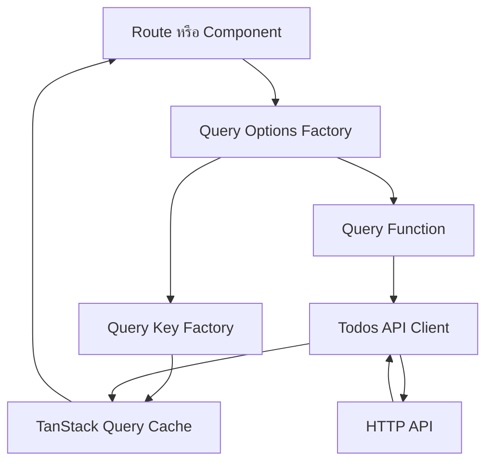
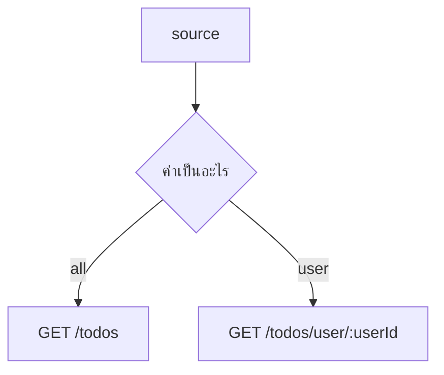
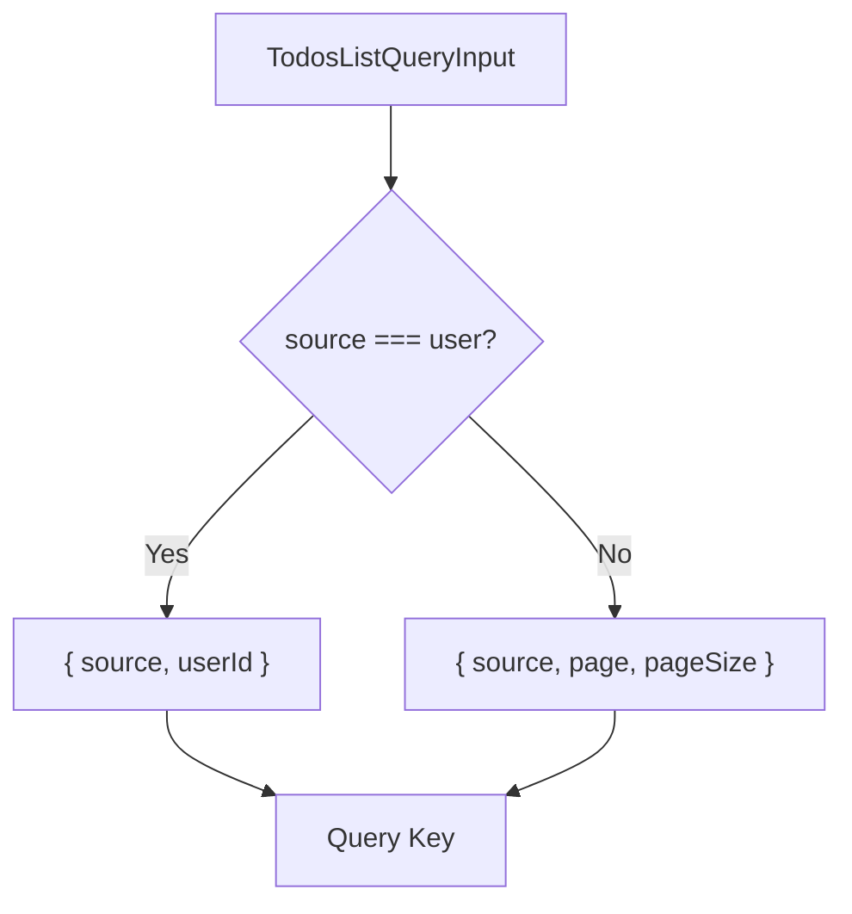
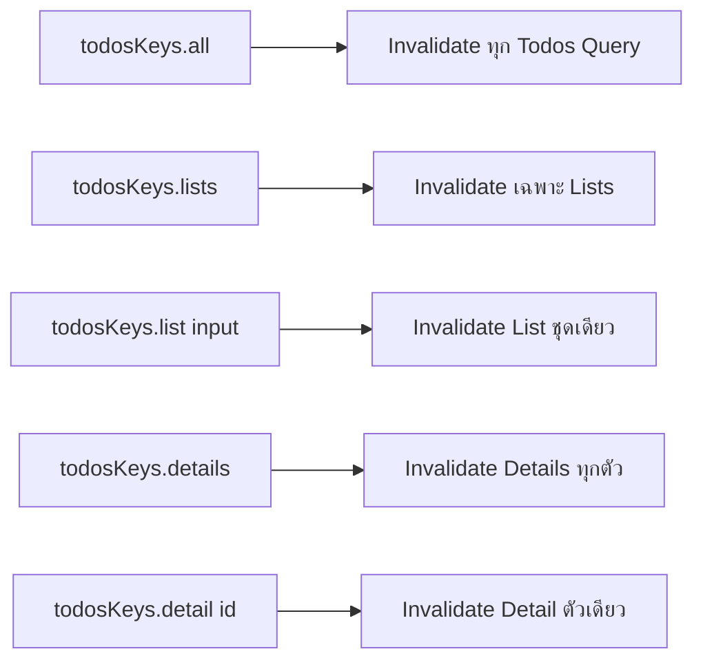
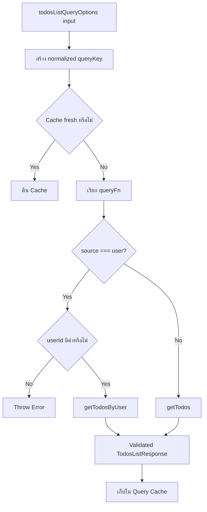
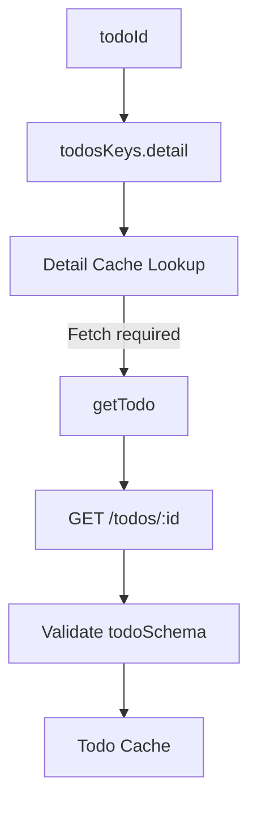

# คำอธิบายเพิ่มเติมเกี่ยวกับ Query Key และ Query Options

ไฟล์เป้าหมายจาก Tutorial: `src/features/todos/api/queries.ts`

> หมายเหตุ: ไฟล์ `src/features/todos/api/queries.ts` เป็นไฟล์ที่ Tutorial ให้ผู้อ่านสร้างขึ้น เนื้อหาในเอกสารนี้จึงอธิบายจาก Implementation ในหัวข้อ 6 ของ `docs/GETTING_STARTED.th.md`

## ภาพรวม

ไฟล์ `queries.ts` ทำหน้าที่นิยาม Read Model ของโมดูล Todos สำหรับ TanStack Query โดยรวมสองเรื่องที่ต้องสอดคล้องกันไว้ในจุดเดียว

1. Query Key — ระบุตัวตนของข้อมูลใน Query Cache
2. Query Options — ระบุวิธีดึงข้อมูลและนโยบายของ Query นั้น

Query Key ไม่ใช่เพียงชื่อสำหรับ Cache แต่เป็น Identity ของ Server State หากสอง Request คืนข้อมูลคนละชุด ต้องใช้คนละ Key และหากสอง Request หมายถึง Resource เดียวกัน ต้องไม่สร้าง Key แยกโดยไม่มีเหตุผล



Read Flow ของโมดูลเป็นดังนี้

```text
URL State
  → TodosListQueryInput
  → todosListQueryOptions
  → todosKeys.list
  → Query Cache Lookup
  → queryFn เมื่อ Cache ต้อง Fetch
  → API Client
  → Validated Domain Data
  → Query Cache
  → UI
```

การประกาศ Query Options เป็น Factory ทำให้ Route Loader และ React Component ใช้ Configuration ชุดเดียวกันได้

```ts
const options = todosListQueryOptions(input);

queryClient.ensureQueryData(options);
useSuspenseQuery(options);
```

ผลคือ Loader และ Component อ้างถึง Query Key, Query Function และ `staleTime` ชุดเดียวกัน ลดโอกาสเกิด Fetching Logic ซ้ำหรือ Cache Key ไม่ตรงกัน

---

## `TodosListSource`

```ts
export type TodosListSource = "all" | "user";
```

เป็น Union Type ที่ระบุแหล่งข้อมูลของหน้า Todos List

ค่าที่รองรับ:

- `"all"` — อ่านรายการรวมผ่าน `GET /todos` และใช้ Pagination
- `"user"` — อ่านรายการของ User ผ่าน `GET /todos/user/:userId`

แก่นสำคัญคือ `source` ไม่ได้เป็นเพียง UI Filter แต่เปลี่ยน HTTP Resource ที่ระบบต้องเรียกจริง



ข้อดีของ Union Type:

- ป้องกันค่าที่ไม่รู้จัก เช่น `"mine"` หรือ `"filtered"`
- ทำให้ TypeScript ช่วยตรวจ Branching Logic
- ทำให้ Query Key และ Query Function อ้างอิงชุดค่าที่แน่นอน
- รองรับ Exhaustive Checking เมื่อ Source เพิ่มในอนาคต

Edge Cases:

- หากเพิ่ม Source ใหม่แต่ไม่ได้แก้ Query Function ระบบอาจเลือก Endpoint ผิด
- หาก URL Validation ยอมรับค่ามากกว่า Type นี้ จะเกิดความไม่สอดคล้องระหว่าง Route กับ Query Layer
- TypeScript Type ไม่ตรวจข้อมูลตอน Runtime ดังนั้น URL Search Parameter ต้อง Validate ด้วย Schema ที่ Route Boundary

---

## `TodosListQueryInput`

```ts
export interface TodosListQueryInput {
  page: number;
  pageSize: number;
  source: TodosListSource;
  userId: number | null;
}
```

เป็น Input Contract สำหรับสร้างทั้ง Query Key และ Query Function ของหน้ารายการ Todos

Input:

- `page` — เลขหน้าที่ต้องการอ่าน เริ่มต้นควรเป็น `1`
- `pageSize` — จำนวนรายการต่อหน้า
- `source` — เลือกระหว่างรายการทั้งหมดกับรายการตาม User
- `userId` — ID ของ User เมื่อ `source === "user"`; ใช้ `null` เมื่อยังไม่มีค่า

Output:

- Interface ไม่มี Runtime Output โดยตรง แต่ถูกส่งเข้า `normalizeTodosListInput` และ `todosListQueryOptions`

ความหมายของแต่ละ Combination:

| source | page/pageSize | userId | Resource |
| --- | --- | --- | --- |
| `all` | ใช้งาน | ไม่ใช้งาน | `/todos?limit=...&skip=...` |
| `user` | ไม่ใช้งานใน API ปัจจุบัน | ต้องมีค่า | `/todos/user/:userId` |

จุดสำคัญคือ Interface นี้เป็น Superset ของ Input ที่ทุก Source อาจต้องใช้ แต่แต่ละ Branch ใช้ Field ไม่เหมือนกัน จึงต้อง Normalize ก่อนสร้าง Query Key

ข้อสังเกตด้าน Type Design:

รูปแบบปัจจุบันใช้งานง่ายกับ Route Search State แต่อนุญาต State ที่ไม่สมเหตุสมผลในระดับ Type เช่น

```ts
{
  source: "user",
  userId: null,
  page: 1,
  pageSize: 10,
}
```

จึงมี Runtime Guard ใน Query Function

Production Alternative คือใช้ Discriminated Union:

```ts
export type TodosListQueryInput =
  | {
      source: "all";
      page: number;
      pageSize: number;
    }
  | {
      source: "user";
      userId: number;
    };
```

ข้อดีคือ Invalid State ถูกป้องกันตั้งแต่ Compile Time แต่ Route อาจต้อง Normalize Search State ก่อนส่งเข้า Query Layer

Edge Cases:

- `page <= 0` ทำให้การคำนวณ `skip` ติดลบ
- `pageSize < 0` หรือใหญ่เกินข้อจำกัด API
- `source: "user"` แต่ `userId === null`
- `userId <= 0`
- Number เป็น `NaN`, `Infinity` หรือค่าทศนิยม

ไฟล์นี้สมมติว่า Route Boundary ได้ Validate Input แล้ว Query Layer จึงไม่ Parse ทุก Field ซ้ำ แต่ Guard เฉพาะ Invariant สำคัญที่ `userId` ต้องมีเมื่อใช้ User Scope

---

## `normalizeTodosListInput`

```ts
function normalizeTodosListInput(input: TodosListQueryInput) {
  if (input.source === "user") {
    return {
      source: input.source,
      userId: input.userId,
    } as const;
  }

  return {
    source: input.source,
    page: input.page,
    pageSize: input.pageSize,
  } as const;
}
```

หน้าที่ของฟังก์ชันคือแปลง Input ให้เหลือเฉพาะ Field ที่มีผลต่อ Identity ของ HTTP Resource ก่อนนำไปสร้าง Query Key

Input: `TodosListQueryInput`

Output เมื่อ `source === "user"`:

```ts
{
  source: "user";
  userId: number | null;
}
```

Output เมื่อ `source === "all"`:

```ts
{
  source: "all";
  page: number;
  pageSize: number;
}
```

Logic Breakdown:

1. ตรวจค่า `input.source`
2. หากเป็น `user` ให้เก็บเฉพาะ `source` และ `userId`
3. ตัด `page` และ `pageSize` ออก เพราะ Endpoint `/todos/user/:userId` ใน Tutorial ไม่ใช้สองค่านี้
4. หากเป็น `all` ให้เก็บ `source`, `page` และ `pageSize`
5. ส่ง Object ที่ Normalize แล้วให้ Query Key Factory



เหตุผลที่ต้อง Normalize: สมมติ User Scope ไม่ใช้ Pagination แต่ Input จาก URL เปลี่ยน `page`

```ts
{
  source: "user",
  userId: 5,
  page: 1,
  pageSize: 10,
}
```

และ

```ts
{
  source: "user",
  userId: 5,
  page: 2,
  pageSize: 10,
}
```

ทั้งสอง Input เรียก Resource เดียวกัน:

```text
GET /todos/user/5
```

หากเก็บ Input ทั้งก้อนใน Query Key จะเกิด Cache สอง Entry สำหรับข้อมูลเดียวกัน

```text
ไม่ Normalize
['todos', 'list', { source: 'user', userId: 5, page: 1, pageSize: 10 }]
['todos', 'list', { source: 'user', userId: 5, page: 2, pageSize: 10 }]
```

หลัง Normalize เหลือ Key เดียว

```text
['todos', 'list', { source: 'user', userId: 5 }]
```

ผลเชิง Production:

- ลด Cache Duplication
- ลด Network Request ที่ไม่จำเป็น
- ลด Memory Consumption
- ลดโอกาสที่ UI สองจุดเห็นข้อมูลคนละ Version
- ทำให้ Invalidation และ Cache Update เจาะจง Resource จริง

`as const` ทำให้ Literal Type และ Readonly Tuple/Object ถูกเก็บไว้ ไม่ถูกขยายจาก `"user"` เป็น `string`

Edge Cases:

- ฟังก์ชันยังยอมให้ `{ source: "user", userId: null }` กลายเป็น Query Key ได้ แม้ Query Function จะ Throw ภายหลัง
- หาก Backend เพิ่ม Pagination ให้ User Scope ในอนาคต ต้องเพิ่ม `page` และ `pageSize` กลับเข้า Key มิฉะนั้นหลายหน้าจะชน Cache เดียวกัน
- หาก Query Function ใช้ Field ใหม่ เช่น `sort` หรือ `status` แต่ Normalize ไม่ใส่ Field นั้น จะเกิด Cache Collision
- หากใส่ Field ที่ Query Function ไม่ใช้ จะเกิด Cache Fragmentation

> กฎสำคัญคือ: Query Key ต้องมีทุก Input ที่เปลี่ยนผลลัพธ์ของ `queryFn` และไม่ควรมี Input ที่ไม่เปลี่ยนผลลัพธ์ของ `queryFn`
```

---

## `todosKeys`

```ts
export const todosKeys = {
  all: ["todos"] as const,
  lists: () => [...todosKeys.all, "list"] as const,
  list: (input: TodosListQueryInput) =>
    [...todosKeys.lists(), normalizeTodosListInput(input)] as const,
  details: () => [...todosKeys.all, "detail"] as const,
  detail: (todoId: number) => [...todosKeys.details(), todoId] as const,
};
```

เป็น Query Key Factory ที่สร้าง Key แบบลำดับชั้นสำหรับทุก Read Query ของ Feature Todos

โครงสร้าง Key:

```text
['todos']
├── ['todos', 'list']
│   └── ['todos', 'list', normalizedInput]
└── ['todos', 'detail']
    └── ['todos', 'detail', todoId]
```

### `all`

```ts
all: ["todos"] as const
```

Root Key ของ Feature ใช้เป็น Prefix สำหรับจัดกลุ่ม Query ทั้งหมดของ Todos

ตัวอย่างการใช้งาน:

```ts
queryClient.invalidateQueries({ queryKey: todosKeys.all });
```

จะ Match ทั้ง List และ Detail ของ Todos เนื่องจาก TanStack Query รองรับ Prefix Matching

### `lists`

```ts
lists: () => [...todosKeys.all, "list"] as const
```

สร้าง Prefix สำหรับ Query ประเภทรายการทั้งหมด

```ts
["todos", "list"]
```

เหมาะสำหรับ:

- Invalidate ทุก List แต่ไม่แตะ Detail
- อ่าน Cache ของทุก List ด้วย `getQueriesData`
- Update หลาย List หลัง Mutation

### `list`

```ts
list: (input) => [
  ...todosKeys.lists(),
  normalizeTodosListInput(input),
] as const
```

สร้าง Key ของ List Resource หนึ่งชุดโดยเฉพาะ

ตัวอย่าง:

```ts
todosKeys.list({
  source: "all",
  page: 2,
  pageSize: 20,
  userId: null,
});
```

ได้ผลลัพธ์เชิงแนวคิด:

```ts
["todos", "list", { source: "all", page: 2, pageSize: 20 }]
```

### `details`

```ts
details: () => [...todosKeys.all, "detail"] as const
```

สร้าง Prefix สำหรับ Todo Detail ทุกตัว

```ts
["todos", "detail"]
```

### `detail`

```ts
detail: (todoId) => [...todosKeys.details(), todoId] as const
```

สร้าง Key สำหรับ Todo หนึ่งรายการ

```ts
["todos", "detail", 42]
```

Query Key Hierarchy ช่วยให้ Cache Operation เลือกระดับได้



เหตุผลที่ใช้ Factory แทนเขียน Array ตรงจุดใช้งาน:

- ลด Typo เช่น `"todo"` กับ `"todos"`
- ป้องกันลำดับ Segment ไม่ตรงกัน
- รวม Normalization Rule ไว้จุดเดียว
- ทำให้ Query, Mutation และ Test ใช้ Key Contract เดียวกัน
- Refactor Namespace ได้ง่ายขึ้น
- Type Inference ดีขึ้นเมื่อใช้ `as const`

Edge Cases:

- `todoId` ไม่ผ่าน Validation เช่น `0`, ติดลบ, `NaN`
- เปลี่ยนโครงสร้าง Key โดยไม่ Migration Cache ที่ Persist ไว้
- ใช้คำว่า `"lists"` บางจุดและ `"list"` บางจุดจน Invalidation ไม่ Match
- สร้าง Key Object ที่มี Field `undefined` แบบไม่สม่ำเสมอ
- Query Function เปลี่ยน Input แต่ Key Factory ไม่เปลี่ยนตาม

---

## `todosListQueryOptions`

```ts
export function todosListQueryOptions(input: TodosListQueryInput) {
  return queryOptions({
    queryKey: todosKeys.list(input),
    queryFn: ({ signal }) => {
      if (input.source === "user") {
        if (input.userId === null) {
          throw new Error("User Scope ต้องมี userId");
        }

        return getTodosByUser({ userId: input.userId, signal });
      }

      return getTodos({
        page: input.page,
        pageSize: input.pageSize,
        signal,
      });
    },
    staleTime: 60_000,
  });
}
```

เป็น Query Options Factory สำหรับ Todo List ทุก Source

Input:

```ts
TodosListQueryInput
```

Output:

Object ที่ผ่าน `queryOptions(...)` และประกอบด้วย:

- `queryKey`
- `queryFn`
- `staleTime`
- Type Relationship ระหว่าง Key, Function และ Result

Logic Breakdown:

1. รับ Input จาก Route หรือ Component
2. สร้าง Query Key ผ่าน `todosKeys.list(input)`
3. TanStack Query เรียก `queryFn` เมื่อ Cache ไม่มีข้อมูลหรือข้อมูลต้อง Refetch
4. รับ `signal` จาก Query Context
5. ตรวจ `input.source`
6. ถ้าเป็น `user` ให้ตรวจว่า `userId` ไม่เป็น `null`
7. เรียก `getTodosByUser({ userId, signal })`
8. ถ้าเป็น `all` ให้เรียก `getTodos({ page, pageSize, signal })`
9. กำหนดข้อมูลให้ Fresh เป็นเวลา 60 วินาที



### `queryKey`

```ts
queryKey: todosKeys.list(input)
```

ผูกข้อมูลที่ Fetch ได้เข้ากับ Resource Identity ที่ Normalize แล้ว

### `queryFn`

```ts
queryFn: ({ signal }) => { ... }
```

Query Function รับ `AbortSignal` จาก TanStack Query และส่งต่อถึง API Client

ประโยชน์:

- ยกเลิก Request เมื่อ Query ไม่ต้องการผลลัพธ์แล้ว
- ลด Race Condition เมื่อ URL เปลี่ยนเร็ว
- ลด Network และ Parsing Work ที่ไม่จำเป็น
- ทำให้ Route Navigation และ Query Lifecycle เชื่อมกัน

### Runtime Invariant Guard

```ts
if (input.userId === null) {
  throw new Error("User Scope ต้องมี userId");
}
```

Guard นี้ป้องกันไม่ให้ Client เรียก Endpoint เช่น

```text
/todos/user/null
```

อย่างไรก็ตาม Error แบบ Generic อาจไม่เพียงพอใน Production ควรพิจารณาใช้ Domain/Application Error ที่มี `code` เช่น `INVALID_QUERY_INPUT`

### `staleTime`

```ts
staleTime: 60_000
```

หมายถึงข้อมูลจะถือว่า Fresh เป็นเวลา 60,000 มิลลิวินาที หรือ 1 นาทีหลัง Fetch สำเร็จ

ระหว่างช่วง Fresh:

- Component ใหม่ที่ใช้ Key เดียวกันอ่าน Cache ได้ทันที
- TanStack Query ไม่ Refetch เพียงเพราะ Component Mount ใหม่
- Loader และ Component สามารถ Share Cache Entry เดียวกัน

เมื่อครบ 60 วินาที ข้อมูลจะกลายเป็น Stale แต่ไม่ได้ถูกลบทันที การ Refetch จะขึ้นกับ Trigger และ QueryClient Policy เช่น Mount, Focus, Reconnect หรือ Manual Invalidation

Performance Analysis:

- ลด Request ซ้ำระหว่าง Navigation
- ลด Loading State ที่ไม่จำเป็น
- ช่วยให้ Prefetch มีประโยชน์จริง
- ค่า 60 วินาทีเหมาะกับข้อมูลตัวอย่าง แต่ Production ต้องกำหนดตาม Freshness Requirement

Edge Cases:

- `userId === null` ทำให้ Query เข้าสู่ Error State
- Input ไม่ Valid แต่ถูกใช้สร้าง Cache Key ก่อน Query Function Throw
- Source เปลี่ยนเร็วและ API Client ไม่รองรับ Signal จะเกิด Request แข่งกัน
- `page` หรือ `pageSize` ผิด ทำให้ Fetch Resource ผิด
- User Scope API ในอนาคตรองรับ Pagination แต่ Query Function ยังไม่ส่งค่า
- ใช้ Options Factory คนละชุดใน Loader กับ Component ทำให้ Prefetch ไม่ตรง Cache

Production Alternative สำหรับ Missing `userId`:

- ป้องกันตั้งแต่ Route Validation
- ใช้ Discriminated Union
- ใช้ `enabled` หรือ `skipToken` เมื่อ Query ยังไม่พร้อม
- Redirect ไป URL ที่ Valid ก่อนสร้าง Query

ในกรณี Route Loader ซึ่งต้องการข้อมูลแน่นอน การ Fail Fast ด้วย Guard มักเหมาะกว่าการปิด Query เงียบ ๆ

---

## `todoDetailQueryOptions`

```ts
export function todoDetailQueryOptions(todoId: number) {
  return queryOptions({
    queryKey: todosKeys.detail(todoId),
    queryFn: ({ signal }) => getTodo({ todoId, signal }),
    staleTime: 60_000,
  });
}
```

เป็น Query Options Factory สำหรับอ่าน Todo หนึ่งรายการ

- Input: `todoId: number` — ID ของ Todo ที่ต้องการอ่าน
- Output: Query Options ที่เมื่อ Execute แล้วคืน `Promise<Todo>` ผ่าน `getTodo`

Logic Breakdown:

1. รับ `todoId`
2. สร้าง Query Key `['todos', 'detail', todoId]`
3. เมื่อ Query ต้อง Fetch ให้เรียก `getTodo({ todoId, signal })`
4. ส่ง `AbortSignal` ต่อไปยัง API Client
5. เก็บ Todo ที่ Validate แล้วใน Detail Cache
6. ถือข้อมูลว่า Fresh 60 วินาที



ตัวอย่าง Cache Identity:

```text
Todo 1  → ['todos', 'detail', 1]
Todo 2  → ['todos', 'detail', 2]
```

แต่ละ Entity จึงมี Cache Entry แยกกัน และสามารถ Update หรือ Invalidate รายตัวหลัง Mutation ได้

Edge Cases:

- `todoId` เป็น `0`, ติดลบ, ทศนิยม, `NaN` หรือ `Infinity`
- API ตอบ `404` เมื่อ Entity ไม่มีอยู่
- Todo ถูกลบหลังจาก Cache ถูกสร้าง
- Detail Cache กับ List Cache มีข้อมูล Entity คนละ Version
- Route Param เป็น String แต่ถูก Cast เป็น Number โดยไม่ Runtime Validation
- Mutation Update Detail สำเร็จแต่ไม่ได้ Synchronize List Cache

Production Improvement:

- Validate Route Param ก่อนเรียก Factory
- แยก Not Found Error ออกจาก Transport Error
- กำหนด Cache Synchronization Policy ระหว่าง Detail และ Lists
- พิจารณา `initialData` จาก List Cacheเมื่อเหมาะสม แต่ต้องระวังข้อมูล List อาจเป็น Partial Entity
- กำหนด `staleTime` ตามความถี่ที่ Entity เปลี่ยนจริง

---

## แนวทางสำหรับ Production

### 1. Query Key ต้องสะท้อน Resource Identity จริง

หลักสำคัญที่สุดคือทุกค่าที่เปลี่ยนผลลัพธ์ของ Query Function ต้องอยู่ใน Query Key

ตัวอย่าง หากเพิ่ม Filter:

```ts
status: "all" | "completed" | "pending";
```

และ API ใช้ Filter นี้ Query Key ต้องรวม `status`

```ts
["todos", "list", { source: "all", page, pageSize, status }]
```

หากลืมใส่ จะเกิด Cache Collision: Request คนละชุดเขียนทับ Cache Entry เดียวกัน

ในทางกลับกัน Field ที่ไม่เปลี่ยน Request หรือผลลัพธ์ไม่ควรอยู่ใน Key เพราะจะสร้าง Cache Fragmentation

### 2. Normalize ที่ Boundary เดียว

Normalization Rule ควรอยู่ใน Query Key Factory ไม่ควรกระจายอยู่ตาม Component หรือ Mutation เพราะทุก Consumer ต้องสร้าง Key แบบเดียวกัน

ควรมี Unit Test เช่น:

```ts
expect(
  todosKeys.list({
    source: "user",
    userId: 5,
    page: 1,
    pageSize: 10,
  }),
).toEqual(["todos", "list", { source: "user", userId: 5 }]);
```

และยืนยันว่าเปลี่ยน `page` ใน User Scope แล้วยังได้ Key เดิม

### 3. ใช้ Query Options Factory เป็น Public Read API

Route และ Component ไม่ควรประกอบ `queryKey` กับ `queryFn` เอง

ไม่ควร:

```ts
useQuery({
  queryKey: ["todos", "detail", todoId],
  queryFn: () => getTodo({ todoId }),
});
```

ควร:

```ts
useQuery(todoDetailQueryOptions(todoId));
```

วิธีนี้ป้องกัน Configuration Drift ระหว่าง Loader, Component, Prefetch และ Test

### 4. กำหนด Freshness ตาม Business Requirement

`staleTime: 60_000` ไม่ใช่ค่าที่เหมาะกับทุกระบบ

ควรพิจารณา:

- ข้อมูลเปลี่ยนบ่อยเพียงใด
- ผู้ใช้ยอมรับข้อมูลเก่าได้นานเท่าใด
- มี Mutation จาก Client นี้เพียงรายเดียวหรือหลาย Client
- API มี Cost และ Rate Limit เท่าใด
- ระบบมี Realtime หรือ Push Invalidation หรือไม่

ตัวอย่าง:

- Static Reference Data อาจใช้หลายชั่วโมง
- Inventory หรือ Queue อาจใช้ไม่กี่วินาที
- Data ที่ต้องแม่นยำสูงอาจใช้ `staleTime: 0` และ Refetch Policy เฉพาะ

### 5. แยก Error Taxonomy

Error ที่อาจเกิดใน Query Layer ได้แก่:

- Invalid Query Input
- Request Cancelled
- Network Error
- Timeout
- Unauthorized/Forbidden
- Not Found
- Rate Limited
- API Contract Error
- Server Error

UI และ Observability ควรแยก Error เหล่านี้ได้ ไม่ควรแสดงข้อความเดียวกันทั้งหมด

### 6. Cancellation ต้องครบทั้งสาย

```text
TanStack Query signal
  → queryFn
  → API Client
  → Axios
  → Browser Fetch/XHR Layer
```

หากชั้นใดละเลย Signal การเปลี่ยน Route หรือ Query Key จะไม่หยุดงานเดิมอย่างแท้จริง

### 7. Retry Policy ต้องสอดคล้องกับ Error

ไม่ควร Retry ทุก Error แบบเดียวกัน

- Network Error หรือ 5xx อาจ Retry ได้
- 401, 403, 404 และ Contract Error มักไม่ควร Retry อัตโนมัติหลายครั้ง
- Rate Limit ควรเคารพ Retry-After
- Cancelled Request ไม่ควรถูกมองเป็น Failure ที่ต้อง Retry

Retry อาจกำหนดระดับ QueryClient หรือ Override ใน Options Factory ตาม Use Case

### 8. Cache Consistency ระหว่าง List และ Detail

List และ Detail ใช้ Cache Entry แยกกัน

```text
['todos', 'list', ...]
['todos', 'detail', todoId]
```

เมื่อ Update Todo สำเร็จ ต้องกำหนด Policy ว่าจะ:

- Set Detail Cache โดยตรง
- Patch Entity ใน List Cache ที่เกี่ยวข้อง
- Invalidate Lists ให้ Refetch
- ใช้หลายวิธีร่วมกัน

Policy ต้องยึด Consistency Model ของ Backend ไม่ควรอัปเดต Cache แบบคาดเดาโดยไม่มีข้อมูลจาก Server

### 9. Security

Query Key อยู่ใน Memory ของ Browser และอาจปรากฏใน Devtools หรือ Persisted Cache

ห้ามใส่ข้อมูลลับ เช่น:

- Access Token
- Session Secret
- Password
- Personal Data ที่ไม่จำเป็น
- Authorization Header

Query Key ควรประกอบด้วย Resource Identifier และ Query Parameters ที่ปลอดภัยเท่านั้น

ข้อมูลจาก Query Cache ต้องถือว่าเป็น Client-side Data ไม่ใช่พื้นที่ลับหรือ Security Boundary

### 10. Scalability และ Maintainability

เมื่อ Feature ขยาย ควรรักษา Namespace ให้ชัดเจน เช่น:

```ts
const todosKeys = {
  all: ["todos"] as const,
  lists: () => [...todosKeys.all, "list"] as const,
  list: (filters) => [...todosKeys.lists(), filters] as const,
  details: () => [...todosKeys.all, "detail"] as const,
  detail: (id) => [...todosKeys.details(), id] as const,
  comments: (id) => [...todosKeys.detail(id), "comments"] as const,
};
```

แต่ไม่ควรทำ Factory ให้ซับซ้อนจนซ่อน Resource Model ควรรักษา Key ให้อ่านแล้วเข้าใจได้จาก Devtools

### 11. Testing Strategy

ควรทดสอบอย่างน้อย:

1. Query Key Shape
2. Normalization Behavior
3. Source Routing ว่า `all` เรียก `getTodos`
4. Source Routing ว่า `user` เรียก `getTodosByUser`
5. Missing `userId` ทำให้ Fail
6. Signal ถูกส่งต่อ API Client
7. Detail ID อยู่ใน Query Key
8. Loader และ Component ใช้ Cache Entry เดียวกัน
9. Stale Policy ทำงานตามที่คาด
10. Error จาก API Client ถูกส่งต่อ Query State อย่างถูกต้อง

### 12. Observability

Log และ Trace ควรระบุข้อมูลที่ช่วยวิเคราะห์โดยไม่รั่วข้อมูลลับ เช่น:

- Feature: `todos`
- Query Type: `list` หรือ `detail`
- Source: `all` หรือ `user`
- Resource ID
- Request Duration
- Cache Hit/Miss เมื่อระบบรองรับ Instrumentation
- Error Code

ไม่ควร Serialize Query Cache ทั้งก้อนลง Production Log

---

## สรุปสาระสำคัญ

`queries.ts` เป็น Read Contract ระหว่าง Route, TanStack Query Cache และ Todos API Client

แก่นของ Implementation นี้มีดังนี้:

1. `TodosListSource` จำกัด Source ที่ระบบรองรับ
2. `TodosListQueryInput` รวม State ที่จำเป็นสำหรับเลือก Resource
3. `normalizeTodosListInput` ตัด Field ที่ไม่ส่งผลต่อ Resource ออกจาก Cache Identity
4. `todosKeys` สร้าง Query Key แบบลำดับชั้นและใช้ซ้ำได้ทั้ง Feature
5. `todosListQueryOptions` เลือก API Endpoint ตาม Source และส่ง Cancellation Signal ต่อ
6. `todoDetailQueryOptions` แยก Cache ของแต่ละ Todo ตาม ID
7. `staleTime` ลด Request ซ้ำ แต่ต้องกำหนดตาม Business Freshness Requirement
8. Query Key ต้องตรงกับ Input ของ Query Function เสมอ เพื่อป้องกันทั้ง Cache Collision และ Cache Fragmentation
9. Route Loader และ Component ควรใช้ Query Options Factory ชุดเดียวกัน
10. Runtime Validation, Error Taxonomy, Retry และ Cache Consistency ต้องได้รับการออกแบบเพิ่มเมื่อเชื่อม Production API จริง

แนวคิดที่ต้องจำคือ:
- Query Key = Identity ของ Server State
- Query Function = วิธีสร้าง Server State ชุดนั้น
- Query Options = Contract ที่ผูกทั้งสองอย่างเข้าด้วยกัน
