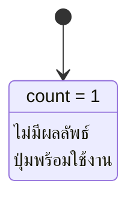
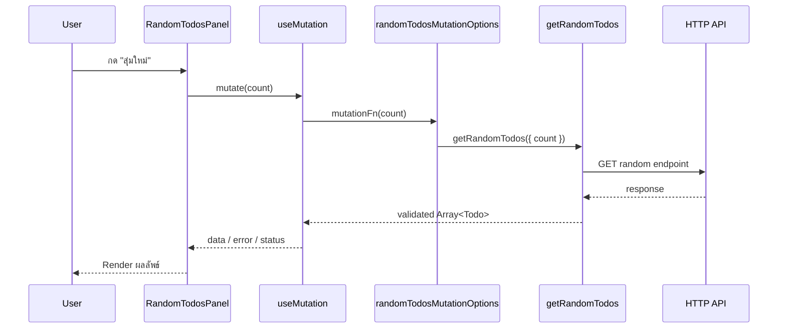
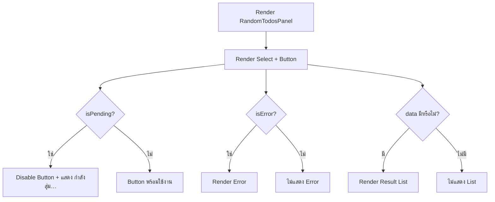
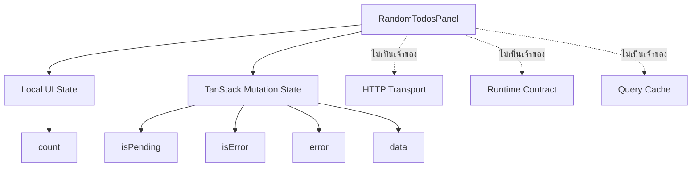
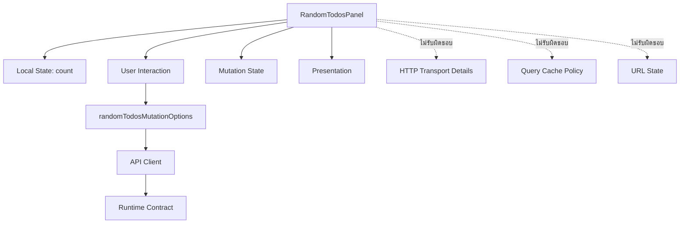

# คำอธิบายเพิ่มเติมเกี่ยวกับ RandomTodosPanel

ไฟล์: `src/features/todos/components/random-todos-panel.tsx`

## ภาพรวม

`RandomTodosPanel` เป็น Interactive Feature Component สำหรับให้ผู้ใช้เลือกจำนวน Todo ที่ต้องการสุ่มตั้งแต่ 1–10 รายการ แล้วสั่งให้ระบบเรียก Random Todos API เมื่อกดปุ่ม `สุ่มใหม่`

Component นี้มีประเด็นทางสถาปัตยกรรมที่สำคัญกว่าหน้าตาของ UI คือ แม้ Backend Endpoint จะใช้ HTTP `GET` แต่ Interaction นี้ถูกมองเป็น **Command** ไม่ใช่ Query State ปกติ เพราะผู้ใช้คาดหวังผลลัพธ์ใหม่ทุกครั้งที่กดปุ่ม

```text
ผู้ใช้เลือกจำนวน
  → เก็บ count ใน Local State
  → ผู้ใช้กด "สุ่มใหม่"
  → mutation.mutate(count)
  → randomTodosMutationOptions
  → getRandomTodos
  → HTTP API
  → Runtime Validation
  → Mutation Result
  → Render รายการสุ่ม
```

ดังนั้น Tutorial จึงใช้ `useMutation` แทน `useQuery`

```text
Random Command
  ≠ Resource ที่ต้อง Cache และ Background Refetch
```

จุดสำคัญคือ **การเลือก Query หรือ Mutation ไม่ควรตัดสินจาก HTTP Method เพียงอย่างเดียว** แต่ควรดู Semantics ของ State และ User Interaction ด้วย

กรณีนี้ผู้ใช้ต้องการ

- ให้ Request เกิดเมื่อกดปุ่มเท่านั้น
- ให้กดใหม่แล้วได้ผลลัพธ์ใหม่
- ไม่ต้องการ Cache Identity แบบ Query Key
- ไม่ต้องการ Background Refetch
- ไม่ต้องการผลสุ่มถูก Share กับ Query Consumer อื่นโดยอัตโนมัติ

จึงเหมาะกับ Mutation มากกว่า Query

```mermaid
flowchart LR
    A[User เลือก count] --> B[Local State: count]
    B --> C[กดสุ่มใหม่]
    C --> D[mutation.mutate(count)]
    D --> E[randomTodosMutationOptions]
    E --> F[getRandomTodos]
    F --> G[HTTP API]
    G --> H[Validated Array Todo]
    H --> I[Mutation State]
    I --> J[Render UI]
```

---

## Component Contract

### Props

`RandomTodosPanel` ไม่มี Props

```ts
export function RandomTodosPanel() {
  // ...
}
```

หมายความว่า Component นี้เป็น Feature Widget ที่สามารถทำงานได้ด้วยตัวเองภายใต้ Provider ที่จำเป็น โดยไม่ต้องรับข้อมูลหรือ Callback จาก Parent

สิ่งที่ Component ต้องพึ่งจากภายนอกไม่ได้ส่งผ่าน Props แต่ได้มาจาก Infrastructure Context ได้แก่ TanStack Query `QueryClientProvider`

ในเชิง Contract จึงสามารถมองได้ว่า

```text
Explicit Input ผ่าน Props
  → ไม่มี

Implicit Runtime Dependency
  → QueryClientProvider
```

ข้อดีคือ Parent สามารถ Compose Panel เข้า Page ได้ง่าย

```tsx
<RandomTodosPanel />
```

แต่ต้องเข้าใจด้วยว่า Component นี้ไม่ใช่ Pure Presentation Component เพราะมันเป็นเจ้าของ Interaction และเรียก Mutation เอง

---

### Local State

Component มี Local State เพียงตัวเดียว

```ts
const [count, setCount] = useState(1);
```

`count` คือจำนวน Todo ที่ผู้ใช้ต้องการสุ่ม

ค่าเริ่มต้นคือ

```text
count = 1
```

เหตุผลที่ `count` เหมาะกับ Local State:

- เป็น UI Preference ชั่วคราวของ Panel
- ไม่จำเป็นต้อง Share ข้าม Page
- ไม่จำเป็นต้อง Bookmark
- Refresh แล้วกลับเป็นค่าเริ่มต้นได้โดยไม่เสีย Business State
- ไม่ใช่ Server State
- ไม่จำเป็นต้องอยู่ใน Query Cache

จึงไม่ควรย้าย State นี้ไป Global Store หรือ TanStack Query โดยไม่มี Requirement เพิ่มเติม

```text
Local UI State
  → useState

Shareable / Bookmarkable State
  → URL

Server State
  → TanStack Query
```

นอกจาก `count` แล้ว Component ยังมี State อีกชุดหนึ่งที่ไม่ได้จัดการด้วย `useState` คือ Mutation State

```ts
const mutation = useMutation(randomTodosMutationOptions());
```

TanStack Query เป็นผู้จัดการสถานะ เช่น

- `mutation.isPending`
- `mutation.isError`
- `mutation.error`
- `mutation.data`

ดังนั้น Component ไม่จำเป็นต้องสร้าง State ซ้ำอย่าง

```ts
const [loading, setLoading] = useState(false);
const [error, setError] = useState(null);
const [data, setData] = useState([]);
```

การสร้าง State ซ้ำแบบนั้นจะทำให้มี State Owner มากกว่าหนึ่งจุดและเพิ่มโอกาสที่สถานะไม่ตรงกัน

---

### External Dependencies

Component ใช้ Dependencies หลักสามกลุ่ม

#### React

```ts
import { useState } from "react";
```

รับผิดชอบ Local UI State คือ `count`

#### TanStack Query

```ts
import { useMutation } from "@tanstack/react-query";
```

ใช้จัดการ Command Lifecycle ตั้งแต่ Idle → Pending → Success/Error

#### Feature Mutation Contract

```ts
import { randomTodosMutationOptions } from "../api/mutations";
```

Component ไม่เรียก `getRandomTodos()` หรือ Axios โดยตรง แต่ใช้ Mutation Options ที่ Feature API Layer เตรียมไว้

Dependency Flow จึงเป็น

```text
RandomTodosPanel
  → randomTodosMutationOptions
  → getRandomTodos
  → Shared HTTP Client
```

ไม่ใช่

```text
RandomTodosPanel
  → Axios
  → API
```

แนวทางนี้ทำให้ UI ไม่ต้องรู้ Endpoint, Runtime Validation หรือ Transport Configuration

#### Shared UI

```ts
import { Button } from "#/shared/ui/button";
import { Card, CardContent, CardHeader, CardTitle } from "#/shared/ui/card";
```

ทำให้ Feature ใช้ UI Primitive กลางโดยไม่สร้าง Button/Card Implementation ซ้ำ

---

## Logic Breakdown

### Initial State

เมื่อ Component Mount

```ts
const [count, setCount] = useState(1);
const mutation = useMutation(randomTodosMutationOptions());
```

สถานะเริ่มต้นเชิงแนวคิดคือ

```text
count = 1
mutation = idle
mutation.data = undefined
mutation.error = null
```

UI จะแสดง

- Select ที่เลือก `1`
- ปุ่ม `สุ่มใหม่`
- ยังไม่มี Error
- ยังไม่มีรายการผลลัพธ์



---

### User Interaction

ผู้ใช้มี Interaction หลักสองแบบ

1. เปลี่ยนจำนวน Todo
2. กดปุ่มสุ่มใหม่

#### เปลี่ยนจำนวน

```tsx
<select
  value={count}
  onChange={(event) => setCount(Number(event.target.value))}
>
```

ค่าจาก DOM `event.target.value` เป็น `string` เสมอ จึงต้องแปลงเป็น `number`

```ts
Number(event.target.value)
```

ตัวเลือกถูกสร้างจาก

```ts
Array.from({ length: 10 }, (_, index) => index + 1)
```

ผลคือ

```text
[1, 2, 3, 4, 5, 6, 7, 8, 9, 10]
```

ดังนั้น UI ปกติจะส่งค่าได้เฉพาะช่วง 1–10

#### กดสุ่มใหม่

```tsx
<Button
  disabled={mutation.isPending}
  onClick={() => mutation.mutate(count)}
>
```

เมื่อกด Component จะส่ง `count` ปัจจุบันเข้า Mutation

```text
count
  → mutation.mutate(count)
```

Component ไม่ต้องรู้ว่า count = 1 กับ count > 1 ใช้ Endpoint ต่างกัน เพราะรายละเอียดนั้นเป็นหน้าที่ของ API Client

---

### Event Handlers

Event Handler สำหรับ Select คือ

```ts
(event) => setCount(Number(event.target.value))
```

Input:

```text
ChangeEvent จาก select
```

Transformation:

```text
string
  → Number(...)
  → number
```

Output/Side Effect:

```text
setCount(newCount)
  → Component Re-render
```

Event Handler สำหรับ Button คือ

```ts
() => mutation.mutate(count)
```

Input:

```text
count ปัจจุบัน
```

Side Effect:

```text
เริ่ม Mutation
  → เรียก API
  → Mutation State เปลี่ยน
```

ไม่มีการเขียน HTTP Logic อยู่ใน Event Handler ซึ่งเป็น Boundary ที่ดี

```text
Event Handler
  → บอก Intent
  → Mutation Layer จัดการ Operation
```

---

### Query / Mutation Interaction

แกนของ Component คือ

```ts
const mutation = useMutation(randomTodosMutationOptions());
```

`randomTodosMutationOptions()` จาก API Mutation Layer กำหนดประมาณว่า

```ts
mutationOptions({
  mutationKey: todosMutationKeys.random(),
  mutationFn: (count: number) => getRandomTodos({ count }),
});
```

ดังนั้นเมื่อ Component เรียก

```ts
mutation.mutate(count)
```

Flow จะเป็น



#### ทำไมใช้ Mutation ทั้งที่เป็น GET

ตาม HTTP Semantics Endpoint นี้ยังเป็น Read Request แต่ใน UI มันมี Command Semantics

```text
ผู้ใช้กดปุ่ม
  → ขอผลลัพธ์ใหม่ ณ ตอนนี้
```

ถ้าใช้ Query ตามปกติ จะต้องออกแบบ Query Key, `enabled`, Refetch Behavior และ Cache Policy ทั้งที่ Requirement ไม่ต้องการ Cache Resource แบบนั้น

Mutation จึงสื่อ Intent ของ UI ได้ตรงกว่า

#### Mutation Cache ไม่เท่ากับ Query Cache

TanStack Query ยังคงมี Mutation State ภายใน Mutation Cache สำหรับติดตาม Lifecycle แต่ผล Random นี้ไม่ได้ถูกบันทึกเป็น Query Data ภายใต้ `todosKeys.*`

จึงไม่ควรตีความว่า “Mutation ไม่มี Cache เลย” แต่ควรเข้าใจว่า

```text
ไม่มี Reusable Query Cache Entry สำหรับ Random Result
```

ผลลัพธ์ถูกใช้ผ่าน Mutation Observer ของ Component เพื่อแสดง UI ปัจจุบัน

---

### Rendering Logic

Component ใช้ Conditional Rendering ตาม Mutation State

โครงสร้างหลักคือ

```text
Card
├── Header
│   └── Title
└── Content
    ├── Count Select
    ├── Action Button
    ├── Error Message (ถ้ามี)
    └── Result List (ถ้ามี)
```

Rendering Decision สามารถมองได้เป็น



การแยก Rendering จาก Network Implementation ทำให้ JSX อ่านได้จาก UI State โดยตรง

---

### Loading State

Loading State อ้างอิงจาก

```ts
mutation.isPending
```

นำไปใช้สองจุด

```tsx
disabled={mutation.isPending}
```

และ

```tsx
{mutation.isPending ? "กำลังสุ่ม…" : "สุ่มใหม่"}
```

ข้อดีคือ

1. ป้องกันผู้ใช้กดปุ่มเดิมซ้ำในระหว่าง Request เดียวกันจาก UI ปกติ
2. ให้ Feedback ว่าระบบกำลังทำงาน
3. ไม่ต้องสร้าง `loading` State เพิ่มเอง

Flow:

```text
Idle
  → Click
  → isPending = true
  → Disable Button
  → Request เสร็จ
  → isPending = false
```

อย่างไรก็ตาม `disabled` เป็นเพียง UX Protection ไม่ใช่ระบบป้องกัน Request ซ้ำระดับ Server เพราะ Caller อื่นหรือหลาย Component Instance ยังสามารถเรียก Operation พร้อมกันได้

---

### Error State

เมื่อ Mutation ล้มเหลว

```tsx
{mutation.isError ? (
  <p className="text-sm text-destructive">
    {mutation.error.message}
  </p>
) : null}
```

Component ใช้ TanStack Query Mutation State โดยตรง

```text
API / Validation / Transport Error
  → Mutation Error State
  → mutation.isError = true
  → mutation.error
  → Render Message
```

ข้อดีคือ UI ไม่ต้องจับ `try/catch` ใน Click Handler

อย่างไรก็ตามใน Production ควรพิจารณาว่า `error.message` เป็นข้อความที่ปลอดภัยสำหรับ End User หรือไม่ เพราะ Error จาก Infrastructure อาจมีรายละเอียดภายในที่ไม่ควรถูกเปิดเผย

แนวทางที่ดีกว่าคือ Error Layer Normalize Error ให้เป็น User-safe Message หรือให้ Presentation Layer map Error Code ไปเป็นข้อความที่เหมาะสม

---

### Success / Empty State

เมื่อ Mutation สำเร็จและมี `mutation.data`

```tsx
{mutation.data ? (
  <ul className="space-y-2">
    {mutation.data.map((todo) => (
      <li key={todo.id}>...</li>
    ))}
  </ul>
) : null}
```

ผลลัพธ์มี Type เป็น

```ts
Array<Todo>
```

แต่ละรายการแสดง

- Todo Text
- Todo ID
- User ID
- Completed Status

```text
Todo
├── todo.todo
├── todo.id
├── todo.userId
└── todo.completed
```

`key={todo.id}` ใช้ Domain Identity เป็น React Key ซึ่งเหมาะสมกว่าการใช้ Array Index

#### Empty State

ตาม API Contract ของ Tutorial `randomTodosSchema` กำหนด Array อย่างน้อย 1 รายการ และ `count` อยู่ระหว่าง 1–10 ดังนั้นเมื่อ Response ผ่าน Contract แล้ว Success Data ไม่ควรเป็น `[]`

จึงไม่มี Explicit Empty State ใน Component ปัจจุบัน

ถ้า Backend Contract ในอนาคตอนุญาต Empty Array ควรเพิ่ม UI สำหรับ

```text
Request สำเร็จ
แต่ไม่มีรายการ
```

แยกออกจาก

```text
ยังไม่เคย Request
```

เพื่อไม่ให้สอง State ดูเหมือนกัน

---

## Data Flow

```mermaid
flowchart LR
    A[User Interaction] --> B[Component State: count]
    B --> C[mutation.mutate]
    C --> D[randomTodosMutationOptions]
    D --> E[getRandomTodos]
    E --> F[HTTP API]
    F --> G[Zod Runtime Validation]
    G --> H[Mutation Result]
    H --> I[RandomTodosPanel]
    I --> J[Render UI]
```



สามารถแบ่ง State Ownership ได้ดังนี้



---

## Separation of Concerns

### Presentation

Component รับผิดชอบการแสดง

- Card
- Count Selector
- Action Button
- Loading Text
- Error Message
- Random Todo Result List

เป็นหน้าที่ของ UI Layer โดยตรง

---

### Interaction

Component เป็นเจ้าของ Interaction ของ Widget นี้ ได้แก่

```text
เลือก count
กดสุ่ม
แสดงสถานะของคำสั่ง
```

จึงสมเหตุสมผลที่ `useState` และ `useMutation` อยู่ใน Component นี้

---

### Server State

Component ไม่สร้าง Query Key และไม่เขียนผล Random ลง Query Cache

```text
Random Result
  → Mutation Result State
  → Render ใน Panel
```

ไม่ใช่

```text
Random Result
  → todosKeys.list(...)
  → Shared Query Cache
```

เหตุผลคือข้อมูลสุ่มไม่มี Stable Identity ในบริบทของ UI นี้ที่ต้อง Share/Refetch แบบ Query Resource

ถ้า Requirement ในอนาคตเปลี่ยนเป็น “ผลสุ่มชุดล่าสุดต้อง Share ข้ามหลาย Component หรือ Restore หลัง Navigation” ควรประเมิน State Ownership ใหม่แทนการยึด Mutation เดิมแบบตายตัว

---

### URL State

`count` ไม่ถูกเก็บใน URL เพราะ Tutorial มองว่าเป็น State ชั่วคราวของ Widget

```text
/todos
```

ไม่จำเป็นต้องเป็น

```text
/todos?randomCount=5
```

แต่ถ้า Product Requirement ระบุว่าผู้ใช้ต้อง Share หรือ Bookmark จำนวนที่เลือกได้ การย้าย `count` ไป URL จะสมเหตุสมผลกว่า Local State

หลักคือ

```text
State Ownership ต้องตาม User Experience Requirement
```

ไม่ใช่กำหนดจากชนิด Component เพียงอย่างเดียว

---

### Business Logic

Component ไม่เป็นเจ้าของ Business Rule สำคัญ เช่น

- count ต้องอยู่ในช่วง 1–10
- count = 1 ต้องใช้ Endpoint ใด
- count > 1 ต้องใช้ Endpoint ใด
- API Response ต้องมีรูปร่างแบบใด

Rule เหล่านี้อยู่ใน API Contract/API Client Layer

Component เพียงสร้าง UI ให้เลือกค่า 1–10 ซึ่งเป็น UX Constraint ชั้นแรก

```text
UI Constraint
  → ช่วยผู้ใช้เลือกค่าที่ถูกต้อง

Runtime Contract
  → ป้องกัน Invalid Input แม้ Caller จะข้าม UI
```

นี่เป็น Defense in Depth ที่ถูกต้องกว่าเชื่อ UI เพียงชั้นเดียว

---

## Production-Ready Analysis

### Performance Optimization

Component นี้มีภาระ Rendering ต่ำมาก เพราะ Random Count สูงสุดเพียง 10 รายการ

#### 1. ไม่จำเป็นต้องใช้ `useMemo` กับ Option List ในตอนนี้

```ts
Array.from({ length: 10 }, (_, index) => index + 1)
```

สร้าง Array เพียง 10 ค่าในแต่ละ Render ซึ่งมีต้นทุนต่ำมาก

การเพิ่ม

```ts
useMemo(...)
```

โดยไม่มี Measurement จะเพิ่ม Complexity มากกว่าประโยชน์

หากต้องการให้เป็นค่าคงที่เพื่อความหมายเชิง Domain สามารถย้ายออกนอก Component ได้ เช่น

```ts
const RANDOM_COUNTS = Array.from({ length: 10 }, (_, index) => index + 1);
```

แต่ควรทำเพื่อความชัดเจนหรือ Reuse มากกว่า Micro-optimization

#### 2. จำกัดจำนวน Result ตั้งแต่ Contract

การจำกัด 1–10 ช่วยควบคุมทั้ง

- Response Size
- DOM Nodes
- Rendering Cost
- Network Payload

#### 3. ไม่ต้อง Memoize Component โดยอัตโนมัติ

`RandomTodosPanel` ไม่มี Props และ Render Cost ต่ำ การใช้ `memo()` ไม่มีเหตุผลชัดเจนจนกว่าจะมี Profiling Data

#### 4. ป้องกัน Duplicate Click ระหว่าง Pending

```tsx
disabled={mutation.isPending}
```

ลด Duplicate Request จาก Interaction ปกติ ซึ่งช่วยทั้ง UX และ Network Cost

แต่ไม่ควรใช้เป็นกลไก Rate Limit หลัก

---

### Security First

#### 1. UI Option ไม่ใช่ Validation Boundary

แม้ `<select>` จะมีเฉพาะ 1–10 แต่ Runtime Code สามารถถูกเรียกจาก DevTools, Test หรือ Caller อื่นได้

ดังนั้น Backend/API Client ต้อง Validate ซ้ำ

Tutorial ทำผ่าน `randomTodoCountSchema`

```text
UI Select
  → First-line Constraint
  → API Client Schema
  → Runtime Boundary
```

#### 2. React ป้องกัน HTML Injection จาก Text Rendering โดยปริยาย

ค่า

```tsx
{todo.todo}
```

ถูก React Escape ก่อน Render เป็น Text จึงไม่ตีความเป็น HTML โดยตรง

อย่าเปลี่ยนไปใช้ `dangerouslySetInnerHTML` กับข้อมูล API โดยไม่มี Sanitization Requirement ที่ชัดเจน

#### 3. Error Message อาจเปิดเผยข้อมูลภายใน

ปัจจุบันแสดง

```tsx
mutation.error.message
```

ถ้า Transport/Error Layer ส่งข้อความเชิงเทคนิค เช่น Internal URL, Stack Detail หรือ Infrastructure Metadata อาจไม่เหมาะกับ End User

Production ควรมี Error Taxonomy และ User-safe Message

#### 4. Client-side Disable ไม่ใช่ Rate Limiting

ผู้ใช้หรือ Script ยังสามารถเรียก API โดยไม่ผ่าน UI ได้

ถ้า Random Endpoint มีต้นทุนสูง Backend ควรควบคุม

- Authentication
- Authorization ถ้าจำเป็น
- Rate Limiting
- Abuse Prevention
- Request Quota

โดย Server เป็น Security Authority

---

### Accessibility

โค้ดปัจจุบันมีพื้นฐานที่ดีหลายจุด

#### 1. Select มี Label ที่สัมพันธ์กัน

เพราะ `<select>` อยู่ภายใน `<label>`

```tsx
<label>
  <span>จำนวน</span>
  <select>...</select>
</label>
```

Screen Reader จึงสามารถเชื่อมชื่อ Control กับ Select ได้

#### 2. ใช้ Native Select และ Button

Native Controls ให้ Keyboard Interaction และ Accessibility Semantics มาโดยพื้นฐาน ซึ่งมักแข็งแรงกว่าการสร้าง Custom Control เองโดยไม่จำเป็น

#### 3. Loading Feedback

ข้อความปุ่มเปลี่ยนจาก

```text
สุ่มใหม่
```

เป็น

```text
กำลังสุ่ม…
```

ทำให้สถานะเห็นได้ด้วยข้อความ ไม่พึ่งสีหรือ Spinner เพียงอย่างเดียว

#### 4. Error Message ควรถูกประกาศให้ Assistive Technology

ปัจจุบัน Error เป็น `<p>` ปกติ

Production ควรพิจารณา

```tsx
<p role="alert">...</p>
```

สำหรับ Error สำคัญ หรือใช้ Live Region ที่เหมาะสม

#### 5. Success Result ควรพิจารณา Live Region

ถ้าผลลัพธ์เปลี่ยนหลัง Click โดย Focus ยังอยู่ที่ Button ผู้ใช้ Screen Reader อาจไม่ทราบว่ารายการด้านล่างอัปเดตแล้ว

อาจใช้ข้อความสถานะ เช่น

```text
สุ่มสำเร็จ 5 รายการ
```

ภายใต้ `aria-live="polite"`

#### 6. Focus ไม่ควรถูกย้ายโดยไม่จำเป็น

หลัง Success การคง Focus ที่ Button เป็นพฤติกรรมที่คาดเดาได้ เว้นแต่ Product UX ต้องการนำผู้ใช้ไปยังผลลัพธ์โดยเฉพาะ

---

### Scalability & Maintainability

#### 1. Component ใช้ Feature Mutation API ไม่เรียก Transport โดยตรง

ทำให้เปลี่ยน Axios, Endpoint หรือ Validation Implementation ได้โดยไม่ต้องแก้ JSX ส่วนใหญ่

#### 2. Mutation Options เป็น Reusable Contract

Component ไม่ต้องกำหนด `mutationKey` และ `mutationFn` ซ้ำ

```text
UI
  → Mutation Options
  → API Client
```

ช่วยลด Configuration Drift หากมี Consumer มากกว่าหนึ่งจุด

#### 3. UI Rule กับ Domain Rule แยกกัน

`Array.from(...1–10)` ทำหน้าที่ UX

`randomTodoCountSchema` ทำหน้าที่ Runtime Contract

การแยกนี้ทำให้ระบบยังปลอดภัยเมื่อมี Caller ใหม่ที่ไม่ผ่าน Component

#### 4. ถ้า Panel ซับซ้อนขึ้น ค่อยแยก Subcomponent

ปัจจุบัน Component ยังเล็ก จึงไม่มีเหตุผลต้องแยก `RandomTodosForm`, `RandomTodosResult`, `RandomTodosError` ล่วงหน้า

ควรแยกเมื่อเกิดเหตุผลจริง เช่น

- Rendering ซับซ้อนขึ้น
- Subtree ต้อง Reuse
- Test Boundary ชัดขึ้น
- Component มีหลาย Independent Responsibility

#### 5. Semantics อาจเปลี่ยนตาม Requirement

ถ้าในอนาคต Random Result ต้อง

- Share ข้าม Page
- Persist หลัง Navigation
- Refetch ตามเวลา
- Deep Link ได้

อาจต้องเปลี่ยนจาก Mutation Result ไป Query/URL/State Model อื่น

Architecture ควรตาม Requirement ไม่ใช่ยึด Pattern เดิมเพียงเพราะ Tutorial ใช้แบบนี้

---

### Testability

Component นี้เหมาะกับ Component Integration Test เพราะ Observable Behavior ชัดเจน

กรณีหลักที่ควรทดสอบ

#### Initial State

- Select ค่าเริ่มต้นเป็น `1`
- มี Option 1–10
- ปุ่มแสดง `สุ่มใหม่`
- ยังไม่มี Result List

#### Count Interaction

- เปลี่ยน Select เป็น `5`
- กดปุ่ม
- Mutation ได้ Input `5`

#### Pending State

- ปุ่มถูก Disable ระหว่าง Request
- ข้อความเป็น `กำลังสุ่ม…`
- ไม่ควรเกิด Duplicate Click จาก UI ปกติ

#### Success State

- Render Todo ที่ API ส่งกลับ
- แสดง ID, User ID และสถานะถูกต้อง
- จำนวนรายการตรงกับ Response

#### Error State

- เมื่อ API ล้มเหลว แสดง Error State
- UI กลับมาสามารถ Retry ได้หลัง Pending สิ้นสุด

#### Contract Failure

- Response ผิด Schema ต้องกลายเป็น Error State ไม่ใช่ข้อมูลผิดรูปเข้าสู่ UI

แนวทาง Test ที่เหมาะในระดับ Integration คือ

```text
RandomTodosPanel
  + QueryClientProvider
  + MSW
  → User Interaction จริง
  → HTTP Boundary จำลอง
  → Assert UI State
```

วิธีนี้ทดสอบ Integration ระหว่าง Component, Mutation และ API Boundary ได้ดีกว่าการ Mock Internal Hook ทุกตัวจน Implementation Detail ถูกผูกกับ Test

---

## Edge Cases

### 1. ค่า Select ถูกดัดแปลงให้ต่ำกว่า 1 หรือมากกว่า 10

UI ปกติทำไม่ได้ แต่ Runtime Caller สามารถข้าม UI ได้

Expected Behavior:

```text
randomTodoCountSchema
  → Reject Invalid Count
  → Mutation Error
```

จึงไม่ควรเชื่อ Select Options เป็น Validation ชั้นสุดท้าย

---

### 2. `Number(event.target.value)` ได้ค่าที่ไม่ถูกต้อง

จาก Option ปัจจุบันค่าทุกตัวเป็นตัวเลขที่แน่นอน จึงปลอดภัยใน Flow ปกติ

หากภายหลัง Select กลายเป็น Dynamic Data ต้องระวัง

```ts
Number("invalid") // NaN
```

และให้ Runtime Contract เป็น Final Guard

---

### 3. ผู้ใช้กดซ้ำเร็วมาก

`disabled={mutation.isPending}` ป้องกัน Click ต่อเนื่องจาก Button Instance เดียวใน Flow ปกติ

แต่ Race ยังเกิดได้จาก

- Programmatic Invocation
- Multiple Component Instances
- Multiple Browser Tabs

ถ้า Endpoint มี Side Effect หรือต้นทุนสูง ต้องแก้ที่ Server/Operation Policy ไม่ใช่อาศัย Button Disable

---

### 4. Request ช้ามาก

UI มี Loading Text และ Disabled Button แล้ว แต่ถ้าระบบจริงมี Latency สูงควรพิจารณา

- Timeout Policy ใน Shared HTTP Client
- Retry Policy ที่เหมาะกับ Operation
- User-safe Timeout Error
- Cancel Strategy หาก Requirement ต้องการ

Mutation ของ Tutorial ไม่ได้ส่ง `AbortSignal` แบบ Query Read Flow โดยอัตโนมัติ จึงไม่ควรสันนิษฐานว่า Navigation แล้ว Random Request จะถูก Cancel เหมือน TanStack Query Query Function

---

### 5. API คืน Empty Array

ตาม Contract ปัจจุบันถือว่าผิด เพราะ Random Result ต้องมีอย่างน้อย 1 รายการ

Expected Behavior:

```text
[]
  → Zod Validation Fail
  → Mutation Error
```

ไม่ควรเข้าสู่ Success UI แบบเงียบ ๆ

---

### 6. API คืน Todo ซ้ำกัน

ถ้า Schema ตรวจเพียงรูปร่างของแต่ละ Todo แต่ไม่ได้ enforce Unique ID ใน Array ข้อมูลซ้ำอาจผ่าน Contract และเกิด React Duplicate Key Warning

หาก Backend รับประกัน Unique ID อยู่แล้วถือเป็น Server Contract แต่ถ้าไม่รับประกันและ UI ต้องการ uniqueness ควรระบุ Rule เพิ่มที่ Boundary ที่เหมาะสม

---

### 7. Error Message มีข้อมูลภายใน

`mutation.error.message` อาจไม่เหมาะสำหรับผู้ใช้โดยตรง

Production ควรแยก

```text
Diagnostic Error
  → Logging / Observability

User-safe Error
  → UI
```

---

### 8. Todo Text ยาวผิดปกติ

แม้ API Contract ป้องกันรูปร่างข้อมูล แต่ถ้า Response Contract ไม่จำกัดความยาว `todo.todo` ข้อความที่ยาวมากอาจทำให้ Layout เสีย

ควรแก้ด้วย Design Requirement เช่น

- wrapping
- truncation เมื่อเหมาะสม
- max-width
- responsive layout

ไม่ควรตัดข้อมูลโดยไม่มี UX Requirement

---

### 9. Component Render นอก QueryClientProvider

`useMutation` ต้องใช้ TanStack Query Context

หาก Render Component โดยไม่มี Provider จะเกิด Runtime Error

ดังนั้น Application Composition และ Test Setup ต้องครอบด้วย `QueryClientProvider`

---

### 10. Mutation สำเร็จแต่ผู้ใช้เปลี่ยน count ระหว่าง Request

ใน UI ปัจจุบัน Select ไม่ถูก Disable ระหว่าง Pending ดังนั้นผู้ใช้สามารถ

1. เลือก `count = 3`
2. กดสุ่ม
3. ระหว่าง Request เปลี่ยน Select เป็น `10`
4. Response ของ Request แรกกลับมา 3 รายการ

ผลลัพธ์ 3 รายการยังถูกแสดงอย่างถูกต้องตาม Request ที่ส่งไป แต่ Select จะแสดง 10 ซึ่งอาจทำให้ผู้ใช้ตีความว่าผลลัพธ์ควรมี 10 รายการ

นี่เป็น UX Edge Case ที่ควรตัดสินตาม Requirement

ทางเลือก ได้แก่

```text
A. อนุญาตให้เปลี่ยน Select ระหว่าง Pending
   → Flexible แต่ Selected Value อาจไม่ตรงกับ Result ล่าสุด

B. Disable Select ระหว่าง Pending
   → State ของ Control ตรงกับ Request ที่กำลังทำงาน

C. เก็บ submittedCount แยก
   → แสดงว่า Result ล่าสุดมาจาก count เท่าไร
```

สำหรับ Tutorial ปัจจุบันวิธี A ยังยอมรับได้เพราะ Flow เรียบง่าย แต่ Production UX ควรกำหนดให้ชัด

---

## สรุปสาระสำคัญ

`RandomTodosPanel` เป็นตัวอย่างที่ดีของ Interactive Feature Component ที่แบ่ง State Ownership ชัดเจน

```text
Local UI State
  → count
  → React useState

Command / Async State
  → pending / error / result
  → TanStack Query useMutation

HTTP และ Validation
  → API / Contract Layer

Reusable Server Query Cache
  → ไม่ใช้ใน Flow นี้
```

แก่นสำคัญที่สุดมีดังนี้

1. `count` เป็น Local State เพราะเป็น UI State ชั่วคราว
2. Random Endpoint ใช้ `useMutation` เพราะ Interaction มี Command Semantics แม้ HTTP Method จะเป็น GET
3. Component ไม่เรียก Axios หรือ API Client โดยตรง แต่ใช้ `randomTodosMutationOptions`
4. Loading, Error และ Success State ใช้ Mutation State เป็น Source of Truth
5. ผลสุ่มไม่ได้ถูกสร้างเป็น Reusable Query Cache Entry
6. UI จำกัด count 1–10 เพื่อ UX แต่ Runtime Schema ยังคงเป็น Validation Boundary ที่แท้จริง
7. `disabled={mutation.isPending}` เป็น UX Protection ไม่ใช่ Security หรือ Server Rate Limit
8. Production ควรระวัง Error Leakage, Accessibility ของ Dynamic Result และ UX เมื่อ count เปลี่ยนระหว่าง Request
9. Test ควรเน้น Observable Behavior ผ่าน QueryClientProvider + MSW มากกว่าผูกกับ Internal Hook Implementation

ภาพรวม Responsibility ของ Component สามารถสรุปได้เป็น



การรักษา Boundary แบบนี้ทำให้ Component อ่านง่าย ทดสอบง่าย และสามารถเปลี่ยน Infrastructure ด้านล่างได้โดยไม่ลาก HTTP/Validation Logic เข้ามาปะปนกับ JSX