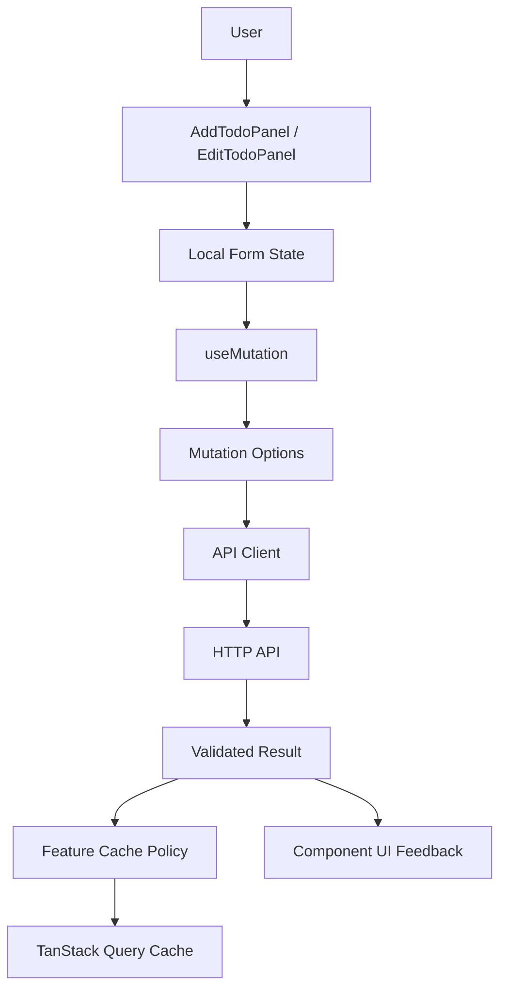
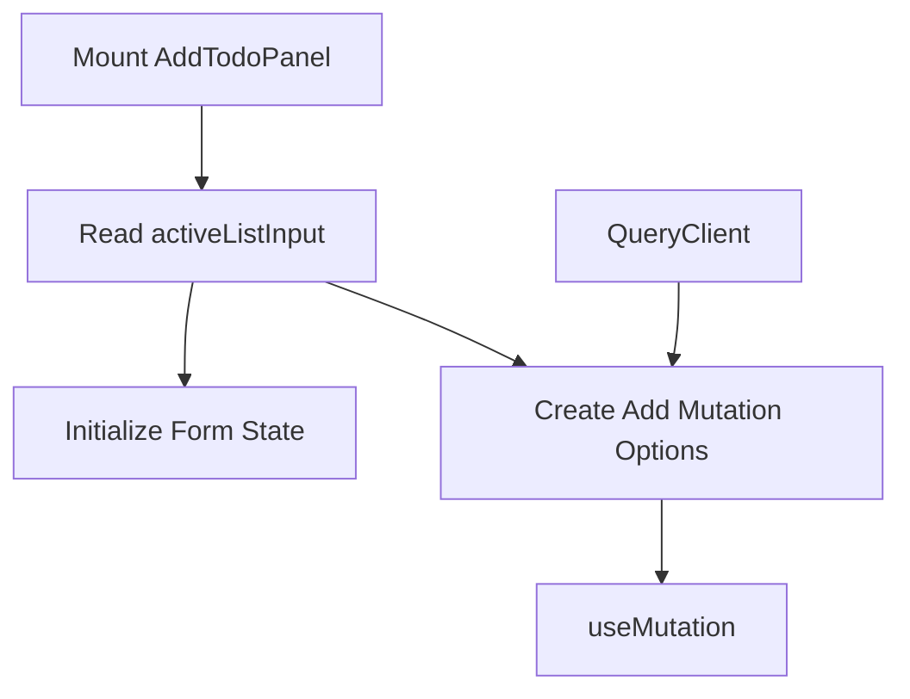
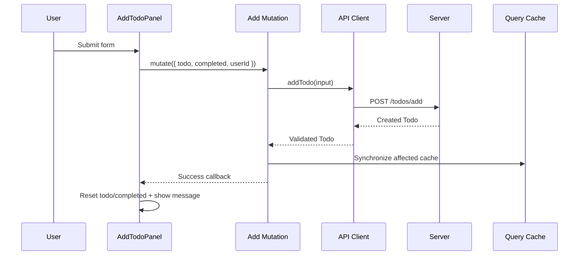
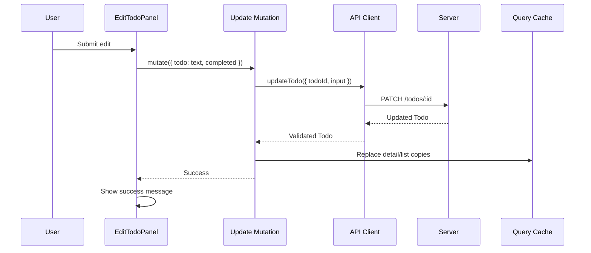
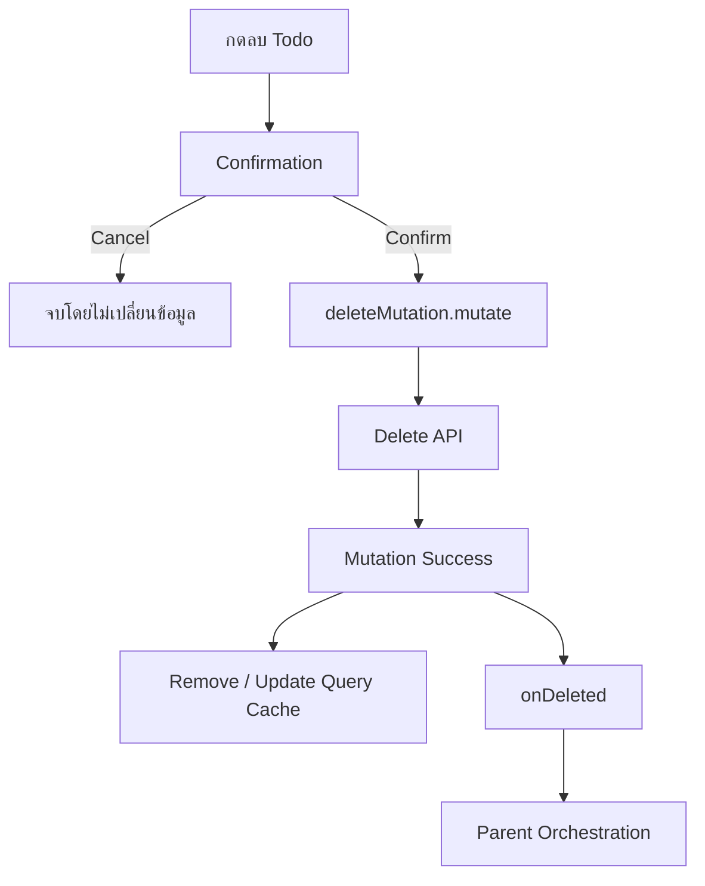
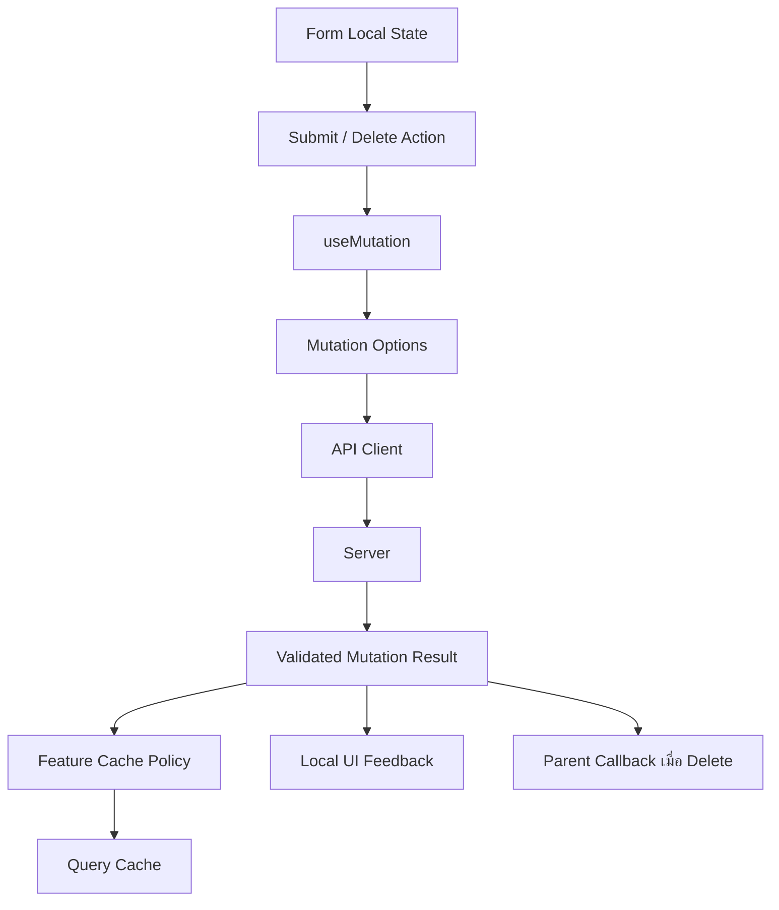

# คำอธิบายเพิ่มเติมเกี่ยวกับ Todo Mutation Panel

ไฟล์: `src/features/todos/components/todo-mutation-panel.tsx`

## ภาพรวม

`todo-mutation-panel.tsx` รวม Interactive Components สำหรับคำสั่งที่เปลี่ยน Server State ของ Todo ไว้สองตัว

- `AddTodoPanel` — สร้าง Todo ใหม่
- `EditTodoPanel` — แก้ไขหรือลบ Todo ที่มีอยู่แล้ว

ทั้งสอง Component ใช้ TanStack Query `useMutation` เพื่อเรียก Mutation Options ที่นิยามไว้ใน `api/mutations.ts` และใช้ `useQueryClient()` เพื่อส่ง `QueryClient` เข้าไปให้ Cache Policy ของ Feature ทำงาน

```text
User Interaction
  → Form Local State
  → useMutation
  → Feature Mutation Options
  → Todos API Client
  → HTTP API
  → Runtime Contract Validation
  → Mutation onSuccess
  → Query Cache Synchronization
  → Component-specific UI Feedback
```

จุดสำคัญทางสถาปัตยกรรมคือ Component **ไม่ได้เขียน Query Cache เอง** แม้ว่าจะถือ `QueryClient` อยู่ก็ตาม

หน้าที่การ Synchronize Cache ถูกเก็บไว้ใน Mutation Options เช่น

- Add → ใส่ Todo ใหม่ลง Detail Cache และ Active List ที่สมเหตุสมผล
- Update → อัปเดต Detail Cache และ List Cache ที่มี Todo นั้น
- Delete → ลบ Detail Cache และนำ Todo ออกจาก List Cache

ส่วน Component มีหน้าที่เกี่ยวกับ UI Interaction เช่น

- เก็บค่าที่ผู้ใช้กำลังกรอก
- Submit Form
- Disable ปุ่มระหว่าง Request
- แสดงข้อความ Success/Error
- ขอ Confirmation ก่อน Delete
- แจ้ง Parent หลัง Delete สำเร็จผ่าน `onDeleted`

การแยกนี้สำคัญ เพราะถ้าทุก Component เขียน Cache Policy เอง กฎเรื่อง Server State จะกระจายอยู่ทั่ว UI และยากต่อการรักษาความสอดคล้อง



อีกแนวคิดสำคัญคือ Tutorial แยก Create กับ Edit ออกจากกัน แทนการสร้าง Component เดียวที่พยายามรองรับทุก Mode

```text
AddTodoPanel
  → ไม่มี Todo เดิม
  → Mutation ไม่ต้องผูกกับ todoId

EditTodoPanel
  → มี Todo จริง
  → Update/Delete Mutation ผูกกับ todo.id ที่แน่นอน
```

ทำให้ Hook แต่ละชุดถูกสร้างด้วย Resource Identity ที่ถูกต้องตั้งแต่ Render แรก และไม่ต้องใช้ ID สมมติหรือ Conditional Hook

---

## Component Contract

### Props

ไฟล์นี้มี Component Contract สองชุด

```ts
interface AddTodoPanelProps {
  activeListInput: TodosListQueryInput;
}

interface EditTodoPanelProps {
  todo: Todo;
  onDeleted: () => void;
}
```

`AddTodoPanel` รับ

```ts
activeListInput: TodosListQueryInput
```

ค่าตัวนี้ไม่ได้ใช้เพื่อ Fetch ข้อมูล แต่ใช้บอก Cache Policy ว่าขณะนี้ผู้ใช้กำลังดู List แบบใด เพื่อให้ Add Mutation ตัดสินใจได้ว่า Todo ใหม่ควรถูก Insert เข้า Active List Cache หรือไม่

ตัวอย่าง

```text
source = all, page = 1
  → Todo ใหม่ควรเข้า Active List

source = all, page = 3
  → ไม่ควรฝืน Insert เข้า page 3

source = user, userId = 5
  → Insert เฉพาะเมื่อ createdTodo.userId === 5
```

`EditTodoPanel` รับ

```ts
todo: Todo
```

เพื่อ

- ระบุ `todo.id` สำหรับ Update/Delete Mutation
- ใช้ค่า `todo.todo` เป็นค่าเริ่มต้นของ Text Field
- ใช้ `todo.completed` เป็นค่าเริ่มต้นของ Checkbox

และรับ

```ts
onDeleted: () => void
```

เพื่อแจ้ง Parent ว่า Delete สำเร็จแล้ว โดย Component ไม่ต้องรู้ว่า Parent จะ Navigate, ปิด Dialog หรือทำ Action อะไรต่อ

นี่เป็น Intent Callback แบบเดียวกับที่ใช้ใน `TodosToolbar`

```text
Child
  → แจ้งเหตุการณ์
  → Parent ตัดสินใจ orchestration ต่อ
```

---

### Local State

`AddTodoPanel` มี Local State สี่ตัว

```ts
const [todo, setTodo] = useState("");
const [completed, setCompleted] = useState(false);
const [userId, setUserId] = useState(activeListInput.userId ?? 1);
const [message, setMessage] = useState("");
```

`EditTodoPanel` มี Local State สามตัว

```ts
const [text, setText] = useState(todo.todo);
const [completed, setCompleted] = useState(todo.completed);
const [message, setMessage] = useState("");
```

State เหล่านี้เหมาะกับ Local State เพราะเป็น UI Draft State ระหว่างที่ผู้ใช้กำลังกรอกข้อมูล ยังไม่ใช่ Server State ที่ยืนยันแล้ว

```text
Input Draft
  → Local State

Saved Todo
  → TanStack Query Cache
```

ไม่ควรนำค่าที่ผู้ใช้กำลังพิมพ์ทุกตัวไปใส่ Query Cache เพราะ Query Cache มีหน้าที่เป็นเจ้าของ Server State ไม่ใช่ Form Draft

`message` ก็เป็น Ephemeral UI State เช่นกัน เพราะมีไว้แสดง Feedback ชั่วคราวภายใน Panel

---

### External Dependencies

ไฟล์นี้พึ่งพา Dependency หลักดังนี้

```ts
import { useState } from "react";
```

ใช้เก็บ Form Draft และข้อความ Feedback

```ts
import { useMutation, useQueryClient } from "@tanstack/react-query";
```

- `useMutation` — จัดการ Mutation Lifecycle
- `useQueryClient` — เข้าถึง QueryClient เพื่อส่งให้ Feature Mutation Options

```ts
import {
  addTodoMutationOptions,
  deleteTodoMutationOptions,
  updateTodoMutationOptions,
} from "../api/mutations";
```

เป็น Feature-level Command และ Cache Policy

```ts
import type { Todo } from "../api/contracts";
import type { TodosListQueryInput } from "../api/queries";
```

ใช้ Type ที่มาจาก Feature Contract แทนการสร้าง Type ซ้ำใน UI

Shared UI คือ

```ts
Button
Card
CardContent
CardHeader
CardTitle
```

ดังนั้น Dependency Direction ยังเป็น

```text
Feature Component
  → Feature API Public Logic
  → Shared UI
```

Component ไม่ Import Axios หรือ HTTP Client โดยตรง

---

## `AddTodoPanel`

### Props

```ts
interface AddTodoPanelProps {
  activeListInput: TodosListQueryInput;
}
```

Input หลักคือ State ของ List ที่กำลัง Active

ตัวอย่าง

```ts
{
  page: 1,
  pageSize: 10,
  source: "user",
  userId: 5,
}
```

ค่านี้ถูกส่งเข้า

```ts
addTodoMutationOptions(queryClient, activeListInput)
```

เพื่อให้ Mutation Options รู้ Context ของ Cache ที่กำลังแสดงอยู่

สิ่งสำคัญคือ `activeListInput` ไม่ใช่ Create Payload

Create Payload ถูกสร้างจาก Local Form State แยกต่างหาก

```ts
{
  todo,
  completed,
  userId,
}
```

---

### Local State

```ts
const [todo, setTodo] = useState("");
const [completed, setCompleted] = useState(false);
const [userId, setUserId] = useState(activeListInput.userId ?? 1);
const [message, setMessage] = useState("");
```

ความหมาย

- `todo` — ข้อความ Todo ที่กำลังสร้าง
- `completed` — สถานะเริ่มต้นของ Todo ใหม่
- `userId` — User ที่ Todo ใหม่เป็นของ
- `message` — Success/Error Feedback

`userId` ตั้งค่าเริ่มต้นจาก Active User Filter ถ้ามี

```ts
activeListInput.userId ?? 1
```

จึงช่วยลดงานผู้ใช้ในกรณีที่กำลังเปิด

```text
Todos ของ User #5
```

แล้วต้องการเพิ่ม Todo ให้ User #5 ต่อทันที

---

### Initial State

เมื่อ Component Mount ครั้งแรก

```text
todo = ""
completed = false
userId = activeListInput.userId ?? 1
message = ""
```

จากนั้นสร้าง Query Client

```ts
const queryClient = useQueryClient();
```

และสร้าง Mutation

```ts
const mutation = useMutation(
  addTodoMutationOptions(queryClient, activeListInput),
);
```

ภาพรวม



---

### Submit Flow

Form ใช้ Native Submit Event

```tsx
<form
  onSubmit={(event) => {
    event.preventDefault();
    setMessage("");

    mutation.mutate(
      { todo, completed, userId },
      {
        onSuccess: ...,
        onError: ...,
      },
    );
  }}
>
```

ลำดับทำงาน

```text
1. ผู้ใช้กรอก Form
2. Browser ตรวจ required / minLength / maxLength / min
3. ผู้ใช้กด Submit
4. onSubmit ทำงาน
5. preventDefault() ป้องกัน Browser Reload
6. ล้าง message เก่า
7. mutation.mutate(...) รับ CreateTodoInput
8. Mutation Options เรียก addTodo(...)
9. API Client Validate Payload ด้วย Zod
10. POST /todos/add
11. Validate Response
12. Feature Cache Policy ทำงาน
13. Component แสดง Success หรือ Error Feedback
```



---

### Mutation Interaction

Mutation ถูกประกอบจากสอง Layer

Layer แรก: Feature Policy

```ts
addTodoMutationOptions(queryClient, activeListInput)
```

รับผิดชอบ

- Mutation Key
- API Call
- Cache Synchronization หลัง Success

Layerที่สอง: Component-specific callbacks

```ts
mutation.mutate(payload, {
  onSuccess: ...,
  onError: ...,
});
```

รับผิดชอบ UI Response เฉพาะ Interaction นี้

นี่เป็น Separation ที่ดี

```text
Shared Feature Consequence
  → Mutation Options
  → Cache Policy

Local Interaction Consequence
  → Component mutate callback
  → Form Reset / Message
```

ถ้า Add Mutation ถูกเรียกจาก Component อื่นในอนาคต Cache Policy ยังเหมือนเดิม แต่ UI Feedback สามารถต่างกันได้

---

### Success / Error Handling

เมื่อสำเร็จ

```ts
onSuccess: (createdTodo) => {
  setMessage(`DummyJSON จำลองการสร้าง Todo #${createdTodo.id} สำเร็จ`);
  setTodo("");
  setCompleted(false);
},
```

Component ทำสามอย่าง

1. แจ้งผลสำเร็จ
2. ล้างข้อความ Todo
3. Reset Checkbox กลับเป็น `false`

สังเกตว่า `userId` ไม่ถูก Reset จึงเหมาะกับการเพิ่ม Todo หลายรายการต่อเนื่องให้ User คนเดิม

เมื่อเกิด Error

```ts
onError: (error) => setMessage(error.message)
```

ข้อความจาก Error ถูกนำมาแสดงใน Panel

ใน Production ควรพิจารณา Mapping Technical Error เป็นข้อความที่ผู้ใช้เข้าใจได้ และไม่เปิดเผยข้อมูลภายในระบบมากเกินไป

---

## `EditTodoPanel`

### Props

```ts
interface EditTodoPanelProps {
  todo: Todo;
  onDeleted: () => void;
}
```

`todo` เป็น Validated Domain Data ที่ Parent ส่งมา

ตัวอย่าง

```ts
{
  id: 12,
  todo: "Review architecture",
  completed: false,
  userId: 5,
}
```

`onDeleted` เป็น Callback หลัง Delete สำเร็จ

Component จึงไม่รู้จัก Router และไม่สมมติว่าหลัง Delete ต้อง Navigate ไปที่ใด

---

### Local State

```ts
const [text, setText] = useState(todo.todo);
const [completed, setCompleted] = useState(todo.completed);
const [message, setMessage] = useState("");
```

Local State ถูก initialize จาก Server State แต่หลังจากนั้นกลายเป็น Form Draft ของผู้ใช้

```text
Query Data
  → Initial Form State
  → User Edit
  → Local Draft
  → Submit
  → Server State ใหม่
```

นี่เป็นกรณีที่การ Copy Server Data ลง Local State มีเหตุผล เพราะ Form ต้องสามารถแก้ไข Draft ได้โดยไม่เปลี่ยน Query Cache ทุก Keystroke

แต่ต้องเข้าใจข้อจำกัดว่า `useState(initialValue)` อ่าน Initial Value เฉพาะตอน Mount ครั้งแรก ซึ่งจะกล่าวในส่วน Edge Cases

---

### Update Flow

Update Form ทำงานดังนี้

```ts
updateMutation.mutate(
  { todo: text, completed },
  {
    onSuccess: () => setMessage("DummyJSON จำลองการแก้ไขสำเร็จ"),
    onError: (error) => setMessage(error.message),
  },
);
```

ลำดับ

```text
1. ผู้ใช้แก้ text/completed
2. Submit Form
3. preventDefault()
4. ล้าง message เก่า
5. ส่ง { todo: text, completed }
6. updateTodoMutationOptions ผูก request กับ todo.id
7. API Client Validate Update Input
8. PATCH /todos/:id
9. Validate Response
10. Mutation Cache Policy อัปเดต Detail/List Cache
11. Component แสดง Success Message
```



แม้ `UpdateTodoInput` รองรับ Partial Update แต่ Component นี้ส่งทั้ง `todo` และ `completed` ทุกครั้ง ซึ่งเหมาะกับ Tutorial ที่มี Form เล็ก หาก Production ต้องการส่งเฉพาะ Dirty Fields ควรสร้าง Diff ก่อน Mutation

---

### Delete Flow

Delete ไม่ใช้ Form Submit เพราะปุ่มกำหนด

```tsx
type="button"
```

เพื่อไม่ให้การกด Delete Trigger `onSubmit` ของ Form

ก่อน Delete มี Confirmation

```ts
const confirmed = window.confirm(`ยืนยันการลบ Todo #${todo.id}`);

if (!confirmed) {
  return;
}
```

ถ้ายืนยัน

```text
1. ล้าง message เดิม
2. deleteMutation.mutate(...)
3. DELETE /todos/:id
4. Validate Delete Response
5. Cache Policy ลบ Detail Cache
6. Cache Policy ลบ Todo จาก List Cache
7. onDeleted() แจ้ง Parent
```



Tutorial ใช้ `window.confirm()` เพื่อให้ Flow เข้าใจง่าย แต่ระบบจริงควรใช้ Accessible Alert Dialog ที่ควบคุม Focus และ Keyboard Interaction ได้ถูกต้อง

---

### Mutation Interaction

`EditTodoPanel` มี Mutation สองตัวที่ผูกกับ Resource เดียวกัน

```ts
const updateMutation = useMutation(
  updateTodoMutationOptions(queryClient, todo.id),
);

const deleteMutation = useMutation(
  deleteTodoMutationOptions(queryClient, todo.id),
);
```

ทั้งคู่ใช้ `todo.id` เดียวกัน แต่มี Mutation Key และ Cache Policy คนละชุด

จากนั้นรวม Pending State

```ts
const isPending = updateMutation.isPending || deleteMutation.isPending;
```

และใช้ Disable Action ทั้งสอง

```tsx
<Button type="submit" disabled={isPending}>
```

```tsx
<Button type="button" variant="destructive" disabled={isPending}>
```

ผลคือ

```text
Update กำลังทำงาน
  → ห้าม Update ซ้ำ
  → ห้าม Delete พร้อมกัน

Delete กำลังทำงาน
  → ห้าม Delete ซ้ำ
  → ห้าม Update พร้อมกัน
```

เป็น Concurrency Guard ระดับ UI ที่เรียบง่ายและเหมาะสมสำหรับ Panel นี้

อย่างไรก็ตาม มันไม่ใช่ Distributed Concurrency Control เพราะ Request จาก Tab อื่นหรือ Client อื่นยังเกิดขึ้นได้ ระบบจริงต้องให้ Backend จัดการ Conflict ด้วยกลไกที่เหมาะสม เช่น Version, ETag หรือ Optimistic Concurrency Control หาก Domain ต้องการ

---

### `onDeleted`

```ts
onSuccess: onDeleted
```

`onDeleted` เป็น Callback ที่จงใจปล่อยให้ Parent เป็นผู้ตัดสินใจผลลัพธ์หลัง Resource ถูกลบ

ตัวอย่าง Parent อาจ

```text
Delete Success
  → Navigate กลับ /todos
```

หรือ

```text
Delete Success
  → ปิด Dialog
```

หรือ

```text
Delete Success
  → เลือก Todo ถัดไป
```

Component ไม่ควร Hard-code Route เพราะจะลด Reusability และเพิ่ม Coupling กับ Router

---

### Success / Error Handling

Update Success

```ts
onSuccess: () => setMessage("DummyJSON จำลองการแก้ไขสำเร็จ")
```

Update Error

```ts
onError: (error) => setMessage(error.message)
```

Delete Success

```ts
onSuccess: onDeleted
```

Delete Error

```ts
onError: (error) => setMessage(error.message)
```

Delete Success ไม่มีข้อความใน Component เพราะ Parent จะจัดการขั้นตอนถัดไปทันที เช่น Navigation ออกจากหน้า Detail

---

## Logic Breakdown

### Event Handlers

ไฟล์นี้ใช้ Controlled Inputs ทั้งหมด

Text Input

```ts
onChange={(event) => setTodo(event.target.value)}
```

หรือ

```ts
onChange={(event) => setText(event.target.value)}
```

Number Input

```ts
onChange={(event) => setUserId(Number(event.target.value))}
```

Checkbox

```ts
onChange={(event) => setCompleted(event.target.checked)}
```

Submit Handler มีหน้าที่แปลง Local Form State เป็น Mutation Variables

```text
DOM Event
  → React State
  → Domain-shaped Input
  → Mutation Boundary
```

Component ไม่สร้าง HTTP Payload หรือ URL Endpoint ด้วยตัวเอง

---

### Rendering Logic

ทั้งสอง Panel ใช้โครง UI เดียวกัน

```text
Card
├── CardHeader
│   └── CardTitle
└── CardContent
    └── form
        ├── Fields
        ├── Actions
        └── Feedback Message
```

ความแตกต่างคือ

```text
AddTodoPanel
  → Text
  → User ID
  → Completed
  → Add Button

EditTodoPanel
  → Text
  → Completed
  → Update Button
  → Delete Button
```

การแยก Component ทำให้ JSX แต่ละตัวสอดคล้องกับ Use Case ของตัวเอง และหลีกเลี่ยง Conditional Branch จำนวนมาก เช่น `mode === "create"` หรือ `mode === "edit"`

---

### Loading State

Add ใช้

```ts
mutation.isPending
```

เพื่อ Disable Submit และเปลี่ยนข้อความ

```text
เพิ่ม Todo
→ กำลังเพิ่ม…
```

Edit รวม Pending จาก Update/Delete

```ts
const isPending = updateMutation.isPending || deleteMutation.isPending;
```

จึงป้องกัน Action Conflict ภายใน Panel

การ Disable ปุ่มระหว่าง Pending ช่วยลด Accidental Duplicate Request แต่ Backend ของ Production ยังควรออกแบบเรื่อง Idempotency ตาม Semantics ของ Endpoint โดยเฉพาะ Create Operation

---

### Error State

ทั้งสอง Component ใช้ `message` ร่วมสำหรับ Success และ Error

```ts
const [message, setMessage] = useState("");
```

ข้อดีคือ Tutorial เรียบง่าย

ข้อจำกัดคือ UI ไม่รู้เชิงโครงสร้างว่า Message ปัจจุบันเป็น

```text
success | error | info
```

จึงใช้ Style เดียวกัน

```tsx
<p className="text-sm text-muted-foreground">{message}</p>
```

Production UI มักเหมาะกับ Structured Feedback เช่น

```ts
type Feedback =
  | { type: "success"; message: string }
  | { type: "error"; message: string }
  | null;
```

เพื่อให้ Semantics, Styling และ Accessibility ชัดเจนกว่า

---

### Success State

Add Success มี Form Reset บางส่วน

```text
todo → ""
completed → false
userId → คงเดิม
```

Edit Success ไม่ Reset เพราะค่าที่ผู้ใช้เพิ่งบันทึกเป็นค่าที่ควรเห็นต่อ

หลัง Update สำเร็จ Query Cache ถูกแทนด้วย `updatedTodo` ผ่าน Mutation Policy ส่วน Draft State ใน Component ยังคงค่าที่ Submit ซึ่งโดยปกติสอดคล้องกับ Response ถ้า Server ไม่ Normalize หรือ Transform ข้อมูลเพิ่มเติม

ถ้า Backend สามารถ Normalize Text หรือเปลี่ยน Field อื่นหลัง Save Production Form อาจต้อง Sync Local Draft จาก Response หรือ Remount/Reset Form หลัง Mutation สำเร็จอย่างตั้งใจ

---

## Data Flow



Create Flow

```text
Form Draft
  → CreateTodoInput
  → addTodoMutationOptions
  → addTodo
  → POST
  → Todo
  → Cache Synchronization
  → Reset Form
```

Update Flow

```text
Form Draft
  → UpdateTodoInput
  → updateTodoMutationOptions(todo.id)
  → updateTodo
  → PATCH
  → Updated Todo
  → Detail/List Cache Synchronization
```

Delete Flow

```text
Confirm
  → deleteTodoMutationOptions(todo.id)
  → deleteTodo
  → DELETE
  → Cache Removal
  → onDeleted()
```

---

## Separation of Concerns

### Presentation

Component รับผิดชอบ

- Form Layout
- Labels
- Inputs
- Buttons
- Pending Text
- Feedback Message

Shared UI Primitives ช่วยให้ Style สอดคล้องกับระบบ

---

### Interaction

Component เป็นเจ้าของ

- Form Draft
- Submit Event
- Checkbox/Text/Number Change Event
- Delete Confirmation Trigger
- Disable State ระหว่าง Mutation
- Component-specific Success/Error Feedback

---

### Server State

Component ไม่เก็บ Todo ที่ Save แล้วเป็น Source of Truth

Server State ยังคงเป็นหน้าที่ของ

```text
TanStack Query Cache
```

และ Cache Synchronization อยู่ใน

```text
api/mutations.ts
```

นี่เป็น Boundary สำคัญ

```text
Form Draft != Server State
```

---

### URL State

Component นี้ไม่อ่านและไม่เขียน URL โดยตรง

`AddTodoPanel` รับ Active List Context ผ่าน Prop

`EditTodoPanel` แจ้ง Delete Success ผ่าน Callback

ดังนั้น Router Orchestration ยังอยู่กับ Parent/Route Layer

---

### Business Logic

Business/Domain Validation หลักไม่ได้ฝากไว้กับ JSX

แม้ Input มี HTML Constraint เช่น

```tsx
required
minLength={3}
maxLength={300}
min={1}
```

แต่ Mutation Input จะถูก Validate ซ้ำที่ API Boundary ด้วย Zod

```text
Browser Validation
  → UX Guard

Zod Validation
  → Runtime Contract Guard
```

Cache Membership และ Consistency Rules ก็อยู่ใน `api/mutations.ts` ไม่อยู่ใน Component

---

## Production-Ready Analysis

### Performance Optimization

Component มี State ขนาดเล็กและ Render Cost ต่ำ จึงไม่จำเป็นต้องใช้ `useMemo` หรือ `useCallback` โดยอัตโนมัติ

สิ่งที่มีผลต่อ Performance มากกว่าคือ Network และ Mutation Behavior

แนวทางสำคัญ

1. Disable duplicate actions ระหว่าง Pending
2. ไม่ Refetch ทุก Query แบบกว้างโดยไม่จำเป็น เพราะ Mutation Options ใช้ Direct Cache Synchronization
3. ไม่เขียน Query Cache ทุก Keystroke
4. Form Draft อยู่ Local State ทำให้ Server Cache ไม่ถูก churn

สำหรับ Update ปัจจุบันส่ง `{ todo, completed }` ทุกครั้ง แม้ไม่มี Field เปลี่ยน

ระบบใหญ่สามารถเพิ่ม Dirty Tracking เพื่อ

- Disable Save เมื่อไม่มีการเปลี่ยนแปลง
- ส่งเฉพาะ Field ที่เปลี่ยน
- ลด Request ที่ไม่มีประโยชน์

แต่อย่าซับซ้อน Form เล็กโดยไม่มี Requirement จริง

ถ้า Create Operation มีโอกาสถูก Retry จาก Infrastructure ต้องพิจารณา Idempotency Key เพื่อป้องกัน Resource ซ้ำ ไม่ควรพึ่งเพียง Disabled Button

---

### Security First

Client-side Validation ไม่ใช่ Security Boundary

ตัวอย่าง

```tsx
<input type="number" min={1} required />
```

ไม่ได้ป้องกันผู้โจมตีเรียก API โดยตรงด้วย `userId` อื่น

Backend ต้องตรวจ

- Authentication
- Authorization
- Resource Ownership
- Allowed Fields
- Input Validation

โดยเฉพาะ `userId` ใน Create Payload ไม่ควรถูกเชื่อเพียงเพราะ UI เป็นผู้ส่ง

```text
Client userId
  → Untrusted Input
  → Server Authorization Required
```

Update/Delete ก็เช่นกัน การรู้ `todo.id` ไม่ได้หมายความว่าผู้ใช้มีสิทธิ์แก้หรือลบ Todo นั้น

ถ้าระบบใช้ Cookie-based Authentication สำหรับ Mutating Requests ต้องประเมิน CSRF Protection เช่น SameSite Cookie, CSRF Token หรือแนวทางที่ Backend Framework รองรับ

ข้อความ Error จาก Server ไม่ควรนำ Technical Detail, Stack Trace, SQL Error หรือข้อมูล Sensitive มาแสดงตรง ๆ ต่อผู้ใช้ Production ควร Normalize Error ผ่าน Application Error Layer

สำหรับ XSS ค่า Text ที่ Render ผ่าน React JSX จะถูก Escape โดย Default แต่ระบบยังต้องระวังกรณีที่ภายหลังใช้ HTML Injection API เช่น `dangerouslySetInnerHTML`

---

### Accessibility

โค้ดพื้นฐานมีข้อดีหลายจุด

- Input อยู่ภายใน `<label>` จึงมี Accessible Name
- Submit ใช้ `<Button type="submit">`
- Delete กำหนด `type="button"` ชัดเจน
- Native Checkbox รองรับ Keyboard โดย Default
- Disabled State สื่อว่า Action ยังไม่พร้อม

จุดที่ Production ควรปรับ

#### 1. `window.confirm()`

Browser Confirm Dialog จำกัดการควบคุม UX และ Accessibility

ควรใช้ Accessible Alert Dialog ที่มี

- `role="alertdialog"` หรือ Primitive ที่ implement semantics ถูกต้อง
- Focus Trap
- Initial Focus ที่เหมาะสม
- Escape Behavior
- Restore Focus หลังปิด
- ปุ่ม Cancel/Confirm ที่ชัดเจน

#### 2. Dynamic Feedback

ข้อความ Success/Error เกิดขึ้นหลัง Interaction

ควรพิจารณา Live Region เช่น

```tsx
<p role="status" aria-live="polite">
  {message}
</p>
```

สำหรับ Error ที่ต้องประกาศเร่งด่วนอาจใช้ `role="alert"` ตามความเหมาะสม

#### 3. Pending State

นอกจากเปลี่ยนข้อความปุ่ม อาจใช้ `aria-busy` บน Form หรือ Region เพื่อให้ Assistive Technology เข้าใจว่ากำลังประมวลผล

#### 4. Destructive Action

Confirmation ต้องอธิบาย Resource ที่กำลังลบอย่างชัดเจน ไม่ใช้ข้อความทั่วไปแบบ "แน่ใจหรือไม่" อย่างเดียว

---

### Scalability & Maintainability

โครงสร้างปัจจุบันเหมาะกับ Feature ขนาดเล็กถึงกลาง เพราะ

- Create/Edit แยก Component
- API Logic ไม่อยู่ใน UI
- Cache Policy ไม่กระจาย
- Types มาจาก Contract กลาง
- Parent Orchestration ผ่าน Callback

เมื่อ Form ซับซ้อนขึ้น เช่นมีหลายสิบ Field, Nested Fields, Conditional Validation หรือ Field Array ควรพิจารณา Form Library แทนการเพิ่ม `useState` จำนวนมาก

แต่ Library ควรถูกเพิ่มเมื่อ Complexity พิสูจน์ว่าจำเป็น ไม่ใช่เพราะทุก Form ต้องมี Form Library

อีกประเด็นสำคัญคือ Initial State จาก Props

```ts
useState(todo.todo)
```

และ

```ts
useState(activeListInput.userId ?? 1)
```

ไม่ได้ Sync อัตโนมัติเมื่อ Props เปลี่ยน

ระบบต้องกำหนด Lifecycle Contract ให้ชัดว่า

- Component จะ Remount เมื่อ Resource เปลี่ยน หรือ
- Form จะ Reset เมื่อ Props เปลี่ยน หรือ
- Draft เดิมควรถูก Preserve

ไม่ควรใส่ `useEffect` Sync Props → State โดยอัตโนมัติทุกครั้ง เพราะอาจทับ Draft ที่ผู้ใช้กำลังแก้

---

### Testability

ควรทดสอบ Component ที่ Boundary ของ User Behavior มากกว่าทดสอบ Implementation Detail

`AddTodoPanel` อย่างน้อยควรมี Test

1. Render Initial Values
2. Submit Valid Input
3. Disable Submit ระหว่าง Pending
4. แสดง Success Message
5. Reset `todo` และ `completed` หลัง Success
6. แสดง Error Message เมื่อ API Fail
7. Initialize `userId` จาก `activeListInput.userId`
8. ไม่ Submit เมื่อ Native Constraint ไม่ผ่าน

`EditTodoPanel` ควรมี Test

1. Initialize จาก `todo`
2. Update สำเร็จ
3. Update Error
4. Delete Cancel → ไม่เรียก Mutation
5. Delete Confirm → เรียก Delete
6. Delete Success → เรียก `onDeleted`
7. Disable Update และ Delete เมื่อ Mutation ใด Mutation หนึ่ง Pending
8. Cache หลัง Update/Delete สอดคล้องกับ Mutation Policy

Integration Test ควรใช้

```text
React Testing Library
+ QueryClientProvider
+ MSW
```

และ QueryClient ของ Test ควรปิด Retry หรือกำหนด Policy ให้ deterministic เพื่อไม่ให้ Test ช้าและ Flaky

ควรทดสอบผลลัพธ์ที่ผู้ใช้เห็น เช่นข้อความ, Disabled State และ Callback มากกว่าตรวจว่า `setMessage` ถูกเรียกกี่ครั้ง

---

## Edge Cases

### 1. `activeListInput` เปลี่ยนหลัง `AddTodoPanel` Mount

```ts
const [userId, setUserId] = useState(activeListInput.userId ?? 1);
```

`useState` ไม่เปลี่ยนค่าเริ่มต้นใหม่เมื่อ Prop เปลี่ยน

ตัวอย่าง

```text
Mount ตอน userId = 5
→ local userId = 5
→ Parent เปลี่ยน Filter เป็น userId = 8
→ AddTodoPanel ตัวเดิมยังอาจถือ local userId = 5
```

ต้องตัดสิน UX Contract ว่าควร Preserve Draft หรือ Reset ตาม Filter ใหม่

---

### 2. `todo` Prop เปลี่ยนขณะ `EditTodoPanel` ยัง Mounted

```ts
useState(todo.todo)
useState(todo.completed)
```

ถ้า Parent เปลี่ยนจาก Todo #1 เป็น Todo #2 โดย React ไม่ Remount Component Local Draft อาจยังเป็นค่าของ Todo #1

แนวทางแก้ขึ้นกับ UI Architecture เช่น

```tsx
<EditTodoPanel key={todo.id} todo={todo} ... />
```

เพื่อบังคับ Remount เมื่อ Resource เปลี่ยน หรือใช้ Form Reset Strategy ที่ชัดเจน

ไม่ควร Sync Prop ลง State แบบไร้เงื่อนไขจนทับ Unsaved Draft

---

### 3. Whitespace ผ่าน HTML `minLength` แต่ไม่ผ่าน Zod

ตัวอย่าง

```text
"   "
```

Browser เห็น String Length = 3 จึงอาจผ่าน `minLength={3}` แต่ Contract ใช้ `.trim().min(3)` ทำให้เหลือความยาว 0 และ Reject

นี่เป็นเหตุผลที่ Runtime Validation ต้องยังอยู่ แม้มี Native Form Validation

Production UX สามารถ Trim ก่อน Submit หรือแสดง Validation ที่สอดคล้องกับ Contract มากขึ้น

---

### 4. Number Input ถูกล้าง

```ts
Number(event.target.value)
```

เมื่อค่าจาก Input เป็น Empty String

```ts
Number("") === 0
```

จึงอาจทำให้ Local State เป็น `0`

Native `min={1}` จะช่วยตอน Submit แต่ Runtime Contract ยังคงต้องตรวจซ้ำ

Form ที่ซับซ้อนอาจเก็บ Raw String ระหว่าง Editing แล้ว Parse เมื่อ Submit เพื่อรองรับ Intermediate Input State ได้ดีกว่า

---

### 5. Update โดยไม่มีการเปลี่ยนแปลง

Component ยังส่ง

```ts
{ todo: text, completed }
```

แม้ค่าจะเหมือนเดิม

ผลคือ Network Request ที่ไม่จำเป็น

ระบบที่ต้อง Optimize สามารถ Dirty-check ก่อน Submit แต่สำหรับ Tutorial ความเรียบง่ายมีน้ำหนักมากกว่า

---

### 6. Server Normalize Response ต่างจาก Form Draft

เช่น Server Trim Text

```text
Input: "Review architecture   "
Server: "Review architecture"
```

Query Cache จะได้ค่าจาก Server แต่ Local `text` อาจยังถือ Draft เดิม

ถ้า UI ต้องการให้ Form สะท้อน Canonical Server Value ต้องกำหนด Reset/Sync Strategy หลัง Success

---

### 7. Update และ Delete เกิดจาก Client อื่นพร้อมกัน

Disabled Button ป้องกันเฉพาะ Interaction ใน Panel ปัจจุบัน

ไม่ได้ป้องกัน

- Tab อื่น
- Browser อื่น
- User อื่น
- Background Process

Backend ต้องจัดการ Resource Conflict ตาม Consistency Model ของระบบ

---

### 8. Todo ถูกลบไปแล้วก่อนผู้ใช้กด Delete

API อาจคืน `404`

UI ต้องตัดสินว่า

```text
404 Delete
→ แสดง Error
```

หรือในบาง Domain มอง Delete เป็น Idempotent Outcome และถือว่า Desired State "ไม่มี Resource" สำเร็จแล้ว

Policy นี้ควรกำหนดที่ API/Application Layer ไม่ควรให้แต่ละ Componentตีความเอง

---

### 9. Todo ถูกแก้จากที่อื่นระหว่างที่ Form เปิดอยู่

ผู้ใช้อาจ Save Draft เก่าทับข้อมูลใหม่

ระบบที่มี Collaborative หรือ High-value Data ควรใช้ Version Field, ETag หรือ Optimistic Concurrency Control แทน Last-write-wins โดยไม่ตั้งใจ

---

### 10. Double Create จาก Network Retry

แม้ Button ถูก Disable แต่ Transport, Proxy หรือ Client Retry Strategy อาจทำ Request ซ้ำได้

ถ้า Create ต้อง Exactly-once หรือ Duplicate มีผลเสีย Backend ควรรองรับ Idempotency Key

---

### 11. Error Message มี Technical Detail

```ts
setMessage(error.message)
```

เหมาะกับ Tutorial แต่ Production ต้องแน่ใจว่า Error Layer ไม่ส่งข้อมูล Sensitive หรือรายละเอียด Infrastructure ไปถึง UI

---

### 12. Delete Confirmation ไม่ Accessible เพียงพอ

`window.confirm()` เหมาะกับ Demo แต่ไม่เหมาะเป็น Pattern หลักของ Production Design System ควรเปลี่ยนเป็น Alert Dialog ที่รองรับ Keyboard, Focus Management และ Screen Reader อย่างครบถ้วน

---

## สรุปสาระสำคัญ

`todo-mutation-panel.tsx` เป็นตัวอย่างของการแยก **Form Interaction** ออกจาก **Mutation/Cache Policy** อย่างชัดเจน

```text
Component
  → Local Draft
  → User Interaction
  → UI Feedback

Mutation Options
  → API Command
  → Cache Consistency

API Client
  → HTTP Transport
  → Runtime Contract
```

`AddTodoPanel` ใช้ `activeListInput` เพื่อให้ Add Mutation รู้ว่าควร Synchronize Active List อย่างไร ส่วน Create Payload มาจาก Local State

`EditTodoPanel` รับ Todo ที่มี Identity จริงแล้ว จึงสร้าง Update/Delete Mutation ด้วย `todo.id` ที่ถูกต้องตั้งแต่ต้น

การแยก Create/Edit ช่วยหลีกเลี่ยง Conditional Hook และ ID สมมติ ขณะที่ `onDeleted` ช่วยให้ Child แจ้ง Intent โดยไม่ผูกกับ Router

แนวทางสำคัญสำหรับ Production คือ

1. อย่าใช้ Client-side Validation เป็น Security Boundary
2. ให้ Backend ตรวจ Authorization และ Resource Ownership เสมอ
3. ใช้ Mutation Options เป็นเจ้าของ Cache Policy กลาง
4. ใช้ Local State สำหรับ Form Draft ไม่ใช่ Server State
5. ระวัง `useState(initialProp)` เมื่อ Prop สามารถเปลี่ยนโดยไม่ Remount
6. แยก Success/Error Feedback ให้มี Semantic ที่ชัดเจนเมื่อ UI โตขึ้น
7. เปลี่ยน `window.confirm()` เป็น Accessible Alert Dialog
8. พิจารณา Idempotency และ Concurrency Control ตามความสำคัญของ Domain
9. ทดสอบจาก User Behavior และ Cache Outcome ไม่ยึด Implementation Detail

แก่นของ Component นี้คือ

```text
UI เป็นผู้เริ่ม Command
แต่ Feature Mutation Layer เป็นผู้รับผิดชอบผลกระทบต่อ Server State และ Cache
```

เมื่อรักษา Boundary นี้ไว้ Component จะอ่านง่าย ทดสอบง่าย และสามารถขยาย Mutation Behavior โดยไม่ทำให้ UI กลายเป็นเจ้าของ Business/Data Consistency Logic