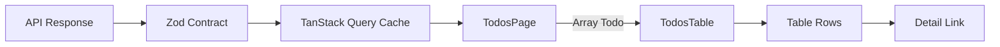
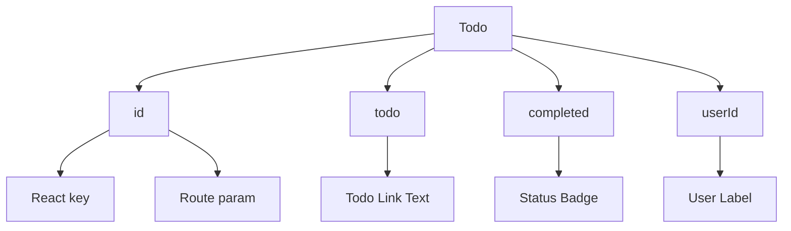
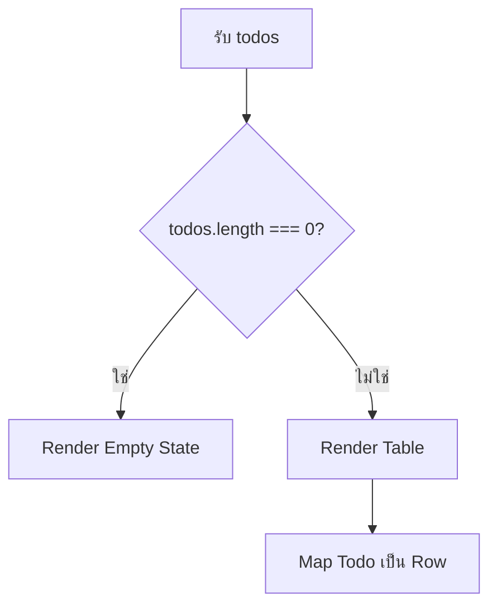
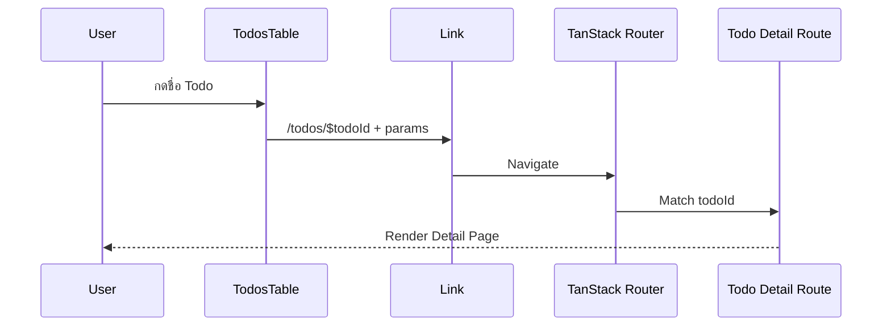
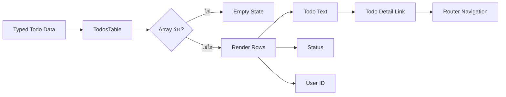
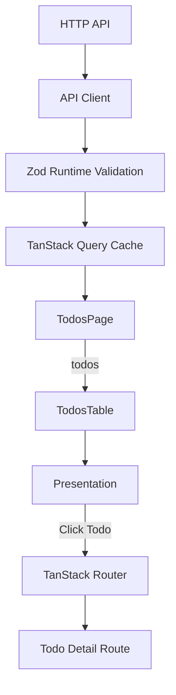

# คำอธิบายเพิ่มเติมเกี่ยวกับ TodosTable

ไฟล์: `src/features/todos/components/todos-table.tsx`

## ภาพรวม

`TodosTable` เป็น Presentation Component สำหรับแสดงรายการ `Todo` ที่ Parent ส่งเข้ามาในรูปแบบตาราง และเปิดทางให้ผู้ใช้กดจาก Todo แต่ละรายการไปยังหน้า Detail ผ่าน TanStack Router `Link`

หน้าที่หลักของ Component มีเพียงสามเรื่อง

1. รับ Typed Data คือ `Array<Todo>`
2. แปลงข้อมูลแต่ละ Todo ให้เป็น Table Row
3. แสดง Navigation Link ไปยัง `/todos/$todoId`

```text
Parent / Page
  → Array<Todo>
  → TodosTable
  → Render Table Rows
  → User กด Todo
  → TanStack Router Link
  → /todos/$todoId
```

จุดสำคัญเชิง Architecture คือ Component นี้ **ไม่เป็นเจ้าของ Server State และไม่รู้จักวิธีดึงข้อมูล**

มันไม่รู้จัก

- Axios
- HTTP Endpoint
- TanStack Query `QueryClient`
- Query Key
- Route Loader
- Pagination Logic
- Mutation Logic

Component เชื่อเพียง Contract ที่ Parent ส่งเข้ามาว่า `todos` คือข้อมูลที่พร้อม Render แล้ว



นี่เป็นตัวอย่างของแนวคิด **Separation of Concerns** ที่ดี เพราะ Data Fetching กับ Data Presentation ถูกแยกจากกันอย่างชัดเจน

---

## Component Contract

### Props

Component มี Contract ที่เล็กมาก

```ts
interface TodosTableProps {
  todos: Array<Todo>;
}
```

มี Prop เพียงตัวเดียวคือ `todos`

```ts
todos: Array<Todo>
```

โดย `Todo` มาจาก API Contract ของ Feature

```ts
import type { Todo } from "../api/contracts";
```

รูปร่างข้อมูลตาม Tutorial คือประมาณนี้

```ts
interface Todo {
  id: number;
  todo: string;
  completed: boolean;
  userId: number;
}
```

ดังนั้น Input ของ Component คือ

```text
Array<Todo>
```

เช่น

```ts
[
  {
    id: 1,
    todo: "Do something nice for someone",
    completed: false,
    userId: 152,
  },
  {
    id: 2,
    todo: "Memorize a poem",
    completed: true,
    userId: 13,
  },
]
```

Output ของ Component ไม่ใช่ข้อมูลใหม่ แต่เป็น React UI Tree ที่แสดง Table หรือ Empty State

```text
Array<Todo>
  → TodosTable
  → React UI
```

จุดสำคัญคือ Component ไม่ต้องรับ `loading`, `error`, `page`, `pageSize` หรือ Query Object เพราะ State เหล่านั้นไม่ได้เป็น Responsibility ของ Table นี้

---

### Local State

`TodosTable` ไม่มี Local State

ไม่มี

```ts
useState(...)
```

และไม่มี

```ts
useEffect(...)
```

เหตุผลคือ Component นี้สามารถคำนวณ UI ทั้งหมดจาก Props ได้โดยตรง

```text
todos
  → todos.length
  → Empty State หรือ Table
  → todos.map(...)
```

ดังนั้นการสร้าง Local State เพื่อ Copy Props เช่น

```ts
const [localTodos, setLocalTodos] = useState(todos);
```

จะเป็น Anti-pattern ในกรณีนี้ เพราะจะทำให้เกิด State สองชุด

```text
Parent todos
Local todos
```

และต้องเพิ่ม Logic Synchronization โดยไม่จำเป็น

หลักการที่ควรใช้คือ

> ถ้า UI สามารถ Derive ได้จาก Props โดยตรง ไม่ควรสร้าง Local State ซ้ำ

---

### External Dependencies

Component มี Dependency หลักสองรายการ

#### 1. `Todo`

```ts
import type { Todo } from "../api/contracts";
```

ใช้เป็น Compile-time Contract สำหรับข้อมูลที่รับเข้ามา

Dependency Direction คือ

```text
components
  → api/contracts
```

Component จึงรู้จัก Domain Shape ของ Todo แต่ไม่รู้จัก Transport Layer

#### 2. TanStack Router `Link`

```ts
import { Link } from "@tanstack/react-router";
```

ใช้สร้าง Client-side Navigation ไปยังหน้า Todo Detail

```tsx
<Link
  to="/todos/$todoId"
  params={{ todoId: String(todo.id) }}
>
  {todo.todo}
</Link>
```

TanStack Router จะจัดการ Navigation โดยไม่ต้อง Reload Document ทั้งหน้า

```text
Click
  → Router Navigation
  → Match /todos/$todoId
  → Route Loader / Query
  → Detail Page
```

นี่เป็น Infrastructure Dependency เพียงตัวเดียวที่ Table รับรู้โดยตรง

ถ้าในอนาคต `TodosTable` ต้องถูก Reuse ในบริบทที่ไม่มี Router อาจเปลี่ยน Contract เป็น Callback เช่น

```ts
interface TodosTableProps {
  todos: Array<Todo>;
  onSelectTodo: (todoId: number) => void;
}
```

แต่สำหรับ Feature-specific Component ปัจจุบัน การใช้ `Link` โดยตรงถือว่าสมเหตุสมผลและทำให้ API ของ Component เรียบง่ายกว่า

---

## Logic Breakdown

### Input Data

Function Signature คือ

```ts
export function TodosTable({ todos }: TodosTableProps)
```

Input:

```text
todos: Array<Todo>
```

ค่าที่ Component ใช้จาก Todo แต่ละตัวคือ

```text
id
├─ React key
└─ Route Parameter

todo
└─ Link Text

completed
└─ Status Label + Visual Style

userId
└─ User Display
```

สามารถมอง Dependency ต่อ Field ได้ดังนี้



เพราะข้อมูลก่อนเข้าถึง Component ควรผ่าน Zod API Contract มาแล้ว Table จึงไม่ต้องทำ Runtime Validation ซ้ำทุก Row

Boundary ที่ถูกต้องคือ

```text
HTTP Response
  → Zod Validation
  → Query Cache
  → Page
  → TodosTable
```

ไม่ใช่

```text
HTTP Response
  → TodosTable
  → Validate ทุก Cell
```

การ Validate ที่ Boundary เพียงครั้งเดียวช่วยให้ UI Layer เรียบง่ายและลดการทำงานซ้ำ

---

### Rendering Logic

Logic หลักของ Component แบ่งเป็นสอง Branch

```ts
if (todos.length === 0) {
  return <EmptyState />;
}

return <Table />;
```

Flow คือ



ข้อดีคือใช้ Early Return ทำให้ Main Table JSX ไม่ต้องถูกครอบด้วย Conditional Expression ซ้อนหลายชั้น

เปรียบเทียบกับรูปแบบที่อ่านยากกว่า

```tsx
return todos.length === 0 ? (
  <EmptyState />
) : (
  <Table />
);
```

ทั้งสองแบบถูกต้อง แต่ Early Return เหมาะเมื่อ State หนึ่งมี UI Tree แยกจาก Main Rendering อย่างชัดเจน

---

### Navigation Interaction

Todo Text ถูก Render เป็น `Link`

```tsx
<Link
  to="/todos/$todoId"
  params={{ todoId: String(todo.id) }}
  className="font-medium hover:underline"
>
  {todo.todo}
</Link>
```

Input:

```text
todo.id: number
```

ถูกแปลงเป็น

```ts
String(todo.id)
```

เพราะ Path Parameter ใน URL อยู่ในรูป String

ตัวอย่าง

```text
todo.id = 42
```

จะกลายเป็น

```text
/todos/42
```

Flow:



การใช้ `Link` ดีกว่าการเขียน

```tsx
<a href={`/todos/${todo.id}`}>
```

สำหรับ Client-side SPA เพราะ Router สามารถจัดการ Navigation, typed route params และ integration กับ routing lifecycle ได้โดยตรง

อย่างไรก็ตาม Route Layer ยังคงต้อง Validate `todoId` ที่ URL Boundary เอง ไม่ควรถือว่า `String(todo.id)` จาก Table เป็น Security หรือ Validation Guarantee เพราะผู้ใช้สามารถพิมพ์ URL เองได้

---

### Empty State

เมื่อไม่มีข้อมูล

```ts
todos.length === 0
```

Component Return ทันที

```tsx
<p className="rounded-lg border border-dashed p-8 text-center text-muted-foreground">
  ไม่พบ Todo ตามเงื่อนไขที่เลือก
</p>
```

Empty State มีความหมายต่างจาก Loading และ Error State

```text
Loading
  = ยังไม่รู้ว่ามีข้อมูลหรือไม่

Error
  = โหลดข้อมูลไม่สำเร็จ

Empty
  = โหลดสำเร็จ แต่ผลลัพธ์เป็น []
```

ดังนั้น Table ไม่ควรพยายามรวมทั้งสาม State เข้าไว้ใน Prop เดียว

ใน Architecture นี้ Parent/Page เป็นผู้จัดการ Query State ส่วน Table รับข้อมูลที่ Query สำเร็จแล้ว

```text
Page
├─ Pending / Loading
├─ Error
└─ Success
      └─ TodosTable
           ├─ [] → Empty State
           └─ [...] → Table
```

การแยกความหมายแบบนี้ช่วยให้ UX และ Test ชัดเจน

---

### Row Rendering

เมื่อมีข้อมูล Component ใช้

```ts
todos.map((todo) => (...))
```

เพื่อสร้าง `<tr>` หนึ่งแถวต่อหนึ่ง Todo

```tsx
<tr key={todo.id} className="bg-card">
```

`todo.id` ถูกใช้เป็น React Key เพราะเป็น Stable Domain Identifier ของ Entity

นี่ดีกว่าการใช้ Array Index เช่น

```tsx
<tr key={index}>
```

เพราะเมื่อ List ถูก Insert, Delete หรือ Reorder ค่า Index สามารถเปลี่ยนได้ ในขณะที่ Entity ID ควรคงที่

แต่ Requirement สำคัญคือ `todo.id` ต้อง Unique ภายใน Array ที่ Render

หากข้อมูลเป็น

```ts
[
  { id: 1, ... },
  { id: 1, ... },
]
```

React จะได้รับ Duplicate Key และอาจ Reconcile Row ผิดพลาดได้

ปกติปัญหานี้ควรถูกแก้ที่ Data Contract / Backend Domain Boundary ไม่ใช่สร้าง Composite Key เพื่อซ่อน Data Integrity Problem โดยไม่มีเหตุผล

---

### Status Rendering

สถานะของ Todo แสดงจาก Boolean

```ts
todo.completed
```

Logic คือ

```text
true
  → "เสร็จแล้ว"
  → สีเขียว

false
  → "ยังไม่เสร็จ"
  → สีเหลือง/ส้ม
```

โค้ดใช้ Conditional Expression สองตำแหน่ง

```tsx
className={
  todo.completed
    ? "...emerald..."
    : "...amber..."
}
```

และ

```tsx
{todo.completed ? "เสร็จแล้ว" : "ยังไม่เสร็จ"}
```

จุดที่ทำได้ดีคือสถานะไม่ได้สื่อด้วยสีเพียงอย่างเดียว แต่มีข้อความกำกับด้วย

```text
สี + Text Label
```

จึงรองรับผู้ใช้ที่แยกสีได้ยากได้ดีกว่า

ถ้า Domain Status ขยายจาก Boolean ไปเป็นหลายสถานะ เช่น

```text
pending
in_progress
completed
cancelled
```

ไม่ควรเพิ่ม Nested Ternary ต่อเนื่อง แต่ควรแยก Mapping เช่น

```ts
const statusConfig = {
  pending: { label: "รอดำเนินการ", ... },
  in_progress: { label: "กำลังดำเนินการ", ... },
  completed: { label: "เสร็จแล้ว", ... },
};
```

เพื่อรักษา Maintainability

---

## Data Flow



ในภาพรวมระดับ Application



สิ่งที่ควรสังเกตคือ Data Flow ลงมาทางเดียว

```text
Query Data
  ↓
Page
  ↓
Table Props
  ↓
Render
```

Table ไม่มีการเขียนข้อมูลย้อนกลับเข้า Query Cache

---

## Separation of Concerns

### Presentation

นี่คือ Responsibility หลักของ `TodosTable`

Component เป็นเจ้าของเรื่องต่อไปนี้

- Table Markup
- Row Layout
- Empty State
- Todo Display
- Status Display
- User ID Display
- Visual Classes
- Detail Link Presentation

กล่าวคือ Component ตอบคำถามว่า

> “เมื่อได้รับ Todos แล้ว จะนำเสนอข้อมูลเหล่านั้นอย่างไร?”

ไม่ตอบคำถามว่า

> “Todos มาจากไหน?”

---

### Interaction

Interaction มีเพียง Navigation

```text
User Click Todo
  → Link
  → Router
```

Component ไม่มี Form Submit, Mutation หรือ Filter Interaction

นี่ทำให้ Interaction Surface เล็กและคาดเดาได้ง่าย

หากในอนาคตเพิ่ม Row Selection, Bulk Actions หรือ Inline Edit ควรประเมินใหม่ว่า Table ยังควรเป็น Presentation Component เดียวหรือควรแยก Interaction Layer ออกมา

---

### Server State

`TodosTable` ไม่เป็นเจ้าของ Server State

ไม่มี

```ts
useQuery(...)
```

ไม่มี

```ts
useMutation(...)
```

ไม่มี

```ts
useQueryClient(...)
```

ดังนั้น Table ไม่สนใจว่า Data มาจาก

```text
Network
Cache
Loader
Mock
Storybook Fixture
Test Fixture
```

ตราบใดที่ Parent ส่ง `Array<Todo>` ที่ถูกต้องเข้ามา

นี่เป็นคุณสมบัติที่ช่วย Testability และ Reusability โดยตรง

---

### URL State

Table ไม่เป็นเจ้าของ Search Parameter เช่น

```text
page
pageSize
source
userId
```

State เหล่านี้เป็น Responsibility ของ Route/Page/Toolbar Flow

แต่ Table สร้าง Navigation ไปยัง Entity URL ผ่าน

```tsx
to="/todos/$todoId"
```

จึงมีความรู้เกี่ยวกับ URL Structure เฉพาะเส้นทาง Detail เท่านั้น

ถ้า Route Structure ถูกเปลี่ยน เช่น

```text
/tasks/$taskId
```

ไฟล์นี้จะต้องเปลี่ยนด้วย นี่คือ Coupling ที่ยอมรับได้สำหรับ Feature-specific Component แต่ควรรับรู้ว่ามีอยู่

---

### Business Logic

Table ไม่ควรมี Business Logic เช่น

- ตรวจ Permission ว่า User มีสิทธิ์เห็น Todo หรือไม่
- คำนวณ Domain Status ที่ซับซ้อน
- กรอง Todo ตาม User
- ตัดสิน Pagination
- Sort ข้อมูลตาม Business Rule
- แก้ Cache หลัง Update/Delete

ตัวอย่างที่ไม่ควรทำใน Table

```ts
const visibleTodos = todos.filter((todo) => todo.userId === currentUser.id);
```

ถ้าเป็น Authorization Rule การกรองใน Browser ไม่ใช่ Security Control และ Backend ต้องบังคับสิทธิ์จริง

ถ้าเป็น UI Filter ก็ควรถูกจัดการก่อนส่ง Data เข้า Table เพื่อให้ Component ทำหน้าที่ Presentation อย่างเดียว

---

## Production-Ready Analysis

### Performance Optimization

Implementation ปัจจุบันมี Performance Characteristic ที่ดีสำหรับ Paginated Table ทั่วไป

#### 1. Rendering Complexity เป็น O(n)

```ts
todos.map(...)
```

มีเวลาโดยประมาณ

```text
O(number of visible rows)
```

ถ้า `pageSize` อยู่ประมาณ 5–50 รายการ ค่าใช้จ่ายนี้ต่ำมาก และไม่ควรเพิ่ม Optimization ที่ซับซ้อนก่อนมี Evidence จาก Profiling

#### 2. ไม่จำเป็นต้อง `React.memo` โดยอัตโนมัติ

ไม่ควรเพิ่ม

```ts
export const TodosTable = memo(...)
```

เพียงเพราะเป็น Table

`memo` มีต้นทุนในการ Compare Props และเพิ่ม Complexity ควรใช้เมื่อ Profiling พบว่า Parent Re-render บ่อยและ Table Rendering มี Cost จริง

#### 3. Stable Key ถูกต้อง

```tsx
key={todo.id}
```

ช่วย React Reconciliation ได้ดีกว่า Array Index

#### 4. Pagination เป็น Optimization ที่สำคัญกว่า Memoization

ถ้าระบบมีข้อมูลหลักหมื่นรายการ การ Render ทุก Entity แล้วหวังพึ่ง `memo` ไม่ใช่แนวทางหลัก

ควรใช้

```text
Server Pagination
หรือ
Virtualization
```

เช่น TanStack Virtual เมื่อ UI Requirement ต้อง Scroll Dataset จำนวนมาก

#### 5. Long Text

`todo.todo` อาจยาวมาก ในระบบจริงควรกำหนด Layout Policy เช่น

- Wrap
- Truncate + accessible full text
- Max width
- Responsive column strategy

เพื่อป้องกัน Table Width ขยายเกิน Viewport

Tutorial มี `overflow-x-auto` ซึ่งช่วยป้องกัน Layout แตกในแนวนอนอยู่แล้ว

---

### Security First

Table ไม่มี Network หรือ Sensitive Operation โดยตรง แต่มีประเด็น Security ที่ควรเข้าใจ

#### 1. React Escaping

ค่าจาก API ถูก Render แบบ

```tsx
{todo.todo}
```

React จะ Escape Text Content โดย Default จึงไม่ตีความ String เป็น HTML โดยตรง

เช่นข้อมูล

```text
<script>alert(1)</script>
```

จะถูกแสดงเป็นข้อความ ไม่ถูก Execute เป็น Script ในการ Render ปกติ

ดังนั้นไม่ควรเปลี่ยนไปใช้

```tsx
dangerouslySetInnerHTML
```

กับ Content จาก API โดยไม่มี Sanitization ที่เหมาะสม

#### 2. Route Parameter ไม่ใช่ Authorization

Table สร้าง URL จาก

```ts
todo.id
```

แต่ผู้ใช้สามารถแก้ URL เป็น ID อื่นเองได้

ดังนั้น Detail API ต้องตรวจ Authorization ฝั่ง Server เสมอในระบบที่มีข้อมูลจำกัดสิทธิ์

```text
UI hides link
≠
Security
```

และ

```text
Typed route param
≠
Authorization
```

#### 3. IDOR Risk

ถ้าระบบ Production มี Endpoint เช่น

```text
GET /todos/42
```

Backend ต้องตรวจว่าผู้ใช้ปัจจุบันมีสิทธิ์อ่าน Entity `42` หรือไม่ เพื่อป้องกัน Insecure Direct Object Reference (IDOR)

#### 4. Sensitive Data

Table ควรรับเฉพาะ Fields ที่ UI มีเหตุผลต้องแสดง หาก API ส่งข้อมูล Sensitive มากับ Entity แม้ Component จะไม่ Render ก็ยังถือว่าข้อมูลได้มาถึง Browser แล้ว

หลักการคือ Backend Response ควรใช้ Least Data Exposure ไม่ใช่หวังพึ่งการซ่อน Column ฝั่ง Frontend

---

### Accessibility

Semantic HTML ของ Tutorial เริ่มต้นได้ดีเพราะใช้ Element จริง

```html
<table>
<thead>
<tbody>
<tr>
<th>
<td>
```

แทนการจำลอง Table ด้วย `<div>` จำนวนมาก

อย่างไรก็ตาม Production สามารถปรับเพิ่มได้

#### 1. เพิ่ม `scope="col"`

Header ปัจจุบัน

```tsx
<th className="...">Todo</th>
```

ควรพิจารณา

```tsx
<th scope="col" className="...">Todo</th>
```

เพื่อช่วยเทคโนโลยี Assistive เชื่อม Header กับ Column ได้ชัดเจน

#### 2. Table Caption

ถ้าบริบทหน้าจอไม่ได้อธิบาย Table ชัดเจน ควรเพิ่ม `<caption>` ซึ่งอาจซ่อนด้วย `sr-only`

```tsx
<caption className="sr-only">รายการ Todos</caption>
```

#### 3. Status ไม่ใช้สีอย่างเดียว

Tutorial ทำถูกต้องแล้ว เพราะมีทั้ง

```text
Visual Color
+
"เสร็จแล้ว" / "ยังไม่เสร็จ"
```

ผู้ใช้จึงไม่ต้องพึ่ง Color Perception เพียงอย่างเดียว

#### 4. Link มี Accessible Name

Link ใช้ Todo Text เป็น Content

```tsx
<Link>Buy milk</Link>
```

จึงมี Accessible Name ตามธรรมชาติและ Keyboard Focus ได้

#### 5. Horizontal Scroll

`overflow-x-auto` ช่วยให้ Table ใช้ได้บนหน้าจอเล็ก แต่ควรทดสอบ Mobile + Keyboard + Screen Magnification จริง โดยเฉพาะเมื่อ Column เพิ่มขึ้น

---

### Scalability & Maintainability

Component ปัจจุบันเหมาะกับ Table แบบง่ายที่มี 3 Columns และไม่มี Advanced Interaction

ควรรักษาความเรียบง่ายนี้ไว้ตราบใดที่ Requirement ยังไม่เพิ่ม

ไม่ควรรีบใช้ Data Grid Library สำหรับ Table ที่มีเพียง

```text
Todo
Status
User
```

แต่ถ้า Requirement ขยายเป็น

- Sorting หลาย Column
- Column Visibility
- Column Pinning
- Row Selection
- Bulk Actions
- Server Filtering
- Complex Pagination
- Virtualization
- Resizable Columns

จึงควรพิจารณา TanStack Table หรือ abstraction ที่เหมาะสม

หลักคือ

```text
Simple requirements
  → Simple semantic table

Complex table state
  → Dedicated table model/library
```

#### Extract Cell Components เมื่อมีเหตุผล

ปัจจุบันไม่จำเป็นต้องสร้าง

```text
TodoCell
StatusCell
UserCell
```

เพราะ Logic ยังเล็ก

แต่ถ้า Status Rendering ถูกใช้หลายหน้า หรือมี Tooltip/Icon/Permission Logic เพิ่ม จึงค่อย Extract เป็น Component/Domain Presenter เพื่อหลีกเลี่ยง Duplication

#### Feature Boundary

Table อยู่ใน

```text
features/todos/components
```

ซึ่งถูกต้อง เพราะรู้จัก `Todo` และ Route `/todos/$todoId`

ไม่ควรย้ายไป `shared/ui` เพียงเพราะมี HTML `<table>` อยู่ภายใน เพราะ Component นี้มี Domain Knowledge ของ Todos ชัดเจน

---

### Testability

Component นี้เหมาะกับ Component Test เพราะ Input/Output ชัดเจนและไม่มี Network Dependency

ควรทดสอบอย่างน้อยกรณีต่อไปนี้

#### 1. Empty State

Input

```ts
[]
```

Expected

```text
แสดง "ไม่พบ Todo ตามเงื่อนไขที่เลือก"
ไม่แสดง Data Rows
```

#### 2. Render Rows

Input หลาย Todo

Expected

```text
จำนวน Row ตรงกับข้อมูล
Todo Text ถูกต้อง
User ID ถูกต้อง
```

#### 3. Completed Status

```ts
completed: true
```

Expected

```text
"เสร็จแล้ว"
```

#### 4. Incomplete Status

```ts
completed: false
```

Expected

```text
"ยังไม่เสร็จ"
```

#### 5. Navigation Link

Todo ID เช่น

```ts
id: 42
```

ควรสร้าง Navigation Target ไปยัง

```text
/todos/42
```

ควรทดสอบผ่าน Router Test Harness แทนการ Mock Implementation Detail ของ TanStack Router มากเกินไป

#### 6. User-visible Behavior มากกว่า CSS Implementation

ไม่ควรทำ Test ที่ผูกกับ Utility Class ทุกตัว เช่น

```text
ต้องมี class bg-emerald-500/10
```

เว้นแต่ Color/Class นั้นเป็น Requirement โดยตรง

ควรเน้น Behavior เช่น

```text
completed=true
→ ผู้ใช้เห็น "เสร็จแล้ว"
```

เพราะ Test จะทนต่อการ Refactor Styling ได้ดีกว่า

---

## Edge Cases

### 1. `todos` เป็น Array ว่าง

```ts
[]
```

Component รองรับแล้วด้วย Empty State

---

### 2. Duplicate Todo ID

```ts
[
  { id: 1, ... },
  { id: 1, ... },
]
```

จะทำให้ React Key ซ้ำ

ผลที่อาจเกิด

- Warning
- Row Reconciliation ผิด
- UI Update ไม่ตรง Entity

ควรถือเป็น Data Integrity Problem และแก้ที่ Contract/Backend/Test Fixture

---

### 3. Todo Text ยาวมาก

อาจทำให้ Table กว้างหรือ Row สูงมาก

ควรกำหนด UX Policy ใน Production ว่าจะ Wrap หรือ Truncate

---

### 4. Todo Text เป็น Empty String

ตาม API Contract ของ Tutorial `todo` ต้องผ่าน

```ts
z.string().trim().min(1)
```

ดังนั้น Response ที่ถูกต้องไม่ควรมี Empty Todo

ถ้า Component ได้ Empty String แสดงว่า Boundary Validation ถูกข้ามหรือมี Test Fixture ที่ไม่ตรง Contract

ไม่ควรแก้ด้วยการเติม Fallback ทุกจุดโดยไม่ตรวจ Root Cause

---

### 5. `userId` หรือ `id` ไม่ถูกต้อง

Contract กำหนดให้เป็น Positive Integer ดังนั้นค่าประเภท `0`, Negative หรือ `NaN` ไม่ควรหลุดมาถึง Component

Route Detail ยังคงต้อง Validate Path Parameter ซ้ำที่ URL Boundary เพราะ URL สามารถถูกแก้จากภายนอกได้

---

### 6. Dataset ใหญ่มาก

ถ้าส่ง Array หลักหมื่นรายการเข้า Table การ Render O(n) จะเริ่มมี Cost สูง

ควรแก้ที่ Data Architecture ด้วย Pagination/Virtualization ไม่ใช่เพิ่ม `useMemo` รอบ `map` แบบสุ่มสี่สุ่มห้า

---

### 7. API เพิ่ม Status ใหม่

ปัจจุบัน `completed` เป็น Boolean จึงมีเพียงสอง State

ถ้า Backend เปลี่ยน Domain Model เป็นหลายสถานะ Contract และ Presentation Mapping ต้องเปลี่ยนพร้อมกัน ไม่ควรบังคับ State ใหม่ให้กลายเป็น Boolean เพื่อรักษา UI เดิม

---

### 8. Todo ถูกลบหลัง List Render แต่ก่อนกด Link

ผู้ใช้อาจกดไปยัง Todo ที่ถูกลบจาก Server ไปแล้วจาก Session/Client อื่น

Table ไม่ควรรับผิดชอบกรณีนี้

Detail Route/API Query ควรจัดการ `404 Not Found` และแสดง Error/Not-found Boundary ที่เหมาะสม

```text
List Cache ยังมี Todo
  → User Click
  → Detail Request
  → Server 404
  → Route Not-found/Error Handling
```

---

### 9. Todo ไม่มีสิทธิ์เข้าถึงแล้ว

คล้ายกรณี Delete แต่ Server อาจตอบ `403 Forbidden`

ต้องจัดการที่ API/Route Boundary ไม่ใช่ Table เพราะ Table ไม่สามารถเป็นแหล่งความจริงของ Authorization ได้

---

### 10. Responsive Layout เมื่อ Column เพิ่ม

ปัจจุบันมี `overflow-x-auto` รองรับ Horizontal Overflow ขั้นพื้นฐาน แต่เมื่อ Table มี Column จำนวนมาก อาจต้องออกแบบ Mobile Presentation ใหม่ เช่น

```text
Desktop → Table
Mobile → Stacked Card/List
```

ไม่ควรถือว่า Horizontal Scroll เป็นคำตอบที่ดีที่สุดสำหรับทุก Data Density

---

## สรุปสาระสำคัญ

`TodosTable` เป็นตัวอย่างของ Feature Presentation Component ที่มี Responsibility ชัดเจน

```text
รับ Typed Data
  → Render Empty State หรือ Table
  → Render Todo Rows
  → แสดง Status และ User
  → สร้าง Link ไป Detail
```

แก่นของ Component ไม่ได้อยู่ที่ HTML Table เพียงอย่างเดียว แต่อยู่ที่ **Boundary ที่มันไม่ข้าม**

```text
TodosTable
├─ รู้จัก Todo Domain Shape
├─ รู้จักการนำเสนอ Todo
├─ รู้จัก Detail Route Link
│
├─ ไม่รู้จัก Axios
├─ ไม่รู้จัก API Endpoint
├─ ไม่รู้จัก QueryClient
├─ ไม่รู้จัก Cache Policy
├─ ไม่รู้จัก Route Loader
└─ ไม่เป็นเจ้าของ Server State
```

แนวทางนี้ทำให้ Component

- เข้าใจง่าย
- ทดสอบง่าย
- เปลี่ยน Styling ได้โดยไม่กระทบ Data Layer
- ไม่สร้าง Server State ซ้ำ
- มี Dependency Surface เล็ก
- เหมาะกับการขยายตาม Requirement จริง

หลักสำคัญสำหรับ Production คือรักษา Component ให้เป็น Presentation Boundary ตราบใดที่ Requirement ยังเป็นเพียงการแสดงข้อมูล และย้ายความซับซ้อนด้าน Data Fetching, Authorization, Cache, Filtering และ Business Rules ไปยัง Layer ที่เป็นเจ้าของเรื่องเหล่านั้นโดยตรง
