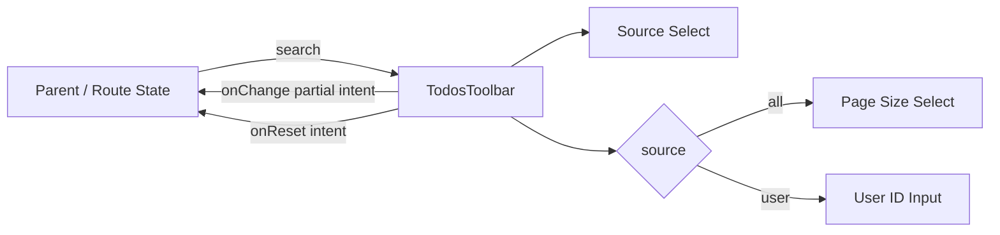
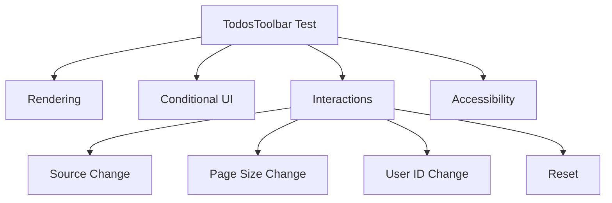
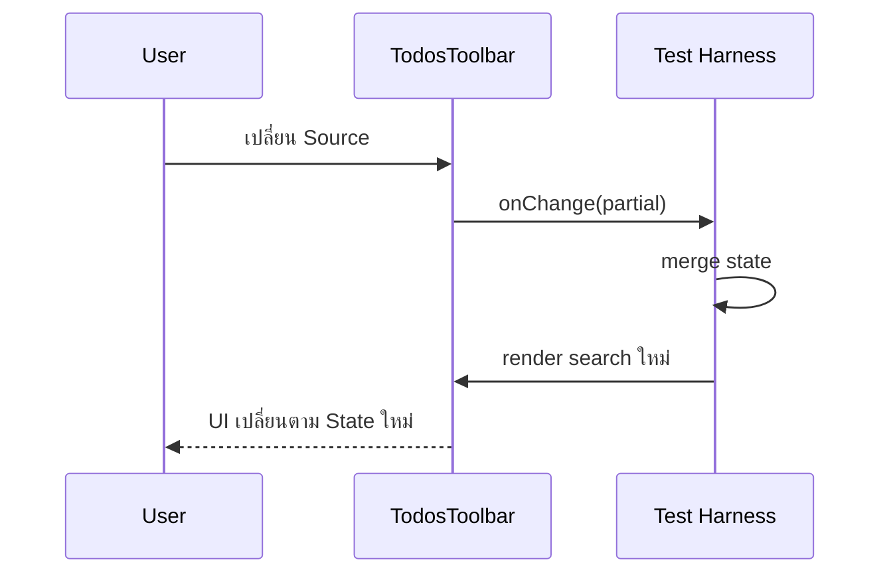
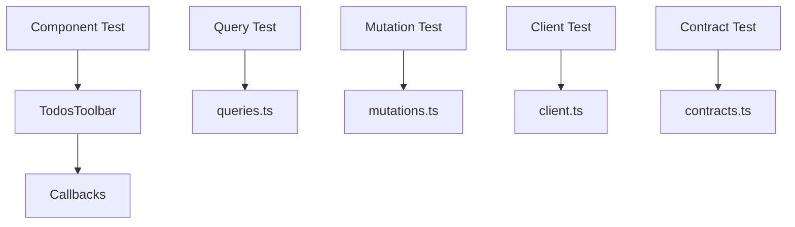
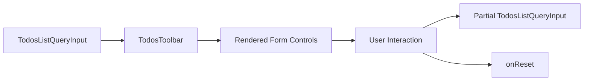

# แนวทางการเขียน Test สำหรับ Todos Toolbar

ไฟล์ Test: `src/features/todos/components/todos-toolbar.test.tsx`

ไฟล์ Production ที่ทดสอบ: `src/features/todos/components/todos-toolbar.tsx`

เอกสารนี้ต่อเนื่องจากหัวข้อ 8 ของ [`docs/GETTING_STARTED.th.md`](../../GETTING_STARTED.th.md) ซึ่งสร้าง `TodosToolbar` สำหรับควบคุม Source, Page Size, User ID และ Reset Intent ของหน้า Todos

เป้าหมายคือสร้าง Component Test ที่ตรวจ **พฤติกรรมที่ผู้ใช้และ Parent Component มองเห็นจริง** ด้วย Vitest + React Testing Library + `user-event` โดยไม่ผูก Test กับ Tailwind class, Router, TanStack Query หรือ HTTP Layer ที่ `TodosToolbar` ไม่ได้เป็นเจ้าของ

---

## 1. ทำความเข้าใจ Responsibility ของ `TodosToolbar`

Implementation จาก Tutorial คือ

```tsx
import type { TodosListQueryInput, TodosListSource } from "../api/queries";
import { Button } from "#/shared/ui/button";

interface TodosToolbarProps {
  search: TodosListQueryInput;
  onChange: (next: Partial<TodosListQueryInput>) => void;
  onReset: () => void;
}

const inputClassName =
  "h-9 rounded-md border border-input bg-background px-3 text-sm outline-none ring-offset-background focus-visible:ring-2 focus-visible:ring-ring";

export function TodosToolbar({ search, onChange, onReset }: TodosToolbarProps) {
  return (
    <div className="grid gap-3 rounded-xl border bg-card p-4 sm:grid-cols-2 lg:grid-cols-4">
      <label className="grid gap-1.5 text-sm">
        <span className="font-medium">แหล่งข้อมูล</span>
        <select
          className={inputClassName}
          value={search.source}
          onChange={(event) => {
            const source = event.target.value as TodosListSource;

            onChange({
              source,
              page: 1,
              userId: source === "user" ? (search.userId ?? 1) : null,
            });
          }}
        >
          <option value="all">Todos ทั้งหมด</option>
          <option value="user">Todos ตาม User</option>
        </select>
      </label>

      {search.source === "user" ? (
        <label className="grid gap-1.5 text-sm">
          <span className="font-medium">User ID</span>
          <input
            className={inputClassName}
            type="number"
            min={1}
            value={search.userId ?? 1}
            onChange={(event) =>
              onChange({
                userId: Number(event.target.value),
                page: 1,
              })
            }
          />
        </label>
      ) : (
        <label className="grid gap-1.5 text-sm">
          <span className="font-medium">จำนวนต่อหน้า</span>
          <select
            className={inputClassName}
            value={search.pageSize}
            onChange={(event) =>
              onChange({
                pageSize: Number(event.target.value),
                page: 1,
              })
            }
          >
            {[5, 10, 20, 30, 50].map((pageSize) => (
              <option key={pageSize} value={pageSize}>
                {pageSize}
              </option>
            ))}
          </select>
        </label>
      )}

      <div className="flex items-end">
        <Button variant="outline" onClick={onReset}>
          ล้างตัวกรอง
        </Button>
      </div>
    </div>
  );
}
```

Component นี้เป็น **Controlled Presentational Component**



สิ่งที่ Toolbar เป็นเจ้าของ:

- แสดงค่าจาก `search`
- แสดง Control ที่เหมาะกับ `search.source`
- แปลง DOM String เป็น Number สำหรับ `pageSize` และ `userId`
- Reset `page` เป็น `1` เมื่อ Filter ที่มีผลต่อ Dataset เปลี่ยน
- Normalize `userId` เมื่อเปลี่ยน Source
- แจ้ง Intent ผ่าน Callback

สิ่งที่ Toolbar **ไม่ได้** เป็นเจ้าของ:

- URL Navigation
- Route Search Validation
- TanStack Query Cache
- API Request
- Zod Runtime Contract ของ HTTP Response
- Mutation

ดังนั้น Test ของไฟล์นี้ไม่ควร Mock Router, QueryClient, Axios หรือ MSW

---

## 2. Behavior Contract ที่ต้องล็อกด้วย Test

กฎหลักจากหัวข้อ 8 คือ

```text
เปลี่ยน Source
  → page = 1

source = all
  → แสดง Page Size
  → userId ไม่ถูกใช้ใน UI

source = user
  → แสดง User ID
  → Page Size ไม่แสดง

เปลี่ยน Page Size
  → pageSize เป็น number
  → page = 1

เปลี่ยน User ID
  → userId เป็น number
  → page = 1

กด Reset
  → เรียก onReset

Toolbar
  → แจ้ง Intent เท่านั้น
  → ไม่เรียก Router โดยตรง
```

Source transition มี normalization เพิ่มเติม

```text
all → user
  userId เดิมมีค่า
    → รักษาค่าเดิม

  userId เดิมเป็น null
    → fallback เป็น 1

user → all
  → userId = null
```

---

## 3. Test Strategy

Test Suite ควรแบ่งเป็น 4 กลุ่ม

1. **Rendering** — Control และค่าที่แสดงตรงกับ `search`
2. **Conditional UI** — `all` และ `user` แสดง Control คนละชุด
3. **Interaction Contract** — User Action ส่ง Partial State ที่ถูกต้องผ่าน `onChange`/`onReset`
4. **Accessibility Contract** — Control ค้นหาได้ด้วย Semantic Role + Accessible Name



### สิ่งที่ไม่ควร Test

ไม่ควรเขียน Assertion เช่น

```ts
expect(element).toHaveClass("grid", "gap-3", "rounded-xl");
```

เพราะ Tailwind class เป็น Implementation Detail การเปลี่ยน Layout โดยไม่เปลี่ยน Behavior ไม่ควรทำให้ Test พัง

ไม่ควร Test ว่า Browser ทำงานตาม HTML Specification เช่น `<select>` สามารถเลือก Option ได้หรือไม่ แต่ควร Test ว่าเมื่อผู้ใช้เลือกแล้ว **Component ส่ง Intent อะไรออกมา**

---

## 4. Test Matrix

| Scenario | Input State | User Action | Expected Result |
| --- | --- | --- | --- |
| All Scope Render | `source=all` | ไม่มี | Source=`all`, แสดง Page Size, ซ่อน User ID |
| User Scope Render | `source=user` | ไม่มี | Source=`user`, แสดง User ID, ซ่อน Page Size |
| User ID Fallback | `source=user`, `userId=null` | ไม่มี | Input แสดง `1` |
| Source Options | ทุก Scope | ไม่มี | มี `all`, `user` |
| Page Size Options | `source=all` | ไม่มี | มี 5, 10, 20, 30, 50 |
| All → User | `userId=null` | เลือก User | `{ source: "user", page: 1, userId: 1 }` |
| All → User Preserve | `userId=9` | เลือก User | `{ source: "user", page: 1, userId: 9 }` |
| User → All | `source=user` | เลือก All | `{ source: "all", page: 1, userId: null }` |
| Page Size | `source=all` | เปลี่ยนขนาดหน้า | `{ pageSize: number, page: 1 }` |
| User ID | `source=user` | เปลี่ยน ID | `{ userId: number, page: 1 }` |
| Reset | ทุก Scope | กดปุ่ม | เรียก `onReset` หนึ่งครั้ง |
| Initial Render | ทุก Scope | ไม่มี | ไม่เรียก Callback โดยไม่มี User Action |
| Accessibility | ทุก Scope | ไม่มี | Query ด้วย role/name ได้ |
| User ID Constraint | `source=user` | ไม่มี | `type=number`, `min=1` |

---

## 5. ติดตั้ง Test Dependencies

Repository ปัจจุบันยังไม่ได้ติดตั้ง Component Test Stack จึงต้องเพิ่ม

```bash
bun add -D \
  vitest \
  @vitest/coverage-v8 \
  jsdom \
  @testing-library/react \
  @testing-library/user-event \
  @testing-library/jest-dom
```

หน้าที่ของแต่ละ Package

| Package | หน้าที่ |
| --- | --- |
| `vitest` | Test Runner และ Assertion |
| `@vitest/coverage-v8` | Coverage Provider |
| `jsdom` | Browser-like DOM Environment |
| `@testing-library/react` | Render และ Query React Component |
| `@testing-library/user-event` | จำลอง User Interaction ระดับสูง |
| `@testing-library/jest-dom` | DOM Matchers เช่น `toBeInTheDocument`, `toHaveValue` |

---

## 6. เพิ่ม Test Scripts

เพิ่ม Script เข้า `package.json` โดยรวมกับ Script เดิม ไม่แทนที่ทั้งหมด

```json
{
  "scripts": {
    "test": "vitest run",
    "test:watch": "vitest",
    "test:coverage": "vitest run --coverage"
  }
}
```

หลังติดตั้ง Dependency ควร Commit `bun.lock` ของโปรเจ็กต์จริงเพื่อให้ Local และ CI ใช้ Dependency Graph เดียวกัน

---

## 7. ตั้งค่า Vitest สำหรับ Component Test

สร้าง `vitest.config.ts` หากโปรเจ็กต์ยังไม่มี

```ts
import { mergeConfig } from "vite";
import { defineConfig } from "vitest/config";

import viteConfig from "./vite.config";

export default mergeConfig(
  viteConfig,
  defineConfig({
    test: {
      environment: "jsdom",
      setupFiles: ["./src/test/setup.ts"],
      clearMocks: true,
      restoreMocks: true,
      coverage: {
        provider: "v8",
        reporter: ["text", "html"],
        include: ["src/**/*.{ts,tsx}"],
        exclude: [
          "src/**/*.d.ts",
          "src/**/*.test.{ts,tsx}",
          "src/routeTree.gen.ts",
          "src/test/**",
        ],
      },
    },
  }),
);
```

เหตุผลที่ใช้ `mergeConfig` คือ Test ควร reuse Vite resolution/plugin configuration ของ Application แทนสร้าง Alias และ React Configuration ซ้ำอีกชุด

---

## 8. ตั้งค่า Testing Library

สร้างหรือแก้ `src/test/setup.ts`

```ts
import "@testing-library/jest-dom/vitest";

import { cleanup } from "@testing-library/react";
import { afterEach } from "vitest";

afterEach(() => {
  cleanup();
});
```

ถ้า `setup.ts` มี MSW lifecycle จาก API Integration Test อยู่แล้ว ให้ **รวม** Configuration เข้าด้วยกัน ไม่ลบของเดิม

ตัวอย่าง

```ts
import "@testing-library/jest-dom/vitest";

import { cleanup } from "@testing-library/react";
import { afterAll, afterEach, beforeAll } from "vitest";

import { server } from "./msw/server";

beforeAll(() => {
  server.listen({ onUnhandledRequest: "error" });
});

afterEach(() => {
  cleanup();
  server.resetHandlers();
});

afterAll(() => {
  server.close();
});
```

`TodosToolbar` ไม่ใช้ MSW แต่ Test Infrastructure กลางสามารถรองรับทั้ง Component Test และ API Integration Test ได้

---

## 9. ทำไมใช้ Stateful Test Harness

`TodosToolbar` เป็น Controlled Component

```tsx
<select value={search.source} onChange={...} />
```

Component ไม่แก้ `search` เอง แต่ส่ง `onChange(next)` ให้ Parent เป็นผู้เปลี่ยน State

ถ้า Test Render แบบนี้

```tsx
<TodosToolbar search={search} onChange={vi.fn()} onReset={vi.fn()} />
```

แล้วพยายาม Interaction ต่อหลาย Step ค่า Prop จะไม่เปลี่ยน เพราะ Test ไม่มี Parent ที่รับ Callback แล้วส่ง State ใหม่กลับลงมา

สำหรับ Test ที่ต้องตรวจ Interaction แบบต่อเนื่องจึงสร้าง Harness เล็ก ๆ ให้ทำหน้าที่เหมือน Parent จริง



Harness ไม่ได้เพิ่ม Business Logic ใหม่ มันเพียง apply Partial State แบบเดียวกับ Parent ที่ Controlled Component ต้องการ

---

## 10. โค้ดฉบับเต็ม: `todos-toolbar.test.tsx`

สร้างไฟล์

```text
src/features/todos/components/todos-toolbar.test.tsx
```

ใช้โค้ดต่อไปนี้

```tsx
import { useState } from "react";
import { fireEvent, render, screen, within } from "@testing-library/react";
import userEvent from "@testing-library/user-event";
import { describe, expect, it, vi } from "vitest";

import type { TodosListQueryInput } from "../api/queries";
import { TodosToolbar } from "./todos-toolbar";

const allSearch = {
  page: 2,
  pageSize: 10,
  source: "all",
  userId: null,
} satisfies TodosListQueryInput;

const userSearch = {
  page: 3,
  pageSize: 10,
  source: "user",
  userId: 7,
} satisfies TodosListQueryInput;

interface ToolbarHarnessProps {
  initialSearch: TodosListQueryInput;
  onChange: (next: Partial<TodosListQueryInput>) => void;
  onReset: () => void;
}

function ToolbarHarness({ initialSearch, onChange, onReset }: ToolbarHarnessProps) {
  const [search, setSearch] = useState(initialSearch);

  return (
    <TodosToolbar
      search={search}
      onChange={(next) => {
        onChange(next);
        setSearch((current) => ({ ...current, ...next }));
      }}
      onReset={onReset}
    />
  );
}

function renderToolbar(initialSearch: TodosListQueryInput = allSearch) {
  const onChange = vi.fn<(next: Partial<TodosListQueryInput>) => void>();
  const onReset = vi.fn<() => void>();
  const user = userEvent.setup();

  render(
    <ToolbarHarness initialSearch={initialSearch} onChange={onChange} onReset={onReset} />,
  );

  return {
    user,
    onChange,
    onReset,
  };
}

describe("TodosToolbar", () => {
  describe("rendering", () => {
    it("renders all scope with source and page-size controls", () => {
      renderToolbar(allSearch);

      const sourceSelect = screen.getByRole("combobox", { name: "แหล่งข้อมูล" });
      const pageSizeSelect = screen.getByRole("combobox", { name: "จำนวนต่อหน้า" });

      expect(sourceSelect).toHaveValue("all");
      expect(pageSizeSelect).toHaveValue("10");
      expect(screen.queryByRole("spinbutton", { name: "User ID" })).not.toBeInTheDocument();
      expect(screen.getByRole("button", { name: "ล้างตัวกรอง" })).toBeInTheDocument();
    });

    it("renders exactly the supported source options", () => {
      renderToolbar(allSearch);

      const sourceSelect = screen.getByRole("combobox", { name: "แหล่งข้อมูล" });
      const options = within(sourceSelect).getAllByRole("option");

      expect(options).toHaveLength(2);
      expect(options.map((option) => (option as HTMLOptionElement).value)).toEqual([
        "all",
        "user",
      ]);
      expect(within(sourceSelect).getByRole("option", { name: "Todos ทั้งหมด" })).toHaveValue(
        "all",
      );
      expect(within(sourceSelect).getByRole("option", { name: "Todos ตาม User" })).toHaveValue(
        "user",
      );
    });

    it("renders exactly the supported page-size options in all scope", () => {
      renderToolbar(allSearch);

      const pageSizeSelect = screen.getByRole("combobox", { name: "จำนวนต่อหน้า" });
      const values = within(pageSizeSelect)
        .getAllByRole("option")
        .map((option) => Number((option as HTMLOptionElement).value));

      expect(values).toEqual([5, 10, 20, 30, 50]);
    });

    it("renders user scope with user-id control and hides page-size control", () => {
      renderToolbar(userSearch);

      const sourceSelect = screen.getByRole("combobox", { name: "แหล่งข้อมูล" });
      const userIdInput = screen.getByRole("spinbutton", { name: "User ID" });

      expect(sourceSelect).toHaveValue("user");
      expect(userIdInput).toHaveValue(7);
      expect(userIdInput).toHaveAttribute("type", "number");
      expect(userIdInput).toHaveAttribute("min", "1");
      expect(screen.queryByRole("combobox", { name: "จำนวนต่อหน้า" })).not.toBeInTheDocument();
    });

    it("falls back to user id 1 when user scope receives null", () => {
      renderToolbar({
        ...userSearch,
        userId: null,
      });

      expect(screen.getByRole("spinbutton", { name: "User ID" })).toHaveValue(1);
    });

    it("does not call callbacks during initial render", () => {
      const { onChange, onReset } = renderToolbar(allSearch);

      expect(onChange).not.toHaveBeenCalled();
      expect(onReset).not.toHaveBeenCalled();
    });
  });

  describe("source changes", () => {
    it("switches from all to user, resets page, and falls back userId to 1", async () => {
      const { user, onChange } = renderToolbar({
        ...allSearch,
        page: 4,
        userId: null,
      });

      await user.selectOptions(screen.getByRole("combobox", { name: "แหล่งข้อมูล" }), "user");

      expect(onChange).toHaveBeenCalledTimes(1);
      expect(onChange).toHaveBeenLastCalledWith({
        source: "user",
        page: 1,
        userId: 1,
      });

      expect(screen.getByRole("combobox", { name: "แหล่งข้อมูล" })).toHaveValue("user");
      expect(screen.getByRole("spinbutton", { name: "User ID" })).toHaveValue(1);
      expect(screen.queryByRole("combobox", { name: "จำนวนต่อหน้า" })).not.toBeInTheDocument();
    });

    it("preserves an existing non-null userId when switching from all to user", async () => {
      const { user, onChange } = renderToolbar({
        ...allSearch,
        userId: 9,
      });

      await user.selectOptions(screen.getByRole("combobox", { name: "แหล่งข้อมูล" }), "user");

      expect(onChange).toHaveBeenLastCalledWith({
        source: "user",
        page: 1,
        userId: 9,
      });
      expect(screen.getByRole("spinbutton", { name: "User ID" })).toHaveValue(9);
    });

    it("switches from user to all, resets page, and clears userId", async () => {
      const { user, onChange } = renderToolbar({
        ...userSearch,
        page: 5,
        userId: 12,
      });

      await user.selectOptions(screen.getByRole("combobox", { name: "แหล่งข้อมูล" }), "all");

      expect(onChange).toHaveBeenCalledTimes(1);
      expect(onChange).toHaveBeenLastCalledWith({
        source: "all",
        page: 1,
        userId: null,
      });

      expect(screen.getByRole("combobox", { name: "แหล่งข้อมูล" })).toHaveValue("all");
      expect(screen.getByRole("combobox", { name: "จำนวนต่อหน้า" })).toBeInTheDocument();
      expect(screen.queryByRole("spinbutton", { name: "User ID" })).not.toBeInTheDocument();
    });
  });

  describe("page-size changes", () => {
    it.each([5, 20, 30, 50])(
      "emits pageSize=%i as a number and resets page to 1",
      async (pageSize) => {
        const { user, onChange } = renderToolbar({
          ...allSearch,
          page: 4,
          pageSize: 10,
        });

        const pageSizeSelect = screen.getByRole("combobox", { name: "จำนวนต่อหน้า" });

        await user.selectOptions(pageSizeSelect, String(pageSize));

        expect(onChange).toHaveBeenCalledTimes(1);
        expect(onChange).toHaveBeenLastCalledWith({
          pageSize,
          page: 1,
        });
        expect(pageSizeSelect).toHaveValue(String(pageSize));
      },
    );
  });

  describe("user-id changes", () => {
    it.each([1, 12, 99])(
      "emits userId=%i as a number and resets page to 1",
      (userId) => {
        const { onChange } = renderToolbar({
          ...userSearch,
          page: 4,
          userId: 7,
        });

        const userIdInput = screen.getByRole("spinbutton", { name: "User ID" });

        fireEvent.change(userIdInput, {
          target: { value: String(userId) },
        });

        expect(onChange).toHaveBeenCalledTimes(1);
        expect(onChange).toHaveBeenLastCalledWith({
          userId,
          page: 1,
        });
        expect(userIdInput).toHaveValue(userId);
      },
    );
  });

  describe("reset", () => {
    it("calls onReset when the reset button is clicked", async () => {
      const { user, onChange, onReset } = renderToolbar(userSearch);

      await user.click(screen.getByRole("button", { name: "ล้างตัวกรอง" }));

      expect(onReset).toHaveBeenCalledTimes(1);
      expect(onChange).not.toHaveBeenCalled();
    });

    it("calls onReset once per user click", async () => {
      const { user, onReset } = renderToolbar(allSearch);
      const resetButton = screen.getByRole("button", { name: "ล้างตัวกรอง" });

      await user.click(resetButton);
      await user.click(resetButton);

      expect(onReset).toHaveBeenCalledTimes(2);
    });
  });

  describe("accessibility contract", () => {
    it("exposes all-scope controls through semantic roles and labels", () => {
      renderToolbar(allSearch);

      expect(screen.getByRole("combobox", { name: "แหล่งข้อมูล" })).toBeEnabled();
      expect(screen.getByRole("combobox", { name: "จำนวนต่อหน้า" })).toBeEnabled();
      expect(screen.getByRole("button", { name: "ล้างตัวกรอง" })).toBeEnabled();
    });

    it("exposes user-scope controls through semantic roles and labels", () => {
      renderToolbar(userSearch);

      expect(screen.getByRole("combobox", { name: "แหล่งข้อมูล" })).toBeEnabled();
      expect(screen.getByRole("spinbutton", { name: "User ID" })).toBeEnabled();
      expect(screen.getByRole("button", { name: "ล้างตัวกรอง" })).toBeEnabled();
    });
  });
});
```

---

## 11. อธิบาย Test Harness

Fixture หลักใช้ `satisfies TodosListQueryInput`

```ts
const allSearch = {
  page: 2,
  pageSize: 10,
  source: "all",
  userId: null,
} satisfies TodosListQueryInput;
```

ข้อดีคือ TypeScript ตรวจ Fixture ให้ตรง Production Type โดยไม่บังคับให้ Variable ถูก widen เป็น Interface ทั้งก้อนโดยไม่จำเป็น

Harness ใช้

```ts
setSearch((current) => ({ ...current, ...next }));
```

เพื่อจำลอง Parent ที่รับ `Partial<TodosListQueryInput>` จาก Toolbar แล้วส่ง State ใหม่กลับเข้ามา

จึงสามารถ Test Flow จริงได้ เช่น

```text
all
  → user selects User Scope
  → onChange({ source: "user", page: 1, userId: 1 })
  → Harness merge state
  → Toolbar re-render
  → User ID ปรากฏ
```

---

## 12. ทำไมใช้ `getByRole` มากกว่า `getByText`

ตัวอย่างที่แนะนำ

```ts
screen.getByRole("combobox", { name: "แหล่งข้อมูล" });
```

ดีกว่า

```ts
screen.getByText("แหล่งข้อมูล");
```

เพราะ Test แรกพิสูจน์พร้อมกันว่า

- Control เป็น Semantic Form Control
- Label เชื่อมกับ Control ได้จริง
- Accessible Name ถูกต้อง
- User ที่ใช้ Assistive Technology สามารถระบุ Control ได้

`<label>` ของ Component ครอบ `<select>`/`<input>` โดยตรง จึงสร้าง Accessible Name จากข้อความใน Label ได้โดยไม่ต้องใช้ `id` + `htmlFor`

---

## 13. ทำไมใช้ `userEvent` สำหรับ Select และ Button

`userEvent` จำลอง Interaction ใกล้พฤติกรรมของผู้ใช้มากกว่า `fireEvent`

```ts
await user.selectOptions(sourceSelect, "user");
await user.click(resetButton);
```

เหมาะกับ Interaction ที่มี semantic behavior ชัดเจน เช่น Select และ Button

สำหรับ Number Input ใน Test Suite นี้ใช้

```ts
fireEvent.change(userIdInput, {
  target: { value: "12" },
});
```

โดยตั้งใจ เพราะ Test ต้องการ isolate Contract นี้โดยตรง

```text
DOM event.target.value = "12"
           ↓
Number("12")
           ↓
onChange({ userId: 12, page: 1 })
```

หากใช้ `user.clear()` + `user.type()` กับ Controlled Numeric Input จะเกิด Intermediate Events หลายครั้ง เช่นค่าว่างก่อนพิมพ์เลขใหม่ ซึ่งไม่ใช่สิ่งที่ Test Case นี้ต้องการพิสูจน์

---

## 14. ทำไมต้อง Test ว่าค่าเป็น Number

DOM Form Controls คืนค่าเป็น String เสมอ

```ts
event.target.value; // string
```

แต่ `TodosListQueryInput` ต้องการ

```ts
pageSize: number;
userId: number | null;
```

Component จึงทำ

```ts
Number(event.target.value)
```

Test นี้

```ts
expect(onChange).toHaveBeenLastCalledWith({
  pageSize: 20,
  page: 1,
});
```

จงใจใช้ `20` ไม่ใช่ `"20"`

ถ้ามี Regression แล้ว Component ส่ง String ออกมา Test จะ Fail ทันที ก่อนข้อมูลผิด Type จะไหลไปถึง Route หรือ Query Layer

---

## 15. ทำไมทุก Filter Change ต้อง Reset Page

สมมติผู้ใช้อยู่หน้า 5

```text
page = 5
pageSize = 10
```

แล้วเปลี่ยน Page Size เป็น 50 หรือเปลี่ยน Source เป็น User Dataset ใหม่อาจมีเพียงหน้าเดียว

หากยังรักษา `page = 5` จะเกิด State ที่ไม่สมเหตุสมผล

ดังนั้น Component ส่ง

```ts
{
  pageSize: 50,
  page: 1,
}
```

หรือ

```ts
{
  source: "user",
  userId: 1,
  page: 1,
}
```

ทุก Test ของ Source/Page Size/User ID จึงต้อง Assert `page: 1` ด้วย ไม่ใช่ตรวจเฉพาะ Field ที่ผู้ใช้แก้

---

## 16. Source Normalization Cases

### `all → user` เมื่อ `userId === null`

Code

```ts
userId: source === "user" ? (search.userId ?? 1) : null
```

ผลคือ

```text
null
  ↓ ?? 1
1
```

ดังนั้น Callback ต้องเป็น

```ts
{
  source: "user",
  page: 1,
  userId: 1,
}
```

### `all → user` เมื่อมี User ID เดิม

แม้ Route ปกติจะ Normalize All Scope ให้ `userId=null` แต่ Component รองรับ State ที่มีค่าเดิมอยู่

```ts
{
  source: "all",
  userId: 9,
}
```

เมื่อเปลี่ยนเป็น User Scope จะรักษา `9`

```ts
{
  source: "user",
  page: 1,
  userId: 9,
}
```

Test Case นี้ล็อก Branch ของ `search.userId ?? 1` ให้ครบ

### `user → all`

ต้องล้าง User ID

```ts
{
  source: "all",
  page: 1,
  userId: null,
}
```

เพื่อไม่ให้ State ที่ไม่เกี่ยวกับ All Resource ติดไปต่อ

---

## 17. Conditional Rendering

Toolbar ใช้ Branch เดียวกันในการตัดสินว่าแสดง Page Size หรือ User ID

```tsx
search.source === "user" ? <UserIdInput /> : <PageSizeSelect />
```

ดังนั้น Test ต้องตรวจทั้ง Positive และ Negative Assertion

All Scope

```ts
expect(screen.getByRole("combobox", { name: "จำนวนต่อหน้า" })).toBeInTheDocument();
expect(screen.queryByRole("spinbutton", { name: "User ID" })).not.toBeInTheDocument();
```

User Scope

```ts
expect(screen.getByRole("spinbutton", { name: "User ID" })).toBeInTheDocument();
expect(screen.queryByRole("combobox", { name: "จำนวนต่อหน้า" })).not.toBeInTheDocument();
```

เหตุผลที่ต้องตรวจด้านที่ไม่ควรอยู่ด้วย เพราะ Regression บางแบบอาจทำให้ Control ทั้งสองแสดงพร้อมกัน ซึ่ง Positive Assertion อย่างเดียวตรวจไม่พบ

---

## 18. User ID Constraint และ Runtime Validation Boundary

Input ระบุ

```tsx
<input type="number" min={1} />
```

Test จึงตรวจ

```ts
expect(userIdInput).toHaveAttribute("type", "number");
expect(userIdInput).toHaveAttribute("min", "1");
```

แต่ต้องเข้าใจว่า

```text
min=1
```

เป็น Browser/UI Constraint ไม่ใช่ Runtime Domain Validation

Component ปัจจุบันยังสามารถคำนวณ

```ts
Number("") // 0
Number("0") // 0
```

ได้หาก Event ถูกส่งเข้ามา

ดังนั้นไม่ควรเขียน Test ที่สมมติว่า Toolbar เป็นผู้ Reject Invalid User ID เพราะ Responsibility นั้นอยู่ที่ Route/Search Validation Boundary ตาม Architecture ของ Tutorial

หาก Product Requirement เปลี่ยนและต้อง Block Invalid Value ใน Component จริง ควรแก้ Production Code ก่อน แล้วเพิ่ม Test ตาม Behavior ใหม่

---

## 19. Reset Contract

ปุ่ม Reset ไม่คำนวณ Default State เอง

```tsx
<Button onClick={onReset}>ล้างตัวกรอง</Button>
```

นี่เป็น Design ที่ดีเพราะ Default Search State เป็น Responsibility ของ Parent/Route

Toolbar เพียงส่ง Intent

```text
User click Reset
      ↓
TodosToolbar
      ↓
onReset()
      ↓
Parent ตัดสินว่าจะ reset เป็นค่าใด
```

Test จึงควร Assert เพียง

```ts
expect(onReset).toHaveBeenCalledTimes(1);
expect(onChange).not.toHaveBeenCalled();
```

ไม่ควรคาดว่า Toolbar จะเปลี่ยนเป็น `{ page: 1, pageSize: 10, ... }` เอง เพราะ Production Code ไม่ได้เป็นเจ้าของ Default State

---

## 20. ทำไมไม่ต้องมี RouterProvider ใน Test

Test Suite นี้ Render

```tsx
<TodosToolbar ... />
```

ได้โดยตรงโดยไม่มี

```tsx
<RouterProvider />
```

นี่เป็นคุณสมบัติทาง Architecture ที่ดี เพราะ Section 8 ระบุว่า Component แจ้ง Intent ผ่าน Callback และไม่เรียก Router โดยตรง

ผลคือ

- Test เบา
- Setup น้อย
- Component reuse ได้
- ไม่ผูก Presentation Layer กับ Navigation Infrastructure

หากในอนาคต Toolbar เริ่ม Import `useNavigate()` โดยตรง Test นี้จะเริ่มต้องมี Router Context ซึ่งเป็นสัญญาณว่าควรทบทวน Component Boundary ก่อนเพิ่ม Test Infrastructure เพื่อรองรับ Coupling ใหม่

---

## 21. Test Isolation ระหว่าง Layer

หลังเพิ่ม Test นี้ Test Architecture ของ Todos จะเป็น

```text
contracts.test.ts
  → Zod Contract

client.test.ts
  → Axios / HTTP / MSW

queries.test.ts
  → Query Key / Query Options / Read Cache

mutations.test.ts
  → Mutation / Write Cache Policy

todos-toolbar.test.tsx
  → Toolbar Rendering / Interaction / Callback Contract
```



แต่ละ Test Layer จึง Fail ด้วยเหตุผลที่เจาะจงมากขึ้น

---

## 22. รัน Test

รันเฉพาะ Toolbar

```bash
bunx vitest run src/features/todos/components/todos-toolbar.test.tsx
```

รันทุก Test

```bash
bun run test
```

Watch Mode

```bash
bun run test:watch
```

Coverage

```bash
bun run test:coverage
```

เฉพาะ Toolbar พร้อม Coverage

```bash
bunx vitest run src/features/todos/components/todos-toolbar.test.tsx --coverage
```

---

## 23. Coverage ที่ควรได้จาก Test Suite นี้

Test Suite ฉบับเต็มครอบคลุม Branch สำคัญของ Component

```text
source === user
├── true
└── false

source change
├── source = user
│   ├── search.userId != null
│   └── search.userId == null
└── source = all

conditional control
├── User ID
└── Page Size

callbacks
├── onChange: source
├── onChange: pageSize
├── onChange: userId
└── onReset
```

เป้าหมายไม่ใช่ไล่ตัวเลข Coverage ให้ 100% โดยไม่สนคุณภาพ แต่ Test ชุดนี้ควรครอบคลุม Branch ทางธุรกิจของ Toolbar เกือบทั้งหมดตาม Implementation ปัจจุบัน

---

## 24. Production Edge Cases ที่ควรรู้ แต่ไม่ควรยัดเข้า Test นี้โดยผิด Layer

### Invalid URL/Search State

เช่น

```text
page = -1
pageSize = 999
userId = 0
source = unknown
```

ควร Test ที่ Route Search Schema ไม่ใช่ Toolbar

### Navigation

เช่น Source Change แล้ว URL เปลี่ยนหรือไม่ ควร Test Route/Integration Layer เพราะ Toolbar เพียง Emit Callback

### Query Refetch

เช่นเปลี่ยน `pageSize` แล้ว Query Key ใหม่ทำให้ Fetch หรือไม่ เป็น Responsibility ของ Query/Route Integration

### API Error

Toolbar ไม่มี API Request จึงไม่ควรมี MSW Handler หรือ HTTP Error Test ในไฟล์นี้

### CSS Responsive Layout

Tailwind breakpoint เช่น

```text
sm:grid-cols-2
lg:grid-cols-4
```

ไม่เหมาะกับ jsdom Behavior Test หาก Responsive Layout เป็น Critical Requirement ให้ใช้ Browser/E2E หรือ Visual Regression Test

---

## 25. Regression Cases ที่ Test Suite นี้ป้องกัน

Test จะจับ Regression เช่น

- เปลี่ยน Source แล้วลืม Reset Page
- เปลี่ยนเป็น User Scope แล้ว `userId` ยังเป็น `null`
- เปลี่ยนกลับ All Scope แต่ลืมล้าง `userId`
- Page Size ถูกส่งเป็น String
- User ID ถูกส่งเป็น String
- User Scope ยังแสดง Page Size
- All Scope ยังแสดง User ID
- ลบ Option 20/30/50 โดยไม่ตั้งใจ
- Label หลุดจาก Form Control ทำให้ Accessible Name หาย
- Reset ไปเรียก `onChange` แทน `onReset`
- Initial Render ยิง Callback โดยไม่มี User Action

---

## 26. Production Checklist

ก่อนถือว่า `todos-toolbar.test.tsx` พร้อมใช้งานจริง ให้ตรวจ

- [ ] ใช้ `jsdom` สำหรับ Component Test
- [ ] Import `@testing-library/jest-dom/vitest`
- [ ] Query Element ด้วย Semantic Role + Accessible Name
- [ ] ใช้ `userEvent` สำหรับ User Interaction ที่เหมาะสม
- [ ] Test `all` และ `user` Scope ทั้งคู่
- [ ] Test Source Transition ทั้งสองทิศทาง
- [ ] Test `userId ?? 1` ทั้ง Branch มีค่าและ `null`
- [ ] Test Page Size ทุก Option ที่รองรับ
- [ ] Test `Number(...)` Conversion ของ Page Size
- [ ] Test `Number(...)` Conversion ของ User ID
- [ ] Test ทุก Filter Change ว่า Reset `page` เป็น 1
- [ ] Test Conditional Rendering แบบ Positive + Negative
- [ ] Test Reset Callback
- [ ] ไม่ Assert Tailwind Class โดยไม่จำเป็น
- [ ] ไม่ Mock Router/Query/API ที่ Component ไม่ได้ใช้
- [ ] ไม่ย้าย URL Validation Responsibility มาไว้ใน Toolbar Test
- [ ] รัน `bun run test`
- [ ] รัน `bun run typecheck`
- [ ] รัน `bun run lint`
- [ ] รัน `bun run format:check`

---

## 27. สรุป Architecture

Test ที่ดีของ `TodosToolbar` ไม่ได้ถามว่า

> JSX ภายในเขียนอย่างไร?

แต่ถามว่า

> เมื่อ Parent ส่ง State นี้เข้ามา ผู้ใช้เห็น Control อะไร และเมื่อผู้ใช้ทำ Action นี้ Component ส่ง Intent อะไรกลับออกไป?

Boundary ที่ต้องรักษาคือ



เมื่อ Test ยึด Boundary นี้ การเปลี่ยน Styling, Layout หรือ Internal JSX ที่ไม่กระทบ Behavior จะไม่ทำให้ Test พังโดยไม่จำเป็น แต่ Regression ที่กระทบ User Flow, State Normalization, Type Conversion และ Accessibility จะถูกตรวจพบได้ทันที
