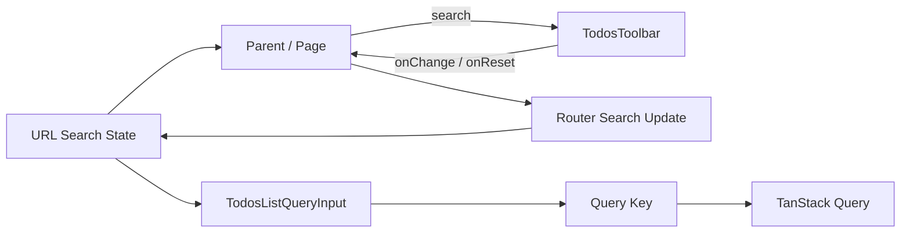
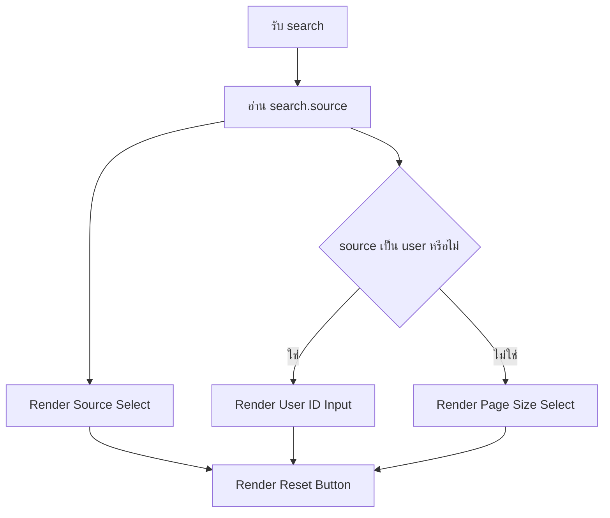
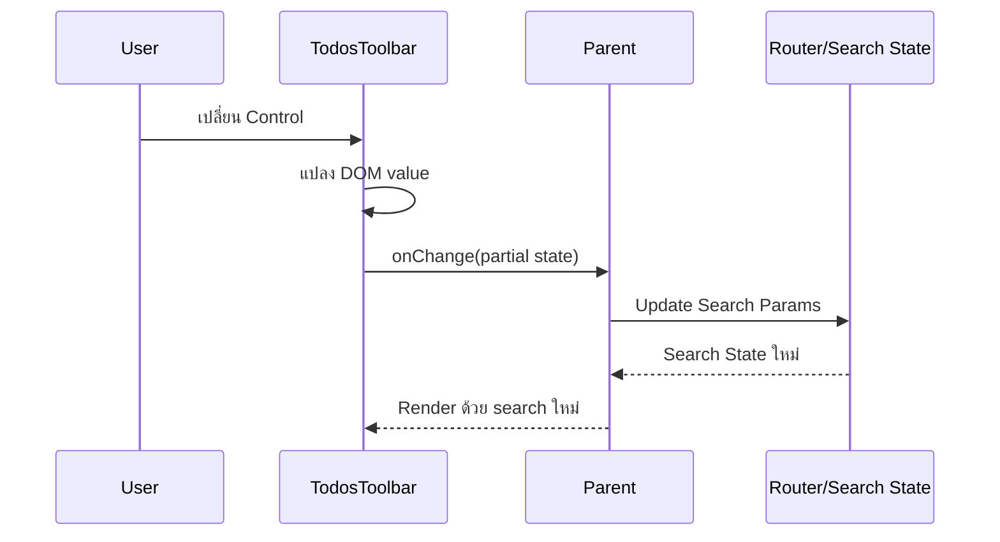
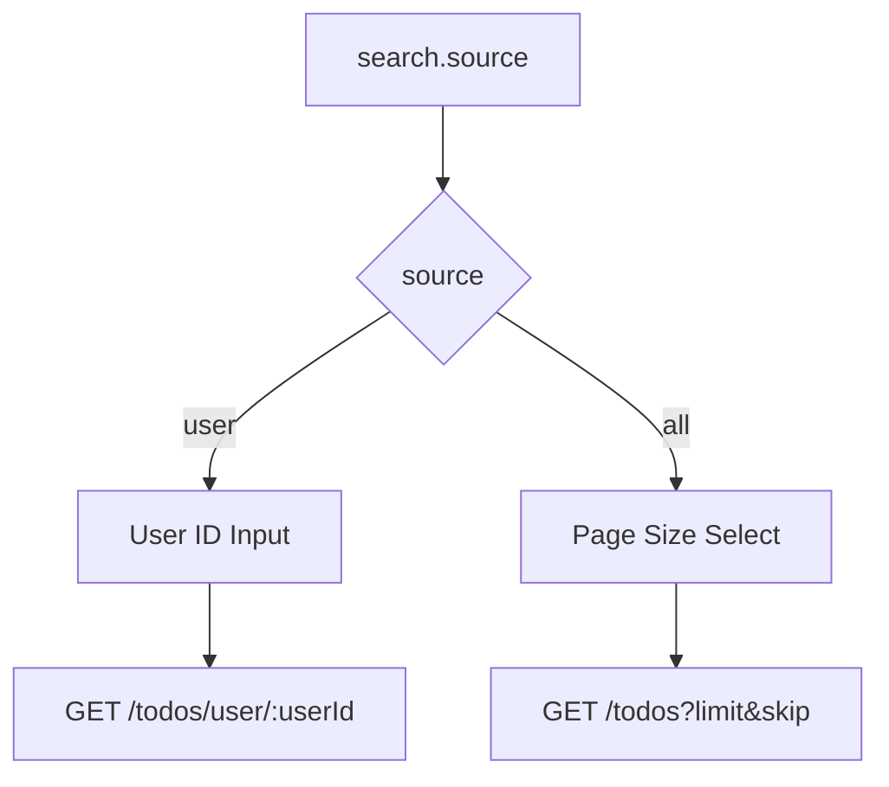
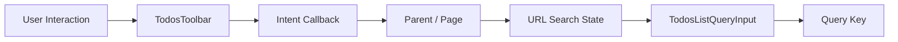
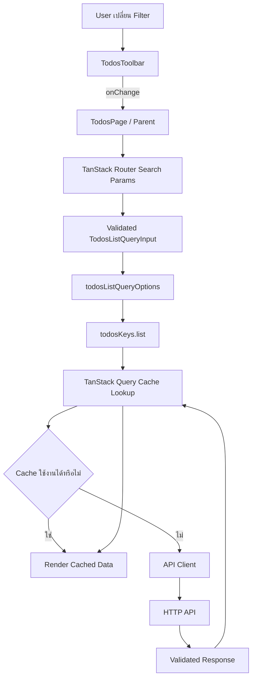
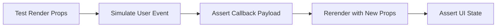

# คำอธิบายเพิ่มเติมเกี่ยวกับ TodosToolbar

ไฟล์: `src/features/todos/components/todos-toolbar.tsx`

## ภาพรวม

`TodosToolbar` เป็น Component สำหรับควบคุมเงื่อนไขการแสดงรายการ Todos เช่น

- เลือกว่าจะดู Todos ทั้งหมด หรือ Todos ของ User คนใดคนหนึ่ง
- กำหนดจำนวนรายการต่อหน้าในโหมด Todos ทั้งหมด
- เปลี่ยน User ID ในโหมด Todos ตาม User
- Reset ตัวกรองกลับไปเป็นค่าเริ่มต้น

จุดสำคัญที่สุดคือ Component นี้ **ไม่ได้เป็นเจ้าของ URL State และไม่ได้เรียก Router โดยตรง** แต่รับ State ปัจจุบันผ่าน `search` และส่ง Intent กลับไปยัง Parent ผ่าน `onChange` และ `onReset`

```text
Parent / Page
  → ส่ง search ปัจจุบัน
  → TodosToolbar
  → ผู้ใช้เปลี่ยนค่า
  → onChange(...)
  → Parent / Page
  → Update URL Search State
  → Query Input เปลี่ยน
  → Query Key เปลี่ยน
  → TanStack Query อ่าน Cache หรือ Fetch ข้อมูลใหม่
```

แนวทางนี้ทำให้ Toolbar ไม่ผูกติดกับ TanStack Router, TanStack Query หรือ HTTP API โดยตรง และสามารถทดสอบ Interaction ของ Component ได้โดยส่ง Props จำลองเข้าไป



มองในเชิง Architecture แล้ว `TodosToolbar` อยู่ใน Feature UI Layer และทำหน้าที่แปลง User Interaction ให้เป็น Intent เท่านั้น

```text
UI Event
  → Intent
  → Parent Orchestration
  → URL State
  → Query State
  → Server State
```

ไม่ควรกลายเป็น

```text
UI Event
  → Router
  → QueryClient
  → Axios
  → API
```

เพราะจะทำให้ Presentation Component รู้จัก Infrastructure มากเกินไปและเกิด Coupling สูง

---

## Component Contract

### Props

Component รับ Props ผ่าน `TodosToolbarProps`

```ts
interface TodosToolbarProps {
  search: TodosListQueryInput;
  onChange: (next: Partial<TodosListQueryInput>) => void;
  onReset: () => void;
}
```

มี Contract หลัก 3 รายการ

#### `search`

```ts
search: TodosListQueryInput;
```

เป็น State ปัจจุบันของหน้ารายการ Todos

Type มาจาก Query Layer:

```ts
interface TodosListQueryInput {
  page: number;
  pageSize: number;
  source: "all" | "user";
  userId: number | null;
}
```

Toolbar ใช้ค่าดังกล่าวเพื่อกำหนดว่า UI ควรแสดงอะไรและ Control แต่ละตัวควรมีค่าอะไร

ตัวอย่าง

```ts
{
  page: 2,
  pageSize: 20,
  source: "all",
  userId: null,
}
```

UI จะอยู่ในโหมด Todos ทั้งหมด และแสดง Select สำหรับ `pageSize`

อีกตัวอย่าง

```ts
{
  page: 1,
  pageSize: 20,
  source: "user",
  userId: 5,
}
```

UI จะอยู่ในโหมด User Scope และแสดง Input สำหรับ `userId`

`search` จึงเป็น **Input State** ไม่ใช่ State ที่ Toolbar เป็นเจ้าของเอง

#### `onChange`

```ts
onChange: (next: Partial<TodosListQueryInput>) => void;
```

เป็น Callback สำหรับแจ้ง Parent ว่าผู้ใช้ต้องการเปลี่ยน Search State บางส่วน

ใช้ `Partial<TodosListQueryInput>` เพราะ Toolbar ไม่จำเป็นต้องส่ง Object ครบทุก Field ทุกครั้ง

ตัวอย่างเมื่อเปลี่ยน Page Size:

```ts
onChange({
  pageSize: 20,
  page: 1,
});
```

Component ไม่ต้องรู้ว่า Parent จะนำข้อมูลนี้ไปทำอะไร Parent อาจ

- Update TanStack Router Search Params
- Merge เข้ากับ State ปัจจุบัน
- Log Analytics
- ใช้ใน Story/Test Harness

นี่เป็นรูปแบบที่เรียกว่า **Intent Callback**

```text
Component บอกว่า "ผู้ใช้ต้องการเปลี่ยนค่า"

แต่ไม่ได้เป็นผู้ตัดสินใจว่า
"Application ต้องเก็บค่านั้นไว้ที่ไหน"
```

#### `onReset`

```ts
onReset: () => void;
```

แจ้ง Parent ว่าผู้ใช้ต้องการล้างตัวกรอง

Toolbar ไม่กำหนด Default State เอง เช่นไม่เขียนว่า

```ts
onChange({
  page: 1,
  pageSize: 10,
  source: "all",
  userId: null,
});
```

แต่ส่ง `onReset()` กลับไปแทน

ข้อดีคือ Default Search Policy ยังคงอยู่ที่ Boundary ที่เหมาะสม เช่น Route หรือ Page Orchestration ไม่กระจายซ้ำอยู่ใน Component

---

### Local State

`TodosToolbar` **ไม่มี Local State**

ไม่มี

```ts
useState(...)
```

เพราะค่าที่ Control แสดงต้องสะท้อน State ที่เป็น Canonical ของหน้าจอ ซึ่งใน Architecture นี้คือ URL Search State ที่ Parent ส่งเข้ามาผ่าน `search`

ดังนั้น Inputs ใน Toolbar เป็น Controlled Inputs

```tsx
<select value={search.source} ... />
```

```tsx
<input value={search.userId ?? 1} ... />
```

```tsx
<select value={search.pageSize} ... />
```

แนวทางนี้สำคัญเพราะถ้า Toolbar เก็บ Filter ซ้ำใน Local State จะมี State สองชุด

```text
URL Search State
        +
Toolbar Local State
```

ซึ่งอาจไม่ตรงกันเมื่อ

- ผู้ใช้ Refresh หน้า
- กด Back / Forward
- เปิด URL จาก Bookmark
- Parent เปลี่ยน Search State จากที่อื่น
- Route Normalize Search Params

โครงสร้างปัจจุบันจึงใช้

```text
URL / Parent State = Source of Truth
Toolbar = Controlled View
```

---

### External Dependencies

ไฟล์นี้มี Dependency เพียงสองกลุ่ม

```ts
import type { TodosListQueryInput, TodosListSource } from "../api/queries";
import { Button } from "#/shared/ui/button";
```

#### Feature Query Types

```ts
TodosListQueryInput
TodosListSource
```

Toolbar รู้จัก Type ของ Query Input เพราะ UI นี้กำลังแก้ไขเงื่อนไขเดียวกับที่ Query Layer ใช้ในการระบุ Resource

อย่างไรก็ตาม Component **ไม่ได้ Import**

- `todosListQueryOptions`
- `useQuery`
- `QueryClient`
- Axios
- API Client

จึงยังรักษา Dependency Boundary ได้ดี

#### Shared UI

```ts
Button
```

ใช้ Shared UI Primitive สำหรับปุ่ม Reset เพื่อให้ Visual Style และ Interaction Pattern สอดคล้องกับทั้ง Application

ส่วน `<select>`, `<input>` และ `<label>` ใช้ Native HTML Element โดยตรง

ข้อดีคือ

- Semantic HTML ชัดเจน
- Keyboard interaction ใช้งานได้ตาม Browser มาตรฐาน
- ไม่เพิ่ม Client-side Complexity โดยไม่จำเป็น

---

## Logic Breakdown

### Input State

เมื่อ Component Render จะได้รับ

```ts
{
  search,
  onChange,
  onReset,
}
```

จาก Parent

ลำดับการตัดสินใจหลักคือ



`source` จึงเป็น Discriminator หลักของ Toolbar

```text
source = all
  → ใช้ page + pageSize
  → userId ไม่เกี่ยวข้อง

source = user
  → ใช้ userId
  → pageSize ไม่ถูกใช้โดย Endpoint นี้
```

นี่สอดคล้องกับ Query Layer ที่ Normalize Query Key ต่างกันตาม `source`

---

### User Interaction

Toolbar รองรับ Interaction หลัก 4 แบบ

1. เปลี่ยน Source
2. เปลี่ยน User ID
3. เปลี่ยน Page Size
4. Reset Filter

ทุก Interaction มี Pattern เดียวกัน

```text
DOM Event
  → แปลงค่าจาก Event
  → สร้าง Partial<TodosListQueryInput>
  → เรียก Callback
  → Parent เป็นผู้ Update State จริง
```

ตัวอย่าง Source Change:

```tsx
onChange={(event) => {
  const source = event.target.value as TodosListSource;

  onChange({
    source,
    page: 1,
    userId: source === "user" ? (search.userId ?? 1) : null,
  });
}}
```

ตัวอย่าง Page Size Change:

```tsx
onChange={(event) =>
  onChange({
    pageSize: Number(event.target.value),
    page: 1,
  })
}
```

Toolbar ไม่ได้ Update `search` โดยตรง เพราะ Props เป็น Read-only Input จาก Parent



---

### `onChange`

`onChange` เป็นแกนสำคัญของการ Decouple Toolbar ออกจาก Router

Component ส่งเฉพาะ Field ที่มีการเปลี่ยน

#### เปลี่ยน Source เป็น User

```ts
onChange({
  source: "user",
  page: 1,
  userId: search.userId ?? 1,
});
```

ถ้า `userId` เดิมเป็น `null` จะใช้ `1` เป็นค่าเริ่มต้น

เหตุผลคือ User Scope ต้องมี User ID จึงจะสร้าง Request ที่สมบูรณ์ได้

#### เปลี่ยน Source เป็น All

```ts
onChange({
  source: "all",
  page: 1,
  userId: null,
});
```

เมื่อกลับสู่ All Scope ค่า `userId` ไม่มีความหมายกับ Resource นี้ จึงถูก Normalize เป็น `null`

#### เปลี่ยน User ID

```ts
onChange({
  userId: Number(event.target.value),
  page: 1,
});
```

#### เปลี่ยน Page Size

```ts
onChange({
  pageSize: Number(event.target.value),
  page: 1,
});
```

สิ่งที่น่าสังเกตคือทุกการเปลี่ยน Filter ที่อาจทำให้ Dataset เปลี่ยนจะ Reset `page` ด้วย

---

### `onReset`

ปุ่ม

```tsx
<Button variant="outline" onClick={onReset}>
  ล้างตัวกรอง
</Button>
```

ทำหน้าที่เพียงแจ้ง Intent

```text
User Click
  → onReset()
  → Parent
  → กำหนด Canonical Default Search
```

การไม่ใส่ Default Search Object ไว้ใน Toolbar ช่วยป้องกัน Default Value กระจายหลายจุด

ตัวอย่าง หากภายหลังทีมเปลี่ยน Default `pageSize` จาก `10` เป็น `20` ควรแก้ที่ Route/Search Policy จุดเดียว ไม่จำเป็นต้องไล่แก้ทุก Component ที่มีปุ่ม Reset

นี่เป็นหลัก **Single Source of Truth สำหรับ Defaults**

---

### Conditional Rendering

Toolbar เปลี่ยน Control ที่สองตามค่า `search.source`

```tsx
{search.source === "user" ? (
  // User ID input
) : (
  // Page Size select
)}
```

เหตุผลไม่ได้เป็นเพียงเรื่อง UX แต่สะท้อน Resource Semantics ของ API

#### `source === "user"`

Endpoint คือ

```text
GET /todos/user/:userId
```

จึงต้องการ `userId`

Tutorial API นี้ไม่ได้ใช้ Pagination Parameters ใน User Scope ดังนั้น `pageSize` ไม่ถูกแสดง

#### `source === "all"`

Endpoint คือ

```text
GET /todos?limit=...&skip=...
```

จึงต้องการ `pageSize` สำหรับคำนวณ Pagination



การซ่อน Control ที่ไม่มีผลกับ Resource ช่วยลดทั้ง Cognitive Load ของผู้ใช้และโอกาสเกิด State ที่ดูเหมือนเปลี่ยนแต่จริง ๆ แล้วไม่มีผลกับ Request

---

### Pagination Reset Rules

Tutorial กำหนดกฎสำคัญว่า เมื่อเงื่อนไขที่กำหนด Dataset เปลี่ยน ต้อง Reset `page` กลับเป็น `1`

มี 3 จุดที่ทำเช่นนี้

#### เปลี่ยน Source

```ts
page: 1
```

#### เปลี่ยน User ID

```ts
page: 1
```

#### เปลี่ยน Page Size

```ts
page: 1
```

เหตุผลคือ Page ปัจจุบันอาจไม่ valid สำหรับ Dataset ใหม่

ตัวอย่าง

```text
ก่อนเปลี่ยน
source = all
pageSize = 10
page = 8

ผู้ใช้เปลี่ยน pageSize = 50
```

หากยังเก็บ `page = 8`

```text
skip = (8 - 1) × 50
     = 350
```

ทั้งที่ Dataset อาจมีไม่ถึง 350 รายการ ทำให้หน้าจอดูเหมือน “ไม่มีข้อมูล” ทั้งที่จริง ๆ มีข้อมูลในหน้าแรก

อีกตัวอย่าง

```text
source = all
page = 5

เปลี่ยนเป็น
source = user
userId = 7
```

User #7 อาจมี Todo เพียงไม่กี่รายการ หากไม่ Reset Page จะเกิด State ที่ไม่สัมพันธ์กับ Dataset ใหม่

หลักทั่วไปคือ

```text
Filter Identity เปลี่ยน
        ↓
Dataset Identity เปลี่ยน
        ↓
Pagination Cursor/Page เดิมไม่รับประกันว่า valid
        ↓
Reset Pagination
```

---

## Data Flow



เมื่อนำ Query Layer เข้ามาต่อ Flow จะสมบูรณ์เป็น



จุดสำคัญคือ Toolbar ไม่รู้จักขั้นตอนตั้งแต่ Router ลงไปเลย

มันรู้เพียง

```text
search in
intent out
```

ซึ่งเป็น Contract ที่เล็กและเสถียร

---

## Separation of Concerns

### Presentation

Toolbar เป็นเจ้าของเรื่อง Presentation เช่น

- Layout ของ Filter Controls
- Label ของ Control
- Native `select` และ `input`
- ปุ่ม Reset
- Responsive Grid
- Style Class ของ Input

ตัวอย่าง

```tsx
<div className="grid gap-3 rounded-xl border bg-card p-4 sm:grid-cols-2 lg:grid-cols-4">
```

เป็น Concern ฝั่ง View โดยตรง

Component สามารถเปลี่ยนจาก Grid เป็น Flex หรือใช้ Design System Component ใหม่ได้โดยไม่กระทบ API Client หรือ Query Cache

---

### Interaction

Toolbar เป็นเจ้าของการแปล UI Event ให้เป็น Intent

ตัวอย่าง

```text
เลือก User Scope
→ source = user
→ page = 1
→ ensure userId
```

หรือ

```text
เปลี่ยน Page Size
→ pageSize ใหม่
→ page = 1
```

นี่เป็น Interaction Policy ที่เหมาะกับ Component เพราะสัมพันธ์โดยตรงกับ Control ที่ผู้ใช้กำลังกด

อย่างไรก็ตาม Component ไม่ควรไปไกลถึงขั้นตัดสินใจเรื่อง

- Query Cache Invalidation
- HTTP Endpoint
- Authorization
- Retry Policy
- API Error Mapping

---

### Server State

`TodosToolbar` ไม่ได้เป็นเจ้าของ Server State

ไม่มี

```ts
useQuery(...)
useMutation(...)
useQueryClient(...)
```

และไม่ควรมี เพราะหน้าที่ของ Toolbar คือเปลี่ยนเงื่อนไขของ View ไม่ใช่ Fetch หรือ Cache ข้อมูล

Server State ยังคงเป็นความรับผิดชอบของ TanStack Query ผ่าน Query Options ที่ Feature API Layer กำหนดไว้

```text
Toolbar
  → เปลี่ยน Query Input

TanStack Query
  → เป็นเจ้าของ Query Result
```

---

### URL State

Toolbar ใช้ค่าที่มีต้นทางจาก URL State แต่ไม่ได้เป็นเจ้าของ URL โดยตรง

นี่เป็นความแตกต่างสำคัญ

```text
รู้จัก "Shape ของ State"
≠
รู้จัก "Router Infrastructure"
```

Component รู้ว่า State มี

```text
source
page
pageSize
userId
```

แต่ไม่ต้องรู้ว่า URL เป็น

```text
/todos?page=1&pageSize=20&source=user&userId=5
```

หรือ Parent ใช้ API อะไรในการ Update URL

ข้อดีคือ Component สามารถนำไป Render ใน Unit Test โดยไม่ต้อง Boot Router ทั้งระบบ

---

### Business Logic

Toolbar มี Business/UI Rule เล็กน้อยที่เกี่ยวข้องกับ Interaction เช่น

- User Scope ต้องมี User ID
- เปลี่ยน Dataset แล้ว Reset Page
- All Scope ใช้ Page Size
- User Scope ใช้ User ID

แต่ Business Logic ระดับ Domain ไม่ควรอยู่ในไฟล์นี้ เช่น

```text
User คนใดมีสิทธิ์ดู Todo ใด
Todo ใดถือว่าแก้ไขได้
Limit สูงสุดจาก Backend คือเท่าไร
ข้อมูลใดต้องถูก Mask
```

สิ่งเหล่านั้นต้องอยู่ที่ Boundary ที่เหมาะสม เช่น Authorization Layer, Domain Logic หรือ API Contract

---

## Production-Ready Analysis

### Performance Optimization

Component นี้มีต้นทุนการ Render ต่ำมาก

ประกอบด้วย

- Select 1–2 ตัว
- Input สูงสุด 1 ตัว
- Button 1 ตัว
- ไม่มี Query
- ไม่มี Expensive Calculation
- ไม่มี Large List

ดังนั้นโดยปกติ **ไม่จำเป็นต้องใช้ `useMemo`, `useCallback` หรือ `React.memo` โดยอัตโนมัติ**

การเพิ่ม Memoization โดยไม่มี Measurement อาจทำให้โค้ดซับซ้อนขึ้นโดยแทบไม่ได้ประโยชน์

สิ่งที่มีผลต่อ Performance มากกว่าคือการควบคุม Frequency ของ URL Update และ Query Fetch

ใน Component ปัจจุบัน

- `source` ใช้ `<select>` จึงเปลี่ยนเป็น Discrete Event
- `pageSize` ใช้ `<select>` จึงไม่เกิด Event ถี่
- `userId` ใช้ `<input type="number">` ซึ่งอาจเปลี่ยนทุก Keystroke

ถ้า Parent Update URL และ Query ทันทีทุกครั้งที่ User ID เปลี่ยน อาจเกิด Request หลายครั้งเมื่อผู้ใช้กำลังพิมพ์เลขหลายหลัก เช่น

```text
1
→ 12
→ 123
```

อาจกลายเป็น 3 Query Identity ต่อเนื่อง

สำหรับระบบ Production ที่ User ID เป็น Text/Search Input จริง อาจพิจารณา

- Apply Button
- Debounce ที่ Orchestration Layer
- Draft Local State แยกจาก Committed URL State

แต่ไม่ควรเพิ่มโดยอัตโนมัติหาก Input เป็นเพียง Numeric ID ขนาดเล็กและ Requirement ไม่ต้องการ

อีกประเด็นคือ Reset `page: 1` ช่วยป้องกันการ Fetch หน้าที่ไม่มีข้อมูลโดยไม่จำเป็น

---

### Security First

Toolbar เป็น Client-side UI ดังนั้นค่าที่รับจาก `<input>` หรือ `<select>` **ห้ามถือว่าเชื่อถือได้เพียงเพราะ Control จำกัดค่าไว้แล้ว**

ตัวอย่าง

```tsx
<input type="number" min={1} />
```

`min={1}` เป็น UX Constraint ไม่ใช่ Security Boundary

ผู้ใช้สามารถ

- แก้ URL ด้วยตนเอง
- เรียก API โดยไม่ผ่าน UI
- แก้ DOM ผ่าน DevTools
- ส่งค่าที่ผิด Contract จาก Script

ดังนั้น Production Flow ต้องยังคงมี Validation ที่ Boundary อื่น

```text
Toolbar Constraint
  ↓
Route Search Validation
  ↓
Query Input Invariant
  ↓
API Request Validation เมื่อจำเป็น
  ↓
Server Validation + Authorization
```

โดยเฉพาะ `userId` ห้ามใช้เป็น Authorization Mechanism

```text
userId = 5
```

ไม่ได้หมายความว่าผู้ใช้ปัจจุบันมีสิทธิ์ดูข้อมูลของ User #5

Backend ต้องตรวจสิทธิ์จริงเสมอ

อีกจุดหนึ่งคือ

```ts
const source = event.target.value as TodosListSource;
```

`as TodosListSource` เป็น Compile-time Assertion ไม่ใช่ Runtime Validation

ใน UI ปัจจุบันความเสี่ยงต่ำเพราะ `<select>` มี Option ที่ Code เป็นผู้กำหนดเองเพียง

```text
all
user
```

แต่หากค่า `source` ในอนาคตมาจาก Dynamic Data หรือ Third-party Component ควร Validate ก่อนใช้แทนการ Cast โดยตรง

---

### Accessibility

โค้ดปัจจุบันมีพื้นฐาน Accessibility ที่ดีหลายจุด

#### ใช้ Native Form Controls

```html
<select>
<input type="number">
```

Browser และ Assistive Technology เข้าใจ Semantic โดยตรง

#### Control ถูกครอบด้วย `<label>`

```tsx
<label>
  <span>แหล่งข้อมูล</span>
  <select ... />
</label>
```

ทำให้ Accessible Name เชื่อมกับ Control โดยไม่ต้องสร้าง `id` และ `htmlFor` เพิ่ม

#### มี Focus Indicator

```text
focus-visible:ring-2
```

ช่วย Keyboard User เห็นว่าปัจจุบัน Focus อยู่ที่ Element ใด

#### ปุ่มใช้ข้อความชัดเจน

```text
ล้างตัวกรอง
```

ดีกว่าปุ่ม Icon-only ที่ต้องเพิ่ม `aria-label`

สิ่งที่ควรพิจารณาเมื่อขยาย Production UI:

- ถ้ามี Validation Error ของ User ID ให้เชื่อม Error Text ด้วย `aria-describedby`
- ใช้ `aria-invalid` เมื่อ Input Invalid
- หากเปลี่ยน Filter แล้วเกิด Loading State ควรมี Feedback ที่ Screen Reader รับรู้ได้ใน Page Layer
- อย่าพึ่งสีเพียงอย่างเดียวในการสื่อ State

สำหรับ Component นี้ Native Elements เป็นตัวเลือกที่ดีทั้งด้าน Accessibility, Bundle Size และ Maintainability

---

### Scalability & Maintainability

แนวทาง Props ปัจจุบัน Scale ได้ดีในระดับหนึ่ง เพราะ Component ไม่ผูกกับ Router

```ts
search
onChange
onReset
```

เป็น API ที่เล็กและชัดเจน

เมื่อเพิ่ม Filter ใหม่ เช่น

```text
completed
sort
searchText
```

สามารถขยาย `TodosListQueryInput` และเพิ่ม Control โดยยังรักษา Pattern เดิม

อย่างไรก็ตาม เมื่อจำนวน Filter มากขึ้น ควรระวังไม่ให้ Toolbar กลายเป็นไฟล์ขนาดใหญ่ที่รวมทุก Rule ไว้ใน Event Handler

ตัวอย่างโครงสร้างในอนาคตอาจแยกเป็น

```text
TodosToolbar
├── SourceFilter
├── UserFilter
├── StatusFilter
├── PageSizeFilter
└── ResetFiltersButton
```

แต่ควรแยกเมื่อ Complexity จริงเพิ่มขึ้น ไม่ควร Premature Abstraction

อีกประเด็นสำคัญคือการใช้

```ts
Partial<TodosListQueryInput>
```

สะดวก แต่เมื่อ State มี Invariant ซับซ้อนขึ้น เช่น

```text
source=user → userId required
source=all → userId must be null
```

`Partial` สามารถสร้าง Intermediate Intent ที่ไม่สมบูรณ์ได้

ในระบบที่ซับซ้อนมากขึ้น อาจใช้ Explicit Intent Type เช่น

```ts
type TodosToolbarChange =
  | { type: "sourceChanged"; source: TodosListSource }
  | { type: "userChanged"; userId: number }
  | { type: "pageSizeChanged"; pageSize: number };
```

ข้อดีคือ Parent เป็นผู้รวม State Transition Policy ไว้จุดเดียวและ Type System ช่วยบังคับ Event Contract ได้มากขึ้น

แต่สำหรับ Tutorial ปัจจุบัน `Partial<TodosListQueryInput>` มีความเรียบง่ายและเหมาะกับ Scope

---

### Testability

Component นี้เหมาะกับ Component Test มาก เพราะไม่มี Network และ Router Dependency โดยตรง

สามารถทดสอบด้วย Props จำลองได้

สิ่งสำคัญที่ควร Test ได้แก่

#### Render ตาม Source

เมื่อ

```ts
source: "all"
```

ควรเห็น

- Source Select
- Page Size Select
- ไม่เห็น User ID Input

เมื่อ

```ts
source: "user"
```

ควรเห็น

- Source Select
- User ID Input
- ไม่เห็น Page Size Select

#### Source Change

จาก All → User ควรเรียก

```ts
onChange({
  source: "user",
  page: 1,
  userId: expectedUserId,
});
```

#### User ID Change

ควรส่ง User ID ใหม่และ Reset Page

#### Page Size Change

ควรส่ง Page Size ใหม่และ Reset Page

#### Reset

กดปุ่มแล้วต้องเรียก `onReset()` เพียงครั้งเดียว

#### Controlled Behavior

หลังเรียก `onChange` ค่า Control ไม่ควรเปลี่ยนอย่างถาวรจนกว่า Parent จะส่ง `search` ใหม่กลับเข้ามา

นี่เป็น Test สำคัญที่ยืนยันว่า Component เป็น Controlled Component จริง



โดยทั่วไป Test ของ Toolbar ไม่ควร Mock Axios หรือ QueryClient เพราะนั่นไม่ใช่ Dependency ของ Component นี้

---

## Edge Cases

### 1. `search.source` ไม่ตรงกับค่าที่ UI รองรับ

ตาม TypeScript ควรมีเพียง

```text
all | user
```

แต่ข้อมูล Runtime อาจมาจาก URL จึงต้อง Validate ที่ Route Boundary ก่อนส่งเข้ามา

ไม่ควรพึ่ง TypeScript เพียงอย่างเดียว

---

### 2. `source = "user"` แต่ `userId = null`

Component ใช้

```ts
search.userId ?? 1
```

เพื่อให้ Input แสดงค่า `1`

และเมื่อเปลี่ยน Source เป็น User ก็ Normalize เป็น

```ts
userId: search.userId ?? 1
```

อย่างไรก็ตาม Invariant ที่แท้จริงควรถูกตรวจที่ Route/Query Boundary ด้วย เพราะ Component ไม่ใช่ Validation Boundary สุดท้าย

---

### 3. ผู้ใช้ล้าง `<input type="number">`

โค้ดใช้

```ts
Number(event.target.value)
```

กรณี Input ว่าง

```ts
Number("") === 0
```

ดังนั้นอาจส่ง

```ts
{
  userId: 0,
  page: 1,
}
```

แม้ `min={1}` จะระบุไว้ใน HTML

นี่เป็น Edge Case สำคัญสำหรับ Production

แนวทางหนึ่งคือ Guard ก่อน Commit

```ts
const value = event.currentTarget.valueAsNumber;

if (!Number.isInteger(value) || value < 1) {
  return;
}

onChange({ userId: value, page: 1 });
```

หรือแยก Draft State ออกจาก URL State เพื่ออนุญาตให้ Input ว่างชั่วคราวขณะพิมพ์ แต่ Commit เฉพาะค่าที่ Validate แล้ว

---

### 4. User ID เปลี่ยนทุก Keystroke

เช่นจาก `5` เป็น `123`

Browser อาจสร้าง State ลำดับกลางที่ทำให้ Parent Trigger Query หลายครั้ง

ถ้า API มีต้นทุนสูง ควรพิจารณา Debounce หรือ Submit/Apply Interaction ตาม UX Requirement

---

### 5. Page Size จาก DOM ไม่อยู่ในรายการที่กำหนด

UI ปัจจุบันมีเฉพาะ

```text
5, 10, 20, 30, 50
```

แต่ Code ใช้

```ts
Number(event.target.value)
```

โดยไม่มี Runtime Validation ใน Component

ใน Browser ปกติ Native Select จะส่งค่าจาก Option ที่กำหนด แต่ Canonical URL Search Schema ยังควรกำหนด Range/Allowed Values หากระบบต้องการบังคับจริง

---

### 6. Parent Merge `Partial` ผิดวิธี

Toolbar ส่งเฉพาะ Partial State ดังนั้น Parent ต้อง Merge กับ Current State อย่างถูกต้อง

ถ้า Parent ทำ

```ts
setSearch(next);
```

แทนการ Merge อาจทำ Field อื่นหาย

Contract ของ Parent จึงควรชัดว่า

```text
onChange(partial)
→ merge/normalize
→ validate
→ commit URL state
```

---

### 7. เปลี่ยน Source แต่ไม่ Reset Pagination

Tutorial ป้องกันกรณีนี้ไว้แล้วด้วย `page: 1`

หากในอนาคตมี Filter ใหม่ เช่น `completed` หรือ `sort` ต้องพิจารณาด้วยว่า Filter ใดเปลี่ยน Dataset Identity และควร Reset Page เช่นกัน

ไม่ควรจำ Rule เฉพาะ Source เท่านั้น แต่ควรเข้าใจหลักว่า

```text
Dataset Membership / Ordering เปลี่ยน
→ Pagination Position เดิมอาจไม่ valid
```

---

### 8. Reset Default กระจายหลายที่

ปัจจุบัน Toolbar เรียก `onReset()` ซึ่งเป็นแนวทางที่ดี

หากภายหลังมีคนเปลี่ยนเป็นการ Hard-code Default Object ใน Component จะเสี่ยงให้ Default ไม่ตรงกับ Route Search Schema

ควรรักษา Canonical Default ไว้จุดเดียว

---

### 9. `userId` ไม่ใช่ Authorization Boundary

แม้ UI จะเลือก User ID ได้ แต่ Backend ต้องตรวจว่า Requesting User มีสิทธิ์อ่านข้อมูล User เป้าหมายหรือไม่

Frontend Filter เป็นเพียง View Selection ไม่ใช่ Access Control

---

### 10. Toolbar ถูกนำไปใช้ใน `<form>` ภายหลัง

ปัจจุบัน Reset Button อยู่ใน `div` ปกติ แต่หาก Component ถูกย้ายเข้า Form ในอนาคต ต้องตรวจ `type` ของปุ่มให้ชัดเจนเพื่อป้องกันการ Submit Form โดยไม่ตั้งใจ

สำหรับ Action ที่ไม่ได้ Submit Form ควรใช้

```tsx
<Button type="button" ...>
```

เมื่อ Context มีความเป็นไปได้ว่าจะอยู่ภายใน Form

---

## สรุปสาระสำคัญ

`TodosToolbar` เป็นตัวอย่างของ Feature Component ที่รักษา Separation of Concerns ได้ดี เพราะทำหน้าที่เฉพาะการแสดง Controls และแปลง User Interaction เป็น Intent

แก่นของ Component นี้คือ

```text
รับ State จาก Parent
        ↓
Render Controlled Inputs
        ↓
ผู้ใช้เปลี่ยนค่า
        ↓
ส่ง Partial Intent กลับ Parent
        ↓
Parent Update URL State
        ↓
Query Identity เปลี่ยน
        ↓
TanStack Query จัดการ Server State
```

หลักที่ควรจำมีดังนี้

1. Toolbar ไม่เป็นเจ้าของ Server State
2. Toolbar ไม่เรียก Router โดยตรง
3. URL/Parent State เป็น Source of Truth ของ Filter
4. Control เป็น Controlled Component
5. `onChange` สื่อ Intent ไม่ได้ทำ Infrastructure Work
6. เมื่อ Dataset Identity เปลี่ยนต้องพิจารณา Reset Pagination
7. Conditional UI ต้องสะท้อน Resource Semantics ไม่ใช่เพียงซ่อน/แสดงเพื่อความสวยงาม
8. HTML Constraint เช่น `min={1}` เป็น UX Guard ไม่ใช่ Security Validation
9. Authorization ต้องเกิดฝั่ง Server ไม่ใช่จาก `userId` ที่เลือกใน Toolbar
10. Component ที่ Dependency น้อยจะ Test ง่ายและ Maintain ได้ง่ายกว่า

ใน Architecture ของ Tutorial นี้ `TodosToolbar` จึงเป็นสะพานระหว่าง **User Intent** กับ **Application State** โดยไม่ข้าม Boundary ไปจัดการ Router, Query Cache หรือ HTTP API ด้วยตัวเอง