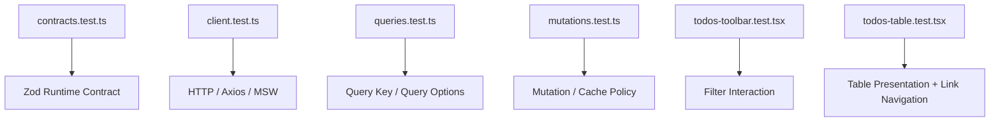

# แนวทางการเขียน Test สำหรับ Todos Table

ไฟล์ Test: `src/features/todos/components/todos-table.test.tsx`

ไฟล์ Production ที่ทดสอบ: `src/features/todos/components/todos-table.tsx`

เอกสารนี้ต่อเนื่องจากหัวข้อ 9 ของ [`docs/GETTING_STARTED.th.md`](../../../GETTING_STARTED.th.md) และเอกสาร [TodosTable](../components-todos-table.md)

เป้าหมายคือสร้าง Component Test สำหรับ `TodosTable` ด้วย **Vitest + React Testing Library + TanStack Router Memory History** โดยทดสอบเฉพาะพฤติกรรมที่ Component นี้เป็นเจ้าของจริง ได้แก่ Empty State, Semantic Table, Row Rendering, Status Mapping, User Label และ Navigation Link ไปยัง Todo Detail

> `TodosTable` ไม่ได้เป็นเจ้าของ Query, Mutation, Axios หรือ Runtime Validation ดังนั้น Test นี้ไม่ควร Mock API, ใช้ MSW หรือสร้าง `QueryClient` โดยไม่มีเหตุผล

---

## 1. ทำความเข้าใจ Responsibility ของ `TodosTable`

Implementation จาก Tutorial คือ

```tsx
import { Link } from "@tanstack/react-router";

import type { Todo } from "../api/contracts";

interface TodosTableProps {
  todos: Array<Todo>;
}

export function TodosTable({ todos }: TodosTableProps) {
  if (todos.length === 0) {
    return (
      <p className="rounded-lg border border-dashed p-8 text-center text-muted-foreground">
        ไม่พบ Todo ตามเงื่อนไขที่เลือก
      </p>
    );
  }

  return (
    <div className="overflow-hidden rounded-xl border">
      <div className="overflow-x-auto">
        <table className="w-full text-left text-sm">
          <thead className="bg-muted text-muted-foreground">
            <tr>
              <th className="px-4 py-3 font-medium">Todo</th>
              <th className="px-4 py-3 font-medium">สถานะ</th>
              <th className="px-4 py-3 font-medium">ผู้ใช้งาน</th>
            </tr>
          </thead>
          <tbody className="divide-y">
            {todos.map((todo) => (
              <tr key={todo.id} className="bg-card">
                <td className="px-4 py-3">
                  <Link
                    to="/todos/$todoId"
                    params={{ todoId: String(todo.id) }}
                    className="font-medium hover:underline"
                  >
                    {todo.todo}
                  </Link>
                </td>
                <td className="px-4 py-3">
                  <span
                    className={
                      todo.completed
                        ? "rounded-full bg-emerald-500/10 px-2 py-1 text-xs text-emerald-700 dark:text-emerald-300"
                        : "rounded-full bg-amber-500/10 px-2 py-1 text-xs text-amber-700 dark:text-amber-300"
                    }
                  >
                    {todo.completed ? "เสร็จแล้ว" : "ยังไม่เสร็จ"}
                  </span>
                </td>
                <td className="px-4 py-3 text-muted-foreground">User #{todo.userId}</td>
              </tr>
            ))}
          </tbody>
        </table>
      </div>
    </div>
  );
}
```

สามารถสรุป Responsibility ได้ดังนี้

```mermaid
flowchart TD
    A[Array Todo] --> B{todos.length === 0?}
    B -->|Yes| C[Empty State]
    B -->|No| D[Semantic Table]
    D --> E[Render 1 Row ต่อ 1 Todo]
    E --> F[Todo Link]
    E --> G[Status Label]
    E --> H[User Label]
    F --> I[/todos/$todoId]
```

สิ่งที่ Table เป็นเจ้าของ:

- ตรวจว่า Array ว่างหรือไม่
- Render Header ของ Table
- Render Todo หนึ่งรายการต่อหนึ่ง Row
- ใช้ `todo.todo` เป็น Link Text
- ใช้ `todo.id` สร้าง Route Parameter
- แปลง `completed` เป็นข้อความสถานะ
- แสดง `User #<userId>`

สิ่งที่ Table **ไม่ได้** เป็นเจ้าของ:

- HTTP Request
- Zod Validation
- Query Cache
- Mutation Cache
- Pagination
- Loading State
- Error State
- Route Loader

ดังนั้น Test Boundary ที่เหมาะสมคือ

```text
Todo fixtures
  → TodosTable จริง
  → TanStack Router จริงใน Memory
  → DOM จริงจาก jsdom
  → Assertions ผ่าน React Testing Library
```

---

## 2. Test Strategy

Test Suite ควรพิสูจน์พฤติกรรมหลัก 6 กลุ่ม

1. **Empty State** — เมื่อ `todos=[]` ต้องแสดงข้อความ Empty และไม่ Render Table
2. **Table Semantics** — เมื่อมีข้อมูล ต้องมี Table, Header และ Row ตาม semantic role ที่ถูกต้อง
3. **Todo Rendering** — ต้องแสดง Todo Text และ User Label ของทุก Entity
4. **Status Mapping** — `completed=true` และ `completed=false` ต้องแสดงข้อความถูกต้อง
5. **Navigation Contract** — Todo Link ต้องสร้าง URL จาก `todo.id` และ Navigate ไป Detail Route ได้
6. **Multiple Rows / Ordering** — หลาย Todo ต้อง Render ครบและรักษาลำดับจาก Props

Test Matrix:

| Behavior | Input | Expected |
| --- | --- | --- |
| Empty | `[]` | แสดง Empty State, ไม่มี Table |
| Single Todo | 1 Todo | 1 Data Row |
| Multiple Todos | หลาย Todo | Render ครบและตามลำดับ |
| Completed | `completed: true` | `เสร็จแล้ว` |
| Incomplete | `completed: false` | `ยังไม่เสร็จ` |
| User | `userId: 7` | `User #7` |
| Link Text | `todo: "..."` | Accessible Link Name ตรง Todo Text |
| Link URL | `id: 42` | `/todos/42` |
| Navigation | Click Link | Router Location เปลี่ยนเป็น `/todos/42` |
| Headers | มีข้อมูล | `Todo`, `สถานะ`, `ผู้ใช้งาน` |

---

## 3. เตรียม Test Dependencies

หากได้ทำตามเอกสาร Test ก่อนหน้านี้แล้ว Dependencies เหล่านี้อาจมีอยู่แล้ว ไม่ต้องติดตั้งซ้ำ

```bash
bun add -D vitest jsdom @testing-library/react @testing-library/user-event @testing-library/jest-dom @vitest/coverage-v8
```

หน้าที่ของแต่ละ Package:

| Package | หน้าที่ |
| --- | --- |
| `vitest` | Test Runner และ Assertions |
| `jsdom` | Browser-like DOM สำหรับ Component Test |
| `@testing-library/react` | Render React Component และ Query DOM |
| `@testing-library/user-event` | จำลองพฤติกรรมผู้ใช้ เช่น Click |
| `@testing-library/jest-dom` | DOM Matchers เช่น `toBeInTheDocument()` |
| `@vitest/coverage-v8` | Coverage |

สำหรับ Test นี้ **ไม่จำเป็นต้องติดตั้ง MSW เพิ่มเฉพาะ Table** เพราะไม่มี HTTP Request

---

## 4. Vitest Configuration

หากโปรเจ็กต์มี `vitest.config.ts` จาก Test ก่อนหน้านี้อยู่แล้ว ให้ใช้ไฟล์เดิมและตรวจว่ามี `environment: "jsdom"`

ตัวอย่าง Configuration ที่เหมาะกับ Repository นี้:

```ts
import { defineConfig, mergeConfig } from "vitest/config";

import viteConfig from "./vite.config";

export default mergeConfig(
  viteConfig,
  defineConfig({
    test: {
      environment: "jsdom",
      globals: true,
      setupFiles: ["./src/test/setup.ts"],
      restoreMocks: true,
      clearMocks: true,
      coverage: {
        provider: "v8",
        reporter: ["text", "html", "lcov"],
      },
    },
  }),
);
```

เหตุผลที่ Merge กับ Vite Config เดิมคือ Test จะได้ใช้ Alias/Plugin Resolution ชุดเดียวกับ Application เช่น `#/...`

---

## 5. Global Test Setup

สร้างหรือใช้ไฟล์เดิม

```text
src/test/setup.ts
```

```ts
import "@testing-library/jest-dom/vitest";
import { cleanup } from "@testing-library/react";
import { afterEach } from "vitest";

afterEach(() => {
  cleanup();
});
```

`jest-dom` ทำให้ใช้ Assertion ที่อ่านตาม DOM Semantics ได้ เช่น

```ts
expect(element).toBeInTheDocument();
expect(element).toHaveAttribute("href", "/todos/1");
```

---

## 6. ทำไม Test นี้ควรใช้ Router จริง

`TodosTable` ใช้

```tsx
<Link to="/todos/$todoId" params={{ todoId: String(todo.id) }}>
```

ดังนั้นหาก Render Component โดยไม่มี Router Context จะไม่สะท้อน Runtime จริงของ `Link`

แนวทางที่ไม่แนะนำ:

```ts
vi.mock("@tanstack/react-router", () => ({
  Link: ({ children }: { children: React.ReactNode }) => <a>{children}</a>,
}));
```

เพราะ Mock แบบนี้ทำให้ Test ไม่ได้พิสูจน์ว่า

- `to` ถูกต้องหรือไม่
- `params.todoId` ถูก Serialize ถูกต้องหรือไม่
- Link สร้าง `href` ถูกต้องหรือไม่
- Click แล้ว Router Navigate จริงหรือไม่

สำหรับ Component นี้ Memory Router มีต้นทุนต่ำและให้ Confidence สูงกว่า

```text
TodosTable
  → Link จริง
  → RouterProvider
  → Memory History
```

ไม่มี Browser Navigation จริงและไม่มี Network Request

---

## 7. Test Fixtures

ควรใช้ Fixture ที่อ่านง่ายและมีทั้งสองสถานะ

```ts
const incompleteTodo = {
  id: 1,
  todo: "Define clear frontend architecture boundaries",
  completed: false,
  userId: 7,
};

const completedTodo = {
  id: 2,
  todo: "Validate every external contract",
  completed: true,
  userId: 11,
};
```

หลีกเลี่ยง Fixture ขนาดใหญ่ที่มี Field ไม่เกี่ยวข้อง เพราะจะทำให้ Test Intent อ่านยาก

---

## 8. Router Test Harness

สร้าง Helper ที่รับ `todos` แล้วประกอบ Route Tree จริงสำหรับ Test

```tsx
function renderTable(todos: Array<Todo>) {
  const rootRoute = createRootRoute();

  const listRoute = createRoute({
    getParentRoute: () => rootRoute,
    path: "todos",
    component: () => <TodosTable todos={todos} />,
  });

  const detailRoute = createRoute({
    getParentRoute: () => rootRoute,
    path: "todos/$todoId",
    component: () => <p>Todo detail test route</p>,
  });

  const router = createRouter({
    routeTree: rootRoute.addChildren([listRoute, detailRoute]),
    history: createMemoryHistory({
      initialEntries: ["/todos"],
    }),
  });

  return {
    router,
    ...render(<RouterProvider router={router} />),
  };
}
```

ข้อดีของ Helper นี้:

- ทุก Test ใช้ Router Configuration เดียวกัน
- Test ระบุเพียง Dataset ที่ต้องการ
- สามารถ Inspect `router.state.location.pathname` หลัง Click ได้
- ไม่ผูก Test กับ Application Router ทั้งระบบ

เราไม่ต้องใช้ Production `routeTree.gen.ts` เพราะเป้าหมายคือทดสอบ `TodosTable` โดยเฉพาะ ไม่ใช่ Route Integration ทั้ง Application

---

## 9. โค้ดฉบับเต็ม: `todos-table.test.tsx`

สร้างไฟล์

```text
src/features/todos/components/todos-table.test.tsx
```

แล้วใส่โค้ดฉบับเต็มดังนี้

```tsx
import { render, screen, within } from "@testing-library/react";
import userEvent from "@testing-library/user-event";
import {
  RouterProvider,
  createMemoryHistory,
  createRootRoute,
  createRoute,
  createRouter,
} from "@tanstack/react-router";
import { describe, expect, it } from "vitest";

import { TodosTable } from "./todos-table";
import type { Todo } from "../api/contracts";

const incompleteTodo: Todo = {
  id: 1,
  todo: "Define clear frontend architecture boundaries",
  completed: false,
  userId: 7,
};

const completedTodo: Todo = {
  id: 2,
  todo: "Validate every external contract",
  completed: true,
  userId: 11,
};

function renderTable(todos: Array<Todo>) {
  const rootRoute = createRootRoute();

  const listRoute = createRoute({
    getParentRoute: () => rootRoute,
    path: "todos",
    component: () => <TodosTable todos={todos} />,
  });

  const detailRoute = createRoute({
    getParentRoute: () => rootRoute,
    path: "todos/$todoId",
    component: () => <p>Todo detail test route</p>,
  });

  const router = createRouter({
    routeTree: rootRoute.addChildren([listRoute, detailRoute]),
    history: createMemoryHistory({
      initialEntries: ["/todos"],
    }),
  });

  return {
    router,
    ...render(<RouterProvider router={router} />),
  };
}

describe("TodosTable", () => {
  describe("empty state", () => {
    it("renders the empty message when todos is empty", async () => {
      renderTable([]);

      expect(
        await screen.findByText("ไม่พบ Todo ตามเงื่อนไขที่เลือก"),
      ).toBeInTheDocument();
    });

    it("does not render a table when todos is empty", async () => {
      renderTable([]);

      await screen.findByText("ไม่พบ Todo ตามเงื่อนไขที่เลือก");

      expect(screen.queryByRole("table")).not.toBeInTheDocument();
    });

    it("does not render todo links when todos is empty", async () => {
      renderTable([]);

      await screen.findByText("ไม่พบ Todo ตามเงื่อนไขที่เลือก");

      expect(screen.queryByRole("link")).not.toBeInTheDocument();
    });
  });

  describe("table semantics", () => {
    it("renders a semantic table for non-empty data", async () => {
      renderTable([incompleteTodo]);

      expect(await screen.findByRole("table")).toBeInTheDocument();
    });

    it("renders the expected column headers", async () => {
      renderTable([incompleteTodo]);

      await screen.findByRole("table");

      expect(screen.getByRole("columnheader", { name: "Todo" })).toBeInTheDocument();
      expect(screen.getByRole("columnheader", { name: "สถานะ" })).toBeInTheDocument();
      expect(screen.getByRole("columnheader", { name: "ผู้ใช้งาน" })).toBeInTheDocument();
    });

    it("renders one data row per todo plus one header row", async () => {
      renderTable([incompleteTodo, completedTodo]);

      const table = await screen.findByRole("table");
      const rows = within(table).getAllByRole("row");

      expect(rows).toHaveLength(3);
    });
  });

  describe("todo content", () => {
    it("renders todo text as an accessible link", async () => {
      renderTable([incompleteTodo]);

      const link = await screen.findByRole("link", {
        name: incompleteTodo.todo,
      });

      expect(link).toBeInTheDocument();
    });

    it("renders the user label", async () => {
      renderTable([incompleteTodo]);

      expect(await screen.findByText("User #7")).toBeInTheDocument();
    });

    it("renders every todo from the provided array", async () => {
      renderTable([incompleteTodo, completedTodo]);

      expect(
        await screen.findByRole("link", { name: incompleteTodo.todo }),
      ).toBeInTheDocument();
      expect(
        screen.getByRole("link", { name: completedTodo.todo }),
      ).toBeInTheDocument();
      expect(screen.getByText("User #7")).toBeInTheDocument();
      expect(screen.getByText("User #11")).toBeInTheDocument();
    });

    it("preserves the order of todos from props", async () => {
      renderTable([completedTodo, incompleteTodo]);

      const table = await screen.findByRole("table");
      const dataRows = within(table).getAllByRole("row").slice(1);

      expect(within(dataRows[0]!).getByRole("link")).toHaveTextContent(completedTodo.todo);
      expect(within(dataRows[1]!).getByRole("link")).toHaveTextContent(incompleteTodo.todo);
    });
  });

  describe("status mapping", () => {
    it("renders completed todo as เสร็จแล้ว", async () => {
      renderTable([completedTodo]);

      expect(await screen.findByText("เสร็จแล้ว")).toBeInTheDocument();
      expect(screen.queryByText("ยังไม่เสร็จ")).not.toBeInTheDocument();
    });

    it("renders incomplete todo as ยังไม่เสร็จ", async () => {
      renderTable([incompleteTodo]);

      expect(await screen.findByText("ยังไม่เสร็จ")).toBeInTheDocument();
      expect(screen.queryByText("เสร็จแล้ว")).not.toBeInTheDocument();
    });

    it("renders both statuses correctly in the same table", async () => {
      renderTable([incompleteTodo, completedTodo]);

      expect(await screen.findByText("ยังไม่เสร็จ")).toBeInTheDocument();
      expect(screen.getByText("เสร็จแล้ว")).toBeInTheDocument();
    });
  });

  describe("navigation", () => {
    it("builds the detail href from todo.id", async () => {
      renderTable([
        {
          ...incompleteTodo,
          id: 42,
        },
      ]);

      const link = await screen.findByRole("link", {
        name: incompleteTodo.todo,
      });

      expect(link).toHaveAttribute("href", "/todos/42");
    });

    it("builds a different href for each todo", async () => {
      renderTable([incompleteTodo, completedTodo]);

      expect(
        await screen.findByRole("link", { name: incompleteTodo.todo }),
      ).toHaveAttribute("href", "/todos/1");
      expect(
        screen.getByRole("link", { name: completedTodo.todo }),
      ).toHaveAttribute("href", "/todos/2");
    });

    it("navigates to the matching detail route when the user clicks a todo", async () => {
      const user = userEvent.setup();
      const { router } = renderTable([
        {
          ...incompleteTodo,
          id: 42,
        },
      ]);

      const link = await screen.findByRole("link", {
        name: incompleteTodo.todo,
      });

      await user.click(link);

      expect(router.state.location.pathname).toBe("/todos/42");
      expect(await screen.findByText("Todo detail test route")).toBeInTheDocument();
    });
  });

  describe("row-level semantics", () => {
    it("keeps each todo link, status and user in the same row", async () => {
      renderTable([incompleteTodo, completedTodo]);

      const table = await screen.findByRole("table");
      const dataRows = within(table).getAllByRole("row").slice(1);

      const firstRow = dataRows[0]!;
      expect(within(firstRow).getByRole("link", { name: incompleteTodo.todo })).toBeInTheDocument();
      expect(within(firstRow).getByText("ยังไม่เสร็จ")).toBeInTheDocument();
      expect(within(firstRow).getByText("User #7")).toBeInTheDocument();

      const secondRow = dataRows[1]!;
      expect(within(secondRow).getByRole("link", { name: completedTodo.todo })).toBeInTheDocument();
      expect(within(secondRow).getByText("เสร็จแล้ว")).toBeInTheDocument();
      expect(within(secondRow).getByText("User #11")).toBeInTheDocument();
    });
  });
});
```

---

## 10. อธิบาย Test ทีละกลุ่ม

### 10.1 Empty State

กรณี

```ts
todos = []
```

ต้องเข้า Early Return ทันที

```text
[]
  → Empty State
  → ไม่มี <table>
  → ไม่มี Todo Link
```

จึงต้องตรวจทั้ง Positive Assertion

```ts
expect(screen.getByText("ไม่พบ Todo ตามเงื่อนไขที่เลือก")).toBeInTheDocument();
```

และ Negative Assertion

```ts
expect(screen.queryByRole("table")).not.toBeInTheDocument();
```

การตรวจเพียงข้อความ Empty State ยังไม่พอ เพราะ Regression อาจทำให้ Empty Message กับ Table ว่างถูก Render พร้อมกันโดยไม่ตั้งใจ

---

### 10.2 Semantic Table

ควร Query ด้วย Role

```ts
screen.getByRole("table")
screen.getByRole("columnheader", { name: "Todo" })
```

แทนการ Query ด้วย Class

```ts
container.querySelector(".w-full.text-left.text-sm")
```

เหตุผลคือ Class เป็น Styling Implementation Detail แต่ `table`, `columnheader` และ `row` คือ User-facing Semantics

ถ้าเปลี่ยน Tailwind Class Test ไม่ควรพัง

---

### 10.3 Row Count

เมื่อมี Todo 2 รายการ DOM จะมี

```text
1 Header Row
2 Data Rows
────────────
3 Rows ทั้งหมด
```

ดังนั้น

```ts
expect(within(table).getAllByRole("row")).toHaveLength(3);
```

ช่วยตรวจว่า Mapping `todos.map(...)` ทำงานครบทุก Entity

---

### 10.4 Status Mapping

Business-to-Presentation Mapping ของ Component คือ

```text
completed = true
  → "เสร็จแล้ว"

completed = false
  → "ยังไม่เสร็จ"
```

Test ควรตรวจข้อความ ไม่ควรล็อก Tailwind สี เช่น

```ts
expect(status).toHaveClass("text-emerald-700");
```

เพราะสีเป็น Design Detail ที่เปลี่ยนได้โดยไม่ทำให้ Business Meaning เปลี่ยน

หาก Accessibility ต้องพึ่งสีเพียงอย่างเดียวจึงเป็นปัญหา แต่ Component ปัจจุบันมีข้อความสถานะอยู่แล้ว จึงสื่อความหมายโดยไม่ต้องพึ่งสี

---

### 10.5 Navigation Contract

`todo.id` เป็น Number ใน Domain

```ts
id: 42
```

แต่ URL Parameter เป็น String

```text
/todos/42
```

Test จึงควรตรวจทั้งสองระดับ

1. Generated `href`
2. Actual Router Navigation หลัง Click

```ts
expect(link).toHaveAttribute("href", "/todos/42");
```

และ

```ts
await user.click(link);
expect(router.state.location.pathname).toBe("/todos/42");
```

การตรวจ `href` เพียงอย่างเดียวพิสูจน์ URL Generation แต่การ Click เพิ่ม Confidence ว่า Link ทำงานกับ Router Context จริง

---

### 10.6 Row Isolation

ถ้ามีหลาย Todo การใช้ Assertion แบบ Global อย่างเดียวอาจไม่พิสูจน์ว่า Status/User อยู่ใน Row ที่ถูกต้อง

ตัวอย่าง Regression:

```text
Todo A | เสร็จแล้ว | User #11
Todo B | ยังไม่เสร็จ | User #7
```

ทุกข้อความยังปรากฏครบ แต่ Association ผิด

จึงใช้

```ts
within(row)
```

เพื่อยืนยันว่า Todo Text, Status และ User ของ Entity เดียวกันอยู่ใน Row เดียวกัน

นี่เป็น Test ที่สำคัญกว่าการตรวจว่าข้อความทั้งหมดอยู่บนหน้าจอเพียงอย่างเดียว

---

## 11. สิ่งที่ไม่ควร Test ใน `todos-table.test.tsx`

### ไม่ทดสอบ API

ไม่ต้องใช้

```ts
server.use(...)
```

เพราะ Table รับข้อมูลจาก Props ที่ผ่าน Boundary มาแล้ว

### ไม่ทดสอบ Query Cache

ไม่ต้องสร้าง

```ts
new QueryClient()
```

Cache เป็น Responsibility ของ Query/Mutation Layer

### ไม่ทดสอบ Zod

ไม่ควรส่ง Invalid Runtime Object เพื่อดูว่า Table ปฏิเสธหรือไม่

```ts
{
  id: "abc",
  completed: "yes"
}
```

เพราะ `Todo` ควรถูก Validate ก่อนถึง UI Layer และ Zod Contract มี `contracts.test.ts` รับผิดชอบอยู่แล้ว

### ไม่ทดสอบ Tailwind Class ทุกตัว

หลีกเลี่ยง

```ts
expect(table).toHaveClass("w-full", "text-left", "text-sm");
```

Styling Refactor ไม่ควรทำให้ Behavior Test พัง

### ไม่ทดสอบ Loading/Error State

`TodosTable` ไม่มี Props สำหรับสอง State นี้ Parent Route/Page เป็นผู้รับผิดชอบ

---

## 12. Test Layer Separation

Test Suite ของ Feature ควรแบ่ง Responsibility ดังนี้



สิ่งนี้ทำให้ Failure อ่านง่าย

```text
Contract Test Fail
  → Schema Problem

Client Test Fail
  → HTTP Boundary Problem

Query Test Fail
  → Cache Identity / Read Orchestration Problem

Mutation Test Fail
  → Write Cache Policy Problem

TodosTable Test Fail
  → Presentation / Navigation Contract Problem
```

---

## 13. Edge Cases ที่ควรรู้ แต่ไม่ควรใส่ Test แบบผิด Layer

### Duplicate Todo ID

React ต้องการ Unique Key

```ts
key={todo.id}
```

หาก API ส่ง ID ซ้ำ นี่เป็น Data Integrity Problem ควรถูกป้องกันที่ Backend/Contract Policy ไม่ควรแก้ Table ด้วย Array Index เพียงเพื่อซ่อนปัญหา

### Todo Text ยาวมาก

Component ปัจจุบันไม่มี Truncation Logic ดังนั้น Unit Test ไม่จำเป็นต้องล็อก Layout ของข้อความยาว การตรวจ Visual Overflow เหมาะกับ Visual/E2E Testing มากกว่า jsdom

### `userId` ใหญ่มาก

Component เพียง Render `User #${todo.userId}` หาก Domain Contract ยอมรับ Number นั้น Presentation ไม่มี Branch เพิ่มเติมให้ต้อง Test

### Invalid URL ID

ผู้ใช้สามารถพิมพ์ URL เองได้ แม้ Table สร้าง URL ถูกต้อง Route Param Schema ยังต้อง Validate `todoId` ที่ Route Boundary

Navigation Link Test ไม่ใช่ Security Validation

---

## 14. Accessibility Notes

Implementation ปัจจุบันมีข้อดีเชิง Accessibility หลายอย่างโดยธรรมชาติ

- ใช้ `<table>` จริง
- ใช้ `<th>` สำหรับ Column Header
- Todo เป็น Link จริง
- Status มีข้อความ ไม่พึ่งสีอย่างเดียว

Test จึงควร Query ผ่าน Accessible Role เช่น

```ts
getByRole("table")
getByRole("columnheader")
getByRole("link")
```

หากอนาคต Table ซับซ้อนขึ้น เช่นมี Sortable Column Header อาจต้องเพิ่ม `aria-sort` และ Test State ของ Header เพิ่ม

---

## 15. การรัน Test

รัน Test ทั้งหมด

```bash
bun run test
```

รันเฉพาะ Todos Table

```bash
bunx vitest run src/features/todos/components/todos-table.test.tsx
```

Watch Mode

```bash
bunx vitest src/features/todos/components/todos-table.test.tsx
```

Coverage

```bash
bunx vitest run src/features/todos/components/todos-table.test.tsx --coverage
```

---

## 16. Coverage Strategy

สำหรับ Component ขนาดเล็กแบบ `TodosTable` เป้าหมายไม่ใช่การไล่ตัวเลข Coverage อย่างเดียว แต่ต้องครอบคลุมทุก Branch ที่มีความหมาย

Branch สำคัญคือ

```text
todos.length === 0
├─ true  → Empty State
└─ false → Table

completed
├─ true  → เสร็จแล้ว
└─ false → ยังไม่เสร็จ
```

และ Interaction สำคัญคือ

```text
Link Click
  → /todos/:id
```

หาก Test ชุดนี้ผ่าน Branch สำคัญของ Component จะถูกครอบคลุมเกือบทั้งหมดตามธรรมชาติ

ไม่ควรเพิ่ม Test ที่ไม่มี Business Value เพียงเพื่อให้ Coverage จาก 98% เป็น 100%

---

## 17. Quality Gate

หลังเพิ่ม Test ให้รันอย่างน้อย

```bash
bun run format
bun run lint
bun run typecheck
bun run test
bun run build
```

หาก Repository เพิ่ม `test` เข้า `bun run check` แล้ว สามารถใช้ Quality Gate กลางแทนได้

---

## 18. Production Checklist

ก่อนถือว่า `TodosTable` Test พร้อมใช้จริง ให้ตรวจรายการต่อไปนี้

- [ ] Empty Array แสดง Empty State
- [ ] Empty Array ไม่ Render Table
- [ ] Non-empty Array Render Semantic Table
- [ ] Header ทั้งสาม Column ถูกต้อง
- [ ] จำนวน Data Row เท่ากับจำนวน Todo
- [ ] Todo Text ถูก Render เป็น Accessible Link
- [ ] `completed=true` แสดง `เสร็จแล้ว`
- [ ] `completed=false` แสดง `ยังไม่เสร็จ`
- [ ] User Label แสดง `User #<id>` ถูกต้อง
- [ ] หลาย Todo Render ครบ
- [ ] ลำดับ Row ตรงกับ Props
- [ ] Todo/Status/User ของแต่ละ Entity อยู่ใน Row เดียวกัน
- [ ] `todo.id` ถูกสร้างเป็น `/todos/:id` ถูกต้อง
- [ ] Click Link แล้ว Memory Router Navigate ถูก Route
- [ ] Test ไม่ Mock API/Query/Mutation โดยไม่จำเป็น
- [ ] Test ไม่ล็อก Tailwind Class ที่ไม่ใช่ Behavior
- [ ] Test Query DOM ด้วย Semantic Role เป็นหลัก

---

## 19. สรุป

`todos-table.test.tsx` ควรพิสูจน์ว่า `TodosTable` ทำหน้าที่เป็น Presentation + Navigation Component ได้ถูกต้อง โดยไม่รับผิดชอบสิ่งที่อยู่ Layer อื่น

```text
Array<Todo>
  ↓
TodosTable
  ├─ Empty State
  └─ Semantic Table
       ├─ Todo Link
       ├─ Status
       └─ User
             ↓
         TanStack Router
             ↓
        /todos/$todoId
```

หลักสำคัญคือ **Test behavior ที่ผู้ใช้เห็นและ Contract ที่ Parent/Router พึ่งพา ไม่ Test implementation detail ที่เปลี่ยนได้ง่าย**

เมื่อแยก Test Boundary แบบนี้ `TodosTable` สามารถ Refactor Styling หรือ Internal Markup บางส่วนได้โดยไม่ทำให้ Test เปราะ ขณะเดียวกัน Regression ที่มีผลต่อข้อมูล สถานะ และ Navigation จะถูกตรวจจับได้อย่างชัดเจน
