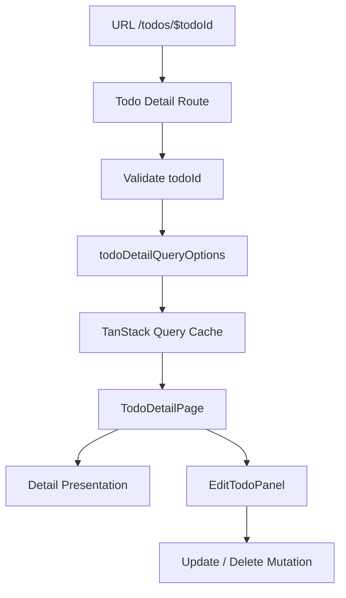
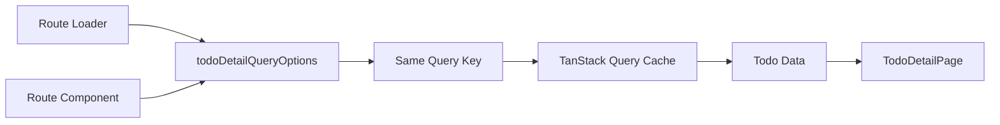
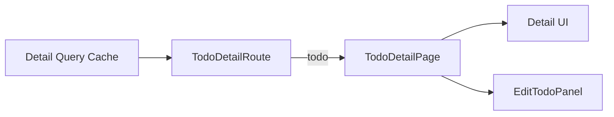
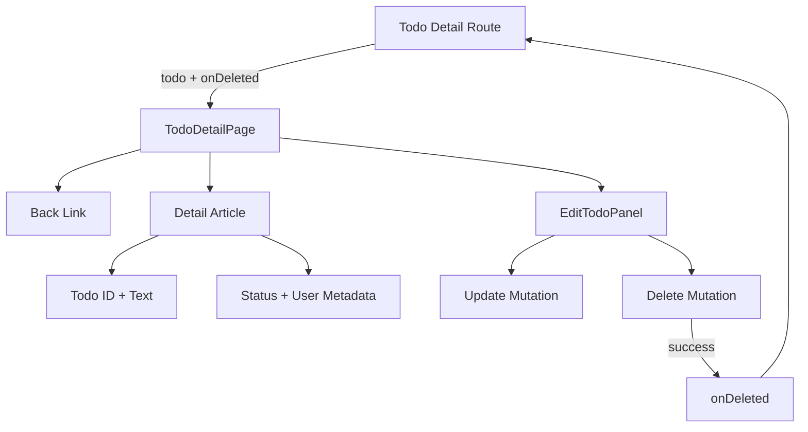
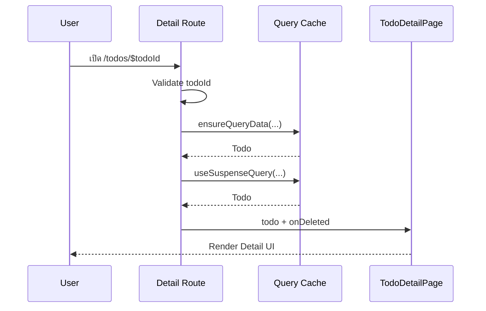
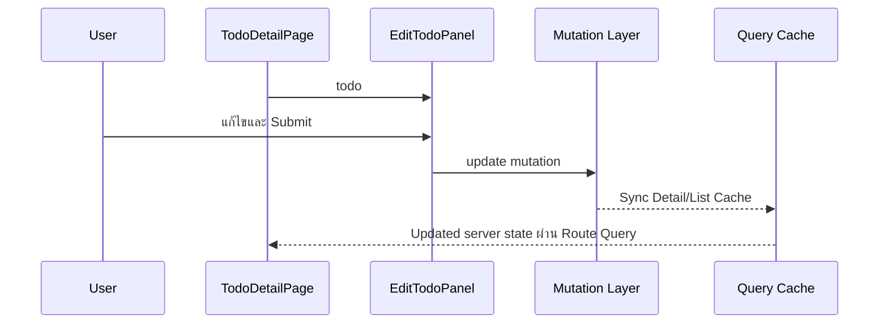
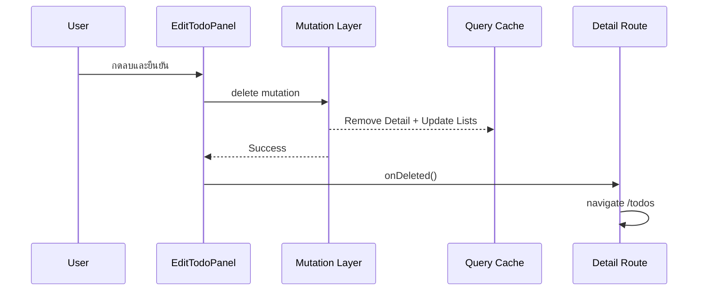
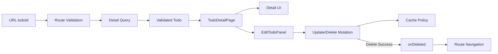

# คำอธิบายเพิ่มเติมเกี่ยวกับ TodoDetailPage

ไฟล์: `src/features/todos/pages/todo-detail-page.tsx`

## ภาพรวม

`TodoDetailPage` คือ Page-level Composition Component สำหรับแสดงรายละเอียดของ Todo หนึ่งรายการ และประกอบ `EditTodoPanel` สำหรับแก้ไขหรือลบ Resource เดียวกัน

หน้าที่ของ Page นี้มีสามแกนหลัก

1. แสดงข้อมูล Todo ที่ Route/Query Layer เตรียมมาแล้ว
2. แสดง Navigation กลับไปหน้า Todos List
3. ส่ง `todo` และ `onDeleted` ต่อให้ `EditTodoPanel` เพื่อให้ Child Component จัดการ Update/Delete Interaction

```text
Todo Detail Route
  → Validate todoId
  → Resolve Detail Query
  → TanStack Query Cache
  → ส่ง todo + onDeleted
  → TodoDetailPage
  → Render Detail UI
  → EditTodoPanel
```

จุดสำคัญทางสถาปัตยกรรมคือ `TodoDetailPage` **ไม่ได้ Fetch Todo เอง** และไม่ได้ Parse Route Param เอง

สิ่งเหล่านั้นอยู่ที่ Route Boundary

```text
Route
  = URL Param + Runtime Validation + Data Loading + Post-delete Navigation

TodoDetailPage
  = Detail Presentation + Feature Composition

EditTodoPanel
  = Edit/Delete Interaction

api/mutations.ts
  = Mutation + Cache Synchronization Policy
```

ดังนั้น Page นี้ไม่ได้กลายเป็น God Component ที่รู้ทั้ง Router Param, Axios, Query Key, Mutation และ Presentation พร้อมกัน



---

## Page Responsibility

### สิ่งที่ Page เป็นเจ้าของ

`TodoDetailPage` เป็นเจ้าของเรื่องที่เกี่ยวกับการประกอบ Detail Screen ได้แก่

1. Layout ของหน้ารายละเอียด
2. Back Navigation Link ไป `/todos`
3. การแสดง `todo.id`
4. การแสดงข้อความ Todo
5. การแสดงสถานะ `completed`
6. การแสดง `userId`
7. การส่ง Todo ปัจจุบันให้ `EditTodoPanel`
8. การส่ง `onDeleted` Callback ต่อให้ `EditTodoPanel`

โครงสร้างโดยรวมคือ

```text
TodoDetailPage
├── Back Link
├── Detail Article
│   ├── Todo ID
│   ├── Todo Text
│   └── Metadata
│       ├── Status
│       └── User
└── EditTodoPanel
```

Page จึงเป็น Composition Boundary ที่เชื่อม Read View กับ Mutation Interaction ของ Resource เดียวกัน

### สิ่งที่ Page ไม่ควรเป็นเจ้าของ

Page นี้ตั้งใจไม่รับผิดชอบเรื่องต่อไปนี้

- อ่าน `todoId` จาก URL
- Validate `todoId`
- สร้าง Detail Query Key
- เรียก `useSuspenseQuery`
- เรียก Axios
- Parse API Response
- สร้าง Update/Delete Mutation
- เขียน Query Cache หลัง Update
- Remove Detail Cache หลัง Delete
- ตัดสินใจว่าจะ Navigate ไปที่ใดหลัง Delete สำเร็จ

Responsibility เหล่านี้ถูกกระจายไปยัง Boundary ที่เหมาะสมกว่า

```text
URL Param Validation    → Detail Route
Query Identity / Fetch  → api/queries.ts
HTTP Request            → api/client.ts
Runtime Contract        → api/contracts.ts
Mutation Cache Policy   → api/mutations.ts
Edit/Delete Form        → EditTodoPanel
Post-delete Navigation  → Detail Route
```

แนวทางนี้ช่วยให้ `TodoDetailPage` สามารถถูกทดสอบด้วย Typed Todo ธรรมดา โดยไม่จำเป็นต้องสร้าง Network หรือ Query Environment สำหรับตัว Page โดยตรง

---

## Inputs

### Props

Page รับ Props ผ่าน `TodoDetailPageProps`

```ts
interface TodoDetailPageProps {
  todo: Todo;
  onDeleted: () => void;
}
```

มี Input สองตัว

#### `todo`

```ts
todo: Todo
```

คือ Domain Data ที่ผ่าน API Contract มาแล้ว

โดยประมาณมีโครงสร้างดังนี้

```ts
interface Todo {
  id: number;
  todo: string;
  completed: boolean;
  userId: number;
}
```

Page จึงไม่ต้องรองรับ `unknown`, `AxiosResponse` หรือข้อมูลที่ยังไม่ได้ Validate

```text
HTTP Response
  → Zod Contract
  → Todo
  → Query Cache
  → Route
  → TodoDetailPage
```

#### `onDeleted`

```ts
onDeleted: () => void
```

คือ Callback ที่บอกว่า Todo ถูกลบสำเร็จแล้ว และ Parent/Route ควรตัดสินใจว่าจะทำอะไรต่อ

ใน Tutorial Route กำหนด Callback เป็นการ Navigate กลับหน้า Todos

```ts
onDeleted={() => {
  void navigate({
    to: "/todos",
    search: defaultTodosSearch,
  });
}}
```

Page ไม่รู้ Implementation ของ Callback นี้

มันเพียงส่งต่อให้ `EditTodoPanel`

```text
Route owns navigation policy
        ↓
TodoDetailPage receives callback
        ↓
EditTodoPanel receives callback
        ↓
Delete success
        ↓
onDeleted()
```

นี่คือการใช้ Dependency Inversion แบบง่ายใน UI: Child ไม่ต้องรู้ว่าหลัง Delete ต้องใช้ Router อย่างไร

### Route Params

`TodoDetailPage` **ไม่ได้รับ Route Param โดยตรง**

Route เป็นผู้รับผิดชอบ

```text
/todos/123
     ↓
params.todoId = "123"
     ↓
Zod
     ↓
123: number
```

Tutorial ใช้

```ts
const todoIdSchema = z.coerce.number().int().positive();
```

จากนั้น Detail Route จึงนำ `todoId` ที่ผ่าน Validation แล้วไปสร้าง Query Options

ข้อดีคือ Page ไม่ต้องมี logic เช่น

```ts
Number(params.todoId)
```

หรือรองรับ Invalid URL ด้วยตัวเอง

### Query Input

Query Input ของ Detail Query คือ

```ts
todoId: number
```

แต่ Input นี้ไม่ได้เข้าสู่ `TodoDetailPage` โดยตรง

Flow จริงคือ

```text
Route Param
  → todoIdSchema.parse()
  → todoDetailQueryOptions(todoId)
  → Query Cache
  → Todo
  → TodoDetailPage
```

ดังนั้น Page เห็นผลลัพธ์สุดท้ายในรูป `Todo` เท่านั้น

นี่เป็น Boundary ที่สำคัญ: Page รับ **data ready for rendering** แทนการรับ identifier แล้วต้องไปโหลดข้อมูลเอง

---

## Dependencies

### Detail Query Options

`TodoDetailPage` ไม่ Import `todoDetailQueryOptions` โดยตรง

Detail Query ถูกใช้ที่ Route Layer

```ts
const { data } = useSuspenseQuery(todoDetailQueryOptions(todoId));
```

และ Loader ใช้ Query Options ชุดเดียวกัน

```ts
context.queryClient.ensureQueryData(todoDetailQueryOptions(todoId));
```

ผลคือ Loader และ Route Component อ้างถึง Cache Identity และ Fetch Policy ชุดเดียวกัน



Page จึงไม่ต้องรู้ว่า Data มาจาก Cache Hit หรือ HTTP Fetch

### Edit Todo Panel

Page Import

```ts
import { EditTodoPanel } from "../components/todo-mutation-panel";
```

แล้วส่ง

```tsx
<EditTodoPanel todo={todo} onDeleted={onDeleted} />
```

Child Component เป็นเจ้าของ

- Local Edit Draft
- Update Mutation
- Delete Mutation
- Pending State
- Confirmation
- Success/Error Feedback

ส่วน Cache Policy อยู่ต่ออีกชั้นใน `api/mutations.ts`

ดังนั้น Flow ถูกแบ่งเป็น

```text
TodoDetailPage
  → ให้ Resource Context

EditTodoPanel
  → จัดการ Interaction

Mutation Options
  → จัดการ Server Mutation + Cache Policy
```

### Navigation

Page มี Navigation สองประเภทที่มี Ownership ต่างกัน

#### Back Navigation

Page Render `Link` แบบ Declarative

```tsx
<Link
  to="/todos"
  search={{
    page: 1,
    pageSize: 10,
    source: "all",
    userId: null,
  }}
>
  กลับไป Todos
</Link>
```

นี่เป็น UI Navigation Intent ที่เหมาะกับ Page เพราะเป็นส่วนหนึ่งของหน้าจอ

#### Post-delete Navigation

Page ไม่เรียก `navigate()` เอง

หลัง Delete สำเร็จ `EditTodoPanel` เรียก `onDeleted` และ Callback ตัวจริงถูกกำหนดโดย Route

```text
Back Link
  → Page owns declarative navigation UI

Delete Success
  → Route owns imperative post-mutation navigation policy
```

การแยกสองกรณีนี้ช่วยให้ Page ไม่ผูกกับ Route API มากเกินความจำเป็น

---

## Data Loading

### Query ที่ใช้

แม้ Placeholder ของหัวข้อนี้พูดถึง Data Loading แต่ต้องแยกให้ชัดว่า `TodoDetailPage` **ไม่ได้เรียก Query เอง**

Query ที่เกี่ยวข้องคือ

```ts
todoDetailQueryOptions(todoId)
```

ซึ่งถูกใช้โดย Detail Route

```text
Route Loader
  → ensureQueryData(todoDetailQueryOptions(todoId))

Route Component
  → useSuspenseQuery(todoDetailQueryOptions(todoId))

TodoDetailPage
  → รับ data ผ่าน todo Prop
```

นี่ทำให้ Page ไม่ต้องมี Loading/Error Branch ภายใน JSX ของตัวเอง

### Cache ที่อ่าน

Query Cache Identity ของ Detail Resource ถูกนิยามใน `todosKeys.detail(todoId)`

แนวคิดโดยประมาณคือ

```text
["todos", "detail", todoId]
```

แต่ `TodoDetailPage` ไม่อ่าน Cache โดยตรง

Route เป็น Query Consumer และส่งผลลัพธ์มาเป็น Prop



### Loading Behavior

Loading State ถูกจัดการที่ Route Boundary ผ่าน `pendingComponent`

```tsx
pendingComponent: () => (
  <p className="py-12 text-muted-foreground">กำลังโหลด Todo…</p>
)
```

ดังนั้น `TodoDetailPage` ถูก Render เมื่อ Suspense Query พร้อมใช้งานแล้ว

ข้อดีคือ Page ไม่ต้องมีโค้ดลักษณะ

```tsx
if (isLoading) ...
if (!data) ...
```

กระจายอยู่ภายใน Presentation Component

### Error Behavior

Error จากการโหลด Detail ถูก Route `errorComponent` รับผิดชอบ

เช่น

- Network Error
- API Contract Error
- HTTP Error
- Query Error

Page จึงมี Contract ที่ง่ายกว่า

```text
TodoDetailPage receives valid Todo
```

อย่างไรก็ตาม Mutation Error จาก Update/Delete เป็นคนละ Boundary และถูก `EditTodoPanel` จัดการเอง เพราะเกิดหลังจาก Page Render แล้ว

```text
Initial Detail Load Error
  → Route Error Boundary

Update/Delete Error
  → EditTodoPanel Mutation Feedback
```

การแยกสอง Error Scope นี้ทำให้ UX และ Error Ownership ชัดเจน

---

## Page Composition

โครงสร้างจริงของ Page เป็นดังนี้



สังเกตว่า Query ไม่ได้อยู่ภายใน `TodoDetailPage`

ดังนั้น Diagram เชิง Boundary ที่แม่นยำกว่าคือ

```text
Route Query
   ↓
TodoDetailPage
   ├── Detail View
   ├── Back Link
   └── EditTodoPanel
          ├── Update Mutation
          └── Delete Mutation
```

---

## Interaction Flow

### เปิดหน้า Detail



### Update



### Delete



จุดสำคัญคือ Navigation หลัง Delete เกิด **หลัง Mutation สำเร็จ** ไม่ใช่ตอนกดปุ่มลบ

---

## Orchestration Analysis

### Query Consumption

`TodoDetailPage` ไม่ Consume Query ด้วย Hook โดยตรง

Route ทำหน้าที่เป็น Adapter ระหว่าง Query Layer กับ Page

```text
TanStack Query
  → Route
  → Props
  → Page
```

ข้อดีคือ

- Page Test ง่าย
- Page ไม่ผูกกับ QueryClientProvider โดยตรง
- Route สามารถควบคุม Pending/Error Boundary
- Query Options ยังคงอยู่ใน Feature API Layer

### Child Component Coordination

Page ส่ง Resource เดียวกันให้ `EditTodoPanel`

```tsx
<EditTodoPanel todo={todo} onDeleted={onDeleted} />
```

ดังนั้น Detail View กับ Edit Form ใช้ Todo ที่มาจาก Source เดียวกัน

แต่ต้องระวังว่า `EditTodoPanel` ใช้ `useState(todo.todo)` และ `useState(todo.completed)` เป็น Initial State เท่านั้น หาก `todo` Prop เปลี่ยนภายหลัง Local Draft จะไม่ Sync โดยอัตโนมัติ

นี่เป็น Edge Case เชิง State Ownership ที่ควรพิจารณาในระบบจริง โดยเฉพาะเมื่อ

- Server State ถูก Refetch ระหว่างกำลัง Edit
- Todo ถูกแก้จากอีก Tab/User
- Route เปลี่ยน Resource โดย Component ไม่ Unmount

### Delete Navigation Flow

Delete Flow ถูกออกแบบให้ Child รายงาน Event และ Route เป็นผู้กำหนด Navigation Policy

```text
EditTodoPanel
  → "ลบสำเร็จแล้ว"
  → onDeleted()

Route
  → "หลังลบให้ไป /todos"
```

ข้อดีคือ `EditTodoPanel` reusable กว่า Component ที่ Hard-code Router Navigation ไว้ภายใน

ตัวอย่าง Consumer อื่นอาจเลือก

```text
Delete success
  → ปิด Dialog
```

หรือ

```text
Delete success
  → Navigate ไป Parent Resource
```

โดยไม่ต้องแก้ Mutation Component

### Cache Coordination

Page ไม่แตะ Query Cache โดยตรง

Update/Delete Cache Policy อยู่ใน `api/mutations.ts`

Update:

```text
Server success
  → Replace Detail Cache
  → Replace Todo ใน List Cache ที่เกี่ยวข้อง
```

Delete:

```text
Server success
  → Remove Detail Cache
  → Remove Todo จาก List Cache
  → Route Navigate ออกจาก Detail
```

นี่ช่วยป้องกัน Race ที่ Page Navigate ออกก่อน Cache Policy ทำงานสำเร็จ

---

## Separation of Responsibilities

### Presentation

Page เป็นเจ้าของการแสดง

- Back Navigation
- Todo ID
- Todo Text
- Status
- User
- Layout รอบ Edit Panel

ใช้ Semantic Element ที่เหมาะสม เช่น

```html
<section>
<article>
<h1>
<dl>
<dt>
<dd>
```

### Server State

Page ไม่เป็นเจ้าของ Server State

`todo` ที่รับมาเป็น Snapshot จาก TanStack Query ผ่าน Route

```text
Server
  → API Client
  → Runtime Validation
  → Query Cache
  → Route
  → Page
```

Page ไม่ควร copy `todo` ทั้งก้อนไปเก็บใน Local State เพียงเพื่อ Render

Edit Draft เป็นข้อยกเว้นที่อยู่ภายใน `EditTodoPanel` เพราะเป็น Temporary User Input

### URL State

Page ไม่ Parse URL Param

`todoId` เป็น URL State ที่ Route เป็นเจ้าของ

Page มีเพียง Declarative Back Link ไป List Page

นี่รักษากฎ

```text
Route owns URL contract
Page owns feature presentation
```

### Business Logic

Page ไม่มี Business Rule ที่ซับซ้อน

การแปลง Boolean เป็น Label

```ts
todo.completed ? "เสร็จแล้ว" : "ยังไม่เสร็จ"
```

เป็น Presentation Mapping ที่เหมาะกับ UI

แต่กฎอย่าง

- ใครมีสิทธิ์แก้ Todo
- Todo สถานะใดลบได้
- การเปลี่ยนสถานะใดถูกอนุญาต

ไม่ควรถูกตัดสินโดย JSX ของ Page เพียงอย่างเดียว โดยเฉพาะ Authorization ต้องถูก enforce ที่ Server

---

## Production-Ready Analysis

### Performance Optimization

Page นี้มีต้นทุน Render ต่ำมาก

- Render Resource เดียว
- ไม่มี Loop ขนาดใหญ่
- ไม่มี expensive calculation
- ไม่มี Data Fetching ซ้ำใน Page

จึงไม่จำเป็นต้องใช้ `useMemo` หรือ `React.memo` โดยอัตโนมัติ

แนวทางที่สำคัญกว่าคือรักษา Query Cache ให้ Detail และ Mutation ใช้ Resource Identity เดียวกัน

```text
Update mutation
  → setQueryData(detailKey)
  → Route Query เห็นข้อมูลใหม่
  → Page Re-render ด้วย Todo ใหม่
```

สำหรับระบบจริงควรพิจารณา

1. `staleTime` ตามความสดที่ Domain ต้องการ
2. Cancellation เมื่อเปลี่ยน Detail อย่างรวดเร็ว
3. Prefetch Detail จาก List เมื่อ UX ได้ประโยชน์จริง
4. Code splitting ที่ Route Level หาก Feature ใหญ่

ไม่ควร optimize JSX เล็ก ๆ ก่อนวัดปัญหาจริง

### Security First

มี Boundary สำคัญหลายจุด

#### Route Param Validation

`todoId` จาก URL เป็น External Input และต้อง Validate ก่อนใช้

Tutorial ทำผ่าน Zod

```ts
z.coerce.number().int().positive()
```

แต่ Validation นี้ไม่ได้แทน Authorization

#### IDOR / Authorization

ผู้ใช้สามารถแก้ URL เช่น

```text
/todos/1
/todos/2
/todos/999
```

ดังนั้น Backend ต้องตรวจว่า Principal ปัจจุบันมีสิทธิ์

- Read Todo
- Update Todo
- Delete Todo

หรือไม่

Frontend Route Guard หรือการซ่อนปุ่มไม่ใช่ Security Boundary

#### XSS

`todo.todo` ถูก Render ผ่าน React Text Node

```tsx
<h1>{todo.todo}</h1>
```

React escape string โดยปริยาย จึงปลอดภัยกว่าการใช้ `dangerouslySetInnerHTML`

หากอนาคต Todo รองรับ Rich HTML ต้องมี Sanitization Strategy ที่ชัดเจน

#### Error Disclosure

Route Tutorial แสดง

```tsx
{error.message}
```

ระบบ Production ไม่ควรเผย Internal Stack, SQL, Token, Upstream Details หรือ Sensitive Information ผ่านข้อความ Error จาก Backend

ควร Normalize Error ก่อนแสดง UI

### Accessibility

โค้ดมีพื้นฐาน Semantic HTML ที่ดี

#### Heading

```html
<h1>{todo.todo}</h1>
```

ทำให้หน้ามี Primary Heading ที่ชัดเจน

#### Metadata

ใช้ Description List

```html
<dl>
  <dt>สถานะ</dt>
  <dd>...</dd>
</dl>
```

เหมาะกับ Key/Value Metadata มากกว่าใช้ `<div>` ธรรมดาทั้งหมด

#### Back Link

```tsx
<Button asChild>
  <Link>กลับไป Todos</Link>
</Button>
```

Semantic Element จริงยังเป็น Anchor จาก `Link` แม้หน้าตาจะเป็น Button ซึ่งเหมาะกว่าการใช้ `<button onClick={navigate}>` สำหรับ Navigation

#### Mutation UI

Accessibility ของ Update/Delete ส่วนใหญ่อยู่ใน `EditTodoPanel`

ระบบจริงควร

- ใช้ Accessible Alert Dialog แทน `window.confirm()`
- ประกาศ Mutation Success/Error ผ่าน `aria-live`
- รักษา Focus หลัง Dialog และ Error
- ทำ Pending State ให้ Screen Reader เข้าใจ

### Scalability & Maintainability

โครงสร้างนี้ scale ได้ดีเพราะ Page ใช้ Props Contract ขนาดเล็ก

```ts
TodoDetailPageProps
  = Todo + onDeleted
```

เมื่อระบบโต สามารถเพิ่ม Child Component โดยไม่จำเป็นต้องย้าย API Logic เข้ามาใน Page เช่น

```text
TodoDetailPage
├── TodoHeader
├── TodoMetadata
├── AssignmentPanel
├── AuditTimeline
└── EditTodoPanel
```

แต่ควรรักษาหลักว่า Page เป็น Orchestrator ไม่ใช่ Repository ของ Business Logic ทั้งหมด

หาก Detail Screen มีหลาย Data Source เช่น

```text
Todo
Comments
Audit Log
Permissions
Attachments
```

ควรพิจารณาว่า Data Ownership อยู่ที่ Route, Nested Route, Feature Query หรือ Child Boundary ใด แทนการยัด Query Hooks ทุกตัวไว้ใน Page เดียว

อีกประเด็นคือ Back Link ปัจจุบัน Hard-code Search เป็น

```ts
{
  page: 1,
  pageSize: 10,
  source: "all",
  userId: null,
}
```

เหมาะกับ Tutorial แต่ Production UX อาจต้อง Preserve Previous List Context เช่น

```text
ผู้ใช้มาจาก
/todos?page=4&pageSize=20&source=user&userId=7

เปิด Detail

กด Back

ควรกลับ Context เดิม
```

แนวทางอาจใช้ Search State, Location State หรือ Route Context ตาม Requirement แต่ไม่ควรเพิ่ม complexity หาก Product ไม่ต้องการ

### Testability

`TodoDetailPage` ทดสอบได้ง่ายเพราะไม่ใช้ Query Hook โดยตรง

Unit/Component Test ควรครอบคลุมอย่างน้อย

1. แสดง Todo ID ถูกต้อง
2. แสดงข้อความ Todo ถูกต้อง
3. แสดง `เสร็จแล้ว` เมื่อ `completed=true`
4. แสดง `ยังไม่เสร็จ` เมื่อ `completed=false`
5. แสดง User ID ถูกต้อง
6. Back Link ชี้ไป `/todos` พร้อม Search Default ที่ถูกต้อง
7. ส่ง `todo` ถูกต้องให้ Edit Panel
8. `onDeleted` ถูกส่งต่อและทำงานตาม Contract

หาก Test `EditTodoPanel` จริงภายใน Page ต้องมี QueryClientProvider เพราะ Child ใช้ `useMutation` และ `useQueryClient`

ดังนั้นสามารถแบ่ง Test Scope ได้

```text
TodoDetailPage composition test
  → Mock EditTodoPanel หรือ provide Query environment

EditTodoPanel mutation test
  → QueryClient + MSW

Detail Route integration test
  → Router + QueryClient + MSW
```

Route Integration Test ควรครอบคลุมเพิ่ม

- Invalid `todoId`
- Detail Query Success
- HTTP 404
- Contract Error
- Pending State
- Error Boundary
- Navigation หลัง Delete สำเร็จ

---

## Edge Cases

### 1. Invalid `todoId`

ตัวอย่าง

```text
/todos/abc
/todos/0
/todos/-1
```

ต้องถูก Reject ที่ Route Param Validation ก่อนเข้า API Client

### 2. Todo ไม่มีอยู่จริง

`todoId` อาจถูกต้องเชิงรูปแบบแต่ Server ไม่มี Resource

```text
/todos/999999
```

ควรถูกแปลงเป็น Error/Not-found UX ที่เหมาะสม ไม่ควร Render Page ด้วยข้อมูลว่าง

### 3. Todo ถูกลบจาก Client อื่น

ผู้ใช้อาจเปิดหน้า Detail อยู่ แต่ Resource ถูกลบจากอีก Session

Update หรือ Refetch ครั้งถัดไปอาจได้ 404/410

ระบบจริงต้องกำหนด UX เช่น

```text
Resource no longer exists
→ แจ้งผู้ใช้
→ Remove stale cache
→ Navigate กลับ List
```

### 4. Update สำเร็จแต่ Local Edit Draft ไม่ Sync

Mutation Policy อัปเดต Query Cache แต่ `EditTodoPanel` ใช้ Local State ที่ Initialize จาก Prop

หาก Prop เปลี่ยนภายหลัง Local Draft อาจยังถือค่าเดิม

ต้องกำหนดชัดว่า Form เป็น

- Snapshot Draft ที่ผู้ใช้ควบคุมจน Submit
- หรือ Form ที่ต้อง Reset เมื่อ Server State เปลี่ยน

อย่า sync props → state ด้วย `useEffect` โดยอัตโนมัติโดยไม่กำหนด UX เพราะอาจ overwrite ข้อมูลที่ผู้ใช้กำลังพิมพ์

### 5. Delete สำเร็จแต่ Navigation ล้มเหลว

Cache อาจถูกลบเรียบร้อยแล้วแต่ Router Navigation มีปัญหา

Page ปัจจุบันไม่จัดการกรณีนี้โดยตรง

Production สามารถมี Global Navigation/Error Handling ตามความเหมาะสม

### 6. Back Link สูญเสีย List Context

Tutorial กลับไป

```text
/todos?page=1&pageSize=10&source=all
```

เสมอ

หากผู้ใช้มาจาก Filter หรือ Pagination อื่น Context เดิมจะหาย

นี่ไม่ใช่ Bug สำหรับ Tutorial แต่เป็น Product Decision ที่ต้องกำหนดในระบบจริง

### 7. Long Todo Text

แม้ Contract จำกัด Create Input สูงสุด 300 ตัวอักษร แต่ Response จากระบบภายนอกต้องยังผ่าน Contract และ UI ต้องรองรับข้อความยาว

ควรทดสอบ

- Wrapping
- Mobile viewport
- Unicode
- Long unbroken token

### 8. Unauthorized Resource

Backend อาจตอบ 401/403

ต้องแยกออกจาก 404 ตาม Security/UX Policy ของระบบ เช่นบางระบบตั้งใจตอบ 404 เพื่อไม่เปิดเผย Resource existence

### 9. Update และ Delete เกิดพร้อมกัน

`EditTodoPanel` ใช้

```ts
const isPending = updateMutation.isPending || deleteMutation.isPending;
```

และ Disable ทั้งสอง Action ระหว่าง Mutation จึงลด Concurrent Command จาก UI เดียวกัน

แต่ยังไม่ป้องกัน Concurrent Modification จาก Client/Session อื่น

ระบบจริงอาจใช้ Version, ETag หรือ Optimistic Concurrency Control เมื่อ Domain ต้องการ

### 10. DummyJSON ไม่ Persist Mutation

Tutorial Update/Delete เป็น Simulation

ดังนั้น Cache ภายใน Browser อาจดูเหมือน Resource ถูกแก้หรือลบแล้ว แต่ Refresh/Fresh Fetch อาจกลับเป็น Dataset เดิม

อย่านำพฤติกรรมนี้ไปสรุปเป็น Cache Policy สำหรับ Backend จริงโดยไม่ตรวจ Consistency Model ของ Server

### 11. `onDeleted` ถูกเรียกมากกว่าหนึ่งครั้ง

UI ปัจจุบัน Disable ปุ่มระหว่าง Request ช่วยลด Double Submit แต่ Callback ควรยังถูกมองเป็น Event Contract ที่ Consumer สามารถจัดการได้อย่างปลอดภัย

### 12. Page Render ด้วย Todo คนใหม่โดย Component Instance เดิม

หาก Routing Configuration ในอนาคต reuse Component Instance ระหว่าง `/todos/1` → `/todos/2`, Detail Presentation จะรับ Prop ใหม่ได้ แต่ Local State ภายใน Edit Panel อาจยังอิง Initial Todo เดิม

ควรมี explicit reset/remount strategy ตาม Router และ Form UX ที่เลือก

---

## สรุปสาระสำคัญ

`TodoDetailPage` เป็นตัวอย่างของ Detail Page ที่รักษา Responsibility Boundary ได้ค่อนข้างสะอาด

```text
Detail Route
  → URL + Validation + Query + Navigation Policy

TodoDetailPage
  → Detail Presentation + Composition

EditTodoPanel
  → Local Form Interaction

Mutation Options
  → Server Mutation + Cache Synchronization
```

แก่นสำคัญมีดังนี้

1. Page รับ `Todo` ที่ Validate แล้ว ไม่รับ HTTP Response หรือ Raw Route Param
2. Route เป็นเจ้าของ Data Loading และ Pending/Error Boundary
3. Page ใช้ Declarative `Link` สำหรับ Back Navigation
4. Navigation หลัง Delete ถูกส่งเข้ามาผ่าน `onDeleted` แทนการ Hard-code Router ใน Mutation Component
5. Edit/Delete Cache Policy ไม่อยู่ใน Page
6. `EditTodoPanel` ใช้ Local State สำหรับ Draft ซึ่งต้องพิจารณา Server-State Synchronization เมื่อระบบจริงซับซ้อนขึ้น
7. Authorization ของ Detail/Update/Delete ต้อง enforce ที่ Backend เสมอ
8. Production UX ควรพิจารณา Not-found State, Accessible Delete Dialog และการ Preserve Previous List Context

ภาพรวมของ Boundary สามารถสรุปได้ดังนี้



เมื่อรักษาเส้นแบ่งนี้ไว้ การเพิ่มความสามารถของ Detail Screen จะไม่ทำให้ Route, Page, Mutation และ Infrastructure ผูกกันจนแก้ไขหรือทดสอบยาก