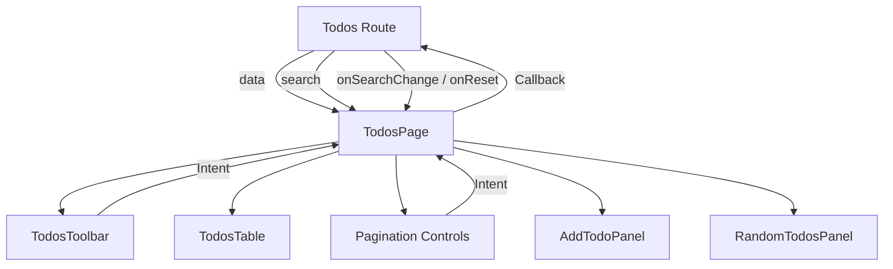
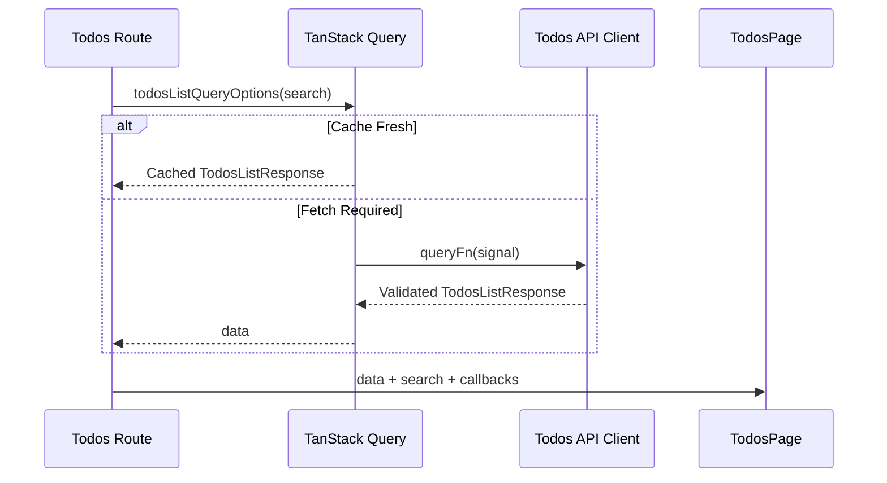
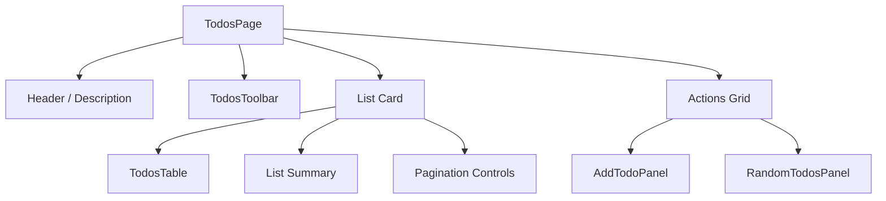
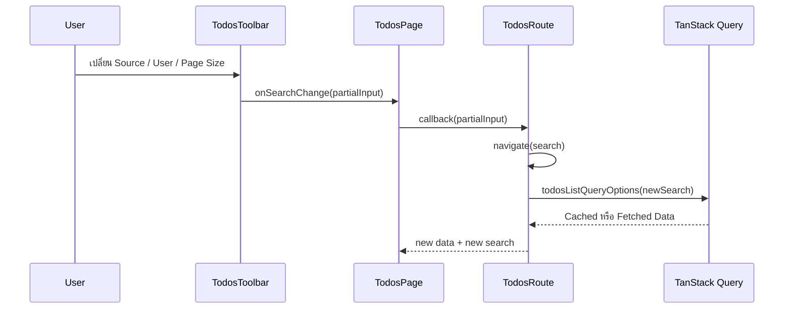
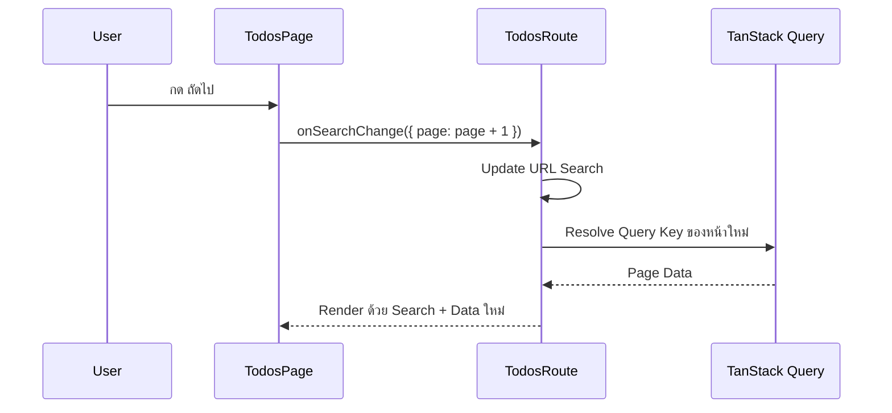
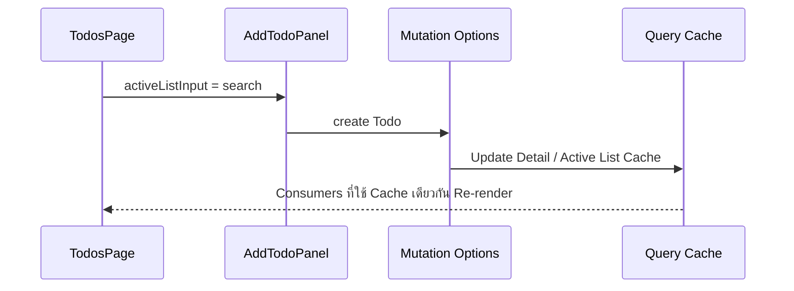
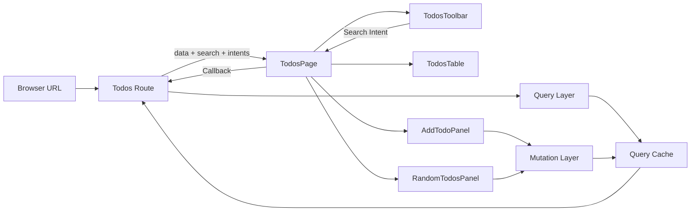

# คำอธิบายเพิ่มเติมเกี่ยวกับ TodosPage

ไฟล์: `src/features/todos/pages/todos-page.tsx`

## ภาพรวม

`TodosPage` คือ Page-level Composition Component ของหน้า Todos List มีหน้าที่นำข้อมูลและ Interaction Contract ที่ Route เตรียมไว้แล้ว มาประกอบเป็นหน้าจอเดียวกัน

Component นี้เชื่อมองค์ประกอบหลักของ Feature เข้าด้วยกัน ได้แก่

- `TodosToolbar` — เปลี่ยน Filter และ List State
- `TodosTable` — แสดงรายการ Todo
- Pagination Controls — เปลี่ยนหน้าใน `source="all"`
- `AddTodoPanel` — สร้าง Todo ใหม่และใช้ Active List Context เพื่อ Sync Cache
- `RandomTodosPanel` — สั่งสุ่ม Todo แบบ Command

สิ่งสำคัญคือ `TodosPage` **ไม่ได้ Fetch ข้อมูลเอง** และ **ไม่ได้ใช้ TanStack Router โดยตรง** แต่รับข้อมูลและ Callback จาก Route ผ่าน Props

```text
Route
  → Validate URL Search State
  → Resolve Query Options
  → TanStack Query Cache
  → ส่ง data + search + callbacks
  → TodosPage
  → Compose Feature Components
```

จากนั้น Page แปลงข้อมูลเหล่านั้นเป็น UI และ Intent กลับไปยัง Route



แนวคิดนี้ทำให้ Page อยู่ในบทบาท **Feature Orchestrator** มากกว่าการเป็น Data Fetching Component

```text
Route
  = URL + Query Orchestration

TodosPage
  = Feature UI Composition

Child Components
  = Focused Presentation / Interaction
```

---

## Page Responsibility

### สิ่งที่ Page เป็นเจ้าของ

`TodosPage` เป็นเจ้าของสิ่งที่เกี่ยวกับการประกอบหน้าจอและความสัมพันธ์ของ Child Components ได้แก่

1. Layout ของหน้า
2. การส่ง `search` ให้ Toolbar
3. การส่ง `data.todos` ให้ Table
4. การคำนวณจำนวนหน้าสำหรับ UI Pagination
5. การแปลง Previous / Next Button เป็น `onSearchChange({ page })`
6. การส่ง Active List Context ไปยัง `AddTodoPanel`
7. การจัดวาง Add และ Random Panel

ตัวอย่าง Derived UI State ที่ Page เป็นเจ้าของคือ

```ts
const lastPage =
  search.source === "all" ? Math.max(1, Math.ceil(data.total / search.pageSize)) : 1;
```

`lastPage` ไม่ใช่ Server State ใหม่ แต่เป็นค่าที่คำนวณจาก State ที่มีอยู่แล้ว

```text
data.total
+
search.pageSize
→ lastPage
```

จึงเหมาะที่จะคำนวณใน Page โดยตรง

### สิ่งที่ Page ไม่ควรเป็นเจ้าของ

Page นี้ตั้งใจไม่รับผิดชอบเรื่องต่อไปนี้

- Parse URL Search Parameter
- Validate `page`, `pageSize`, `source`, `userId`
- สร้าง Query Key
- เรียก `useSuspenseQuery`
- เรียก Axios
- Parse HTTP Response
- เขียน Query Cache โดยตรง
- สร้าง Mutation Function
- ตัดสิน Cache Policy
- Navigate ด้วย TanStack Router โดยตรง

สิ่งเหล่านี้ถูกส่งออกไปยัง Boundary ที่เหมาะสมกว่า

```text
URL Validation       → Route
Query Identity       → api/queries.ts
HTTP Request         → api/client.ts
Runtime Contract     → api/contracts.ts
Cache Mutation Rule  → api/mutations.ts
Form Interaction     → Feature Components
```

การรักษา Boundary นี้ช่วยป้องกัน Page จากการกลายเป็น God Component

---

## Inputs

### Props

Page รับ Props ผ่าน `TodosPageProps`

```ts
interface TodosPageProps {
  data: TodosListResponse;
  search: TodosListQueryInput;
  onSearchChange: (next: Partial<TodosListQueryInput>) => void;
  onReset: () => void;
}
```

สามารถแบ่งเป็นสองกลุ่มได้

```text
Read Inputs
├── data
└── search

Intent Outputs
├── onSearchChange
└── onReset
```

#### `data`

```ts
data: TodosListResponse
```

คือ List Response ที่ผ่าน API Contract Validation และ Query Layer มาแล้ว

Page ใช้ Field หลัก

- `data.todos` — ส่งให้ `TodosTable`
- `data.total` — ใช้แสดงจำนวนทั้งหมดและคำนวณ `lastPage`

Page ไม่ต้องรู้ว่า HTTP Response เดิมมาจาก Endpoint ใด เพราะข้อมูลถูก Normalize ให้เป็น `TodosListResponse` แล้ว

#### `search`

```ts
search: TodosListQueryInput
```

คือ Application State ของ List ปัจจุบัน เช่น

```ts
{
  page: 2,
  pageSize: 10,
  source: "all",
  userId: null,
}
```

หรือ

```ts
{
  page: 1,
  pageSize: 10,
  source: "user",
  userId: 5,
}
```

Page ใช้ State นี้เพื่อ

- Render Toolbar
- เลือกข้อความ Summary
- เปิดหรือซ่อน Pagination
- คำนวณ Previous / Next Page
- ส่ง Active List Context ให้ Add Mutation

#### `onSearchChange`

```ts
onSearchChange: (next: Partial<TodosListQueryInput>) => void
```

เป็น Intent Callback สำหรับขอเปลี่ยนบางส่วนของ Search State

ตัวอย่าง

```ts
onSearchChange({ page: search.page + 1 });
```

Page ไม่รู้ว่า Callback นี้จะเปลี่ยน URL อย่างไร

ใน Tutorial Route เป็นผู้ Implement ด้วย

```ts
navigate({
  search: (previous) => ({ ...previous, ...next }),
});
```

ดังนั้น Page จึงขึ้นกับ Contract ไม่ขึ้นกับ Router Implementation

#### `onReset`

```ts
onReset: () => void
```

เป็น Intent สำหรับ Reset List State กลับ Default

Page เพียงส่งต่อให้ `TodosToolbar`

```tsx
<TodosToolbar
  search={search}
  onChange={onSearchChange}
  onReset={onReset}
/>
```

---

### Route / Search State

แม้ `TodosPage` ไม่ใช้ Router เอง แต่ `search` ที่ได้รับมีต้นทางจาก URL

Flow จริงใน Tutorial คือ

```text
Browser URL
  → Route.validateSearch
  → TodosListQueryInput
  → Query Key
  → Query Data
  → TodosPage Props
```

เมื่อ Page หรือ Toolbar ส่ง Intent กลับ

```text
User Action
  → onSearchChange(...)
  → Route.navigate(...)
  → URL Search Params เปลี่ยน
  → Query Input เปลี่ยน
  → Query Key เปลี่ยน
  → Data ใหม่
  → TodosPage Render ใหม่
```

จุดสำคัญคือ Page ใช้ URL State แบบ **indirect ownership**

```text
Page อ่านและส่ง Intent
Route เป็นเจ้าของ URL จริง
```

ทำให้ Page สามารถ Render ใน Storybook, Component Test หรือ Environment อื่นได้โดยไม่ต้องผูกกับ Router โดยตรง

---

### Query Input

`search` มี Type เดียวกับ Query Input

```ts
TodosListQueryInput
```

จึงเป็นจุดเชื่อมระหว่าง URL State กับ Server State

```text
URL State
  → TodosListQueryInput
  → todosKeys.list(input)
  → Server State Cache Entry
```

สำหรับ Page ค่าเดียวกันยังถูกส่งให้

```tsx
<AddTodoPanel activeListInput={search} />
```

เพราะ Add Mutation ต้องทราบว่า Active List ปัจจุบันคือ Cache Entry ใด และ Todo ใหม่ควรถูก Project เข้า List ปัจจุบันหรือไม่

ดังนั้น `search` มีสองบทบาทใน Page

1. UI State สำหรับ Filter / Pagination
2. Cache Context สำหรับ Mutation Projection

---

## Dependencies

### Query Options

`TodosPage` **ไม่ได้ Import Query Options โดยตรง**

นี่เป็นการออกแบบโดยตั้งใจ

Query Consumption อยู่ที่ Route

```ts
const { data } = useSuspenseQuery(todosListQueryOptions(search));
```

แล้ว Route ส่งเฉพาะ `data` ที่พร้อมใช้ให้ Page

```tsx
<TodosPage data={data} ... />
```

ข้อดีคือ Page ไม่ต้องรู้เรื่อง

- Query Key
- `staleTime`
- `AbortSignal`
- Suspense Query
- QueryClient
- Fetch Lifecycle

จึงเกิด Boundary ที่ชัดเจน

```text
Route / Query Layer
  → Server State Acquisition

Page Layer
  → Server State Composition
```

---

### Toolbar

```ts
import { TodosToolbar } from "../components/todos-toolbar";
```

Page ส่ง

```tsx
<TodosToolbar
  search={search}
  onChange={onSearchChange}
  onReset={onReset}
/>
```

Toolbar เป็น Controlled Component

```text
TodosPage
  → current state
  → TodosToolbar

TodosToolbar
  → intent
  → TodosPage
```

Page ไม่ต้องรู้ Event DOM ภายใน Toolbar เช่น `<select>` หรือ `<input>` แต่รับ Intent ในรูป Domain-friendly State Patch

---

### Table

```ts
import { TodosTable } from "../components/todos-table";
```

Page ส่งเฉพาะข้อมูลที่ Table ต้องใช้

```tsx
<TodosTable todos={data.todos} />
```

Table ไม่ต้องรู้

- Pagination
- Total Count
- Search State
- Query Cache
- API

นี่เป็นตัวอย่างของการลด Prop Surface ให้ Component มี Responsibility เล็กที่สุด

---

### Random Todos Panel

```ts
import { RandomTodosPanel } from "../components/random-todos-panel";
```

Render แบบไม่มี Props

```tsx
<RandomTodosPanel />
```

Panel นี้จัดการ Command State ของตัวเองผ่าน `useMutation`

ดังนั้น `TodosPage` ทำเพียง Composition ไม่ต้อง Orchestrate Random Result

```text
TodosPage
  → วางตำแหน่ง RandomTodosPanel

RandomTodosPanel
  → เป็นเจ้าของ count + mutation state
```

---

### Mutation Panel

Page ใช้

```tsx
<AddTodoPanel activeListInput={search} />
```

สิ่งที่น่าสนใจคือ Page ไม่ส่ง QueryClient หรือ Cache Function ให้ Panel

มันส่งเพียง Domain Context ที่ Mutation Policy ต้องใช้

```text
activeListInput = search
```

จากนั้น `AddTodoPanel` และ Mutation Options เป็นผู้จัดการขั้นตอนต่อไป

```text
TodosPage
  → activeListInput
  → AddTodoPanel
  → addTodoMutationOptions
  → Cache Policy
```

จึงไม่ทำให้ Page ผูกกับรายละเอียดการ Update Cache

---

## Data Loading

### Query ที่ใช้

`TodosPage` ไม่มี Query Hook ภายในไฟล์

Query ที่เกี่ยวข้องคือ

```ts
todosListQueryOptions(search)
```

แต่ถูกใช้จาก `src/routes/todos/index.tsx`

```ts
const { data } = useSuspenseQuery(todosListQueryOptions(search));
```

Page จึงเริ่มทำงานเมื่อ Query Data พร้อมแล้ว

Flow เป็นดังนี้



---

### Cache ที่อ่าน

Page ไม่อ่าน Query Cache โดยตรง

Cache Entry ถูกเลือกก่อนหน้านั้นจาก

```ts
todosKeys.list(search)
```

แล้ว Query Hook คืน `data` ให้ Route

ดังนั้นจากมุมมอง Page

```text
Query Cache
  → opaque upstream concern

TodosListResponse
  → Page input
```

ข้อดีคือสามารถ Unit Test Page ด้วย Object ธรรมดาโดยไม่ต้องสร้าง QueryClient หาก Child ที่ Render ไม่ต้องใช้ Provider หรือถูก Mock แยกไว้

---

### Loading Behavior

`TodosPage` ไม่มี Loading Branch เช่น

```tsx
if (isLoading) { ... }
```

เพราะ Loading State ถูกจัดการที่ Route Boundary ผ่าน Suspense และ

```tsx
pendingComponent
```

ใน Tutorial

```tsx
pendingComponent: () => (
  <p className="py-12 text-muted-foreground">
    กำลังโหลด Todos…
  </p>
)
```

ดังนั้น Responsibility เป็น

```text
Route
  → Pending / Loading Boundary

TodosPage
  → Ready State UI
```

แนวทางนี้ลด Conditional Branch ใน Page และทำให้ Ready-state Component อ่านง่ายขึ้น

---

### Error Behavior

เช่นเดียวกับ Loading State `TodosPage` ไม่จัดการ Query Error โดยตรง

Route ใช้

```tsx
errorComponent
```

เพื่อแสดง Error UI และ Retry Action

Page จึงไม่ต้องผสม

```text
Data Fetch Error
+
Page Composition
```

ไว้ใน Component เดียวกัน

อย่างไรก็ตาม Mutation Error จาก `AddTodoPanel` และ `RandomTodosPanel` เป็น Interaction-local Error จึงถูกจัดการภายใน Panel เหล่านั้นเอง

```text
Initial List Load Error
  → Route Error Boundary

Add / Random Command Error
  → Component Mutation State
```

นี่เป็น Error Ownership ที่สอดคล้องกับตำแหน่งที่ Error เกิดขึ้น

---

## Page Composition

โครงสร้าง UI หลักเป็นดังนี้



ใน JSX

```text
<section>
├── Header
├── TodosToolbar
├── Card
│   ├── TodosTable
│   ├── Result Summary
│   └── Pagination
└── Grid
    ├── AddTodoPanel
    └── RandomTodosPanel
```

โครงสร้างนี้ทำให้แต่ละ Child มีขอบเขตชัดเจน แต่ Page ยังควบคุม Visual Hierarchy ของ Feature ทั้งหน้า

---

## Interaction Flow

### Filter / Search Flow



### Pagination Flow



### Add Flow ในบริบทของ Page



Page ไม่เป็นผู้สั่ง Cache Update เอง แต่เป็นผู้ส่ง Context ที่ Mutation Policy ต้องการ

---

## Orchestration Analysis

### Query Consumption

สิ่งสำคัญคือ `TodosPage` เป็น Consumer ของ Query Result แต่ไม่ใช่ Consumer ของ Query API

```text
รู้จัก:
TodosListResponse

ไม่รู้จัก:
useSuspenseQuery
QueryClient
queryKey
staleTime
queryFn
```

นี่ช่วยลด Infrastructure Coupling

หากภายหลัง Route เปลี่ยนวิธีโหลดข้อมูล เช่น Server Prefetch หรือ Test Fixture แต่ยังส่ง `TodosListResponse` เดิม Page ไม่จำเป็นต้องเปลี่ยน

---

### Child Component Coordination

Page ทำหน้าที่ประสาน Child ผ่าน Props ที่มีความหมายเชิง Feature

```text
TodosToolbar
  ← search
  → onSearchChange / onReset

TodosTable
  ← data.todos

AddTodoPanel
  ← activeListInput

RandomTodosPanel
  → self-contained
```

แต่ Page ไม่พยายามแชร์ State ทุกอย่างผ่านตัวเอง

ตัวอย่าง `RandomTodosPanel` เก็บ `count` และ Mutation Result ภายใน Component เพราะ State เหล่านั้นไม่จำเป็นต่อส่วนอื่นของหน้า

หลักคิดคือ

```text
Lift State Up
เฉพาะเมื่อหลาย Component จำเป็นต้องใช้ State เดียวกันจริง
```

---

### URL State Coordination

Page รู้เชิง Semantic ว่า `search.page` คือ Current Page และการกดปุ่มควรขอเปลี่ยนเป็นหน้าอื่น

แต่ไม่รู้ Implementation ว่า URL ถูกเปลี่ยนด้วย `navigate()` อย่างไร

```text
Page
  → Intent: page = 3

Route
  → Mechanism: ?page=3
```

นี่เป็น Dependency Inversion แบบง่ายใน UI Layer

Page ขึ้นกับ Callback Contract แทน Router API

---

### Mutation Coordination

Page ไม่สร้าง Mutation Hook เอง

Mutation อยู่ใน Focused Panels

```text
Add Todo
  → AddTodoPanel

Random Todo
  → RandomTodosPanel
```

Page ทำหน้าที่เพียงส่ง Context ที่จำเป็น

ข้อดีคือ Mutation UI สามารถพัฒนาและทดสอบแยกจาก List Layout ได้

และ Cache Policy ยังคงรวมศูนย์อยู่ใน `api/mutations.ts`

---

## Separation of Responsibilities

### Presentation

Page เป็นเจ้าของ Macro Layout เช่น

- Page Header
- Section Spacing
- Card Layout
- Summary Position
- Action Panel Grid

แต่ Row Presentation อยู่ใน `TodosTable`

Form Presentation อยู่ใน Mutation Panel

Filter Controls อยู่ใน Toolbar

จึงไม่รวมรายละเอียด UI ทุกอย่างใน Page เดียว

---

### Server State

Server State มีเจ้าของหลักคือ TanStack Query

```text
HTTP API
  → Query Cache
  → Route Query Consumer
  → data Prop
  → TodosPage
```

Page ไม่คัดลอก `data.todos` เข้า `useState`

แนวทางที่ไม่ควรทำคือ

```ts
const [todos, setTodos] = useState(data.todos);
```

เพราะจะสร้าง Server State สำเนาที่สองและเสี่ยง Cache กับ Local State ไม่ตรงกัน

Tutorial หลีกเลี่ยงปัญหานี้โดย Render `data.todos` โดยตรง

---

### URL State

Filter และ Pagination เป็น State ที่ควร Bookmark, Refresh และรองรับ Browser History จึงมีเจ้าของจริงอยู่ใน URL ผ่าน Route

Page ไม่สร้าง Local State ซ้ำ เช่น

```ts
const [page, setPage] = useState(search.page);
```

ซึ่งจะทำให้มี Source of Truth สองชุด

แทนที่จะทำเช่นนั้น Page ใช้

```ts
search.page
```

โดยตรง และส่ง Intent กลับผ่าน Callback

---

### Business Logic

Page มีเฉพาะ UI-level Derivation เช่นคำนวณ `lastPage`

Business / Data Rules ที่ลึกกว่าอยู่ใน Layer ที่เหมาะสม เช่น

```text
Query Key Normalization
  → api/queries.ts

Add Cache Projection
  → api/mutations.ts

Response Validation
  → api/contracts.ts
```

หาก Page เริ่มมี Logic เช่น Normalize API Payload, Parse Permissions หรือคำนวณ Domain Policy จำนวนมาก ควรย้ายออกเป็น Domain/Feature Logic แยกต่างหาก

---

## Production-Ready Analysis

### Performance Optimization

#### 1. `lastPage` ไม่ต้องใช้ `useMemo`

การคำนวณ

```ts
Math.ceil(data.total / search.pageSize)
```

มี Cost ต่ำมาก

การเพิ่ม

```ts
useMemo(...)
```

จะเพิ่ม Complexity โดยแทบไม่มีประโยชน์

ควร Optimize เมื่อพบ Bottleneck จาก Measurement จริง

#### 2. Pagination จำกัดจำนวน Row ที่ Render

ใน `source="all"` API ใช้ Server Pagination ทำให้ `TodosTable` ไม่ต้อง Render Dataset ทั้งหมด

นี่มีผลต่อ Performance มากกว่าการ Memoize Row เล็ก ๆ

```text
Server Pagination
  → Network Payload เล็กลง
  → DOM Node น้อยลง
  → Render Cost ต่ำลง
```

#### 3. อย่าคัดลอก Server Data เข้า Local State

Tutorial Render

```tsx
<TodosTable todos={data.todos} />
```

โดยตรง

จึงไม่เกิด Synchronization Effect หรือ Extra State Update

#### 4. Callback Identity ไม่ควร Optimize ก่อนจำเป็น

Route สร้าง `onSearchChange` Inline ทุก Render

หาก Child ยังไม่ Memoize หรือไม่มี Measurement ว่าทำให้เกิดปัญหา การเพิ่ม `useCallback` ไม่จำเป็น

ควรใช้ React Profiler ก่อนตัดสินใจ

#### 5. Dataset ขนาดใหญ่มาก

หาก Production เปลี่ยนจาก Pagination เป็นการแสดงหลายพัน Row ต่อหน้า ควรพิจารณา

- Server Pagination
- Cursor Pagination
- Virtualization
- Incremental Loading

ไม่ควรพึ่ง `React.memo` เพื่อแก้ปัญหา DOM จำนวนมาก

---

### Security First

#### 1. Page ต้องไม่เป็น Authorization Boundary

ค่าต่าง ๆ เช่น

```text
source=user
userId=5
```

มาจาก Client-controlled URL

แม้ Route Validate Type แล้ว ก็ไม่ได้หมายความว่า User มีสิทธิ์อ่าน User ID นั้น

Production API ต้องตรวจ Authorization ฝั่ง Server

```text
Frontend Validation
  → Data Shape / UX

Backend Authorization
  → Access Control
```

#### 2. React Escaping

Todo Text ถูก Render ผ่าน React ปกติใน Child Component จึงถูก Escape โดย Default

ควรหลีกเลี่ยงการเปลี่ยนไปใช้

```tsx
dangerouslySetInnerHTML
```

กับ API Data เว้นแต่มี Sanitization Policy ที่ชัดเจน

#### 3. Total Count และ Pagination มาจาก External Data

`data` ควรผ่าน Runtime Contract ก่อนเข้า Page ซึ่ง Tutorial ทำที่ API Client Boundary

Page ไม่ควรรับ Raw `AxiosResponse` หรือ `unknown`

#### 4. Mutation Permission

การที่ Add Panel อยู่บนหน้าจอไม่ได้หมายความว่าผู้ใช้มีสิทธิ์ Create

ระบบจริงต้องมีทั้ง

- UI Capability Check เพื่อ UX
- Server Authorization เพื่อ Security

ห้ามพึ่งการซ่อน Component เป็น Security Control

---

### Accessibility

#### 1. Semantic Heading

Page ใช้

```tsx
<h1>Todos</h1>
```

ซึ่งเหมาะกับ Main Heading ของหน้า

#### 2. Pagination Controls

สำหรับ Production ที่มี Pagination ซับซ้อนขึ้น ควรห่อ Controls ด้วย Semantic Navigation

```tsx
<nav aria-label="Todos pagination">
  ...
</nav>
```

เพื่อช่วย Screen Reader เข้าใจบริบทของปุ่ม

#### 3. Current Page Information

ข้อความ

```text
หน้า 2 จาก 10
```

มีประโยชน์ต่อผู้ใช้ แต่เมื่อ Navigation เปลี่ยนข้อมูลแบบ SPA อาจพิจารณา `aria-live="polite"` สำหรับ Result Summary หากต้องการให้ Assistive Technology รับรู้การเปลี่ยนหน้าอัตโนมัติ

#### 4. Focus Management

หลังเปลี่ยน Pagination ข้อมูล Table เปลี่ยนโดยไม่ Reload Document

ในระบบที่ต้องการ Accessibility สูง ควรพิจารณาว่าจะ

- คง Focus ไว้ที่ปุ่ม
- หรือย้าย Focus ไป Result Heading / Table Caption

ตาม UX Requirement

ไม่ควรย้าย Focus แบบอัตโนมัติโดยไม่มีเหตุผล เพราะอาจทำให้ Keyboard User สับสน

#### 5. Disabled Buttons

Tutorial Disable Previous/Next ที่ Boundary

```ts
disabled={search.page <= 1}
```

และ

```ts
disabled={search.page >= lastPage}
```

ช่วยป้องกัน Interaction ที่ไม่มีผลและสื่อ State ผ่าน Native Button Semantics

---

### Scalability & Maintainability

#### 1. Page เป็น Composition Boundary ไม่ใช่ Utility Hub

เมื่อ Feature โตขึ้น ควรรักษา Page ให้ทำหน้าที่ Compose เช่นเดิม

หาก Logic ใดเติบโตมากควรแยกออก เช่น

```text
Advanced Pagination
  → Pagination Component

Bulk Actions
  → BulkActionPanel

Filter Schema
  → Route / Query Contract

Column Definitions
  → Table Module
```

#### 2. Props เป็น Stable Feature Contract

Page ไม่รับ Router Instance หรือ Axios Client

ทำให้ Infrastructure เปลี่ยนได้ง่ายกว่า

#### 3. URL State รองรับ Deep Link

เพราะ Page State สำคัญถูกเก็บใน URL จึงรองรับ

- Refresh
- Bookmark
- Share Link
- Browser Back/Forward

ซึ่งสำคัญเมื่อ Application โตเป็นหลาย Module

#### 4. Child Components แยกตาม Responsibility

การแยก Toolbar, Table, Mutation และ Random Panel ลด Change Blast Radius

ตัวอย่าง หากเปลี่ยน Table Implementation เป็น Data Grid ไม่จำเป็นต้องแก้ Random Mutation Logic

#### 5. Feature Public API

Route ควร Import `TodosPage` ผ่าน

```ts
#/features/todos
```

ไม่ควร Deep Import เข้า `pages/todos-page`

เพื่อรักษา Feature Boundary ระยะยาว

---

### Testability

`TodosPage` มี Testability ที่ดีเพราะ Core Coordination ส่วนใหญ่ขับเคลื่อนด้วย Props

ควรทดสอบอย่างน้อยกรณีต่อไปนี้

#### Rendering

- แสดง Todos จาก `data.todos`
- แสดง Total Count ถูกต้อง
- Render Add และ Random Panel

#### All Scope Pagination

- `page=1` → Previous Disabled
- Middle Page → Previous และ Next Enabled
- Last Page → Next Disabled
- Click Next → `onSearchChange({ page: current + 1 })`
- Click Previous → `onSearchChange({ page: current - 1 })`

#### User Scope

- แสดงข้อความ `Todos ของ User #...`
- ไม่ Render Pagination Controls

#### Toolbar Coordination

- Intent จาก Toolbar ถูกส่งต่อไป `onSearchChange`
- Reset เรียก `onReset`

#### Boundary Cases

- `total=0`
- `total` หาร `pageSize` ไม่ลงตัว
- Empty `todos`

สำหรับ Integration Test ที่รวม Child Mutation Panels ต้อง Wrap ด้วย `QueryClientProvider` และใช้ MSW สำหรับ Network Boundary

แต่ Pure Page Coordination Test สามารถ Mock Child Components เพื่อเน้น Contract ของ Page โดยไม่ต้องทดสอบ Mutation ซ้ำกับ Component Tests

---

## Edge Cases

### 1. `data.total = 0`

โค้ดใช้

```ts
Math.max(1, Math.ceil(0 / pageSize))
```

จึงได้

```text
lastPage = 1
```

และ Summary อาจแสดง

```text
หน้า 1 จาก 1 · ทั้งหมด 0 รายการ
```

นี่เป็น UI Convention ที่ยอมรับได้ แม้ไม่มี Result จริง

### 2. Current Page มากกว่า `lastPage`

ตัวอย่าง

```text
URL page=10
Server total ลดลงจนเหลือ 2 หน้า
```

Page จะคำนวณ `lastPage=2` แต่ยังสามารถแสดง

```text
หน้า 10 จาก 2
```

และ Next จะ Disabled

Tutorial ยังไม่ได้ Normalize Invalid Page หลังทราบ `total`

Production มีหลาย Strategy เช่น

- Redirect ไป `lastPage`
- Reset ไป Page 1
- Allow Empty Page แล้วให้ผู้ใช้กด Previous

ต้องเลือกตาม Product Requirement และหลีกเลี่ยง Navigation Loop

### 3. `pageSize <= 0`

Route Schema ของ Tutorial ป้องกันกรณีนี้ก่อนเข้า Page

แต่หาก Component ถูกเรียกตรงใน Test ด้วย Invalid Props อาจเกิดการหารด้วยศูนย์หรือค่าผิดปกติ

นี่แสดงให้เห็นว่า Page Contract ตั้งสมมติฐานว่า Input ผ่าน Upstream Validation แล้ว

### 4. `source="user"` แต่ `userId=null`

Route Transform Normalize User Scope ให้มี `userId` แล้ว

แต่หาก Props ถูกสร้างผิด Page อาจแสดง

```text
Todos ของ User #null
```

ดังนั้น Production Type Model ที่เข้มขึ้นอาจใช้ Discriminated Union เพื่อตัด Invalid Combination ตั้งแต่ Compile Time

ตัวอย่างแนวคิด

```ts
type TodosListQueryInput =
  | {
      source: "all";
      page: number;
      pageSize: number;
      userId: null;
    }
  | {
      source: "user";
      page: 1;
      pageSize: number;
      userId: number;
    };
```

### 5. `data.todos.length` ไม่สัมพันธ์กับ `data.total`

API อาจส่ง Metadata ผิด เช่น

```text
todos = 10 items
total = 0
```

หาก Schema ตรวจเพียง Type แต่ไม่ตรวจ Cross-field Invariant UI อาจแสดงข้อมูลกับ Summary ไม่ตรงกัน

ระบบจริงต้องตัดสินว่าควรตรวจ Invariant นี้ที่ API Contract หรือยอมรับว่า Pagination Metadata เป็น Server Authority

### 6. Total เปลี่ยนหลัง Add/Delete

Cache Policy ต้องอัปเดต `total` ให้สอดคล้องกับ List Cache

หาก Update ไม่ครบ `lastPage` ที่ Page คำนวณอาจผิด

นี่เป็นตัวอย่างว่าความถูกต้องของ Derived UI State ขึ้นกับ Cache Consistency ด้านล่าง

### 7. Mutation เกิดพร้อมกับ Pagination Change

ผู้ใช้อาจ Submit Add แล้วเปลี่ยน Page/Filter ใกล้เคียงกัน

Mutation Options ต้องใช้ Active List Context ที่ถูก Capture ตอน Mutation ถูกสร้างอย่างถูกต้อง และ Product ต้องกำหนดว่า Todo ใหม่ควรปรากฏที่ List ใด

หาก Workflow ซับซ้อนขึ้นอาจเลือก Invalidation แทน Direct Projection

### 8. Rapid Previous / Next Click

ปุ่มไม่ได้มี Loading Lock สำหรับ Query Navigation โดยตรง

TanStack Query + AbortSignal สามารถช่วยจัดการ Request ที่ถูกแทนที่ แต่ UX อาจต้องพิจารณา

- Keep Previous Data
- Pending Indicator
- Disable Navigation ชั่วคราว

ตาม Latency และ Product Requirement

### 9. Deep Link เปิด Page ที่ไม่มี Cache

ไม่ใช่ปัญหาของ Page โดยตรง

Route Loader และ Query Options ต้อง Fetch Resource ที่ถูกต้องจาก URL State ก่อนส่ง Data เข้า Page

### 10. Child Panel Error ไม่ควรทำให้ List Page ล่มทั้งหน้า

Mutation Error ของ Add/Random ถูกจัดการใน Panel

หาก Error ถูก Throw ออกจาก Child โดยไม่จัดการ อาจกระทบ Error Boundary ระดับสูงกว่า ดังนั้นควรกำหนด Error Ownership ให้ชัดตามชนิดของ Operation

---

## สรุปสาระสำคัญ

`TodosPage` เป็นตัวอย่างของ Page Component ที่ทำหน้าที่ **Orchestration และ Composition** โดยไม่รับผิดชอบ Infrastructure ที่ไม่จำเป็น

แก่นสำคัญคือ

```text
Route
  → URL + Data Loading

TodosPage
  → Feature Composition

TodosToolbar
  → Filter Intent

TodosTable
  → Data Presentation

AddTodoPanel
  → Create Interaction

RandomTodosPanel
  → Random Command
```

สิ่งที่ควรจำมีดังนี้

1. Page รับ Validated Query Result ผ่าน Props แทนการ Fetch ซ้ำ
2. URL State มีเจ้าของที่ Route แต่ Page สามารถอ่านและส่ง Intent ผ่าน Callback
3. Server State ไม่ถูกคัดลอกเข้า Local State
4. Derived State เช่น `lastPage` ควรคำนวณจาก Source of Truth โดยตรง
5. Child Component ควรได้รับเฉพาะข้อมูลและ Intent ที่จำเป็นต่อ Responsibility ของตัวเอง
6. Loading และ Initial Query Error อยู่ที่ Route Boundary
7. Mutation-local Error อยู่ใน Interaction Component ที่เป็นเจ้าของ Operation
8. Cache Policy ไม่ควรกระจายเข้ามาใน Page
9. Authorization ต้องบังคับใช้ฝั่ง Backend แม้ Frontend จะ Validate URL แล้ว
10. เมื่อ Page โตขึ้นควรแยก Responsibility เพิ่ม แทนการสะสม Logic ทุกชนิดไว้ใน Page เดียว

ภาพรวมของ Boundary จึงเป็น



ดังนั้น `TodosPage` จึงเป็นจุดเชื่อมระหว่าง **Validated Application State** กับ **Feature UI Composition** โดยยังรักษา Boundary ของ Router, Query, Mutation และ Presentation ให้แยกออกจากกันอย่างชัดเจน
